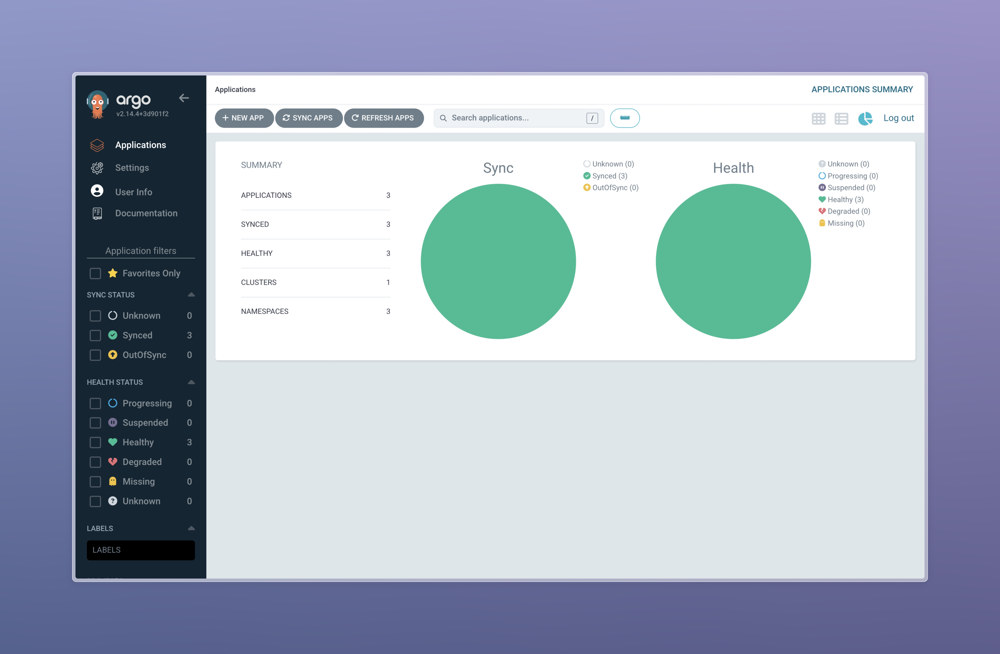

# ArgoCD for GitOps Deployment


```bash
❯ argocd app sync python-app
Handling connection for 8080
Handling connection for 8080
Handling connection for 8080
Handling connection for 8080
TIMESTAMP                  GROUP        KIND       NAMESPACE                  NAME    STATUS    HEALTH        HOOK  MESSAGE
2025-03-07T16:40:53+03:00         ServiceAccount     default              your-app  OutOfSync  Missing              
2025-03-07T16:40:53+03:00   apps  Deployment         default   python-app-your-app    Synced   Healthy              
2025-03-07T16:40:53+03:00          ConfigMap         default           emil-config    Synced                        
2025-03-07T16:40:53+03:00             Secret         default          db-user-pass    Synced                        
2025-03-07T16:40:53+03:00            Service         default   python-app-your-app    Synced   Healthy              
2025-03-07T16:40:53+03:00                Pod     default      pre-install-hook                                 
2025-03-07T16:40:55+03:00                Pod     default      pre-install-hook   Running   Synced     PreSync  pod/pre-install-hook created
2025-03-07T16:41:15+03:00         ServiceAccount     default              your-app    Synced  Missing              
2025-03-07T16:41:17+03:00   apps  Deployment         default   python-app-your-app    Synced   Healthy              deployment.apps/python-app-your-app configured
2025-03-07T16:41:17+03:00                Pod         default      pre-install-hook  Succeeded   Synced     PreSync  pod/pre-install-hook created
2025-03-07T16:41:17+03:00         ServiceAccount     default              your-app    Synced   Missing              serviceaccount/your-app created
2025-03-07T16:41:17+03:00             Secret         default          db-user-pass    Synced                        secret/db-user-pass unchanged
2025-03-07T16:41:17+03:00          ConfigMap         default           emil-config    Synced                        configmap/emil-config unchanged
2025-03-07T16:41:17+03:00            Service         default   python-app-your-app    Synced   Healthy              service/python-app-your-app unchanged
2025-03-07T16:41:17+03:00                Pod     default     post-install-hook   Running   Synced    PostSync  pod/post-install-hook created
2025-03-07T16:41:36+03:00                Pod     default     post-install-hook  Succeeded   Synced    PostSync  pod/post-install-hook created
Handling connection for 8080

Handling connection for 8080
Name:               argocd/python-app
Project:            default
Server:             https://kubernetes.default.svc
Namespace:          default
URL:                https://argocd.example.com/applications/python-app
Source:
- Repo:             https://github.com/emiliogain/S25-core-course-labs.git
  Target:           lab13
  Path:             k8s/your-app
  Helm Values:      values.yaml
SyncWindow:         Sync Allowed
Sync Policy:        Automated
Sync Status:        Synced to lab13 (4c01e55)
Health Status:      Healthy

Operation:          Sync
Sync Revision:      4c01e55b021bcf566b1bb0df0891bbc581b77450
Phase:              Succeeded
Start:              2025-03-07 16:40:53 +0300 MSK
Finished:           2025-03-07 16:41:37 +0300 MSK
Duration:           44s
Message:            successfully synced (no more tasks)

GROUP  KIND            NAMESPACE  NAME                 STATUS     HEALTH   HOOK      MESSAGE
       Pod             default    pre-install-hook     Succeeded           PreSync   pod/pre-install-hook created
       ServiceAccount  default    your-app             Synced                        serviceaccount/your-app created
       Secret          default    db-user-pass         Synced                        secret/db-user-pass unchanged
       ConfigMap       default    emil-config          Synced                        configmap/emil-config unchanged
       Service         default    python-app-your-app  Synced     Healthy            service/python-app-your-app unchanged
apps   Deployment      default    python-app-your-app  Synced     Healthy            deployment.apps/python-app-your-app configured
       Pod             default    post-install-hook    Succeeded           PostSync  pod/post-install-hook created


❯ argocd app get python-app
Handling connection for 8080
Handling connection for 8080
Handling connection for 8080
Handling connection for 8080
Handling connection for 8080
Name:               argocd/python-app
Project:            default
Server:             https://kubernetes.default.svc
Namespace:          default
URL:                https://argocd.example.com/applications/python-app
Source:
- Repo:             https://github.com/emiliogain/S25-core-course-labs.git
  Target:           lab13
  Path:             k8s/your-app
  Helm Values:      values.yaml
SyncWindow:         Sync Allowed
Sync Policy:        Automated
Sync Status:        Synced to lab13 (4c01e55)
Health Status:      Healthy

GROUP  KIND            NAMESPACE  NAME                 STATUS     HEALTH   HOOK      MESSAGE
       Pod             default    pre-install-hook     Succeeded           PreSync   pod/pre-install-hook created
       ServiceAccount  default    your-app             Synced                        serviceaccount/your-app created
       Secret          default    db-user-pass         Synced                        secret/db-user-pass unchanged
       ConfigMap       default    emil-config          Synced                        configmap/emil-config unchanged
       Service         default    python-app-your-app  Synced     Healthy            service/python-app-your-app unchanged
apps   Deployment      default    python-app-your-app  Synced     Healthy            deployment.apps/python-app-your-app configured
       Pod             default    post-install-hook    Succeeded           PostSync  pod/post-install-hook created
```
### After increase of replicaCount:
```bash
❯ argocd app get python-app
Handling connection for 8080
Handling connection for 8080
Handling connection for 8080
Handling connection for 8080
Handling connection for 8080
Name:               argocd/python-app
Project:            default
Server:             https://kubernetes.default.svc
Namespace:          default
URL:                https://argocd.example.com/applications/python-app
Source:
- Repo:             https://github.com/emiliogain/S25-core-course-labs.git
  Target:           lab13
  Path:             k8s/your-app
  Helm Values:      values.yaml
SyncWindow:         Sync Allowed
Sync Policy:        Automated
Sync Status:        Synced to lab13 (0f47841)
Health Status:      Healthy

GROUP  KIND            NAMESPACE  NAME                 STATUS     HEALTH   HOOK      MESSAGE
       Pod             default    pre-install-hook     Succeeded           PreSync   pod/pre-install-hook created
       ServiceAccount  default    your-app             Synced                        serviceaccount/your-app unchanged
       Secret          default    db-user-pass         Synced                        secret/db-user-pass unchanged
       ConfigMap       default    emil-config          Synced                        configmap/emil-config unchanged
       Service         default    python-app-your-app  Synced     Healthy            service/python-app-your-app unchanged
apps   Deployment      default    python-app-your-app  Synced     Healthy            deployment.apps/python-app-your-app configured
       Pod             default    post-install-hook    Succeeded           PostSync  pod/post-install-hook created
```

## Self-healing Test:
### Changing replicaCount:
```bash
❯ kubectl get deployment python-app-prod-your-app -n prod -o jsonpath='{.spec.replicas}'
2%                                                                                                                                                                              
❯ kubectl patch deployment python-app-prod-your-app -n prod --patch '{"spec":{"replicas": 3}}'
deployment.apps/python-app-prod-your-app patched
❯ kubectl get deployment python-app-prod-your-app -n prod -o jsonpath='{.spec.replicas}'
3%
```
### Syncing:
```bash
❯ argocd app sync python-app-prod
Handling connection for 8080
Handling connection for 8080
Handling connection for 8080
Handling connection for 8080
TIMESTAMP                  GROUP        KIND       NAMESPACE                  NAME        STATUS    HEALTH            HOOK  MESSAGE
2025-03-07T17:51:42+03:00          ConfigMap            prod           emil-config        Synced                            
2025-03-07T17:51:42+03:00             Secret            prod          db-user-pass        Synced                            
2025-03-07T17:51:42+03:00            Service            prod  python-app-prod-your-app    Synced   Healthy                  
2025-03-07T17:51:42+03:00         ServiceAccount        prod              your-app        Synced                            
2025-03-07T17:51:42+03:00   apps  Deployment            prod  python-app-prod-your-app  OutOfSync  Progressing              
2025-03-07T17:51:42+03:00   apps  Deployment        prod  python-app-prod-your-app  OutOfSync  Healthy              
2025-03-07T17:51:43+03:00                Pod        prod      pre-install-hook                                 
2025-03-07T17:51:45+03:00                Pod        prod      pre-install-hook   Running   Synced     PreSync  pod/pre-install-hook created
2025-03-07T17:52:08+03:00   apps  Deployment        prod  python-app-prod-your-app    Synced  Progressing              
2025-03-07T17:52:08+03:00   apps  Deployment        prod  python-app-prod-your-app    Synced  Healthy              
2025-03-07T17:52:09+03:00             Secret            prod          db-user-pass        Synced                        secret/db-user-pass unchanged
2025-03-07T17:52:09+03:00          ConfigMap            prod           emil-config        Synced                        configmap/emil-config unchanged
2025-03-07T17:52:09+03:00            Service            prod  python-app-prod-your-app    Synced   Healthy              service/python-app-prod-your-app unchanged
2025-03-07T17:52:09+03:00   apps  Deployment            prod  python-app-prod-your-app    Synced   Healthy              deployment.apps/python-app-prod-your-app configured
2025-03-07T17:52:09+03:00                Pod            prod      pre-install-hook      Succeeded   Synced     PreSync  pod/pre-install-hook created
2025-03-07T17:52:09+03:00         ServiceAccount        prod              your-app        Synced                        serviceaccount/your-app unchanged
2025-03-07T17:52:09+03:00                Pod        prod     post-install-hook   Running   Synced    PostSync  pod/post-install-hook created
2025-03-07T17:52:29+03:00                Pod        prod     post-install-hook  Succeeded   Synced    PostSync  pod/post-install-hook created
Handling connection for 8080

E0307 17:52:30.722505   85180 portforward.go:391] "Unhandled Error" err="error copying from remote stream to local connection: readfrom tcp6 [::1]:8080->[::1]:64617: write tcp6 [::1]:8080->[::1]:64617: write: broken pipe"
Handling connection for 8080
Name:               argocd/python-app-prod
Project:            default
Server:             https://kubernetes.default.svc
Namespace:          prod
URL:                https://argocd.example.com/applications/python-app-prod
Source:
- Repo:             https://github.com/emiliogain/S25-core-course-labs.git
  Target:           lab13
  Path:             k8s/your-app
  Helm Values:      values-prod.yaml
SyncWindow:         Sync Allowed
Sync Policy:        Automated
Sync Status:        Synced to lab13 (0ebee61)
Health Status:      Healthy

Operation:          Sync
Sync Revision:      0ebee619e2ad2ffdfd301cd81cd0accd15c5f899
Phase:              Succeeded
Start:              2025-03-07 17:51:42 +0300 MSK
Finished:           2025-03-07 17:52:29 +0300 MSK
Duration:           47s
Message:            successfully synced (no more tasks)

GROUP  KIND            NAMESPACE  NAME                      STATUS     HEALTH   HOOK      MESSAGE
       Pod             prod       pre-install-hook          Succeeded           PreSync   pod/pre-install-hook created
       ServiceAccount  prod       your-app                  Synced                        serviceaccount/your-app unchanged
       Secret          prod       db-user-pass              Synced                        secret/db-user-pass unchanged
       ConfigMap       prod       emil-config               Synced                        configmap/emil-config unchanged
       Service         prod       python-app-prod-your-app  Synced     Healthy            service/python-app-prod-your-app unchanged
apps   Deployment      prod       python-app-prod-your-app  Synced     Healthy            deployment.apps/python-app-prod-your-app configured
       Pod             prod       post-install-hook         Succeeded           PostSync  pod/post-install-hook created
```
```bash
❯ kubectl get deployment python-app-prod-your-app -n prod -o jsonpath='{.spec.replicas}'
2%      
```

## Pod deletion Test:
### Before deletion
```bash
❯ kubectl get pods -n prod
NAME                                        READY   STATUS    RESTARTS   AGE
python-app-prod-your-app-7cbdd8ccf5-48qgl   1/1     Running   0          24m
python-app-prod-your-app-7cbdd8ccf5-5tfpb   1/1     Running   0          24m
```
### Pod deletion:
```bash
❯ kubectl delete pod -n prod -l app.kubernetes.io/name=your-app
pod "python-app-prod-your-app-7cbdd8ccf5-48qgl" deleted
pod "python-app-prod-your-app-7cbdd8ccf5-5tfpb" deleted

❯ kubectl get pods -n prod
NAME                                        READY   STATUS    RESTARTS   AGE
python-app-prod-your-app-7cbdd8ccf5-84wgs   0/1     Running   0          13s
python-app-prod-your-app-7cbdd8ccf5-gp5ff   0/1     Running   0          13s

❯ kubectl get pods -n prod
NAME                                        READY   STATUS    RESTARTS   AGE
python-app-prod-your-app-7cbdd8ccf5-84wgs   1/1     Running   0          39s
python-app-prod-your-app-7cbdd8ccf5-gp5ff   1/1     Running   0          39s
```

### No drift:
```bash
❯ argocd app diff python-app-prod
Handling connection for 8080
Handling connection for 8080
Handling connection for 8080
Handling connection for 8080
Handling connection for 8080
```

### ArgoCD UI



### Drifts vs. Runtime Events
ArgoCD manages configuration drift by continuously monitoring the cluster
and comparing it to the desired state defined in Git - if manual changes (like editing a deployment) create drift,
ArgoCD auto-reverts them to enforce the Git configuration.
However, runtime events (e.g. pod crashes or deletions) are handled by Kubernetes itself,
which recreates resources to match the declared state without ArgoCD intervention,
ensuring only persistent deviations from Git trigger ArgoCD corrections.