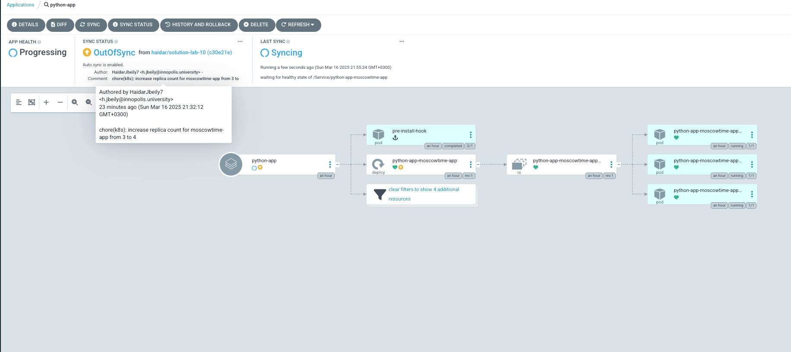

# Lab 13: ArgoCD for GitOps Deployment

## Output of `kubectl get pods -n prod` before and after pod deletion

```bash
NAME                                              READY   STATUS      RESTARTS   AGE
pre-install-hook                                  0/1     Completed   0          3m26s
python-app-prod-moscowtime-app-6c858f8ff8-28plm   1/1     Running     0          3m21s
python-app-prod-moscowtime-app-6c858f8ff8-4c2km   1/1     Running     0          3m21s
python-app-prod-moscowtime-app-6c858f8ff8-d2qsq   1/1     Running     0          3m21s
```

## Screenshots of ArgoCD UI showing sync status and the dashboard after both tests





## Explanation of how ArgoCD handles configuration drift vs. runtime events

ArgoCD handles configuration drift and runtime events differently:

### Configuration Drift

- **Definition**: When the actual state in the cluster differs from the desired state defined in Git.
- **Handling**: ArgoCD automatically detects and corrects configuration drift through its self-healing mechanism.
- **Example**: When we manually changed the replica count using `kubectl patch`, ArgoCD detected this as drift from the Git-defined state and automatically reverted the change to match the configuration in the repository.

### Runtime Events

- **Definition**: Normal Kubernetes lifecycle events that don't affect the desired state definition.
- **Handling**: ArgoCD doesn't intervene as these are handled by Kubernetes controllers.
- **Example**: When we deleted a pod, ArgoCD didn't need to take action because Kubernetes' built-in controllers (Deployment controller) automatically recreated the pod to maintain the desired replica count.

This distinction demonstrates the GitOps principle where Git remains the single source of truth for declarative infrastructure, while allowing Kubernetes to handle its normal runtime responsibilities.
