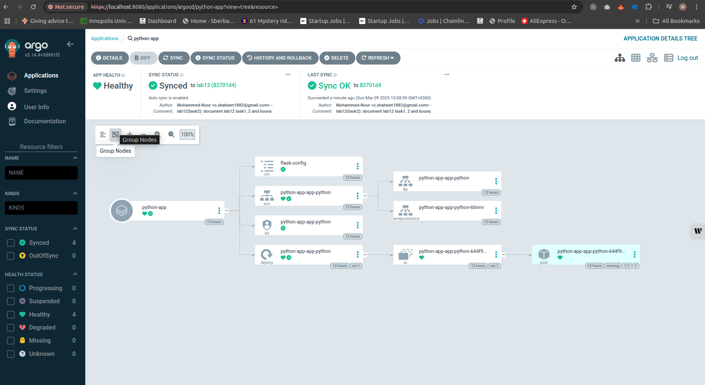
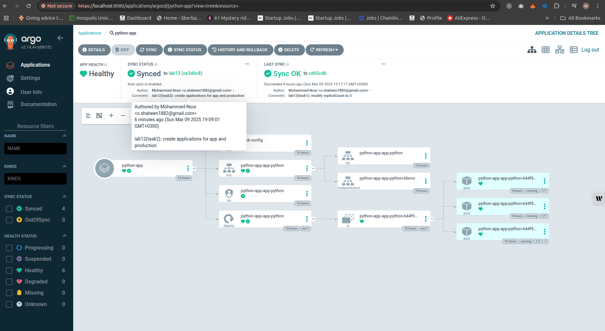

# Lab 13: ArgoCD for GitOps Deployment

## Overview

In this lab, we will implement ArgoCD to automate Kubernetes application deployments using GitOps principles. we’ll install ArgoCD via Helm, configure it to manage the Python app, and simulate production-like workflows.

---

## Task 1: Deploy and Configure ArgoCD

### 1. Install ArgoCD via Helm

1. Add the ArgoCD Helm repository:

   ```bash
   helm repo add argo https://argoproj.github.io/argo-helm
   ```

2. Install ArgoCD:

   ```bash
   helm install argo argo/argo-cd --namespace argocd --create-namespace
   ```

3. Verify installation:

   ```bash
   kubectl wait --for=condition=ready pod -l app.kubernetes.io/name=argocd-server -n argocd --timeout=90s
   ```

   **Output:**

   ```log
   pod/argo-argocd-server-6f848cf7f7-c26jf condition met
   ```

---

### 2. Install ArgoCD CLI

1. Install the ArgoCD CLI tool:

   ```bash
   curl -sSL -o argocd https://github.com/argoproj/argo-cd/releases/latest/download/argocd-linux-amd64
   chmod +x argocd
   sudo mv argocd /usr/local/bin/
   ```

2. Verify CLI installation:

   ```bash
   argocd version
   ```

   **Output:**

   ```log
   argocd: v2.14.4+3d901f2
     BuildDate: 2025-03-04T21:21:26Z
     GitCommit: 3d901f2037888af302a85f518bea70b33ee8e1c7
     GitTreeState: clean
     GoVersion: go1.23.3
     Compiler: gc
     Platform: linux/amd64
   FATA[0000] Argo CD server address unspecified
   ```

---

### 3. Access the ArgoCD UI

1. Forward the ArgoCD server port:

   ```bash
   kubectl port-forward svc/argocd-server -n argocd 8080:443 &
   ```

2. Log in using the initial admin password:

   ```bash
   # Retrieve the password:
   kubectl -n argocd get secret argocd-initial-admin-secret -o jsonpath="{.data.password}" | base64 --decode

   # Log in via CLI:
   argocd login localhost:8080 --insecure
   ```

   **Output:**

   ```log
   Username: admin
   Password: 
   'admin:login' logged in successfully
   Context 'localhost:8080' updated
   ```

3. Open the ArgoCD dashboard:

   

---

### 4. Configure Python App Sync

1. Define the ArgoCD Application in `argocd-python-app.yaml`:

2. Apply the configuration:

   ```bash
   kubectl apply -f ArgoCD/argocd-python-app.yaml
   ```

3. Verify sync:

   ```bash
   argocd app sync python-app
   ```

   **Output:**

   ```log
   TIMESTAMP                  GROUP        KIND       NAMESPACE                  NAME     STATUS   HEALTH        HOOK  MESSAGE
   2025-03-09T15:08:14+03:00          ConfigMap         default          flask-config     Synced                       
   2025-03-09T15:08:14+03:00            Service         default  python-app-app-python    Synced  Healthy              
   2025-03-09T15:08:14+03:00         ServiceAccount     default  python-app-app-python    Synced                       
   2025-03-09T15:08:14+03:00   apps  Deployment         default  python-app-app-python    Synced  Healthy              
   2025-03-09T15:08:14+03:00                Pod     default       preinstall-hook                                 
   2025-03-09T15:08:16+03:00                Pod     default       preinstall-hook   Running   Synced     PreSync  pod/preinstall-hook created
   2025-03-09T15:08:38+03:00          ConfigMap         default          flask-config     Synced                        configmap/flask-config unchanged
   2025-03-09T15:08:38+03:00            Service         default  python-app-app-python    Synced   Healthy              service/python-app-app-python unchanged
   2025-03-09T15:08:38+03:00   apps  Deployment         default  python-app-app-python    Synced   Healthy              deployment.apps/python-app-app-python configured
   2025-03-09T15:08:38+03:00                Pod         default       preinstall-hook   Succeeded   Synced     PreSync  pod/preinstall-hook created
   2025-03-09T15:08:38+03:00         ServiceAccount     default  python-app-app-python    Synced                        serviceaccount/python-app-app-python unchanged
   2025-03-09T15:08:39+03:00                Pod     default      postinstall-hook   Running   Synced    PostSync  pod/postinstall-hook created
   2025-03-09T15:08:59+03:00                Pod     default      postinstall-hook  Succeeded   Synced    PostSync  pod/postinstall-hook created
   ```

   

---

### 5. Test Sync Workflow

1. Modify `values.yaml` (e.g., update `replicaCount`).
2. Commit and push changes to the target branch.
3. Observe ArgoCD auto-sync the update.

   

---

## Task 2: Multi-Environment Deployment & Auto-Sync

### 1. Set Up Multi-Environment Configurations

1. Extend your Python app’s Helm chart to support `dev` and `prod` environments.
2. Create environment-specific values files (`values-dev.yaml`, `values-prod.yaml`).

---

### 2. Create Namespaces

```bash
kubectl create namespace dev
kubectl create namespace prod
```

---

### 3. Deploy Multi-Environment via ArgoCD

1. Define two ArgoCD applications with auto-sync:
   - `argocd-python-dev.yaml`
   - `argocd-python-prod.yaml`

---

### 4. Enable Auto-Sync

1. Test auto-sync by updating `values-prod.yaml` and pushing to Git.

   

---

### 5. Self-Heal Testing

#### Test 1: Manual Override of Replica Count

1. Modify the deployment’s replica count manually:

   ```bash
   kubectl patch deployment python-app-prod-app-python -n prod --patch '{"spec":{"replicas": 3}}'
   ```

   **Output:**

   ```log
   deployment.apps/python-app-prod-app-python patched
   ```

   

2. Observe ArgoCD auto-revert the change:

   

3. Show the pods after sync

```bash
kubectl get pods -n prod
```

```log
NAME                                         READY   STATUS              RESTARTS   AGE
postinstall-hook                             0/1     ContainerCreating   0          2s
preinstall-hook                              0/1     Completed           0          27s
python-app-prod-app-python-8496cff96-b8qkq   1/1     Running             0          21m
python-app-prod-app-python-8496cff96-nwb9b   1/1     Terminating         0          3m38s
python-app-prod-app-python-8496cff96-tgmbj   1/1     Terminating         0          3m38s
```

---

#### Test 2: Delete a Pod (Replica)

- Show the pods before:

  ```bash
  kubectl get pods -n prod
  ```

  ```log
  NAME                                         READY   STATUS    RESTARTS   AGE
  python-app-prod-app-python-8496cff96-b8qkq   1/1     Running   0          22m
  ```

- Delete a pod in the `prod` namespace:

```bash
kubectl delete pod -n prod -l app.kubernetes.io/name=app-python
```

**Output:**

```log
pod "python-app-prod-app-python-8496cff96-b8qkq" deleted
```

- Verify Kubernetes recreates the pod:

   ```bash
   kubectl get pods -n prod -w
   ```

   **Output:**

   ```log
   NAME                                         READY   STATUS    RESTARTS   AGE
   python-app-prod-app-python-8496cff96-qnx64   1/1     Running   0          67s
   ```

- Confirm ArgoCD shows no drift:

   

- Show the Dashboard:

   

---

### Documentation

- **Explanation of how ArgoCD handles configuration drift vs. runtime events:**
  - ArgoCD continuously monitors the desired state defined in Git and reconciles any drift in the cluster. Runtime events (e.g., pod deletions) are handled by Kubernetes itself, while configuration drift (e.g., manual changes to deployments) is reverted by ArgoCD to match the Git state.

---

## Bonus Task: Sync Your Bonus App with ArgoCD

1. Configure ArgoCD for Bonus App:

   - Create an `argocd-<bonus>-app.yaml` similar to Task 1, pointing to your bonus app’s Helm chart folder.
   - Sync and validate deployment:

     ```bash
     kubectl get pods -n default
     ```

   **Output:**

   ```log
   NAME                                     READY   STATUS    RESTARTS        AGE
   app-go-55669c4956-sssql                  1/1     Running   1 (17h ago)     26h
   app-python-8d8c5f6fd-jtb88               1/1     Running   1 (6h44m ago)   26h
   go-app-app-go-66766bd684-6k6lf           1/1     Running   0               66s
   python-app-app-python-644f95d77d-49hkg   1/1     Running   0               6h6m
   python-app-app-python-644f95d77d-fqtsr   1/1     Running   0               6h6m
   python-app-app-python-644f95d77d-ssfvz   1/1     Running   1 (6h44m ago)   18h
   ```

2. Show the app from dashboard:
   
