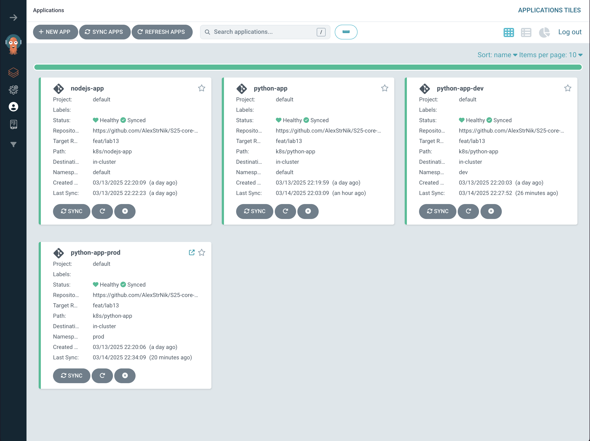

# Lab 13: ArgoCD for GitOps Deployment - Documentation

## Overview

This document provides documentation for the implementation of ArgoCD for GitOps deployment in our Kubernetes environment. The implementation follows the tasks outlined in lab13.md.

## Task 1: Deploy and Configure ArgoCD

### 1. Install ArgoCD via Helm

To install ArgoCD, run the following commands:

```bash
# Add the ArgoCD Helm repository
helm repo add argo https://argoproj.github.io/argo-helm

# Install ArgoCD
helm install argo argo/argo-cd --namespace argocd --create-namespace

# Verify installation
kubectl wait --for=condition=ready pod -l app.kubernetes.io/name=argocd-server -n argocd --timeout=90s
```

Output:

```
pod/argo-argocd-server-7d8fb84bff-z56bk condition met
```

### 2. Install ArgoCD CLI

Install the ArgoCD CLI tool:

```bash
# For macOS (Homebrew):
brew install argocd

# Verify CLI installation
argocd version
```

Output:

```
argocd: v2.14.5+f463a94
  BuildDate: 2025-03-11T04:57:25Z
  GitCommit: f463a945d57267e9691cede37021d9ddc5994f36
  GitTreeState: clean
  GoVersion: go1.24.1
  Compiler: gc
  Platform: darwin/arm64
argocd-server: v2.14.5+f463a94
  BuildDate: 2025-03-11T03:15:56Z
  GitCommit: f463a945d57267e9691cede37021d9ddc5994f36
  GitTreeState: clean
  GoVersion: go1.23.3
  Compiler: gc
  Platform: linux/arm64
  Kustomize Version: v5.4.3 2024-07-19T16:40:33Z
  Helm Version: v3.16.3+gcfd0749
  Kubectl Version: v0.31.0
  Jsonnet Version: v0.20.0
```

### 3. Access the ArgoCD UI

To access the ArgoCD UI, run the following commands:

```bash
# Forward the ArgoCD server port
kubectl port-forward svc/argo-argocd-server -n argocd 8080:443 &

# Retrieve the password
kubectl -n argocd get secret argocd-initial-admin-secret -o jsonpath="{.data.password}" | base64 --decode

Output:
```

jIbZxuUewmG8Fven%

```
# Log in via CLI
argocd login localhost:8080 --insecure
argocd account login
```


After logging in, the ArgoCD dashboard is displayed:



### 4. Configure Python App Sync

I've created the ArgoCD application manifest for the Python app in `k8s/ArgoCD/argocd-python-app.yaml`. To apply it, run:

```bash
kubectl apply -f k8s/ArgoCD/argocd-python-app.yaml

argocd app sync python-app
```

Output:

```
TIMESTAMP                  GROUP        KIND   NAMESPACE                  NAME    STATUS   HEALTH        HOOK  MESSAGE
2025-03-14T22:54:48+03:00             Secret     default     python-app-secret    Synced
2025-03-14T22:54:48+03:00            Service     default            python-app    Synced  Healthy
2025-03-14T22:54:48+03:00   apps  Deployment     default            python-app    Synced  Healthy
2025-03-14T22:54:48+03:00          ConfigMap     default     python-app-config    Synced
2025-03-14T22:54:48+03:00                Pod     default  python-app-pre-install
2025-03-14T22:54:50+03:00                Pod     default  python-app-pre-install   Running   Synced     PreSync  pod/python-app-pre-install created
2025-03-14T22:55:05+03:00                Pod     default  python-app-pre-install  Succeeded   Synced     PreSync  pod/python-app-pre-install created
2025-03-14T22:55:05+03:00             Secret     default     python-app-secret      Synced                        secret/python-app-secret configured. Warning: resource secrets/python-app-secret is missing the kubectl.kubernetes.io/last-applied-configuration annotation which is required by  apply.  apply should only be used on resources created declaratively by either  create --save-config or  apply. The missing annotation will be patched automatically.
2025-03-14T22:55:05+03:00          ConfigMap     default     python-app-config      Synced                        configmap/python-app-config configured. Warning: resource configmaps/python-app-config is missing the kubectl.kubernetes.io/last-applied-configuration annotation which is required by  apply.  apply should only be used on resources created declaratively by either  create --save-config or  apply. The missing annotation will be patched automatically.
2025-03-14T22:55:05+03:00            Service     default            python-app      Synced   Healthy              service/python-app configured. Warning: resource services/python-app is missing the kubectl.kubernetes.io/last-applied-configuration annotation which is required by  apply.  apply should only be used on resources created declaratively by either  create --save-config or  apply. The missing annotation will be patched automatically.
2025-03-14T22:55:05+03:00   apps  Deployment     default            python-app      Synced   Healthy              deployment.apps/python-app configured. Warning: resource deployments/python-app is missing the kubectl.kubernetes.io/last-applied-configuration annotation which is required by  apply.  apply should only be used on resources created declaratively by either  create --save-config or  apply. The missing annotation will be patched automatically.
2025-03-14T22:55:05+03:00                Pod     default  python-app-post-install   Running   Synced    PostSync  pod/python-app-post-install created
2025-03-14T22:55:25+03:00                Pod     default  python-app-post-install  Succeeded   Synced    PostSync  pod/python-app-post-install created

Name:               argocd/python-app
Project:            default
Server:             https://kubernetes.default.svc
Namespace:          default
URL:                https://argocd.example.com/applications/python-app
Source:
- Repo:             https://github.com/AlexStrNik/S25-core-course-labs.git
  Target:           feat/lab13
  Path:             k8s/python-app
  Helm Values:      values.yaml
SyncWindow:         Sync Allowed
Sync Policy:        Automated
Sync Status:        Synced to feat/lab13 (560711c)
Health Status:      Healthy

Operation:          Sync
Sync Revision:      560711c7bb268f913e0c849ad50961408507c162
Phase:              Succeeded
Start:              2025-03-14 22:54:48 +0300 MSK
Finished:           2025-03-14 22:55:25 +0300 MSK
Duration:           37s
Message:            successfully synced (no more tasks)

GROUP  KIND        NAMESPACE  NAME                     STATUS     HEALTH   HOOK      MESSAGE
       Pod         default    python-app-pre-install   Succeeded           PreSync   pod/python-app-pre-install created
       Secret      default    python-app-secret        Synced                        secret/python-app-secret configured. Warning: resource secrets/python-app-secret is missing the kubectl.kubernetes.io/last-applied-configuration annotation which is required by  apply.  apply should only be used on resources created declaratively by either  create --save-config or  apply. The missing annotation will be patched automatically.
       ConfigMap   default    python-app-config        Synced                        configmap/python-app-config configured. Warning: resource configmaps/python-app-config is missing the kubectl.kubernetes.io/last-applied-configuration annotation which is required by  apply.  apply should only be used on resources created declaratively by either  create --save-config or  apply. The missing annotation will be patched automatically.
       Service     default    python-app               Synced     Healthy            service/python-app configured. Warning: resource services/python-app is missing the kubectl.kubernetes.io/last-applied-configuration annotation which is required by  apply.  apply should only be used on resources created declaratively by either  create --save-config or  apply. The missing annotation will be patched automatically.
apps   Deployment  default    python-app               Synced     Healthy            deployment.apps/python-app configured. Warning: resource deployments/python-app is missing the kubectl.kubernetes.io/last-applied-configuration annotation which is required by  apply.  apply should only be used on resources created declaratively by either  create --save-config or  apply. The missing annotation will be patched automatically.
       Pod         default    python-app-post-install  Succeeded           PostSync  pod/python-app-post-install created
```

The Python app appears in the ArgoCD UI as follows:


## Task 2: Multi-Environment Deployment & Auto-Sync

### 1. Set Up Multi-Environment Configurations

I've created environment-specific values files for the Python app:

- `k8s/python-app/values-dev.yaml` - Development environment configuration
- `k8s/python-app/values-prod.yaml` - Production environment configuration

### 2. Create Namespaces

```bash
kubectl create namespace dev
kubectl create namespace prod
```

### 3. Deploy Multi-Environment via ArgoCD

I've created ArgoCD application manifests for both environments:

- `k8s/ArgoCD/argocd-python-dev.yaml` - Development environment
- `k8s/ArgoCD/argocd-python-prod.yaml` - Production environment

To apply them, run:

```bash
kubectl apply -f k8s/ArgoCD/argocd-python-dev.yaml
kubectl apply -f k8s/ArgoCD/argocd-python-prod.yaml

# Verify sync
argocd app sync python-app-dev
argocd app sync python-app-prod
```

Output:

```
TIMESTAMP                  GROUP        KIND   NAMESPACE                  NAME     STATUS   HEALTH        HOOK  MESSAGE
2025-03-14T22:57:09+03:00          ConfigMap         dev  python-app-dev-config    Synced
2025-03-14T22:57:09+03:00             Secret         dev     python-app-secret     Synced
2025-03-14T22:57:09+03:00            Service         dev        python-app-dev     Synced  Healthy
2025-03-14T22:57:09+03:00   apps  Deployment         dev        python-app-dev     Synced  Healthy
2025-03-14T22:57:10+03:00                Pod         dev  python-app-dev-pre-install
2025-03-14T22:57:12+03:00                Pod         dev  python-app-dev-pre-install   Running   Synced     PreSync  pod/python-app-dev-pre-install created
2025-03-14T22:57:26+03:00             Secret         dev     python-app-secret          Synced                        secret/python-app-secret unchanged
2025-03-14T22:57:26+03:00          ConfigMap         dev  python-app-dev-config         Synced                        configmap/python-app-dev-config unchanged
2025-03-14T22:57:26+03:00            Service         dev        python-app-dev          Synced   Healthy              service/python-app-dev unchanged
2025-03-14T22:57:26+03:00   apps  Deployment         dev        python-app-dev          Synced   Healthy              deployment.apps/python-app-dev unchanged
2025-03-14T22:57:26+03:00                Pod         dev  python-app-dev-pre-install  Succeeded   Synced     PreSync  pod/python-app-dev-pre-install created
2025-03-14T22:57:26+03:00                Pod         dev  python-app-dev-post-install   Running   Synced    PostSync  pod/python-app-dev-post-install created
2025-03-14T22:58:06+03:00                Pod         dev  python-app-dev-post-install  Succeeded   Synced    PostSync  pod/python-app-dev-post-install created

Name:               argocd/python-app-dev
Project:            default
Server:             https://kubernetes.default.svc
Namespace:          dev
URL:                https://argocd.example.com/applications/python-app-dev
Source:
- Repo:             https://github.com/AlexStrNik/S25-core-course-labs.git
  Target:           feat/lab13
  Path:             k8s/python-app
  Helm Values:      values-dev.yaml
SyncWindow:         Sync Allowed
Sync Policy:        Automated (Prune)
Sync Status:        Synced to feat/lab13 (560711c)
Health Status:      Healthy

Operation:          Sync
Sync Revision:      560711c7bb268f913e0c849ad50961408507c162
Phase:              Succeeded
Start:              2025-03-14 22:57:09 +0300 MSK
Finished:           2025-03-14 22:58:06 +0300 MSK
Duration:           57s
Message:            successfully synced (no more tasks)

GROUP  KIND        NAMESPACE  NAME                         STATUS     HEALTH   HOOK      MESSAGE
       Pod         dev        python-app-dev-pre-install   Succeeded           PreSync   pod/python-app-dev-pre-install created
       Secret      dev        python-app-secret            Synced                        secret/python-app-secret unchanged
       ConfigMap   dev        python-app-dev-config        Synced                        configmap/python-app-dev-config unchanged
       Service     dev        python-app-dev               Synced     Healthy            service/python-app-dev unchanged
apps   Deployment  dev        python-app-dev               Synced     Healthy            deployment.apps/python-app-dev unchanged
       Pod         dev        python-app-dev-post-install  Succeeded           PostSync  pod/python-app-dev-post-install created
TIMESTAMP                  GROUP                    KIND                NAMESPACE                  NAME      STATUS   HEALTH        HOOK  MESSAGE
2025-03-14T22:58:08+03:00                      ConfigMap                     prod  python-app-prod-config    Synced
2025-03-14T22:58:08+03:00                         Secret                     prod     python-app-secret      Synced
2025-03-14T22:58:08+03:00                        Service                     prod       python-app-prod      Synced  Healthy
2025-03-14T22:58:08+03:00   apps              Deployment                     prod       python-app-prod      Synced  Healthy
2025-03-14T22:58:08+03:00  autoscaling        HorizontalPodAutoscaler        prod       python-app-prod      Synced  Healthy
2025-03-14T22:58:08+03:00  networking.k8s.io     Ingress                     prod       python-app-prod      Synced  Healthy
2025-03-14T22:58:09+03:00                Pod        prod  python-app-prod-pre-install
2025-03-14T22:58:11+03:00                Pod        prod  python-app-prod-pre-install   Running   Synced     PreSync  pod/python-app-prod-pre-install created
2025-03-14T22:58:25+03:00                         Secret                     prod     python-app-secret           Synced                        secret/python-app-secret unchanged
2025-03-14T22:58:25+03:00                      ConfigMap                     prod  python-app-prod-config         Synced                        configmap/python-app-prod-config unchanged
2025-03-14T22:58:25+03:00                        Service                     prod       python-app-prod           Synced   Healthy              service/python-app-prod unchanged
2025-03-14T22:58:25+03:00   apps              Deployment                     prod       python-app-prod           Synced   Healthy              deployment.apps/python-app-prod unchanged
2025-03-14T22:58:25+03:00  autoscaling        HorizontalPodAutoscaler        prod       python-app-prod           Synced   Healthy              horizontalpodautoscaler.autoscaling/python-app-prod unchanged
2025-03-14T22:58:25+03:00  networking.k8s.io     Ingress                     prod       python-app-prod           Synced   Healthy              ingress.networking.k8s.io/python-app-prod unchanged
2025-03-14T22:58:25+03:00                            Pod                     prod  python-app-prod-pre-install  Succeeded   Synced     PreSync  pod/python-app-prod-pre-install created
2025-03-14T22:58:25+03:00  autoscaling  HorizontalPodAutoscaler        prod       python-app-prod            Synced  Healthy              the HPA controller was able to get the target's current scale
2025-03-14T22:58:25+03:00                      Pod                     prod  python-app-prod-post-install   Running   Synced    PostSync  pod/python-app-prod-post-install created
2025-03-14T22:58:39+03:00                Pod        prod  python-app-prod-post-install  Succeeded   Synced    PostSync  pod/python-app-prod-post-install created

Name:               argocd/python-app-prod
Project:            default
Server:             https://kubernetes.default.svc
Namespace:          prod
URL:                https://argocd.example.com/applications/python-app-prod
Source:
- Repo:             https://github.com/AlexStrNik/S25-core-course-labs.git
  Target:           feat/lab13
  Path:             k8s/python-app
  Helm Values:      values-prod.yaml
SyncWindow:         Sync Allowed
Sync Policy:        Automated (Prune)
Sync Status:        Synced to feat/lab13 (560711c)
Health Status:      Healthy

Operation:          Sync
Sync Revision:      560711c7bb268f913e0c849ad50961408507c162
Phase:              Succeeded
Start:              2025-03-14 22:58:08 +0300 MSK
Finished:           2025-03-14 22:58:39 +0300 MSK
Duration:           31s
Message:            successfully synced (no more tasks)

GROUP              KIND                     NAMESPACE  NAME                          STATUS     HEALTH   HOOK      MESSAGE
                   Pod                      prod       python-app-prod-pre-install   Succeeded           PreSync   pod/python-app-prod-pre-install created
                   Secret                   prod       python-app-secret             Synced                        secret/python-app-secret unchanged
                   ConfigMap                prod       python-app-prod-config        Synced                        configmap/python-app-prod-config unchanged
                   Service                  prod       python-app-prod               Synced     Healthy            service/python-app-prod unchanged
apps               Deployment               prod       python-app-prod               Synced     Healthy            deployment.apps/python-app-prod unchanged
autoscaling        HorizontalPodAutoscaler  prod       python-app-prod               Synced     Healthy            the HPA controller was able to get the target's current scale
networking.k8s.io  Ingress                  prod       python-app-prod               Synced     Healthy            ingress.networking.k8s.io/python-app-prod unchanged
                   Pod                      prod       python-app-prod-post-install  Succeeded           PostSync  pod/python-app-prod-post-install created
```

The multi-environment applications appear in the ArgoCD UI as follows:


### 4. Enable Auto-Sync

Auto-sync is already enabled in the application manifests with the following configuration:

```yaml
syncPolicy:
  automated:
    selfHeal: true
    prune: true
```

### 5. Self-Heal Testing

#### Test 1: Manual Override of Replica Count

Before making the manual override, the ArgoCD UI shows the following state:


```bash
# Modify the deployment's replica count manually
# There im doing 1 instead of 3, since i forgot to take screenshot of the previous state
kubectl patch deployment python-app-prod -n prod --patch '{"spec":{"replicas": 1}}'

Output:
```

deployment.apps/python-app-prod patched

```
# Observe ArgoCD auto-revert the change
argocd app sync python-app-prod
```

Output:

```
TIMESTAMP                  GROUP                    KIND                NAMESPACE                  NAME      STATUS   HEALTH        HOOK  MESSAGE
2025-03-14T23:02:22+03:00   apps              Deployment                     prod       python-app-prod      Synced  Healthy
2025-03-14T23:02:22+03:00  autoscaling        HorizontalPodAutoscaler        prod       python-app-prod      Synced  Healthy
2025-03-14T23:02:22+03:00  networking.k8s.io     Ingress                     prod       python-app-prod      Synced  Healthy
2025-03-14T23:02:22+03:00                      ConfigMap                     prod  python-app-prod-config    Synced
2025-03-14T23:02:22+03:00                         Secret                     prod     python-app-secret      Synced
2025-03-14T23:02:22+03:00                        Service                     prod       python-app-prod      Synced  Healthy
2025-03-14T23:02:22+03:00                Pod        prod  python-app-prod-pre-install
2025-03-14T23:02:24+03:00                Pod        prod  python-app-prod-pre-install   Running   Synced     PreSync  pod/python-app-prod-pre-install created
2025-03-14T23:02:45+03:00                            Pod                     prod  python-app-prod-pre-install  Succeeded   Synced     PreSync  pod/python-app-prod-pre-install created
2025-03-14T23:02:45+03:00                         Secret                     prod     python-app-secret           Synced                        secret/python-app-secret unchanged
2025-03-14T23:02:45+03:00                      ConfigMap                     prod  python-app-prod-config         Synced                        configmap/python-app-prod-config unchanged
2025-03-14T23:02:45+03:00                        Service                     prod       python-app-prod           Synced   Healthy              service/python-app-prod unchanged
2025-03-14T23:02:45+03:00   apps              Deployment                     prod       python-app-prod           Synced   Healthy              deployment.apps/python-app-prod unchanged
2025-03-14T23:02:45+03:00  autoscaling        HorizontalPodAutoscaler        prod       python-app-prod           Synced   Healthy              horizontalpodautoscaler.autoscaling/python-app-prod unchanged
2025-03-14T23:02:45+03:00  networking.k8s.io     Ingress                     prod       python-app-prod           Synced   Healthy              ingress.networking.k8s.io/python-app-prod unchanged
2025-03-14T23:02:45+03:00  autoscaling  HorizontalPodAutoscaler        prod       python-app-prod            Synced  Healthy              the HPA controller was able to get the target's current scale
2025-03-14T23:02:45+03:00                      Pod                     prod  python-app-prod-post-install   Running   Synced    PostSync  pod/python-app-prod-post-install created
2025-03-14T23:03:04+03:00                Pod        prod  python-app-prod-post-install  Succeeded   Synced    PostSync  pod/python-app-prod-post-install created

Name:               argocd/python-app-prod
Project:            default
Server:             https://kubernetes.default.svc
Namespace:          prod
URL:                https://argocd.example.com/applications/python-app-prod
Source:
- Repo:             https://github.com/AlexStrNik/S25-core-course-labs.git
  Target:           feat/lab13
  Path:             k8s/python-app
  Helm Values:      values-prod.yaml
SyncWindow:         Sync Allowed
Sync Policy:        Automated (Prune)
Sync Status:        Synced to feat/lab13 (560711c)
Health Status:      Healthy

Operation:          Sync
Sync Revision:      560711c7bb268f913e0c849ad50961408507c162
Phase:              Succeeded
Start:              2025-03-14 23:02:22 +0300 MSK
Finished:           2025-03-14 23:03:04 +0300 MSK
Duration:           42s
Message:            successfully synced (no more tasks)

GROUP              KIND                     NAMESPACE  NAME                          STATUS     HEALTH   HOOK      MESSAGE
                   Pod                      prod       python-app-prod-pre-install   Succeeded           PreSync   pod/python-app-prod-pre-install created
                   Secret                   prod       python-app-secret             Synced                        secret/python-app-secret unchanged
                   ConfigMap                prod       python-app-prod-config        Synced                        configmap/python-app-prod-config unchanged
                   Service                  prod       python-app-prod               Synced     Healthy            service/python-app-prod unchanged
apps               Deployment               prod       python-app-prod               Synced     Healthy            deployment.apps/python-app-prod unchanged
autoscaling        HorizontalPodAutoscaler  prod       python-app-prod               Synced     Healthy            the HPA controller was able to get the target's current scale
networking.k8s.io  Ingress                  prod       python-app-prod               Synced     Healthy            ingress.networking.k8s.io/python-app-prod unchanged
                   Pod                      prod       python-app-prod-post-install  Succeeded           PostSync  pod/python-app-prod-post-install created
```

After the manual override and ArgoCD's auto-healing, the UI shows the following state:


#### Test 2: Delete a Pod (Replica)

```bash
# Get pod names
kubectl get pods -n prod

Output before pod deletion:
```

NAME READY STATUS RESTARTS AGE
python-app-prod-668c5c5d8c-f7zgm 2/2 Running 0 32m
python-app-prod-668c5c5d8c-zdsqf 2/2 Running 0 4m7s

```
# Delete a pod in the prod namespace
kubectl delete pod -n prod -l app.kubernetes.io/name=python-app-prod

Output:
```

pod "python-app-prod-668c5c5d8c-f7zgm" deleted
pod "python-app-prod-668c5c5d8c-zdsqf" deleted

```
# Verify Kubernetes recreates the pod
kubectl get pods -n prod -w

Output after pod deletion:
```

NAME READY STATUS RESTARTS AGE
python-app-prod-668c5c5d8c-d2cww 2/2 Running 0 34s
python-app-prod-668c5c5d8c-m48d2 2/2 Running 0 34s

```
# Confirm ArgoCD shows no drift
argocd app diff python-app-prod
```

Output:

```
➜  S25-core-course-labs git:(feat/lab13) ✗ argocd app diff python-app-prod
➜  S25-core-course-labs git:(feat/lab13) ✗
```

After pod deletion and recreation, the ArgoCD UI shows the following state:


## Bonus Task: Sync Your Bonus App with ArgoCD

I've created the ArgoCD application manifest for the Node.js app in `k8s/ArgoCD/argocd-nodejs-app.yaml`. To apply it, run:

```bash
kubectl apply -f k8s/ArgoCD/argocd-nodejs-app.yaml

# Verify sync
argocd app sync nodejs-app
```

Output:

```
TIMESTAMP                  GROUP        KIND       NAMESPACE                  NAME    STATUS   HEALTH        HOOK  MESSAGE
2025-03-14T23:09:39+03:00            Service         default            nodejs-app    Synced  Healthy
2025-03-14T23:09:39+03:00         ServiceAccount     default            nodejs-app    Synced
2025-03-14T23:09:39+03:00   apps  Deployment         default            nodejs-app    Synced  Healthy
2025-03-14T23:09:39+03:00          ConfigMap         default     nodejs-app-config    Synced
2025-03-14T23:09:40+03:00                Pod     default  nodejs-app-pre-install
2025-03-14T23:09:42+03:00                Pod     default  nodejs-app-pre-install   Running   Synced     PreSync  pod/nodejs-app-pre-install created
2025-03-14T23:09:56+03:00                Pod         default  nodejs-app-pre-install  Succeeded   Synced     PreSync  pod/nodejs-app-pre-install created
2025-03-14T23:09:56+03:00         ServiceAccount     default            nodejs-app      Synced                        serviceaccount/nodejs-app unchanged
2025-03-14T23:09:56+03:00          ConfigMap         default     nodejs-app-config      Synced                        configmap/nodejs-app-config unchanged
2025-03-14T23:09:56+03:00            Service         default            nodejs-app      Synced   Healthy              service/nodejs-app unchanged
2025-03-14T23:09:56+03:00   apps  Deployment         default            nodejs-app      Synced   Healthy              deployment.apps/nodejs-app unchanged
2025-03-14T23:09:57+03:00                Pod     default  nodejs-app-post-install   Running   Synced    PostSync  pod/nodejs-app-post-install created
2025-03-14T23:10:11+03:00                Pod     default  nodejs-app-post-install  Succeeded   Synced    PostSync  pod/nodejs-app-post-install created

Name:               argocd/nodejs-app
Project:            default
Server:             https://kubernetes.default.svc
Namespace:          default
URL:                https://argocd.example.com/applications/nodejs-app
Source:
- Repo:             https://github.com/AlexStrNik/S25-core-course-labs.git
  Target:           feat/lab13
  Path:             k8s/nodejs-app
  Helm Values:      values.yaml
SyncWindow:         Sync Allowed
Sync Policy:        Automated (Prune)
Sync Status:        Synced to feat/lab13 (560711c)
Health Status:      Healthy

Operation:          Sync
Sync Revision:      560711c7bb268f913e0c849ad50961408507c162
Phase:              Succeeded
Start:              2025-03-14 23:09:39 +0300 MSK
Finished:           2025-03-14 23:10:11 +0300 MSK
Duration:           32s
Message:            successfully synced (no more tasks)

GROUP  KIND            NAMESPACE  NAME                     STATUS     HEALTH   HOOK      MESSAGE
       Pod             default    nodejs-app-pre-install   Succeeded           PreSync   pod/nodejs-app-pre-install created
       ServiceAccount  default    nodejs-app               Synced                        serviceaccount/nodejs-app unchanged
       ConfigMap       default    nodejs-app-config        Synced                        configmap/nodejs-app-config unchanged
       Service         default    nodejs-app               Synced     Healthy            service/nodejs-app unchanged
apps   Deployment      default    nodejs-app               Synced     Healthy            deployment.apps/nodejs-app unchanged
       Pod             default    nodejs-app-post-install  Succeeded           PostSync  pod/nodejs-app-post-install created
```

The Node.js app appears in the ArgoCD UI as follows:


## Explanation of ArgoCD Behavior

### Configuration Drift vs. Runtime Events

ArgoCD handles configuration drift and runtime events differently:

1. **Configuration Drift**: When a configuration is manually changed (like scaling replicas with `kubectl patch`), ArgoCD detects this as drift from the desired state defined in Git. With `selfHeal: true`, ArgoCD automatically reverts these changes to match the state in Git.

2. **Runtime Events**: When a pod is deleted, Kubernetes' built-in controllers (not ArgoCD) handle recreation of the pod to maintain the desired replica count. ArgoCD doesn't show drift in this case because the deployment specification (desired state) hasn't changed, only the runtime state temporarily changed and was corrected by Kubernetes.

This distinction is important for understanding GitOps principles: ArgoCD ensures the cluster configuration matches what's in Git, while Kubernetes controllers handle runtime resilience.
