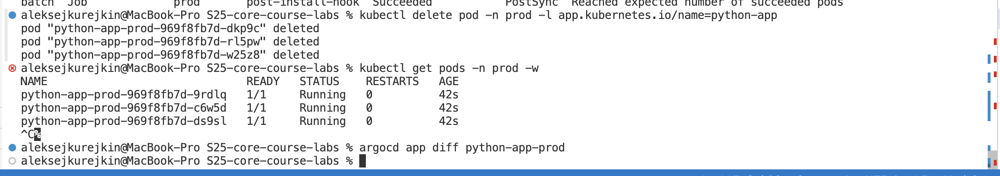
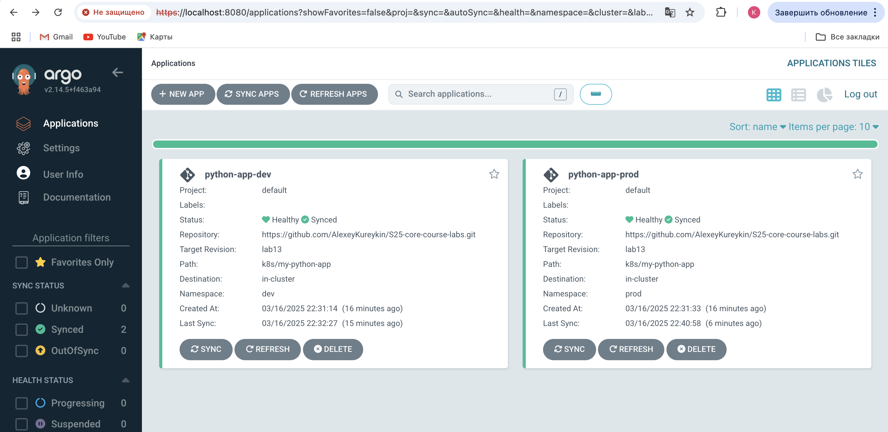
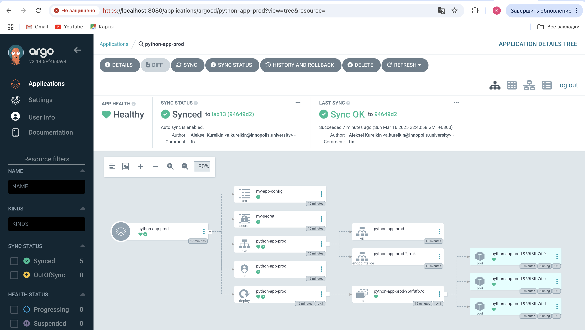

# Lab 13

## Creation of dev and prod:
```bash
aleksejkurejkin@MacBook-Pro S25-core-course-labs % kubectl apply -f k8s/ArgoCD/argocd-python-dev.yaml
application.argoproj.io/python-app-dev created
aleksejkurejkin@MacBook-Pro S25-core-course-labs % kubectl apply -f k8s/ArgoCD/argocd-python-prod.yaml
application.argoproj.io/python-app-prod created
aleksejkurejkin@MacBook-Pro S25-core-course-labs % argocd app list
NAME                    CLUSTER                         NAMESPACE  PROJECT  STATUS     HEALTH       SYNCPOLICY  CONDITIONS  REPO                                                        PATH               TARGET
argocd/python-app-dev   https://kubernetes.default.svc  dev        default  Synced     Progressing  Auto-Prune  <none>      https://github.com/AlexeyKureykin/S25-core-course-labs.git  k8s/my-python-app  lab13
argocd/python-app-prod  https://kubernetes.default.svc  prod       default  OutOfSync  Missing      Auto-Prune  <none>      https://github.com/AlexeyKureykin/S25-core-course-labs.git  k8s/my-python-app  lab13
aleksejkurejkin@MacBook-Pro S25-core-course-labs % argocd app list
NAME                    CLUSTER                         NAMESPACE  PROJECT  STATUS  HEALTH   SYNCPOLICY  CONDITIONS  REPO                                                        PATH               TARGET
argocd/python-app-dev   https://kubernetes.default.svc  dev        default  Synced  Healthy  Auto-Prune  <none>      https://github.com/AlexeyKureykin/S25-core-course-labs.git  k8s/my-python-app  lab13
argocd/python-app-prod  https://kubernetes.default.svc  prod       default  Synced  Healthy  Auto-Prune  <none>      https://github.com/AlexeyKureykin/S25-core-course-labs.git  k8s/my-python-app  lab13
```


## Test 1:
```bash
aleksejkurejkin@MacBook-Pro S25-core-course-labs % kubectl patch deployment python-app-prod -n prod --patch '{"spec":{"replicas": 5}}'
deployment.apps/python-app-prod patched
aleksejkurejkin@MacBook-Pro S25-core-course-labs % argocd app sync python-app-prod
TIMESTAMP                  GROUP        KIND       NAMESPACE                  NAME    STATUS   HEALTH        HOOK  MESSAGE
2025-03-16T22:40:05+03:00             Secret            prod             my-secret    Synced                       
2025-03-16T22:40:05+03:00            Service            prod       python-app-prod    Synced  Healthy              
2025-03-16T22:40:05+03:00         ServiceAccount        prod       python-app-prod    Synced                       
2025-03-16T22:40:05+03:00   apps  Deployment            prod       python-app-prod    Synced  Healthy              
2025-03-16T22:40:05+03:00          ConfigMap            prod         my-app-config    Synced                       
2025-03-16T22:40:05+03:00  batch         Job        prod      pre-install-hook                                 
2025-03-16T22:40:07+03:00  batch         Job        prod      pre-install-hook   Running   Synced     PreSync  job.batch/pre-install-hook created
2025-03-16T22:40:33+03:00  batch         Job            prod      pre-install-hook  Succeeded   Synced     PreSync  Reached expected number of succeeded pods
2025-03-16T22:40:33+03:00         ServiceAccount        prod       python-app-prod    Synced                        serviceaccount/python-app-prod unchanged
2025-03-16T22:40:33+03:00             Secret            prod             my-secret    Synced                        secret/my-secret unchanged
2025-03-16T22:40:33+03:00          ConfigMap            prod         my-app-config    Synced                        configmap/my-app-config unchanged
2025-03-16T22:40:33+03:00            Service            prod       python-app-prod    Synced   Healthy              service/python-app-prod unchanged
2025-03-16T22:40:33+03:00   apps  Deployment            prod       python-app-prod    Synced   Healthy              deployment.apps/python-app-prod unchanged
2025-03-16T22:40:33+03:00  batch         Job        prod     post-install-hook   Running   Synced    PostSync  job.batch/post-install-hook created
2025-03-16T22:40:58+03:00  batch         Job        prod     post-install-hook  Succeeded   Synced    PostSync  Reached expected number of succeeded pods

Name:               argocd/python-app-prod
Project:            default
Server:             https://kubernetes.default.svc
Namespace:          prod
URL:                https://argocd.example.com/applications/python-app-prod
Source:
- Repo:             https://github.com/AlexeyKureykin/S25-core-course-labs.git
  Target:           lab13
  Path:             k8s/my-python-app
  Helm Values:      values-prod.yaml
SyncWindow:         Sync Allowed
Sync Policy:        Automated (Prune)
Sync Status:        Synced to lab13 (94649d2)
Health Status:      Healthy

Operation:          Sync
Sync Revision:      94649d2cc46a7d916c36be53d210e1229c1a5f89
Phase:              Succeeded
Start:              2025-03-16 22:40:05 +0300 MSK
Finished:           2025-03-16 22:40:58 +0300 MSK
Duration:           53s
Message:            successfully synced (no more tasks)

GROUP  KIND            NAMESPACE  NAME               STATUS     HEALTH   HOOK      MESSAGE
batch  Job             prod       pre-install-hook   Succeeded           PreSync   Reached expected number of succeeded pods
       ServiceAccount  prod       python-app-prod    Synced                        serviceaccount/python-app-prod unchanged
       Secret          prod       my-secret          Synced                        secret/my-secret unchanged
       ConfigMap       prod       my-app-config      Synced                        configmap/my-app-config unchanged
       Service         prod       python-app-prod    Synced     Healthy            service/python-app-prod unchanged
apps   Deployment      prod       python-app-prod    Synced     Healthy            deployment.apps/python-app-prod unchanged
batch  Job             prod       post-install-hook  Succeeded           PostSync  Reached expected number of succeeded pods
aleksejkurejkin@MacBook-Pro S25-core-course-labs % argocd app get python-app-prod
Name:               argocd/python-app-prod
Project:            default
Server:             https://kubernetes.default.svc
Namespace:          prod
URL:                https://argocd.example.com/applications/python-app-prod
Source:
- Repo:             https://github.com/AlexeyKureykin/S25-core-course-labs.git
  Target:           lab13
  Path:             k8s/my-python-app
  Helm Values:      values-prod.yaml
SyncWindow:         Sync Allowed
Sync Policy:        Automated (Prune)
Sync Status:        Synced to lab13 (94649d2)
Health Status:      Healthy

GROUP  KIND            NAMESPACE  NAME               STATUS     HEALTH   HOOK      MESSAGE
batch  Job             prod       pre-install-hook   Succeeded           PreSync   Reached expected number of succeeded pods
       ServiceAccount  prod       python-app-prod    Synced                        serviceaccount/python-app-prod unchanged
       Secret          prod       my-secret          Synced                        secret/my-secret unchanged
       ConfigMap       prod       my-app-config      Synced                        configmap/my-app-config unchanged
       Service         prod       python-app-prod    Synced     Healthy            service/python-app-prod unchanged
apps   Deployment      prod       python-app-prod    Synced     Healthy            deployment.apps/python-app-prod unchanged
batch  Job             prod       post-install-hook  Succeeded           PostSync  Reached expected number of succeeded pods
```
## ArgoCD after python-app-prod patched:


## Test 2:
```bash
aleksejkurejkin@MacBook-Pro S25-core-course-labs % kubectl delete pod -n prod -l app.kubernetes.io/name=python-app
pod "python-app-prod-969f8fb7d-dkp9c" deleted
pod "python-app-prod-969f8fb7d-rl5pw" deleted
pod "python-app-prod-969f8fb7d-w25z8" deleted
aleksejkurejkin@MacBook-Pro S25-core-course-labs % kubectl get pods -n prod -w
NAME                              READY   STATUS    RESTARTS   AGE
python-app-prod-969f8fb7d-9rdlq   1/1     Running   0          42s
python-app-prod-969f8fb7d-c6w5d   1/1     Running   0          42s
python-app-prod-969f8fb7d-ds9sl   1/1     Running   0          42s
^C%                                                                                                                                             
aleksejkurejkin@MacBook-Pro S25-core-course-labs % argocd app diff python-app-prod
aleksejkurejkin@MacBook-Pro S25-core-course-labs %
```
## ArgoCD after deletion of pods:






## Explanation:
```
ArgoCD is a GitOps CD tool that ensures that the desired state of Kubernetes applications matches the actual state of the cluster. It continuously monitoring the cluster for deviations and taking corrective actions based on the configured synchronization policies.
```
