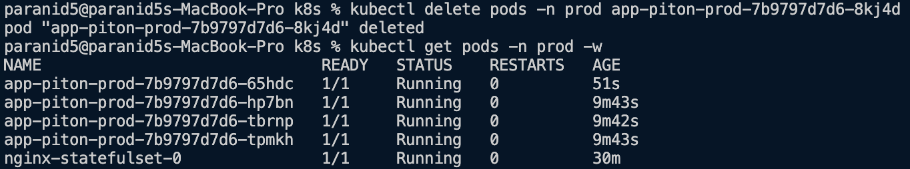

# ArgoCD

## Changes sync

* Sync enabled for all deployments

* Checking if change was observed

* Manual patching

##  Pod deletion

## Configuration drift vs. runtime events

To ensure consistency accros configuration drifts, ArgoCD constantly compares states of an app on host machine with the state in the Git repository. 

When the pod is deleted, it is automatically recreated by Kubernetes, meaning that configuration steps of an app were not changed.

When a component is altered, migration process is launched, meaning that configuration is changed and the syncchronization with remote repository is required.