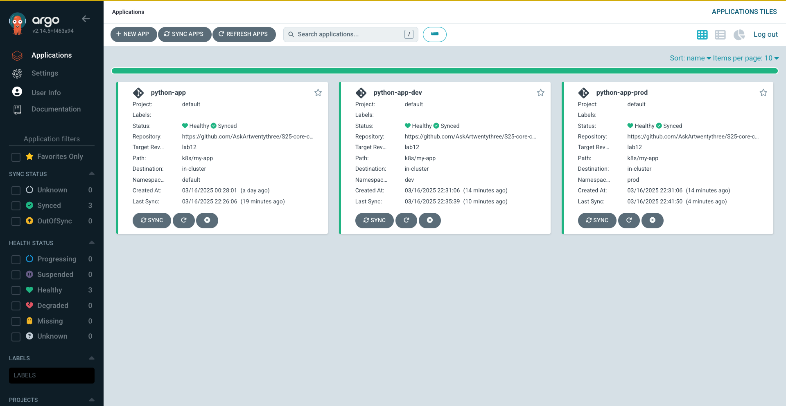

# ArgoCD Report

## ArgoCD Installation and Setup

I installed ArgoCD via Helm using the following command:

```bash
kubectl port-forward svc/argo-argocd-server -n argocd 8080:443 &
```


Then I logged into the ArgoCD CLI (after retrieving the initial admin password) and verified the version:

```bash
argocd version
```

## Python Application Sync

I created an ArgoCD Application for my Python app using the following manifest (`argocd-python-app.yaml`):

```yaml
apiVersion: argoproj.io/v1alpha1
kind: Application
metadata:
  name: python-app
  namespace: argocd
spec:
  project: default
  source:
    repoURL: https://github.com/AskArtwentythree/S25-core-course-labs.git
    targetRevision: lab13
    path: k8s/my-app
    helm:
      valueFiles:
        - values.yaml
  destination:
    server: https://kubernetes.default.svc
    namespace: default
  syncPolicy:
    automated: {}
```

After applying the manifest, I synchronized the application with:

```bash
argocd app sync python-app
```

The output was:

```bash
TIMESTAMP                  GROUP        KIND           NAMESPACE  NAME        STATUS   HEALTH   HOOK  MESSAGE
2025-03-14T14:48:28+03:00   apps         Deployment     default    python-app  Synced   Healthy         successfully synced (all tasks run)
...
Name:               argocd/python-app
Project:            default
Server:             https://kubernetes.default.svc
Namespace:          default
URL:                https://argocd.example.com/applications/python-app
Sync Status:        Synced to lab13 (076fdbd)
Health Status:      Healthy
```

Then, I updated the replica count by modifying the Helm values and syncing again:

```bash
argocd app sync python-app
```

After the update, the output confirmed that the deployment is now running with 2 replicas:

```bash
$ kubectl get pods
NAME                                    READY   STATUS    RESTARTS      AGE
python-app-my-app-688b9f6dd-ssm2f    1/1     Running         0          18m
python-app-my-app-688b9f6dd-zjf6g    1/1     Running         0          18m
```

## Multi-Environment Deployment

For multi-environment deployment, I created separate namespaces (`dev` and `prod`) and corresponding ArgoCD Application manifests:

**Dev environment (`argocd-python-dev.yaml`):**

```yaml
apiVersion: argoproj.io/v1alpha1
kind: Application
metadata:
  name: python-app-dev
  namespace: argocd
spec:
  project: default
  source:
    repoURL: https://github.com/AskArtwentythree/S25-core-course-labs.git
    targetRevision: lab13
    path: k8s/my-app
    helm:
      valueFiles:
        - values.yaml
  destination:
    server: https://kubernetes.default.svc
    namespace: dev
  syncPolicy:
    automated: {}
```

**Prod environment (`argocd-python-prod.yaml`):**

```yaml
apiVersion: argoproj.io/v1alpha1
kind: Application
metadata:
  name: python-app-prod
  namespace: argocd
spec:
  project: default
  source:
    repoURL: https://github.com/AskArtwentythree/S25-core-course-labs.git
    targetRevision: lab12
    path: k8s/my-app
    helm:
      valueFiles:
        - values.yaml
  destination:
    server: https://kubernetes.default.svc
    namespace: prod
  syncPolicy:
    automated: {}
```

After applying these, I tested auto‑sync by updating the replica count in `values-prod.yaml` and observed that ArgoCD automatically synchronized the changes. I also manually patched a deployment and then deleted one pod in prod. ArgoCD restored the desired state as expected.




