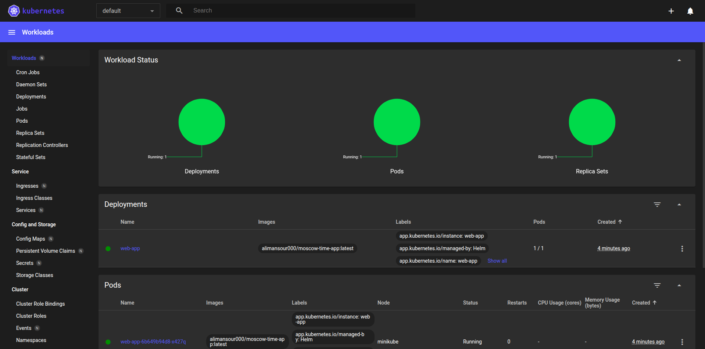

# Lab 13: ArgoCD for GitOps Deployment | Mametov Eldar 

## Task 1: Deploy and Configure ArgoCD

```
lekski@LAPTOP-EA8M0FT5:/mnt/c/Users/Honor/Desktop/S25-core-course-labs$ helm repo add argo https://argoproj.github.io/argo-helm
"argo" has been added to your repositories
```

```
lekski@LAPTOP-EA8M0FT5:/mnt/c/Users/Honor/Desktop/S25-core-course-labs$ kubectl wait --for=condition=ready pod -l app.kubernetes.io/name=argocd-server -n argocd --timeout=90s
pod/argo-argocd-server-6f848cf7f7-zsfrz condition met
lekski@LAPTOP-EA8M0FT5:/mnt/c/Users/Honor/Desktop/S25-core-course-labs$ kubectl get pods -n argocd
NAME                                                     READY   STATUS              RESTARTS   AGE
argo-argocd-application-controller-0                     1/1     Running             0          58s
argo-argocd-applicationset-controller-6bbb8bf56d-tc4r6   1/1     Running             0          59s
argo-argocd-dex-server-f44689b7-nbjvd                    0/1     PodInitializing     0          59s
argo-argocd-notifications-controller-5447b8b5c6-kz4bb    1/1     Running             0          59s
argo-argocd-redis-5b5c7c6f8c-9hmwk                       0/1     ContainerCreating   0          59s
argo-argocd-repo-server-68747cd694-h8jcr                 1/1     Running             0          59s
argo-argocd-server-6f848cf7f7-zsfrz                      1/1     Running             0          57s
```

```
lekski@LAPTOP-EA8M0FT5:/mnt/c/Users/Honor/Desktop/S25-core-course-labs$ chmod +x argocd
lekski@LAPTOP-EA8M0FT5:/mnt/c/Users/Honor/Desktop/S25-core-course-labs$ sudo mv argocd /usr/local/bin/
lekski@LAPTOP-EA8M0FT5:/mnt/c/Users/Honor/Desktop/S25-core-course-labs$ argocd version
argocd: v2.14.4+3d901f2
  BuildDate: 2025-03-04T21:21:26Z
  GitCommit: 3d901f2037888af302a85f518bea70b33ee8e1c7
  GitTreeState: clean
  GoVersion: go1.23.3
  Compiler: gc
  Platform: linux/amd64
argocd-server: v2.14.4+3d901f2
```

```
kski@LAPTOP-EA8M0FT5:/mnt/c/Users/Honor/Desktop/S25-core-course-labs$ kubectl port-forward svc/argo-argocd-server -n argocd 8080:443 &
[1] 25589
lekski@LAPTOP-EA8M0FT5:/mnt/c/Users/Honor/Desktop/S25-core-course-labs$ Forwarding from 127.0.0.1:8080 -> 8080
Forwarding from [::1]:8080 -> 8080
```



```
lekski@LAPTOP-EA8M0FT5:/mnt/c/Users/Honor/Desktop/S25-core-course-labs$ kubectl -n argocd get secret argocd-initial-admin-secret -o jsonpath="{.data.password}" | base64 --decode
yhCgnQWdYf1rHzOX
```


```
lekski@LAPTOP-EA8M0FT5:/mnt/c/Users/Honor/Desktop/S25-core-course-labs/k8s$ argocd app sync argocd/python-app
TIMESTAMP                  GROUP                    KIND       NAMESPACE                  NAME    STATUS   HEALTH        HOOK  MESSAGE
2025-03-13T11:45:04+03:00                            Pod         default      postinstall-hook
2025-03-13T11:45:04+03:00                            Pod         default       preinstall-hook
2025-03-13T11:45:04+03:00                         Secret         default           credentials    Synced
2025-03-13T11:45:04+03:00                        Service         default   python-app-web-apps    Synced  Healthy
2025-03-13T11:45:04+03:00                     ServiceAccount     default              web-apps    Synced
2025-03-13T11:45:04+03:00   apps              Deployment         default   python-app-web-apps    Synced  Healthy
2025-03-13T11:45:04+03:00  networking.k8s.io     Ingress         default   python-app-web-apps    Synced  Healthy
2025-03-13T11:45:04+03:00                      ConfigMap         default       web-apps-config    Synced
2025-03-13T11:45:13+03:00                Pod     default       preinstall-hook   Running   Synced     PreSync  pod/preinstall-hook created
2025-03-13T11:45:47+03:00                            Pod         default       preinstall-hook  Succeeded   Synced     PreSync  pod/preinstall-hook created
2025-03-13T11:45:47+03:00                     ServiceAccount     default              web-apps    Synced                        serviceaccount/web-apps unchanged
2025-03-13T11:45:47+03:00                         Secret         default           credentials    Synced                        secret/credentials unchanged
2025-03-13T11:45:47+03:00                      ConfigMap         default       web-apps-config    Synced                        configmap/web-apps-config unchanged
2025-03-13T11:45:47+03:00                        Service         default   python-app-web-apps    Synced   Healthy              service/python-app-web-apps unchanged
2025-03-13T11:45:47+03:00   apps              Deployment         default   python-app-web-apps    Synced   Healthy              deployment.apps/python-app-web-apps unchanged
2025-03-13T11:45:47+03:00  networking.k8s.io     Ingress         default   python-app-web-apps    Synced   Healthy              ingress.networking.k8s.io/python-app-web-apps unchanged
2025-03-13T11:45:49+03:00                Pod     default      postinstall-hook   Running   Synced    PostSync  pod/postinstall-hook created
2025-03-13T11:46:19+03:00                Pod     default      postinstall-hook  Succeeded   Synced    PostSync  pod/postinstall-hook created

Name:               argocd/python-app
Project:            default
Server:             https://kubernetes.default.svc
Namespace:          default
URL:                https://argocd.example.com/applications/argocd/python-app
Source:
- Repo:             https://github.com/lekski1/S25-core-course-labs.git
  Target:           lab13
  Path:             k8s/web-apps
  Helm Values:      values.yaml
SyncWindow:         Sync Allowed
Sync Policy:        Automated
Sync Status:        Synced to lab13 (59ab9d5)
Health Status:      Healthy

Operation:          Sync
Sync Revision:      59ab9d594cbd2e9ee71ca0f3fbc7503125cb33c2
Phase:              Succeeded
Start:              2025-03-13 11:45:03 +0300 MSK
Finished:           2025-03-13 11:46:19 +0300 MSK
Duration:           1m16s
Message:            successfully synced (no more tasks)

GROUP              KIND            NAMESPACE  NAME                 STATUS     HEALTH   HOOK      MESSAGE
                   Pod             default    preinstall-hook      Succeeded           PreSync   pod/preinstall-hook created
                   ServiceAccount  default    web-apps             Synced                        serviceaccount/web-apps unchanged
                   Secret          default    credentials          Synced                        secret/credentials unchanged
                   ConfigMap       default    web-apps-config      Synced                        configmap/web-apps-config unchanged
                   Service         default    python-app-web-apps  Synced     Healthy            service/python-app-web-apps unchanged
apps               Deployment      default    python-app-web-apps  Synced     Healthy            deployment.apps/python-app-web-apps unchanged
networking.k8s.io  Ingress         default    python-app-web-apps  Synced     Healthy            ingress.networking.k8s.io/python-app-web-apps unchanged
                   Pod             default    postinstall-hook     Succeeded           PostSync  pod/postinstall-hook created
```

after values.yaml changed: 
```
lekski@LAPTOP-EA8M0FT5:/mnt/c/Users/Honor/Desktop/S25-core-course-labs/k8s$ argocd app get python-app
Name:               argocd/python-app
Project:            default
Server:             https://kubernetes.default.svc
Namespace:          default
URL:                https://argocd.example.com/applications/python-app
Source:
- Repo:             https://github.com/lekski1/S25-core-course-labs.git
  Target:           lab13
  Path:             k8s/web-apps
  Helm Values:      values.yaml
SyncWindow:         Sync Allowed
Sync Policy:        Automated
Sync Status:        Synced to lab13 (59ab9d5)
Health Status:      Healthy

GROUP              KIND            NAMESPACE  NAME                 STATUS     HEALTH   HOOK      MESSAGE
                   Pod             default    preinstall-hook      Succeeded           PreSync   pod/preinstall-hook created
                   ServiceAccount  default    web-apps             Synced                        serviceaccount/web-apps unchanged
                   Secret          default    credentials          Synced                        secret/credentials unchanged
                   ConfigMap       default    web-apps-config      Synced                        configmap/web-apps-config unchanged
                   Service         default    python-app-web-apps  Synced     Healthy            service/python-app-web-apps unchanged
apps               Deployment      default    python-app-web-apps  Synced     Healthy            deployment.apps/python-app-web-apps configured
networking.k8s.io  Ingress         default    python-app-web-apps  Synced     Healthy            ingress.networking.k8s.io/python-app-web-apps unchanged
                   Pod             default    postinstall-hook     Succeeded           PostSync  pod/postinstall-hook created
```

```
lekski@LAPTOP-EA8M0FT5:/mnt/c/Users/Honor/Desktop/S25-core-course-labs/k8s$ kubectl get po
NAME                                    READY   STATUS             RESTARTS       AGE
golang-web-app-647d45ff9c-j5ntk         0/2     Error              0              6d17h
postinstall-hook                        0/1     Completed          0              71s
preinstall-hook                         0/1     Completed          0              4m47s
python-app-web-apps-55d87457cc-crxpp    2/2     Running            0              2m51s
python-app-web-apps-55d87457cc-lt8ng    2/2     Running            0              4m13s
vault-0                                 1/1     Running            5 (57m ago)    9d
vault-agent-injector-66f45b5fd5-t9x62   1/1     Running            6 (57m ago)    9d
web-apps-5d797b94f9-hb2kz               1/2     CrashLoopBackOff   41 (95s ago)   6d18h
```


## Task 2

```
lekski@LAPTOP-EA8M0FT5:/mnt/c/Users/Honor/Desktop/S25-core-course-labs/k8s$ kubectl create namespace dev
namespace/dev created
lekski@LAPTOP-EA8M0FT5:/mnt/c/Users/Honor/Desktop/S25-core-course-labs/k8s$ kubectl create namespace prod
namespace/prod created
```

