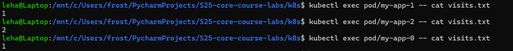

# ArgoCD for GitOps Deployment

## Install ArgoCD via Helm

```bash
> helm repo add argo https://argoproj.github.io/argo-helm
"argo" has been added to your repositories

> helm install argo argo/argo-cd --namespace argocd --create-namespace
NAME: argo
LAST DEPLOYED: Thu Mar 13 20:25:53 2025
NAMESPACE: argocd
STATUS: deployed
REVISION: 1
TEST SUITE: None
NOTES:
In order to access the server UI you have the following options:

1. kubectl port-forward service/argo-argocd-server -n argocd 8080:443

    and then open the browser on http://localhost:8080 and accept the certificate

2. enable ingress in the values file `server.ingress.enabled` and either
      - Add the annotation for ssl passthrough: https://argo-cd.readthedocs.io/en/stable/operator-manual/ingress/#option-1-ssl-passthrough
      - Set the `configs.params."server.insecure"` in the values file and terminate SSL at your ingress: https://argo-cd.readthedocs.io/en/stable/operator-manual/ingress/#option-2-multiple-ingress-objects-and-hosts


After reaching the UI the first time you can login with username: admin and the random password generated during the installation. You can find the password by running:

kubectl -n argocd get secret argocd-initial-admin-secret -o jsonpath="{.data.password}" | base64 -d

(You should delete the initial secret afterwards as suggested by the Getting Started Guide: https://argo-cd.readthedocs.io/en/stable/getting_started/#4-login-using-the-cli)

> kubectl wait --for=condition=ready pod -l app.kubernetes.io/name=argocd-server -n argocd --timeout=90s
pod/argo-argocd-server-85f8dbdd5-9jffz condition met
```

## Install ArgoCD CLI

```bash
> brew install argocd
==> Downloading https://formulae.brew.sh/api/formula.jws.json
==> Downloading https://formulae.brew.sh/api/cask.jws.json
==> Downloading https://ghcr.io/v2/homebrew/core/argocd/manifests/2.14.5
Already downloaded: /Users/m.sirozhova/Library/Caches/Homebrew/downloads/7d1b5ff04b6694988dee3d4bf4d19245e556ae76eeacbd59f903fdd1249a53f6--argocd-2.14.5.bottle_manifest.json
==> Fetching argocd
==> Downloading https://ghcr.io/v2/homebrew/core/argocd/blobs/sha256:5ab232b42438ab52be9dfdea342656efd3fb46d79bc678c9e2a17dc0c4d41633
################################################################################################################################################################################################## 100.0%
==> Pouring argocd--2.14.5.arm64_sonoma.bottle.tar.gz
==> Caveats
zsh completions have been installed to:
  /opt/homebrew/share/zsh/site-functions
==> Summary
🍺  /opt/homebrew/Cellar/argocd/2.14.5: 10 files, 189.9MB
==> Running `brew cleanup argocd`...
Disable this behaviour by setting HOMEBREW_NO_INSTALL_CLEANUP.
Hide these hints with HOMEBREW_NO_ENV_HINTS (see `man brew`).

> argocd version
argocd: v2.14.5+f463a94
  BuildDate: 2025-03-11T04:57:12Z
  GitCommit: f463a945d57267e9691cede37021d9ddc5994f36
  GitTreeState: clean
  GoVersion: go1.24.1
  Compiler: gc
  Platform: darwin/arm64
FATA[0000] Argo CD server address unspecified
```

## Access the ArgoCD UI

```bash
> kubectl port-forward svc/argo-argocd-server -n argocd 8080:443 &

[1] 12206
m.sirozhova@macbook-FN9T7TWJ52 ~ % Forwarding from 127.0.0.1:8080 -> 8080
Forwarding from [::1]:8080 -> 8080

> kubectl -n argocd get secret argocd-initial-admin-secret -o jsonpath="{.data.password}" | base64 --decode
fPAY0OR3fhuyoUJ9%

> argocd login localhost:8080 --insecure
Username: admin
Password:
'admin:login' logged in successfully
Context 'localhost:8080' updated
```

## Configure Python App Sync

```bash
> kubectl apply -f ArgoCD/argocd-python-app.yaml
application.argoproj.io/python-app unchanged

> argocd app sync python-app
TIMESTAMP  GROUP        KIND   NAMESPACE                  NAME    STATUS   HEALTH        HOOK  MESSAGE
2025-03-13T21:33:23+03:00                Pod     default       preinstall-hook   Running   Synced     PreSync  pod/preinstall-hook created
2025-03-13T21:33:47+03:00          ConfigMap         default     app-python-config    Running    Synced              configmap/app-python-config configured. Warning: resource configmaps/app-python-config is missing the kubectl.kubernetes.io/last-applied-configuration annotation which is required by  apply.  apply should only be used on resources created declaratively by either  create --save-config or  apply. The missing annotation will be patched automatically.
2025-03-13T21:33:47+03:00            Service         default  python-app-app-python   Running    Synced              service/python-app-app-python created
2025-03-13T21:33:47+03:00   apps  Deployment         default  python-app-app-python   Running    Synced              deployment.apps/python-app-app-python created
2025-03-13T21:33:47+03:00                Pod         default       preinstall-hook   Succeeded   Synced     PreSync  pod/preinstall-hook created
2025-03-13T21:33:47+03:00         ServiceAccount     default          internal-app    Running    Synced              serviceaccount/internal-app configured. Warning: resource serviceaccounts/internal-app is missing the kubectl.kubernetes.io/last-applied-configuration annotation which is required by  apply.  apply should only be used on resources created declaratively by either  create --save-config or  apply. The missing annotation will be patched automatically.
2025-03-13T21:33:47+03:00         ServiceAccount     default          internal-app   Succeeded   Synced              serviceaccount/internal-app configured. Warning: resource serviceaccounts/internal-app is missing the kubectl.kubernetes.io/last-applied-configuration annotation which is required by  apply.  apply should only be used on resources created declaratively by either  create --save-config or  apply. The missing annotation will be patched automatically.
2025-03-13T21:33:47+03:00          ConfigMap         default     app-python-config   Succeeded   Synced              configmap/app-python-config configured. Warning: resource configmaps/app-python-config is missing the kubectl.kubernetes.io/last-applied-configuration annotation which is required by  apply.  apply should only be used on resources created declaratively by either  create --save-config or  apply. The missing annotation will be patched automatically.
2025-03-13T21:33:47+03:00            Service         default  python-app-app-python  Succeeded   Synced              service/python-app-app-python created
2025-03-13T21:33:58+03:00   apps  Deployment     default  python-app-app-python  Succeeded   Synced              deployment.apps/python-app-app-python created
2025-03-13T21:33:58+03:00                Pod     default      postinstall-hook    Running    Synced    PostSync  pod/postinstall-hook created
2025-03-13T21:34:18+03:00                Pod     default      postinstall-hook  Succeeded   Synced    PostSync  pod/postinstall-hook created

Name:               argocd/python-app
Project:            default
Server:             https://kubernetes.default.svc
Namespace:          default
URL:                https://argocd.example.com/applications/python-app
Source:
- Repo:             https://github.com/Milanaaaa/S25-core-course-labs.git
  Target:           lab13
  Path:             k8s/app-python
  Helm Values:      values.yaml
SyncWindow:         Sync Allowed
Sync Policy:        Automated
Sync Status:        Synced to lab13 (7c96a3f)
Health Status:      Healthy

Operation:          Sync
Sync Revision:      7c96a3fc10cc7d2b83dee69a6ca47ccda3d0e25a
Phase:              Succeeded
Start:              2025-03-13 21:33:20 +0300 MSK
Finished:           2025-03-13 21:34:18 +0300 MSK
Duration:           58s
Message:            successfully synced (no more tasks)

GROUP  KIND            NAMESPACE  NAME                   STATUS     HEALTH   HOOK      MESSAGE
       Pod             default    preinstall-hook        Succeeded           PreSync   pod/preinstall-hook created
       ServiceAccount  default    internal-app           Synced                        serviceaccount/internal-app configured. Warning: resource serviceaccounts/internal-app is missing the kubectl.kubernetes.io/last-applied-configuration annotation which is required by  apply.  apply should only be used on resources created declaratively by either  create --save-config or  apply. The missing annotation will be patched automatically.
       ConfigMap       default    app-python-config      Synced                        configmap/app-python-config configured. Warning: resource configmaps/app-python-config is missing the kubectl.kubernetes.io/last-applied-configuration annotation which is required by  apply.  apply should only be used on resources created declaratively by either  create --save-config or  apply. The missing annotation will be patched automatically.
       Service         default    python-app-app-python  Synced     Healthy            service/python-app-app-python created
apps   Deployment      default    python-app-app-python  Synced     Healthy            deployment.apps/python-app-app-python created
       Pod             default    postinstall-hook       Succeeded           PostSync  pod/postinstall-hook created

> argocd app status python-app
Manage applications

Usage:
  argocd app [flags]
  argocd app [command]
  ...
```

Later the running was done

```bash
GROUP  KIND            NAMESPACE  NAME                   STATUS     HEALTH   HOOK      MESSAGE
       Pod             default    preinstall-hook        Succeeded           PreSync   pod/preinstall-hook created
       ServiceAccount  default    internal-app           Synced                        serviceaccount/internal-app unchanged
       ConfigMap       default    app-python-config      Synced                        configmap/app-python-config unchanged
       Service         default    python-app-app-python  Synced     Healthy            service/python-app-app-python unchanged
apps   Deployment      default    python-app-app-python  Synced     Healthy            deployment.apps/python-app-app-python unchanged
       Pod             default    postinstall-hook       Succeeded           PostSync  pod/postinstall-hook created
```

Then I changed the values.yaml and ran the command again

```bash
> argocd app get python-app
Name:               argocd/python-app
Project:            default
Server:             https://kubernetes.default.svc
Namespace:          default
URL:                https://argocd.example.com/applications/python-app
Source:
- Repo:             https://github.com/Milanaaaa/S25-core-course-labs.git
  Target:           lab13
  Path:             k8s/app-python
  Helm Values:      values.yaml
SyncWindow:         Sync Allowed
Sync Policy:        Automated
Sync Status:        Synced to lab13 (7c96a3f)
Health Status:      Healthy

GROUP  KIND            NAMESPACE  NAME                   STATUS     HEALTH   HOOK      MESSAGE
       Pod             default    preinstall-hook        Succeeded           PreSync   pod/preinstall-hook created
       ServiceAccount  default    internal-app           Synced                        serviceaccount/internal-app unchanged
       ConfigMap       default    app-python-config      Synced                        configmap/app-python-config unchanged
       Service         default    python-app-app-python  Synced     Healthy            service/python-app-app-python unchanged
apps   Deployment      default    python-app-app-python  Synced     Healthy            deployment.apps/python-app-app-python unchanged
       Pod             default    postinstall-hook       Succeeded           PostSync  pod/postinstall-hook created
```

## Multi-Environment Deployment & Auto-Sync

```bash
> kubectl create namespace dev
namespace/dev created

> app-python % kubectl create namespace prod
namespace/prod created

> app-python % kubectl get namespaces
NAME                   STATUS   AGE
argocd                 Active   115m
default                Active   16d
dev                    Active   24s
ingress-nginx          Active   16d
kube-node-lease        Active   16d
kube-public            Active   16d
kube-system            Active   16d
kubernetes-dashboard   Active   16d
prod                   Active   15s
```

## Deploy Multi-Environment via ArgoCD

```bash
> kubectl apply -f argocd-python-dev.yaml
application.argoproj.io/python-app-dev created

> kubectl apply -f argocd-python-prod.yaml
application.argoproj.io/python-app-prod created

> argocd app list
NAME                    CLUSTER                         NAMESPACE  PROJECT  STATUS   HEALTH   SYNCPOLICY  CONDITIONS       REPO                                                   PATH            TARGET
argocd/python-app       https://kubernetes.default.svc  default    default  Synced   Healthy  Auto        <none>           https://github.com/Milanaaaa/S25-core-course-labs.git  k8s/app-python  lab13
argocd/python-app-dev   https://kubernetes.default.svc  dev        default  Unknown  Healthy  Auto-Prune  ComparisonError  https://github.com/Milanaaaa/S25-core-course-labs.git  k8s/app-python  lab13
argocd/python-app-prod  https://kubernetes.default.svc  prod       default  Unknown  Healthy  Auto-Prune  ComparisonError  https://github.com/Milanaaaa/S25-core-course-labs.git  k8s/app-python  lab13
```

```bash
> argocd app get python-app-dev
Name:               argocd/python-app-dev
Project:            default
Server:             https://kubernetes.default.svc
Namespace:          default
URL:                https://argocd.example.com/applications/python-app-dev
Source:
- Repo:             https://github.com/Milanaaaa/S25-core-course-labs.git
  Target:           lab13
  Path:             k8s/app-python
  Helm Values:      values-dev.yaml
SyncWindow:         Sync Allowed
Sync Policy:        Automated
Sync Status:        OutOfSync from lab13 (c790479)
Health Status:      Missing

CONDITION              MESSAGE                                                                                   LAST TRANSITION
SharedResourceWarning  ConfigMap/app-python-config is part of applications argocd/python-app-dev and python-app  2025-03-13 23:08:41 +0300 MSK
SharedResourceWarning  Pod/preinstall-hook is part of applications argocd/python-app-dev and python-app-prod     2025-03-13 23:08:54 +0300 MSK
SharedResourceWarning  ServiceAccount/internal-app is part of applications argocd/python-app-dev and python-app  2025-03-13 23:08:54 +0300 MSK


GROUP  KIND            NAMESPACE  NAME                       STATUS     HEALTH   HOOK     MESSAGE
       Pod             default    preinstall-hook            Running             PreSync  pod/preinstall-hook created
       ConfigMap       default    app-python-config          OutOfSync
       Service         default    python-app-dev-app-python  OutOfSync  Missing
       ServiceAccount  default    internal-app               OutOfSync
apps   Deployment      default    python-app-dev-app-python  OutOfSync  Missing


> argocd app get python-app-prod
Name:               argocd/python-app-prod
Project:            default
Server:             https://kubernetes.default.svc
Namespace:          default
URL:                https://argocd.example.com/applications/python-app-prod
Source:
- Repo:             https://github.com/Milanaaaa/S25-core-course-labs.git
  Target:           lab13
  Path:             k8s/app-python
  Helm Values:      values-prod.yaml
SyncWindow:         Sync Allowed
Sync Policy:        Automated
Sync Status:        Synced to lab13 (c790479)
Health Status:      Progressing

CONDITION              MESSAGE                                                                            LAST TRANSITION
SharedResourceWarning  Pod/preinstall-hook is part of applications argocd/python-app-prod and python-app  2025-03-13 23:09:06 +0300 MSK


GROUP  KIND            NAMESPACE  NAME                        STATUS   HEALTH       HOOK     MESSAGE
       Pod             default    preinstall-hook             Running               PreSync  pod/preinstall-hook configured
       ConfigMap       default    app-python-config           Synced
       Service         default    python-app-prod-app-python  Synced   Healthy
       ServiceAccount  default    internal-app                Synced
apps   Deployment      default    python-app-prod-app-python  Synced   Progressing
```

## Modify values-prod.yaml

```bash
> argocd app get python-app-prod
Name:               argocd/python-app-prod
Project:            default
Server:             https://kubernetes.default.svc
Namespace:          default
URL:                https://argocd.example.com/applications/python-app-prod
Source:
- Repo:             https://github.com/Milanaaaa/S25-core-course-labs.git
  Target:           lab13
  Path:             k8s/app-python
  Helm Values:      values-prod.yaml
SyncWindow:         Sync Allowed
Sync Policy:        Automated
Sync Status:        Synced to lab13 (1f6f2d4)
Health Status:      Healthy

GROUP  KIND            NAMESPACE  NAME                        STATUS     HEALTH   HOOK      MESSAGE
       Pod             default    preinstall-hook             Succeeded           PreSync   pod/preinstall-hook created
       ServiceAccount  default    internal-app                Synced                        serviceaccount/internal-app unchanged
       ConfigMap       default    app-python-config           Synced                        configmap/app-python-config unchanged
       Service         default    python-app-prod-app-python  Synced     Healthy            service/python-app-prod-app-python unchanged
apps   Deployment      default    python-app-prod-app-python  Synced     Healthy            deployment.apps/python-app-prod-app-python configured
       Pod             default    postinstall-hook            Succeeded           PostSync  pod/postinstall-hook created
```

Sync Status Hash has changed

## Modify the deployment’s replica count manually

```bash
> kubectl patch deployment python-app-prod-app-python -n prod --patch '{"spec":{"replicas": 3}}'
deployment.apps/python-app-prod-app-python patched
```

## Observe ArgoCD auto-revert the chang

```bash
> argocd app sync python-app-prod
TIMESTAMP                  GROUP        KIND       NAMESPACE                  NAME          STATUS    HEALTH            HOOK  MESSAGE
2025-03-14T20:44:11+03:00          ConfigMap            prod     app-python-config          Synced
2025-03-14T20:44:11+03:00            Service            prod  python-app-prod-app-python    Synced   Healthy
2025-03-14T20:44:11+03:00         ServiceAccount        prod          internal-app          Synced
2025-03-14T20:44:11+03:00   apps  Deployment            prod  python-app-prod-app-python  OutOfSync  Progressing
2025-03-14T20:44:11+03:00                Pod        prod       preinstall-hook
2025-03-14T20:44:13+03:00                Pod        prod       preinstall-hook   Running   Synced     PreSync  pod/preinstall-hook created
2025-03-14T20:44:15+03:00   apps  Deployment        prod  python-app-prod-app-python  OutOfSync  Healthy
2025-03-14T20:44:34+03:00   apps  Deployment        prod  python-app-prod-app-python    Synced  Progressing
2025-03-14T20:44:34+03:00   apps  Deployment        prod  python-app-prod-app-python    Synced  Healthy
2025-03-14T20:44:36+03:00                Pod            prod       preinstall-hook        Succeeded   Synced     PreSync  pod/preinstall-hook created
2025-03-14T20:44:36+03:00         ServiceAccount        prod          internal-app          Synced                        serviceaccount/internal-app unchanged
2025-03-14T20:44:36+03:00          ConfigMap            prod     app-python-config          Synced                        configmap/app-python-config unchanged
2025-03-14T20:44:36+03:00            Service            prod  python-app-prod-app-python    Synced   Healthy              service/python-app-prod-app-python unchanged
2025-03-14T20:44:36+03:00   apps  Deployment            prod  python-app-prod-app-python    Synced   Healthy              deployment.apps/python-app-prod-app-python configured
2025-03-14T20:44:36+03:00                Pod        prod      postinstall-hook   Running   Synced    PostSync  pod/postinstall-hook created
2025-03-14T20:44:56+03:00                Pod        prod      postinstall-hook  Succeeded   Synced    PostSync  pod/postinstall-hook created

Name:               argocd/python-app-prod
Project:            default
Server:             https://kubernetes.default.svc
Namespace:          prod
URL:                https://argocd.example.com/applications/python-app-prod
Source:
- Repo:             https://github.com/Milanaaaa/S25-core-course-labs.git
  Target:           lab13
  Path:             k8s/app-python
  Helm Values:      values-prod.yaml
SyncWindow:         Sync Allowed
Sync Policy:        Automated
Sync Status:        Synced to lab13 (8924630)
Health Status:      Healthy

Operation:          Sync
Sync Revision:      8924630a4bfd48a2f1af408ebfeceb9241c3bfb9
Phase:              Succeeded
Start:              2025-03-14 20:44:10 +0300 MSK
Finished:           2025-03-14 20:44:56 +0300 MSK
Duration:           46s
Message:            successfully synced (no more tasks)

GROUP  KIND            NAMESPACE  NAME                        STATUS     HEALTH   HOOK      MESSAGE
       Pod             prod       preinstall-hook             Succeeded           PreSync   pod/preinstall-hook created
       ServiceAccount  prod       internal-app                Synced                        serviceaccount/internal-app unchanged
       ConfigMap       prod       app-python-config           Synced                        configmap/app-python-config unchanged
       Service         prod       python-app-prod-app-python  Synced     Healthy            service/python-app-prod-app-python unchanged
apps   Deployment      prod       python-app-prod-app-python  Synced     Healthy            deployment.apps/python-app-prod-app-python configured
       Pod             prod       postinstall-hook            Succeeded           PostSync  pod/postinstall-hook created
       

> argocd app get python-app-prod

Name:               argocd/python-app-prod
Project:            default
Server:             https://kubernetes.default.svc
Namespace:          prod
URL:                https://argocd.example.com/applications/python-app-prod
Source:
- Repo:             https://github.com/Milanaaaa/S25-core-course-labs.git
  Target:           lab13
  Path:             k8s/app-python
  Helm Values:      values-prod.yaml
SyncWindow:         Sync Allowed
Sync Policy:        Automated
Sync Status:        Synced to lab13 (8924630)
Health Status:      Healthy

GROUP  KIND            NAMESPACE  NAME                        STATUS     HEALTH   HOOK      MESSAGE
       Pod             prod       preinstall-hook             Succeeded           PreSync   pod/preinstall-hook created
       ServiceAccount  prod       internal-app                Synced                        serviceaccount/internal-app unchanged
       ConfigMap       prod       app-python-config           Synced                        configmap/app-python-config unchanged
       Service         prod       python-app-prod-app-python  Synced     Healthy            service/python-app-prod-app-python unchanged
apps   Deployment      prod       python-app-prod-app-python  Synced     Healthy            deployment.apps/python-app-prod-app-python configured
       Pod             prod       postinstall-hook            Succeeded           PostSync  pod/postinstall-hook created
```


## Delete a Pod

```bash
> kubectl get pods -n prod
NAME                                          READY   STATUS    RESTARTS   AGE
python-app-prod-app-python-5c8f8f75cd-2vqmt   1/1     Running   0          5m50s

> kubectl delete pod -n prod -l app.kubernetes.io/name=app-python
pod "python-app-prod-app-python-5c8f8f75cd-2vqmt" deleted

> kubectl get pods -n prod
NAME                                          READY   STATUS    RESTARTS   AGE
python-app-prod-app-python-5c8f8f75cd-q2vvf   1/1     Running   0          32s

> argocd app diff python-app-prod

```


## Bonus 



```bash
> kubectl get pods
NAME                                     READY   STATUS    RESTARTS      AGE
app-go-6c8bc687d5-shbrj                  1/1     Running   0             6d7h
app-python-7b6bf8f886-zbt69              1/1     Running   3 (27h ago)   6d7h
go-app-app-go-7c94895c89-bz4f9           1/1     Running   0             84s
python-app-app-python-5b7b769dd8-2lz5m   1/1     Running   0             42m
python-app-app-python-5b7b769dd8-fscwf   1/1     Running   0             42m
vault-0                                  1/1     Running   1 (8d ago)    9d
vault-agent-injector-66f45b5fd5-bddb2    1/1     Running   1 (8d ago)    9d
```

## Explanation of how ArgoCD handles configuration drift vs. runtime events.

ArgoCD detects configuration drift by continuously comparing the desired state (Git) with the actual state (Kubernetes). If drift is found, ArgoCD can alert or automatically sync changes to restore the desired state.

For runtime events (e.g., manual pod restarts or scaling), ArgoCD does not intervene unless they cause a drift in the declared configuration. This ensures that transient runtime events do not trigger unnecessary sync operations.


