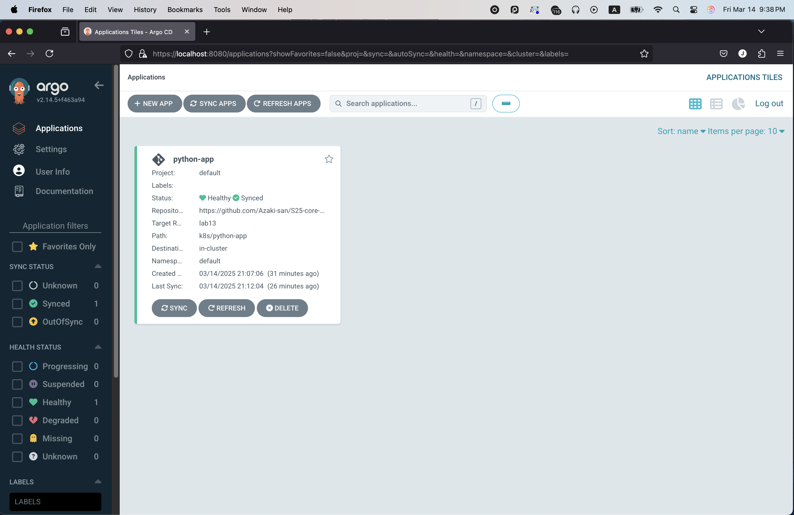

# 13.md
# Task 1: Deploy and Configure ArgoCD

## 1. Install ArgoCD with Helm

1. **Add the Argo Helm Repo**:
   ```bash
   helm repo add argo https://argoproj.github.io/argo-helm
   helm repo update
   ```
2. **Install ArgoCD in a `new argocd` namespace:**
   ```bash
   helm install argo argo/argo-cd --namespace argocd --create-namespace
   ```
   **Output:**
   ```
   andrew@Andrews-MacBook-Pro k8s % helm install argo argo/argo-cd --namespace argocd --create-namespace
   
   NAME: argo
   LAST DEPLOYED: Fri Mar 14 20:22:54 2025
   NAMESPACE: argocd
   STATUS: deployed
   REVISION: 1
   TEST SUITE: None
   NOTES:
   In order to access the server UI you have the following options:
   
   1. kubectl port-forward service/argo-argocd-server -n argocd 8080:443
   
       and then open the browser on http://localhost:8080 and accept the certificate
   
      2. enable ingress in the values file `server.ingress.enabled` and either
            - Add the annotation for ssl passthrough: https://argo-cd.readthedocs.io/en/stable/operator-manual/ingress/#option-1-ssl-passthrough
            - Set the `configs.params."server.insecure"` in the values file and terminate SSL at your ingress: https://argo-cd.readthedocs.io/en/stable/operator-manual/ingress/#option-2-multiple-ingress-objects-and-hosts
   
   
   After reaching the UI the first time you can login with username: admin and the random password generated during the installation. You can find the password by running:
   
   kubectl -n argocd get secret argocd-initial-admin-secret -o jsonpath="{.data.password}" | base64 -d
   
   (You should delete the initial secret afterwards as suggested by the Getting Started Guide: https://argo-cd.readthedocs.io/en/stable/getting_started/#4-login-using-the-cli)
   ```
3. **Wait for Pods:**
   ```bash
   kubectl -n argocd get pods
   ```
   **Output:**
   ```
   andrew@Andrews-MacBook-Pro k8s % kubectl -n argocd get pods
   NAME                                                     READY   STATUS    RESTARTS   AGE
   argo-argocd-application-controller-0                     1/1     Running   0          53m
   argo-argocd-applicationset-controller-688c7bcb6d-w9rzw   1/1     Running   0          53m
   argo-argocd-dex-server-5b797b59c9-nnlr2                  1/1     Running   0          53m
   argo-argocd-notifications-controller-b4c97946d-qn2lt     1/1     Running   0          53m
   argo-argocd-redis-ccc7f98c4-vxbck                        1/1     Running   0          53m
   argo-argocd-repo-server-577bc69c55-4gsk8                 1/1     Running   0          53m
   argo-argocd-server-85f8dbdd5-s45xw                       1/1     Running   0          53m
   ```

## 2. Access the ArgoCD UI
1. **Retrieve Initial Admin Password:**
   ```bash
   kubectl -n argocd get secret argocd-initial-admin-secret -o jsonpath="{.data.password}" | base64 -d
   ```
   Output:
   ```
   andrew@Andrews-MacBook-Pro k8s % kubectl -n argocd get secret argocd-initial-admin-secret -o jsonpath="{.data.password}" | base64 -d
   DXBjDneL6GIAcFtw
   ```
2. **Port-Forward the ArgoCD server:**
   ```bash
   kubectl port-forward service/argo-argocd-server -n argocd 8080:443
   ```
   **Output:**
   ```
   andrew@Andrews-MacBook-Pro k8s % kubectl port-forward service/argo-argocd-server -n argocd 8080:443
   Forwarding from 127.0.0.1:8080 -> 8080
   Forwarding from [::1]:8080 -> 8080
   ```
   This makes ArgoCD UI available at `http://localhost:8080`.
   вСТАВИТЬ СКРИНЧЕК
3. **Login via CLI:**
   ```bash
   argocd login localhost:8080 --insecure
   ```
   Output:
   ```
   andrew@Andrews-MacBook-Pro k8s % argocd login localhost:8080 --insecure
   Username: admin
   Password: 
   'admin:login' logged in successfully
   Context 'localhost:8080' updated
   ```

## 3. Create & Sync Application
1. **Create the ArgoCD Application** by applying `argocd-python-app.yaml`:
   ```bash
   kubectl apply -f ArgoCD/argocd-python-app.yaml
   ```
   **Output:**
   ```
   andrew@Andrews-MacBook-Pro k8s % kubectl apply -f ArgoCD/argocd-python-app.yaml
   application.argoproj.io/python-app created
   ```
2. **Check the App List:**
   ```bash
   argocd app list
   ```
   You should see `argocd/python-app` in OutOfSync state!
3. Sync the Application
   ```bash
   argocd app sync python-app
   ```
   **Output:**
   ```
   andrew@Andrews-MacBook-Pro k8s % argocd app sync python-app
   
   TIMESTAMP                  GROUP        KIND       NAMESPACE                  NAME    STATUS   HEALTH        HOOK  MESSAGE
   2025-03-14T21:08:20+03:00          ConfigMap         default     python-app-config    Synced                       
   2025-03-14T21:08:20+03:00            Service         default            python-app    Synced  Healthy              
   2025-03-14T21:08:20+03:00         ServiceAccount     default           internal-ap    Synced                       
   2025-03-14T21:08:20+03:00   apps  Deployment         default            python-app    Synced  Healthy              
   2025-03-14T21:08:20+03:00                Pod     default  python-app-preinstall-hook                                 
   2025-03-14T21:08:22+03:00                Pod     default  python-app-preinstall-hook   Running   Synced     PreSync  pod/python-app-preinstall-hook created
   2025-03-14T21:08:45+03:00   apps  Deployment         default            python-app          Synced   Healthy              deployment.apps/python-app unchanged
   2025-03-14T21:08:45+03:00                Pod         default  python-app-preinstall-hook  Succeeded   Synced     PreSync  pod/python-app-preinstall-hook created
   2025-03-14T21:08:45+03:00         ServiceAccount     default           internal-ap          Synced                        serviceaccount/internal-ap unchanged
   2025-03-14T21:08:45+03:00          ConfigMap         default     python-app-config          Synced                        configmap/python-app-config unchanged
   2025-03-14T21:08:45+03:00            Service         default            python-app          Synced   Healthy              service/python-app unchanged
   2025-03-14T21:08:45+03:00                Pod     default  python-app-postinstall-hook   Running   Synced    PostSync  pod/python-app-postinstall-hook created
   2025-03-14T21:09:04+03:00                Pod     default  python-app-postinstall-hook  Succeeded   Synced    PostSync  pod/python-app-postinstall-hook created
   
   Name:               argocd/python-app
   Project:            default
   Server:             https://kubernetes.default.svc
   Namespace:          default
   URL:                https://argocd.example.com/applications/python-app
   Source:
   - Repo:             https://github.com/Azaki-san/S25-core-course-labs.git
     Target:           lab13
     Path:             k8s/python-app
     Helm Values:      values.yaml
   SyncWindow:         Sync Allowed
   Sync Policy:        Automated
   Sync Status:        Synced to lab13 (1f92288)
   Health Status:      Healthy
   
   Operation:          Sync
   Sync Revision:      1f922888e457a4fc2f274319e666a4cf072de059
   Phase:              Succeeded
   Start:              2025-03-14 21:08:20 +0300 MSK
   Finished:           2025-03-14 21:09:04 +0300 MSK
   Duration:           44s
   Message:            successfully synced (no more tasks)
   
   GROUP  KIND            NAMESPACE  NAME                         STATUS     HEALTH   HOOK      MESSAGE
          Pod             default    python-app-preinstall-hook   Succeeded           PreSync   pod/python-app-preinstall-hook created
          ServiceAccount  default    internal-ap                  Synced                        serviceaccount/internal-ap unchanged
          ConfigMap       default    python-app-config            Synced                        configmap/python-app-config unchanged
          Service         default    python-app                   Synced     Healthy            service/python-app unchanged
   apps   Deployment      default    python-app                   Synced     Healthy            deployment.apps/python-app unchanged
          Pod             default    python-app-postinstall-hook  Succeeded           PostSync  pod/python-app-postinstall-hook created
   ```
   ArgoCD fetches the Helm chart from Git repo, renders the manifests, and applies them to the cluster.
4. **Check the App list**
   ```bash
   argocd app list
   ```
   **Output:**
   ```
   andrew@Andrews-MacBook-Pro python-app % argocd app list
   NAME               CLUSTER                         NAMESPACE  PROJECT  STATUS  HEALTH   SYNCPOLICY  CONDITIONS  REPO                                                   PATH            TARGET
   argocd/python-app  https://kubernetes.default.svc  default    default  Synced  Healthy  Auto        <none>      https://github.com/Azaki-san/S25-core-course-labs.git  k8s/python-app  lab13
   ```
   
## 4. Test Sync Workflow
1. **Modify `values.yaml`**  
   Just change replica count to 2 :)
2. **Sync update!**  
   Auto-sync is enabled too (in screenshots late you can check it)
   ```bash
   argocd app sync python-app
   ```
   **Output:**
   ```
   andrew@Andrews-MacBook-Pro k8s % argocd app sync python-app  
   
   TIMESTAMP                  GROUP        KIND       NAMESPACE                  NAME    STATUS   HEALTH        HOOK  MESSAGE
   2025-03-14T21:11:20+03:00          ConfigMap         default     python-app-config    Synced                       
   2025-03-14T21:11:20+03:00            Service         default            python-app    Synced  Healthy              
   2025-03-14T21:11:20+03:00         ServiceAccount     default           internal-ap    Synced                       
   2025-03-14T21:11:20+03:00   apps  Deployment         default            python-app    Synced  Healthy              
   2025-03-14T21:11:21+03:00                Pod     default  python-app-preinstall-hook                                 
   2025-03-14T21:11:23+03:00                Pod     default  python-app-preinstall-hook   Running   Synced     PreSync  pod/python-app-preinstall-hook created
   2025-03-14T21:11:43+03:00   apps  Deployment     default            python-app  OutOfSync  Progressing              
   2025-03-14T21:11:44+03:00   apps  Deployment     default            python-app  OutOfSync  Healthy              
   2025-03-14T21:11:45+03:00                Pod         default  python-app-preinstall-hook  Succeeded   Synced     PreSync  pod/python-app-preinstall-hook created
   2025-03-14T21:11:45+03:00         ServiceAccount     default           internal-ap          Synced                        serviceaccount/internal-ap unchanged
   2025-03-14T21:11:45+03:00          ConfigMap         default     python-app-config          Synced                        configmap/python-app-config unchanged
   2025-03-14T21:11:45+03:00            Service         default            python-app          Synced   Healthy              service/python-app unchanged
   2025-03-14T21:11:45+03:00   apps  Deployment         default            python-app        OutOfSync  Healthy              deployment.apps/python-app configured
   2025-03-14T21:11:45+03:00                Pod     default  python-app-postinstall-hook   Running   Synced    PostSync  pod/python-app-postinstall-hook created
   2025-03-14T21:12:04+03:00                Pod     default  python-app-postinstall-hook  Succeeded   Synced    PostSync  pod/python-app-postinstall-hook created
   
   Name:               argocd/python-app
   Project:            default
   Server:             https://kubernetes.default.svc
   Namespace:          default
   URL:                https://argocd.example.com/applications/python-app
   Source:
   - Repo:             https://github.com/Azaki-san/S25-core-course-labs.git
     Target:           lab13
     Path:             k8s/python-app
     Helm Values:      values.yaml
   SyncWindow:         Sync Allowed
   Sync Policy:        Automated
   Sync Status:        Synced to lab13 (7d3a085)
   Health Status:      Healthy
   
   Operation:          Sync
   Sync Revision:      7d3a08571491c8b1e180647c1e3382f88fdf005f
   Phase:              Succeeded
   Start:              2025-03-14 21:11:20 +0300 MSK
   Finished:           2025-03-14 21:12:04 +0300 MSK
   Duration:           44s
   Message:            successfully synced (no more tasks)
   
   GROUP  KIND            NAMESPACE  NAME                         STATUS     HEALTH   HOOK      MESSAGE
          Pod             default    python-app-preinstall-hook   Succeeded           PreSync   pod/python-app-preinstall-hook created
          ServiceAccount  default    internal-ap                  Synced                        serviceaccount/internal-ap unchanged
          ConfigMap       default    python-app-config            Synced                        configmap/python-app-config unchanged
          Service         default    python-app                   Synced     Healthy            service/python-app unchanged
   apps   Deployment      default    python-app                   Synced     Healthy            deployment.apps/python-app configured
          Pod             default    python-app-postinstall-hook  Succeeded           PostSync  pod/python-app-postinstall-hook created
   ```
3. **Check pods:**
   ```bash
   kubectl get pod
   ```
   **Output:**
   ```
   andrew@Andrews-MacBook-Pro k8s % kubectl get pod
   NAME                                    READY   STATUS    RESTARTS        AGE
   python-app-58cc885bfb-895d4             1/1     Running   0               29m
   python-app-58cc885bfb-k64fc             1/1     Running   0               25m
   vault-0                                 1/1     Running   2 (77m ago)     5d21h
   vault-agent-injector-66f45b5fd5-rdncj   1/1     Running   2 (4d11h ago)   5d21h
   ```
   Wow! Two replicas there :)
4. **Bonus! Check UI**
   
   


# Task 2: Multi-Environment Deployment & Auto-Sync

### 1. Set Up Multi-Environment Configurations

1. **Create Namespaces**  
   ```bash
   kubectl create namespace dev
   kubectl create namespace prod
   ```
### 2. Deploy Multi-Environment via ArgoCD
1. **Define Two ArgoCD Applications**
   - `argocd-python-dev.yaml` (for dev namespace, using `values-dev.yaml`).
   - `argocd-python-prod.yaml` (for prod namespace, using `values-prod.yaml`).
2. **Apply Both Applications**
   ```bash
   kubectl apply -f ArgoCD/argocd-python-dev.yaml
   kubectl apply -f ArgoCD/argocd-python-prod.yaml
   ```
   ArgoCD will detect and auto-sync them (due to `automated`).
   
   
   So, everything is automated. I don't need to sync it manually.
3. **Check!**
   ```bash
   argocd app get python-app-dev
   argocd app get python-app-prod
   ```
   **Output:**
   ```
   andrew@Andrews-MacBook-Pro k8s %    argocd app get python-app-dev
   argocd app get python-app-prod
   Name:               argocd/python-app-dev
   Project:            default
   Server:             https://kubernetes.default.svc
   Namespace:          dev
   URL:                https://argocd.example.com/applications/python-app-dev
   Source:
   - Repo:             https://github.com/Azaki-san/S25-core-course-labs.git
     Target:           lab13
     Path:             k8s/python-app
     Helm Values:      values-dev.yaml
   SyncWindow:         Sync Allowed
   Sync Policy:        Automated
   Sync Status:        Synced to lab13 (6106cc0)
   Health Status:      Healthy
   
   GROUP  KIND            NAMESPACE  NAME                             STATUS     HEALTH   HOOK      MESSAGE
          Pod             dev        python-app-dev-preinstall-hook   Succeeded           PreSync   pod/python-app-dev-preinstall-hook created
          ServiceAccount  dev        internal-app                     Synced                        serviceaccount/internal-app created
          ConfigMap       dev        python-app-config                Synced                        configmap/python-app-config created
          Service         dev        python-app-dev                   Synced     Healthy            service/python-app-dev created
   apps   Deployment      dev        python-app-dev                   Synced     Healthy            deployment.apps/python-app-dev created
          Pod             dev        python-app-dev-postinstall-hook  Succeeded           PostSync  pod/python-app-dev-postinstall-hook created
   Name:               argocd/python-app-prod
   Project:            default
   Server:             https://kubernetes.default.svc
   Namespace:          prod
   URL:                https://argocd.example.com/applications/python-app-prod
   Source:
   - Repo:             https://github.com/Azaki-san/S25-core-course-labs.git
     Target:           lab13
     Path:             k8s/python-app
     Helm Values:      values-prod.yaml
   SyncWindow:         Sync Allowed
   Sync Policy:        Automated
   Sync Status:        Synced to lab13 (6106cc0)
   Health Status:      Healthy
   
   GROUP  KIND            NAMESPACE  NAME                              STATUS     HEALTH   HOOK      MESSAGE
          Pod             prod       python-app-prod-preinstall-hook   Succeeded           PreSync   pod/python-app-prod-preinstall-hook created
          ServiceAccount  prod       internal-app                      Synced                        serviceaccount/internal-app created
          ConfigMap       prod       python-app-config                 Synced                        configmap/python-app-config created
          Service         prod       python-app-prod                   Synced     Healthy            service/python-app-prod created
   apps   Deployment      prod       python-app-prod                   Synced     Healthy            deployment.apps/python-app-prod created
          Pod             prod       python-app-prod-postinstall-hook  Succeeded           PostSync  pod/python-app-prod-postinstall-hook created
   ```
4. **Pods**
   ```bash
   kubectl get pod -n prod
   kubectl get pod -n dev
   ```
   **Output:**
   ```
   andrew@Andrews-MacBook-Pro k8s %    kubectl get pod -n prod
      kubectl get pod -n dev
   NAME                               READY   STATUS    RESTARTS   AGE
   python-app-prod-685f7c7677-9xdlt   1/1     Running   0          11m
   python-app-prod-685f7c7677-dktjv   1/1     Running   0          11m
   python-app-prod-685f7c7677-w5tk2   1/1     Running   0          11m
   NAME                             READY   STATUS    RESTARTS   AGE
   python-app-dev-7b5dd747d-vs6k2   1/1     Running   0          12m
   ```
   ArgoCD automatically sync changes!

### 3. Self-Heal Testing
ArgoCD will self-heal if the live state drifts from the desired state in Git.  
Test 1: Manual Override of Replica Count
1. Manually Patch:
   ```bash
   kubectl patch deployment python-app-prod -n prod --patch '{"spec":{"replicas": 4}}'
   kubectl get pod -n prod
   ```
   Output:
   ```
   andrew@Andrews-MacBook-Pro k8s %    kubectl patch deployment python-app-prod -n prod --patch '{"spec":{"replicas": 4}}'
   deployment.apps/python-app-prod patched
   andrew@Andrews-MacBook-Pro k8s % kubectl get pod -n prod                                                            
   NAME                               READY   STATUS    RESTARTS   AGE
   python-app-prod-685f7c7677-9xdlt   1/1     Running   0          14m
   python-app-prod-685f7c7677-dktjv   1/1     Running   0          14m
   python-app-prod-685f7c7677-j8vpl   1/1     Running   0          7s
   python-app-prod-685f7c7677-w5tk2   1/1     Running   0          14m
   ```
2. After syncing, we can see how 4th pod is terminating
   ```
   andrew@Andrews-MacBook-Pro k8s % kubectl get pod -n prod
   NAME                               READY   STATUS        RESTARTS   AGE
   python-app-prod-685f7c7677-9xdlt   1/1     Running       0          17m
   python-app-prod-685f7c7677-dktjv   1/1     Running       0          17m
   python-app-prod-685f7c7677-j8vpl   1/1     Terminating   0          2m40s
   python-app-prod-685f7c7677-w5tk2   1/1     Running       0          17m
   python-app-prod-preinstall-hook    0/1     Completed     0          24s
   ```
Test 2: Delete a Pod
1. **Delete a Pod** in `prod`
   ```bash
   kubectl delete pod -n prod -l app.kubernetes.io/name=python-app
   ```
   **Output:**
   ```
   andrew@Andrews-MacBook-Pro k8s % kubectl delete pod -n prod -l app.kubernetes.io/name=python-app
   
   pod "python-app-prod-685f7c7677-9xdlt" deleted
   pod "python-app-prod-685f7c7677-dktjv" deleted
   pod "python-app-prod-685f7c7677-w5tk2" deleted
   ```
2. **Kubernetes Re-Creates the pod**
   ```
   andrew@Andrews-MacBook-Pro k8s % kubectl get pod -n prod
   NAME                               READY   STATUS        RESTARTS   AGE
   python-app-prod-685f7c7677-9xdlt   1/1     Terminating   0          18m
   python-app-prod-685f7c7677-dktjv   1/1     Terminating   0          18m
   python-app-prod-685f7c7677-g5g45   1/1     Running       0          2s
   python-app-prod-685f7c7677-qzljr   1/1     Running       0          2s
   python-app-prod-685f7c7677-t2hcx   1/1     Running       0          2s
   python-app-prod-685f7c7677-w5tk2   1/1     Terminating   0          18m
   ```
   The Deployment’s replica count is unchanged, so it spawns a replacement Pod automatically.
3. **ArgoCD sees no drift here because the Deployment spec is still the same.**
   ```bash
   andrew@Andrews-MacBook-Pro k8s % argocd app diff python-app-prod
   
   andrew@Andrews-MacBook-Pro k8s %
   ```

# Bonus Task: Sync Your Bonus App with ArgoCD
### **Install and check pods:**
```bash
kubectl apply -f ArgoCD/argocd-golang-app.yaml 
kubectl get pods -n default
```
**Output:**
```
andrew@Andrews-MacBook-Pro k8s % kubectl apply -f ArgoCD/argocd-golang-app.yaml 
application.argoproj.io/golang-app created
andrew@Andrews-MacBook-Pro k8s % kubectl get pods -n default
NAME                                    READY   STATUS      RESTARTS        AGE
golang-app-54c5c694b6-7wtkk             1/1     Running     0               9s
golang-app-postinstall-hook             1/1     Running     0               7s
golang-app-preinstall-hook              0/1     Completed   0               32s
python-app-58cc885bfb-895d4             1/1     Running     0               90m
python-app-58cc885bfb-k64fc             1/1     Running     0               86m
vault-0                                 1/1     Running     2 (138m ago)    5d22h
vault-agent-injector-66f45b5fd5-rdncj   1/1     Running     2 (4d12h ago)   5d22h
```
### Check health
```bash
argocd app get golang-app
```
**Output:**
```
andrew@Andrews-MacBook-Pro k8s % argocd app get golang-app
Name:               argocd/golang-app
Project:            default
Server:             https://kubernetes.default.svc
Namespace:          default
URL:                https://argocd.example.com/applications/golang-app
Source:
- Repo:             https://github.com/Azaki-san/S25-core-course-labs.git
  Target:           lab13
  Path:             k8s/golang-app
  Helm Values:      values.yaml
SyncWindow:         Sync Allowed
Sync Policy:        Automated
Sync Status:        Synced to lab13 (6106cc0)
Health Status:      Healthy

GROUP  KIND            NAMESPACE  NAME                         STATUS     HEALTH   HOOK      MESSAGE
       Pod             default    golang-app-preinstall-hook   Succeeded           PreSync   pod/golang-app-preinstall-hook created
       ServiceAccount  default    golang-app                   Synced                        serviceaccount/golang-app created
       ConfigMap       default    golang-app-config            Synced                        configmap/golang-app-config created
       Service         default    golang-app                   Synced     Healthy            service/golang-app created
apps   Deployment      default    golang-app                   Synced     Healthy            deployment.apps/golang-app created
       Pod             default    golang-app-postinstall-hook  Succeeded           PostSync  pod/golang-app-postinstall-hook created
```


