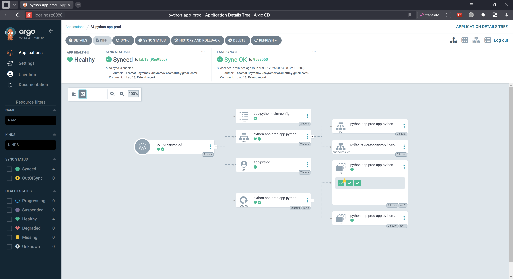

# ArgoCD

## Changes in project

I deleted or edited some files from previous labs to complete this lab

```
secrets.yaml
```

## Deploy and Configure ArgoCD

### ArgoCD installation via Helm

Add the ArgoCD Helm repository

```bash
helm repo add argo https://argoproj.github.io/argo-helm

"argo" has been added to your repositories
```

Install ArgoCD

```bash
helm install argo argo/argo-cd --namespace argocd --create-namespace

NAME: argo
LAST DEPLOYED: Sun Mar  9 21:12:33 2025
NAMESPACE: argocd
STATUS: deployed
REVISION: 1
TEST SUITE: None
NOTES:
In order to access the server UI you have the following options:

1. kubectl port-forward service/argo-argocd-server -n argocd 8080:443

    and then open the browser on http://localhost:8080 and accept the certificate

2. enable ingress in the values file `server.ingress.enabled` and either
      - Add the annotation for ssl passthrough: https://argo-cd.readthedocs.io/en/stable/operator-manual/ingress/#option-1-ssl-passthrough
      - Set the `configs.params."server.insecure"` in the values file and terminate SSL at your ingress: https://argo-cd.readthedocs.io/en/stable/operator-manual/ingress/#option-2-multiple-ingress-objects-and-hosts


After reaching the UI the first time you can login with username: admin and the random password generated during the installation. You can find the password by running:

kubectl -n argocd get secret argocd-initial-admin-secret -o jsonpath="{.data.password}" | base64 -d

(You should delete the initial secret afterwards as suggested by the Getting Started Guide: https://argo-cd.readthedocs.io/en/stable/getting_started/#4-login-using-the-cli)
```

Verify installation

```bash
kubectl wait --for=condition=ready pod -l app.kubernetes.io/name=argocd-server -n argocd --timeout=90s

pod/argo-argocd-server-6f848cf7f7-l65nq condition met
```

### Install ArgoCD CLI

```bash
curl -sSL -o argocd-linux-amd64 https://github.com/argoproj/argo-cd/releases/latest/download/argocd-linux-amd64
  sudo install -m 555 argocd-linux-amd64 /usr/local/bin/argocd
  rm argocd-linux-amd64
```

```bash
argocd version

argocd: v2.14.4+3d901f2
  BuildDate: 2025-03-04T21:21:26Z
  GitCommit: 3d901f2037888af302a85f518bea70b33ee8e1c7
  GitTreeState: clean
  GoVersion: go1.23.3
  Compiler: gc
  Platform: linux/amd64
FATA[0000] Argo CD server address unspecified
```

### Access the ArgoCD UI

Forward the ArgoCD server port

```bash
kubectl port-forward svc/argo-argocd-server -n argocd 8080:443 &

Forwarding from 127.0.0.1:8080 -> 8080
```

Retrieve the password

```bash
kubectl -n argocd get secret argocd-initial-admin-secret -o jsonpath="{.data.password}" | base64 --decode

[INFORMATION DELETED]
```

Log in via CLI

```bash
argocd login localhost:8080 --insecure

Username: admin
Password: 
'admin:login' logged in successfully
Context 'localhost:8080' updated
```

### Configure Python App Sync

Apply the configuration

```bash
kubectl apply -f ArgoCD/argocd-python-app.yaml

application.argoproj.io/python-app created
```

Verify sync

```bash
argocd app sync python-app

TIMESTAMP                  GROUP        KIND       NAMESPACE                  NAME          STATUS   HEALTH        HOOK  MESSAGE
2025-03-13T00:24:12+03:00   apps  Deployment         default  python-app-app-python-helm    Synced  Healthy              
2025-03-13T00:24:12+03:00          ConfigMap         default  app-python-helm-config        Synced                       
2025-03-13T00:24:12+03:00            Service         default  python-app-app-python-helm    Synced  Healthy              
2025-03-13T00:24:12+03:00         ServiceAccount     default            app-python          Synced                       
2025-03-13T00:24:12+03:00                Pod     default  python-app-pre-install-hook                                 
2025-03-13T00:24:14+03:00                Pod     default  python-app-pre-install-hook   Running   Synced     PreSync  pod/python-app-pre-install-hook created
```

```bash
argocd app get python-app

Name:               argocd/python-app
Project:            default
Server:             https://kubernetes.default.svc
Namespace:          default
URL:                https://argocd.example.com/applications/python-app
Source:
- Repo:             https://github.com/azamatbayramov/S25-core-course-labs.git
  Target:           lab13
  Path:             k8s/app-python-helm
  Helm Values:      values.yaml
SyncWindow:         Sync Allowed
Sync Policy:        Automated
Sync Status:        Synced to lab13 (fd36834)
Health Status:      Healthy

GROUP  KIND            NAMESPACE  NAME                          STATUS     HEALTH   HOOK      MESSAGE
       Pod             default    python-app-pre-install-hook   Succeeded           PreSync   pod/python-app-pre-install-hook created
       ServiceAccount  default    app-python                    Synced                        serviceaccount/app-python unchanged
       ConfigMap       default    app-python-helm-config        Synced                        configmap/app-python-helm-config unchanged
       Service         default    python-app-app-python-helm    Synced     Healthy            service/python-app-app-python-helm unchanged
apps   Deployment      default    python-app-app-python-helm    Synced     Healthy            deployment.apps/python-app-app-python-helm unchanged
       Pod             default    python-app-post-install-hook  Succeeded           PostSync  pod/python-app-post-install-hook created
```

Changed and pushed `replicaCount: 2` in `values.yaml` and observed the sync

```bash
argocd app get python-app

Name:               argocd/python-app
Project:            default
Server:             https://kubernetes.default.svc
Namespace:          default
URL:                https://argocd.example.com/applications/python-app
Source:
- Repo:             https://github.com/azamatbayramov/S25-core-course-labs.git
  Target:           lab13
  Path:             k8s/app-python-helm
  Helm Values:      values.yaml
SyncWindow:         Sync Allowed
Sync Policy:        Automated
Sync Status:        Synced to lab13 (58fbb91)
Health Status:      Healthy

GROUP  KIND            NAMESPACE  NAME                          STATUS     HEALTH   HOOK      MESSAGE
       Pod             default    python-app-pre-install-hook   Succeeded           PreSync   pod/python-app-pre-install-hook created
       ServiceAccount  default    app-python                    Synced                        serviceaccount/app-python unchanged
       ConfigMap       default    app-python-helm-config        Synced                        configmap/app-python-helm-config unchanged
       Service         default    python-app-app-python-helm    Synced     Healthy            service/python-app-app-python-helm unchanged
apps   Deployment      default    python-app-app-python-helm    Synced     Healthy            deployment.apps/python-app-app-python-helm configured
       Pod             default    python-app-post-install-hook  Succeeded           PostSync  pod/python-app-post-install-hook created
```

```bash
kubectl get deployments.apps

NAME                         READY   UP-TO-DATE   AVAILABLE   AGE
app-go-helm                  1/1     1            1           3d3h
app-python-helm              1/1     1            1           3d3h
python-app-app-python-helm   2/2     2            2           22m
vault-agent-injector         1/1     1            1           10d
```

```bash
kubectl get po

NAME                                          READY   STATUS    RESTARTS        AGE
app-go-helm-69958f7d97-6r9wm                  1/1     Running   1 (2d23h ago)   3d3h
app-python-helm-bfcb8cc8c-25czd               1/1     Running   1 (2d23h ago)   3d3h
python-app-app-python-helm-7bdbf97cdd-ns4g9   1/1     Running   0               8m32s
python-app-app-python-helm-7bdbf97cdd-zrr6n   1/1     Running   0               24m
vault-0                                       1/1     Running   4 (2d23h ago)   10d
vault-agent-injector-66f45b5fd5-94mb7         1/1     Running   4 (2d23h ago)   10d
```

As we can see, count of pods increased to 2

## Multi-Environment Deployment & Auto-Sync

### Create Namespaces

```bash
kubectl create namespace dev

namespace/dev created
```

```bash
kubectl create namespace prod

namespace/prod created
```

### Deploy Multi-Environment via ArgoCD

```bash
kubectl apply -f ArgoCD/argocd-python-dev.yaml

application.argoproj.io/python-app-dev created
```

```bash
kubectl apply -f ArgoCD/argocd-python-prod.yaml

application.argoproj.io/python-app-prod created
```

```bash
kubectl get deployments.apps -n dev

NAME                             READY   UP-TO-DATE   AVAILABLE   AGE
python-app-dev-app-python-helm   1/1     1            1           2m39s

```

```bash
kubectl get deployments.apps -n prod

NAME                              READY   UP-TO-DATE   AVAILABLE   AGE
python-app-prod-app-python-helm   3/3     3            3           2m36s
```

### Auto-Sync

```bash
kubectl exec -n prod -it python-app-prod-app-python-helm-58645759db-4vdk6 -- printenv | grep PY_VAR_1

PY_VAR_1=pyVar1 prod value
```

Changed `PY_VAR_1` to `pyVar1 prod value changed` in `values-prod.yaml` and pushed the changes

After some time in new pod we can see the changes

```bash
kubectl exec -n prod -it python-app-prod-app-python-helm-68d478b4c4-bqf97 -- printenv | grep PY_VAR_1

PY_VAR_1=pyVar1 prod value changed
```

## Self-Heal Testing (Manual Override of Replica Count)

Check the current status of application

```bash
argocd app get python-app-prod -o tree

Name:               argocd/python-app-prod
Project:            default
Server:             https://kubernetes.default.svc
Namespace:          prod
URL:                https://argocd.example.com/applications/python-app-prod
Source:
- Repo:             https://github.com/azamatbayramov/S25-core-course-labs.git
  Target:           lab13
  Path:             k8s/app-python-helm
  Helm Values:      values-prod.yaml
SyncWindow:         Sync Allowed
Sync Policy:        Automated
Sync Status:        Synced to lab13 (6d11bf0)
Health Status:      Healthy

KIND/NAME                                                 STATUS  HEALTH   MESSAGE
ConfigMap/app-python-helm-config                          Synced           configmap/app-python-helm-config unchanged
Service/python-app-prod-app-python-helm                   Synced  Healthy  service/python-app-prod-app-python-helm unchanged
├─Endpoints/python-app-prod-app-python-helm                                
└─EndpointSlice/python-app-prod-app-python-helm-f8f6p                      
ServiceAccount/app-python                                 Synced           serviceaccount/app-python unchanged
Deployment/python-app-prod-app-python-helm                Synced  Healthy  deployment.apps/python-app-prod-app-python-helm configured
├─ReplicaSet/python-app-prod-app-python-helm-58645759db           Healthy  
└─ReplicaSet/python-app-prod-app-python-helm-68d478b4c4           Healthy  
  ├─Pod/python-app-prod-app-python-helm-68d478b4c4-t87zr          Healthy  
  ├─Pod/python-app-prod-app-python-helm-68d478b4c4-wk9qx          Healthy  
  └─Pod/python-app-prod-app-python-helm-68d478b4c4-zjtqm          Healthy
```

Patch the deployment to increase the replica count

```bash
kubectl patch deployment python-app-prod-app-python-helm -n prod --patch '{"spec":{"replicas": 10}}'

deployment.apps/python-app-prod-app-python-helm patched
```

Check the status of the application

```bash
argocd app get python-app-prod -o tree

Name:               argocd/python-app-prod
Project:            default
Server:             https://kubernetes.default.svc
Namespace:          prod
URL:                https://argocd.example.com/applications/python-app-prod
Source:
- Repo:             https://github.com/azamatbayramov/S25-core-course-labs.git
  Target:           lab13
  Path:             k8s/app-python-helm
  Helm Values:      values-prod.yaml
SyncWindow:         Sync Allowed
Sync Policy:        Automated
Sync Status:        OutOfSync from lab13 (6d11bf0)
Health Status:      Progressing

KIND/NAME                                                 STATUS     HEALTH       MESSAGE
Service/python-app-prod-app-python-helm                   Synced     Healthy      service/python-app-prod-app-python-helm unchanged
├─Endpoints/python-app-prod-app-python-helm                                       
└─EndpointSlice/python-app-prod-app-python-helm-f8f6p                             
ServiceAccount/app-python                                 Synced                  serviceaccount/app-python unchanged
Deployment/python-app-prod-app-python-helm                OutOfSync  Progressing  deployment.apps/python-app-prod-app-python-helm configured
├─ReplicaSet/python-app-prod-app-python-helm-58645759db              Healthy      
└─ReplicaSet/python-app-prod-app-python-helm-68d478b4c4              Progressing  
  ├─Pod/python-app-prod-app-python-helm-68d478b4c4-8ggqq             Progressing  
  ├─Pod/python-app-prod-app-python-helm-68d478b4c4-bbzrj             Progressing  
  ├─Pod/python-app-prod-app-python-helm-68d478b4c4-dtd2h             Progressing  
  ├─Pod/python-app-prod-app-python-helm-68d478b4c4-qbg9c             Progressing  
  ├─Pod/python-app-prod-app-python-helm-68d478b4c4-qz6mc             Progressing  
  ├─Pod/python-app-prod-app-python-helm-68d478b4c4-t87zr             Healthy      
  ├─Pod/python-app-prod-app-python-helm-68d478b4c4-wd687             Progressing  
  ├─Pod/python-app-prod-app-python-helm-68d478b4c4-wk9qx             Healthy      
  ├─Pod/python-app-prod-app-python-helm-68d478b4c4-zhdbc             Progressing  
  └─Pod/python-app-prod-app-python-helm-68d478b4c4-zjtqm             Healthy      
ConfigMap/app-python-helm-config                          Synced                  configmap/app-python-helm-config unchanged
```

Check the status of the application again

```bash
argocd app get python-app-prod -o tree
Name:               argocd/python-app-prod
Project:            default
Server:             https://kubernetes.default.svc
Namespace:          prod
URL:                https://argocd.example.com/applications/python-app-prod
Source:
- Repo:             https://github.com/azamatbayramov/S25-core-course-labs.git
  Target:           lab13
  Path:             k8s/app-python-helm
  Helm Values:      values-prod.yaml
SyncWindow:         Sync Allowed
Sync Policy:        Automated
Sync Status:        OutOfSync from lab13 (6d11bf0)
Health Status:      Healthy

KIND/NAME                                                 STATUS     HEALTH   MESSAGE
ConfigMap/app-python-helm-config                          Synced              configmap/app-python-helm-config unchanged
Service/python-app-prod-app-python-helm                   Synced     Healthy  service/python-app-prod-app-python-helm unchanged
├─Endpoints/python-app-prod-app-python-helm                                   
└─EndpointSlice/python-app-prod-app-python-helm-f8f6p                         
ServiceAccount/app-python                                 Synced              serviceaccount/app-python unchanged
Deployment/python-app-prod-app-python-helm                OutOfSync  Healthy  deployment.apps/python-app-prod-app-python-helm configured
├─ReplicaSet/python-app-prod-app-python-helm-58645759db              Healthy  
└─ReplicaSet/python-app-prod-app-python-helm-68d478b4c4              Healthy  
  ├─Pod/python-app-prod-app-python-helm-68d478b4c4-8ggqq             Healthy  
  ├─Pod/python-app-prod-app-python-helm-68d478b4c4-bbzrj             Healthy  
  ├─Pod/python-app-prod-app-python-helm-68d478b4c4-dtd2h             Healthy  
  ├─Pod/python-app-prod-app-python-helm-68d478b4c4-qbg9c             Healthy  
  ├─Pod/python-app-prod-app-python-helm-68d478b4c4-qz6mc             Healthy  
  ├─Pod/python-app-prod-app-python-helm-68d478b4c4-t87zr             Healthy  
  ├─Pod/python-app-prod-app-python-helm-68d478b4c4-wd687             Healthy  
  ├─Pod/python-app-prod-app-python-helm-68d478b4c4-wk9qx             Healthy  
  ├─Pod/python-app-prod-app-python-helm-68d478b4c4-zhdbc             Healthy  
  └─Pod/python-app-prod-app-python-helm-68d478b4c4-zjtqm             Healthy
```

Sync the application

```bash
argocd app sync python-app-prod
TIMESTAMP                  GROUP        KIND       NAMESPACE                  NAME               STATUS    HEALTH        HOOK  MESSAGE
2025-03-15T23:44:48+03:00         ServiceAccount        prod            app-python               Synced                        
2025-03-15T23:44:48+03:00   apps  Deployment            prod  python-app-prod-app-python-helm  OutOfSync  Healthy              
2025-03-15T23:44:48+03:00          ConfigMap            prod  app-python-helm-config             Synced                        
2025-03-15T23:44:48+03:00            Service            prod  python-app-prod-app-python-helm    Synced   Healthy              
2025-03-15T23:44:48+03:00                Pod        prod  python-app-prod-pre-install-hook                                 
2025-03-15T23:44:50+03:00                Pod        prod  python-app-prod-pre-install-hook   Running   Synced     PreSync  pod/python-app-prod-pre-install-hook created
2025-03-15T23:45:00+03:00   apps  Deployment        prod  python-app-prod-app-python-helm    Synced  Progressing              
2025-03-15T23:45:00+03:00   apps  Deployment        prod  python-app-prod-app-python-helm    Synced  Healthy              
2025-03-15T23:45:02+03:00                Pod            prod  python-app-prod-pre-install-hook  Succeeded   Synced     PreSync  pod/python-app-prod-pre-install-hook created
2025-03-15T23:45:02+03:00         ServiceAccount        prod            app-python                Synced                        serviceaccount/app-python unchanged
2025-03-15T23:45:02+03:00          ConfigMap            prod  app-python-helm-config              Synced                        configmap/app-python-helm-config unchanged
2025-03-15T23:45:02+03:00            Service            prod  python-app-prod-app-python-helm     Synced   Healthy              service/python-app-prod-app-python-helm unchanged
2025-03-15T23:45:02+03:00   apps  Deployment            prod  python-app-prod-app-python-helm     Synced   Healthy              deployment.apps/python-app-prod-app-python-helm configured
2025-03-15T23:45:02+03:00                Pod        prod  python-app-prod-post-install-hook   Running   Synced    PostSync  pod/python-app-prod-post-install-hook created
2025-03-15T23:45:09+03:00                Pod        prod  python-app-prod-post-install-hook  Succeeded   Synced    PostSync  pod/python-app-prod-post-install-hook created

Name:               argocd/python-app-prod
Project:            default
Server:             https://kubernetes.default.svc
Namespace:          prod
URL:                https://argocd.example.com/applications/python-app-prod
Source:
- Repo:             https://github.com/azamatbayramov/S25-core-course-labs.git
  Target:           lab13
  Path:             k8s/app-python-helm
  Helm Values:      values-prod.yaml
SyncWindow:         Sync Allowed
Sync Policy:        Automated
Sync Status:        Synced to lab13 (6d11bf0)
Health Status:      Healthy

Operation:          Sync
Sync Revision:      6d11bf01dd928c14c9fc133f59ae7ee3e25e731f
Phase:              Succeeded
Start:              2025-03-15 23:44:48 +0300 MSK
Finished:           2025-03-15 23:45:09 +0300 MSK
Duration:           21s
Message:            successfully synced (no more tasks)

GROUP  KIND            NAMESPACE  NAME                               STATUS     HEALTH   HOOK      MESSAGE
       Pod             prod       python-app-prod-pre-install-hook   Succeeded           PreSync   pod/python-app-prod-pre-install-hook created
       ServiceAccount  prod       app-python                         Synced                        serviceaccount/app-python unchanged
       ConfigMap       prod       app-python-helm-config             Synced                        configmap/app-python-helm-config unchanged
       Service         prod       python-app-prod-app-python-helm    Synced     Healthy            service/python-app-prod-app-python-helm unchanged
apps   Deployment      prod       python-app-prod-app-python-helm    Synced     Healthy            deployment.apps/python-app-prod-app-python-helm configured
       Pod             prod       python-app-prod-post-install-hook  Succeeded           PostSync  pod/python-app-prod-post-install-hook created
```

Get the status of the application

```bash
argocd app get python-app-prod -o tree
Name:               argocd/python-app-prod
Project:            default
Server:             https://kubernetes.default.svc
Namespace:          prod
URL:                https://argocd.example.com/applications/python-app-prod
Source:
- Repo:             https://github.com/azamatbayramov/S25-core-course-labs.git
  Target:           lab13
  Path:             k8s/app-python-helm
  Helm Values:      values-prod.yaml
SyncWindow:         Sync Allowed
Sync Policy:        Automated
Sync Status:        Synced to lab13 (6d11bf0)
Health Status:      Healthy

KIND/NAME                                                 STATUS  HEALTH   MESSAGE
ConfigMap/app-python-helm-config                          Synced           configmap/app-python-helm-config unchanged
Service/python-app-prod-app-python-helm                   Synced  Healthy  service/python-app-prod-app-python-helm unchanged
├─Endpoints/python-app-prod-app-python-helm                                
└─EndpointSlice/python-app-prod-app-python-helm-f8f6p                      
ServiceAccount/app-python                                 Synced           serviceaccount/app-python unchanged
Deployment/python-app-prod-app-python-helm                Synced  Healthy  deployment.apps/python-app-prod-app-python-helm configured
├─ReplicaSet/python-app-prod-app-python-helm-58645759db           Healthy  
└─ReplicaSet/python-app-prod-app-python-helm-68d478b4c4           Healthy  
  ├─Pod/python-app-prod-app-python-helm-68d478b4c4-t87zr          Healthy  
  ├─Pod/python-app-prod-app-python-helm-68d478b4c4-wk9qx          Healthy  
  └─Pod/python-app-prod-app-python-helm-68d478b4c4-zjtqm          Healthy
```

## Self-Heal Testing (Delete a Pod)

Get the statuses of the pods

```bash
kubectl get pods -n prod

NAME                                               READY   STATUS    RESTARTS   AGE
python-app-prod-app-python-helm-68d478b4c4-t87zr   1/1     Running   0          31m
python-app-prod-app-python-helm-68d478b4c4-wk9qx   1/1     Running   0          48m
python-app-prod-app-python-helm-68d478b4c4-zjtqm   1/1     Running   0          48m
```

Delete a pod

```bash
kubectl delete pod -n prod python-app-prod-app-python-helm-68d478b4c4-t87zr

pod "python-app-prod-app-python-helm-68d478b4c4-t87zr" deleted
```

Get the statuses of the pods

```bash
kubectl get pods -n prod -w

NAME                                               READY   STATUS    RESTARTS   AGE
python-app-prod-app-python-helm-68d478b4c4-t87zr   1/1     Running   0          32m
python-app-prod-app-python-helm-68d478b4c4-wk9qx   1/1     Running   0          49m
python-app-prod-app-python-helm-68d478b4c4-zjtqm   1/1     Running   0          49m
python-app-prod-app-python-helm-68d478b4c4-t87zr   1/1     Terminating   0          32m
python-app-prod-app-python-helm-68d478b4c4-p6f62   0/1     Pending       0          0s
python-app-prod-app-python-helm-68d478b4c4-p6f62   0/1     Pending       0          0s
python-app-prod-app-python-helm-68d478b4c4-p6f62   0/1     ContainerCreating   0          0s
python-app-prod-app-python-helm-68d478b4c4-t87zr   0/1     Completed           0          32m
python-app-prod-app-python-helm-68d478b4c4-t87zr   0/1     Completed           0          32m
python-app-prod-app-python-helm-68d478b4c4-t87zr   0/1     Completed           0          32m
python-app-prod-app-python-helm-68d478b4c4-p6f62   0/1     Running             0          1s
python-app-prod-app-python-helm-68d478b4c4-p6f62   1/1     Running             0          12s
```

Get the statuses of the pods

```bash
kubectl get pods -n prod

NAME                                               READY   STATUS    RESTARTS   AGE
python-app-prod-app-python-helm-68d478b4c4-p6f62   1/1     Running   0          45s
python-app-prod-app-python-helm-68d478b4c4-wk9qx   1/1     Running   0          49m
python-app-prod-app-python-helm-68d478b4c4-zjtqm   1/1     Running   0          50m
```

Get the diff of the application

```bash
argocd app diff python-app-prod
```

Screenshot of UI after tests:



## Bonus Task

```bash
kubectl apply -f ArgoCD/argocd-go-app.yaml 

application.argoproj.io/go-app created
```

```bash
kubectl get po

NAME                                          READY   STATUS    RESTARTS        AGE
app-go-helm-69958f7d97-6r9wm                  1/1     Running   2 (2d23h ago)   6d3h
app-python-helm-bfcb8cc8c-25czd               1/1     Running   2 (2d23h ago)   6d3h
go-app-pre-install-hook                       1/1     Running   0               4s
python-app-app-python-helm-766b5c48f6-8rrcb   1/1     Running   0               103m
python-app-app-python-helm-766b5c48f6-kdx2r   1/1     Running   0               103m
vault-0                                       1/1     Running   5 (2d23h ago)   13d
vault-agent-injector-66f45b5fd5-94mb7         1/1     Running   5 (2d23h ago)   13d
```

```bash
argocd app get go-app

Name:               argocd/go-app
Project:            default
Server:             https://kubernetes.default.svc
Namespace:          default
URL:                https://argocd.example.com/applications/go-app
Source:
- Repo:             https://github.com/azamatbayramov/S25-core-course-labs.git
  Target:           lab13
  Path:             k8s/app-go-helm
  Helm Values:      values.yaml
SyncWindow:         Sync Allowed
Sync Policy:        Automated
Sync Status:        Synced to lab13 (59af2d5)
Health Status:      Healthy

GROUP  KIND            NAMESPACE  NAME                      STATUS     HEALTH   HOOK      MESSAGE
       Pod             default    go-app-pre-install-hook   Succeeded           PreSync   pod/go-app-pre-install-hook created
       ServiceAccount  default    go-app-app-go-helm        Synced                        serviceaccount/go-app-app-go-helm created
       ConfigMap       default    app-go-helm-config        Synced                        configmap/app-go-helm-config configured. Warning: resource configmaps/app-go-helm-config is missing the kubectl.kubernetes.io/last-applied-configuration annotation which is required by  apply.  apply should only be used on resources created declaratively by either  create --save-config or  apply. The missing annotation will be patched automatically.
       Service         default    go-app-app-go-helm        Synced     Healthy            service/go-app-app-go-helm created
apps   Deployment      default    go-app-app-go-helm        Synced     Healthy            deployment.apps/go-app-app-go-helm created
       Pod             default    go-app-post-install-hook  Succeeded           PostSync  pod/go-app-post-install-hook created
```


## Explanation of how ArgoCD handles configuration drift vs. runtime events.

### Configuration Drift

Happens when the cluster setup doesn’t match Git.
ArgoCD spots and fixes these changes automatically.
Example: In Test 1, a manually changed replica count was reset to match Git.

### Runtime Events

Includes normal Kubernetes actions like restarting pods or scaling.
ArgoCD ignores these because they are expected.
Example: In Test 2, a deleted pod was recreated by Kubernetes without ArgoCD stepping in.
