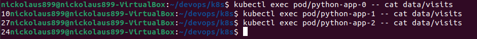
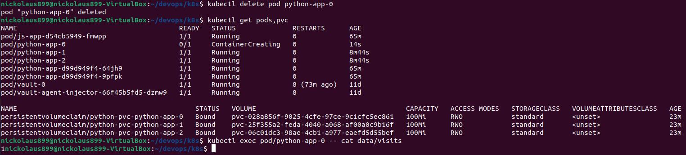

# Stateful Set

I followed tutorial and completed `helm install`. I have defined 
`podManagementPolicy` as Parallel and `volumeClaimTemplates`
 in `statefulset.yaml` and moved parameters to `values.yaml`

```
$ kubectl get po,sts,svc,pvc
NAME                                        READY   STATUS              RESTARTS      AGE
pod/js-app-d54cb5949-fmwpp                  1/1     Running             0             41m
pod/python-app-0                            0/1     ContainerCreating   0             9s
pod/python-app-1                            0/1     ContainerCreating   0             9s
pod/python-app-2                            0/1     ContainerCreating   0             9s
pod/python-app-d99d949f4-64jh9              1/1     Running             0             41m
pod/python-app-d99d949f4-9pfpk              1/1     Running             0             41m
pod/vault-0                                 1/1     Running             8 (49m ago)   11d
pod/vault-agent-injector-66f45b5fd5-dzmw9   1/1     Running             8             11d

NAME                          READY   AGE
statefulset.apps/python-app   0/3     10s
statefulset.apps/vault        1/1     11d

NAME                               TYPE        CLUSTER-IP       EXTERNAL-IP   PORT(S)             AGE
service/js-app                     ClusterIP   10.101.194.242   <none>        3000/TCP            41m
service/kubernetes                 ClusterIP   10.96.0.1        <none>        443/TCP             11d
service/python-app                 ClusterIP   10.110.250.191   <none>        5000/TCP            10s
service/vault                      ClusterIP   10.106.60.87     <none>        8200/TCP,8201/TCP   11d
service/vault-agent-injector-svc   ClusterIP   10.106.180.175   <none>        443/TCP             11d
service/vault-internal             ClusterIP   None             <none>        8200/TCP,8201/TCP   11d

NAME                                            STATUS   VOLUME                                     CAPACITY   ACCESS MODES   STORAGECLASS   VOLUMEATTRIBUTESCLASS   AGE
persistentvolumeclaim/python-pvc-python-app-0   Bound    pvc-028a856f-9025-4cfe-97ce-9c1cfc5ec861   100Mi      RWO            standard       <unset>                 10s
persistentvolumeclaim/python-pvc-python-app-1   Bound    pvc-25f355a2-feda-4040-a068-af00a0c9b16f   100Mi      RWO            standard       <unset>                 9s
persistentvolumeclaim/python-pvc-python-app-2   Bound    pvc-06c01dc3-98ae-4cb1-a977-eaefd5d55bef   100Mi      RWO            standard       <unset>                 9s
```

## Accessing app

Command `minikube service python-app` returned me an address of my app. I openned it in different
tabs and reloaded page several times



Because of the balancer work, different requests come to different pods to split the load. Each pod
has unique volume `data` for storing `visits` with the number of request, therefore each pod has
its own `visits` file that is not equal to such files in different pods.

## Delete pod



After deletion, pod was successfully recreated.
