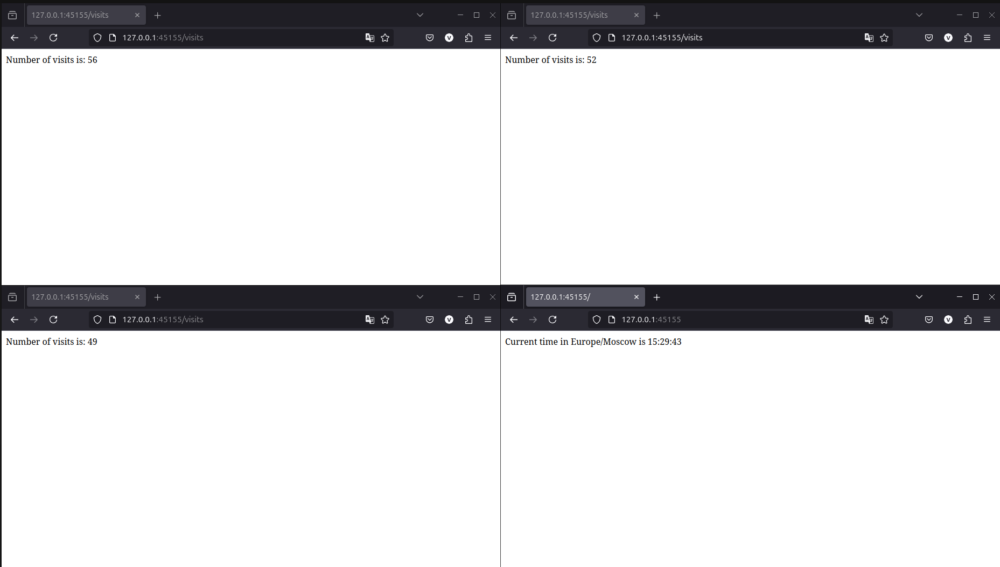

# Kubernetes StatefulSet

## Task 1

In this task I changed `deployment.yaml` and set `kind: StatefulSet`. Values were specified earlier. There is an output without errors:

```sh
(venv) vm@vm /m/v/d/h/V/U/L/P/D/S/k8s (lab14)> helm install --dry-run --debug python-app python-app
install.go:225: 2025-03-16 16:00:27.920848155 +0300 MSK m=+0.022931326 [debug] Original chart version: ""
install.go:242: 2025-03-16 16:00:27.920873225 +0300 MSK m=+0.022956387 [debug] CHART PATH: /media/vm/d3052253-5e37-4e1f-a3dd-ef4fb6119093/home/VM/User/Learning/Program/DOE/S25-core-course-labs/k8s/python-app

NAME: python-app
LAST DEPLOYED: Sun Mar 16 16:00:27 2025
NAMESPACE: default
STATUS: pending-install
REVISION: 1
USER-SUPPLIED VALUES:
{}

COMPUTED VALUES:
affinity: {}
autoscaling:
  enabled: false
  maxReplicas: 100
  minReplicas: 1
  targetCPUUtilizationPercentage: 80
env:
  cpuLimit: 500m
  cpuRequest: 250m
  memoryLimit: 512Mi
  memoryRequest: 64Mi
fullnameOverride: ""
image:
  pullPolicy: IfNotPresent
  repository: voronm1522/devops
  tag: python-app
imagePullSecrets: []
ingress:
  annotations: {}
  className: ""
  enabled: false
  hosts:
  - host: chart-example.local
    paths:
    - path: /
      pathType: ImplementationSpecific
  tls: []
library-chart:
  global: {}
livenessProbe:
  httpGet:
    path: /
    port: http
nameOverride: ""
nodeSelector: {}
podAnnotations:
  vault.hashicorp.com/agent-inject: "true"
  vault.hashicorp.com/agent-inject-secret-database-config.txt: internal/data/database/config
  vault.hashicorp.com/agent-inject-template-database-config.txt: |
    {{- with secret "internal/data/database/config" -}}
    database:
      username: {{ .Data.data.username }}
      password: {{ .Data.data.password }}
    {{- end -}}
  vault.hashicorp.com/role: internal-app
podLabels: {}
podSecurityContext: {}
readinessProbe:
  httpGet:
    path: /
    port: http
replicaCount: 3
resources: {}
secrets:
  mySecret: very__secret_info
securityContext: {}
service:
  port: 5000
  targetPort: 5000
  type: ClusterIP
serviceAccount:
  annotations: {}
  automount: true
  create: true
  name: ""
tolerations: []
volumeMounts: []
volumes: []

HOOKS:
---
# Source: python-app/templates/post-install-hook.yaml
apiVersion: v1
kind: Pod
metadata:
   name: postinstall-hook
   annotations:
       "helm.sh/hook": "post-install"
       "helm.sh/hook-delete-policy": hook-succeeded
spec:
  containers:
  - name: post-install-container
    image: busybox
    imagePullPolicy: Always
    command: ['sh', '-c', 'echo "The post-install hook is running" && sleep 1' ]
  restartPolicy: Never
  terminationGracePeriodSeconds: 0
---
# Source: python-app/templates/pre-install-hook.yaml
apiVersion: v1
kind: Pod
metadata:
   name: preinstall-hook
   annotations:
       "helm.sh/hook": "pre-install"
       "helm.sh/hook-delete-policy": hook-succeeded
spec:
  containers:
  - name: pre-install-container
    image: busybox
    imagePullPolicy: IfNotPresent
    command: ['sh', '-c', 'echo "The pre-install hook is running" && sleep 1' ]
  restartPolicy: Never
  terminationGracePeriodSeconds: 0
---
# Source: python-app/templates/tests/test-connection.yaml
apiVersion: v1
kind: Pod
metadata:
  name: "python-app-test-connection"
  labels:
    helm.sh/chart: python-app-0.1.0
    app.kubernetes.io/name: python-app
    app.kubernetes.io/instance: python-app
    app.kubernetes.io/managed-by: Helm
  annotations:
    "helm.sh/hook": test
spec:
  containers:
    - name: wget
      image: busybox
      command: ['wget']
      args: ['python-app:5000']
  restartPolicy: Never
MANIFEST:
---
# Source: python-app/templates/serviceaccount.yaml
apiVersion: v1
kind: ServiceAccount
metadata:
  name: python-app
  labels:
    helm.sh/chart: python-app-0.1.0
    app.kubernetes.io/name: python-app
    app.kubernetes.io/instance: python-app
    app.kubernetes.io/managed-by: Helm
automountServiceAccountToken: true
---
# Source: python-app/templates/secrets.yaml
apiVersion: v1
kind: Secret
metadata:
  name: python-app-secrets
  labels:
    app: python-app
type: Opaque
data:
  SECRET: dmVyeV9fc2VjcmV0X2luZm8=
---
# Source: python-app/templates/configmap.yaml
apiVersion: v1
kind: ConfigMap
metadata:
  name: python-app-config
data:
  config.json: "{\n    \"timezone\": \"Europe/Moscow\"\n}"
---
# Source: python-app/templates/service.yaml
apiVersion: v1
kind: Service
metadata:
  name: python-app
  labels:
    helm.sh/chart: python-app-0.1.0
    app.kubernetes.io/name: python-app
    app.kubernetes.io/instance: python-app
    app.kubernetes.io/managed-by: Helm
spec:
  type: ClusterIP
  ports:
    - port: 5000
      targetPort: 5000
      protocol: TCP
      name: http
  selector:
    app.kubernetes.io/name: python-app
    app.kubernetes.io/instance: python-app
---
# Source: python-app/templates/statefulset.yaml
apiVersion: apps/v1
kind: StatefulSet
metadata:
  name: python-app
  labels:    
    app.kubernetes.io/managed-by: Helm
    app.kubernetes.io/instance: python-app
spec:
  replicas: 3
  selector:
    matchLabels:      
      app.kubernetes.io/managed-by: Helm
      app.kubernetes.io/instance: python-app
  template:
    metadata:
      annotations:
        vault.hashicorp.com/agent-inject: "true"
        vault.hashicorp.com/agent-inject-secret-database-config.txt: internal/data/database/config
        vault.hashicorp.com/agent-inject-template-database-config.txt: |
          {{- with secret "internal/data/database/config" -}}
          database:
            username: {{ .Data.data.username }}
            password: {{ .Data.data.password }}
          {{- end -}}
        vault.hashicorp.com/role: internal-app
      labels:
        helm.sh/chart: python-app-0.1.0
        app.kubernetes.io/name: python-app
        app.kubernetes.io/instance: python-app
        app.kubernetes.io/managed-by: Helm
    spec:
      serviceAccountName: internal-app
      # serviceAccountName: python-app
      containers:
        - name: python-app
          image: "voronm1522/devops:python-app"
          imagePullPolicy: IfNotPresent
          ports:
            - name: http
              containerPort: 5000
              protocol: TCP
          livenessProbe:
            httpGet:
              path: /
              port: http
          readinessProbe:
            httpGet:
              path: /
              port: http
          resources:
            requests:
              cpu: "250m"
              memory: "64Mi"
            limits:
              cpu: "500m"
              memory: "512Mi"
          volumeMounts:
            - name: config-volume
              mountPath: /app/config
          env:
            - name: CPU_REQUEST
              value: "250m"
            - name: CPU_LIMIT
              value: "500m"
            - name: MEMORY_REQUEST
              value: "64Mi"
            - name: MEMORY_LIMIT
              value: "512Mi"
            - name: SECRET
              valueFrom:
                secretKeyRef:
                  name: python-app-secrets
                  key: SECRET
      volumes:
        - name: config-volume
          configMap:
            name: python-app-config
  volumeClaimTemplates:
  - metadata:
      name: data
    spec:
      accessModes: [ "ReadWriteOnce" ]
      resources:
        requests:
          storage: 1Mi

NOTES:
1. Get the application URL by running these commands:
  export POD_NAME=$(kubectl get pods --namespace default -l "app.kubernetes.io/name=python-app,app.kubernetes.io/instance=python-app" -o jsonpath="{.items[0].metadata.name}")
  export CONTAINER_PORT=$(kubectl get pod --namespace default $POD_NAME -o jsonpath="{.spec.containers[0].ports[0].containerPort}")
  echo "Visit http://127.0.0.1:8080 to use your application"
  kubectl --namespace default port-forward $POD_NAME 8080:$CONTAINER_PORT
```

## Task 2

Required outputs:

```sh
(venv) vm@vm /m/v/d/h/V/U/L/P/D/S/k8s (lab14)> helm install python-app python-app
NAME: python-app
LAST DEPLOYED: Sun Mar 16 16:01:13 2025
NAMESPACE: default
STATUS: deployed
REVISION: 1
NOTES:
1. Get the application URL by running these commands:
  export POD_NAME=$(kubectl get pods --namespace default -l "app.kubernetes.io/name=python-app,app.kubernetes.io/instance=python-app" -o jsonpath="{.items[0].metadata.name}")
  export CONTAINER_PORT=$(kubectl get pod --namespace default $POD_NAME -o jsonpath="{.spec.containers[0].ports[0].containerPort}")
  echo "Visit http://127.0.0.1:8080 to use your application"
  kubectl --namespace default port-forward $POD_NAME 8080:$CONTAINER_PORT
(venv) vm@vm /m/v/d/h/V/U/L/P/D/S/k8s (lab14)> kubectl get po,sts,svc,pvc
NAME                                     READY   STATUS    RESTARTS      AGE
pod/python-app-0                         2/2     Running   0             9s
pod/python-app-1                         2/2     Running   0             7s
pod/python-app-2                         1/2     Running   0             3s
pod/vault-0                              1/1     Running   1 (15h ago)   16h
pod/vault-agent-injector-cb67b46-htkrl   1/1     Running   1 (15h ago)   16h

NAME                          READY   AGE
statefulset.apps/python-app   2/3     9s
statefulset.apps/vault        1/1     16h

NAME                               TYPE        CLUSTER-IP      EXTERNAL-IP   PORT(S)             AGE
service/kubernetes                 ClusterIP   10.96.0.1       <none>        443/TCP             18h
service/python-app                 ClusterIP   10.97.208.216   <none>        5000/TCP            9s
service/vault                      ClusterIP   10.96.124.72    <none>        8200/TCP,8201/TCP   16h
service/vault-agent-injector-svc   ClusterIP   10.103.138.23   <none>        443/TCP             16h
service/vault-internal             ClusterIP   None            <none>        8200/TCP,8201/TCP   16h

NAME                                      STATUS   VOLUME                                     CAPACITY   ACCESS MODES   STORAGECLASS   VOLUMEATTRIBUTESCLASS   AGE
persistentvolumeclaim/data-python-app-0   Bound    pvc-df0c8993-9535-4b9b-a109-b470c28371f8   1Mi        RWO            standard       <unset>                 2m24s
persistentvolumeclaim/data-python-app-1   Bound    pvc-52a1d083-5eba-4869-8f53-119cd3e098a5   1Mi        RWO            standard       <unset>                 2m19s
persistentvolumeclaim/data-python-app-2   Bound    pvc-b5f295cc-5691-43c6-8fd2-f5eb01dc0e1d   1Mi        RWO            standard       <unset>                 2m15s
(venv) vm@vm /m/v/d/h/V/U/L/P/D/S/k8s (lab14)> minikube service python-app
|-----------|------------|-------------|--------------|
| NAMESPACE |    NAME    | TARGET PORT |     URL      |
|-----------|------------|-------------|--------------|
| default   | python-app |             | No node port |
|-----------|------------|-------------|--------------|
😿  service default/python-app has no node port
❗  Services [default/python-app] have type "ClusterIP" not meant to be exposed, however for local development minikube allows you to access this !
🏃  Starting tunnel for service python-app.
|-----------|------------|-------------|------------------------|
| NAMESPACE |    NAME    | TARGET PORT |          URL           |
|-----------|------------|-------------|------------------------|
| default   | python-app |             | http://127.0.0.1:34989 |
|-----------|------------|-------------|------------------------|
🎉  Opening service default/python-app in default browser...
```

After that I visited root and `visits`



So, so there is outputs of `kubectl exec pod/python-app-<number> -- cat visits/visits`

```sh
(venv) vm@vm /m/v/d/h/V/U/L/P/D/S/k8s (lab14)> kubectl exec pod/python-app-0 -- cat visits/visits
Defaulted container "python-app" out of: python-app, vault-agent, vault-agent-init (init)
17⏎                                                                                        (venv) vm@vm /m/v/d/h/V/U/L/P/D/S/k8s (lab14)> kubectl exec pod/python-app-1 -- cat visits/visits
Defaulted container "python-app" out of: python-app, vault-agent, vault-agent-init (init)
21⏎                                                                                        (venv) vm@vm /m/v/d/h/V/U/L/P/D/S/k8s (lab14)> kubectl exec pod/python-app-2 -- cat visits/visits
Defaulted container "python-app" out of: python-app, vault-agent, vault-agent-init (init)
18⏎ 
```

Each pod has its own PersistentVolumeClaim and Kubernetes distributes load between them. This is the reason of difference in outputs above.

```sh
(venv) vm@vm /m/v/d/h/V/U/L/P/D/S/k8s (lab14)> kubectl exec python-app-1 -- cat  visits/visits
Defaulted container "python-app" out of: python-app, vault-agent, vault-agent-init (init)
54⏎                                                                                        
(venv) vm@vm /m/v/d/h/V/U/L/P/D/S/k8s (lab14)> kubectl delete pod python-app-1
pod "python-app-1" deleted
(venv) vm@vm /m/v/d/h/V/U/L/P/D/S/k8s (lab14)> kubectl exec python-app-1 -- cat  visits/visits
Defaulted container "python-app" out of: python-app, vault-agent, vault-agent-init (init)
55⏎                   
```

