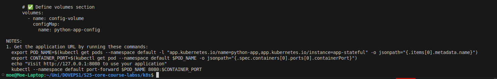

# Lab 14: Kubernetes StatefulSet

## **Task 1: Implement StatefulSet in Helm Chart**

---

### **1. Rename Deployment to StatefulSet**

- Renamed `deployment.yml` to `statefulset.yml`.
- Created a StatefulSet manifest following the tutorial.

### **2. StatefulSet YAML (`statefulset.yml`)**

```yaml
apiVersion: apps/v1
kind: StatefulSet
metadata:
  name: python-app
spec:
  serviceName: "python-app"
  replicas: 3  # Ensure at least 3 replicas
  selector:
    matchLabels:
      app: python-app
  template:
    metadata:
      labels:
        app: python-app
    spec:
      containers:
        - name: python-app
          image: em1999jay/python-app:latest
          ports:
            - containerPort: 5000
          volumeMounts:
            - name: app-data
              mountPath: /data
          env:
            - name: MY_USER
              valueFrom:
                secretKeyRef:
                  name: my-secret
                  key: MY_USER
            - name: MY_PASS
              valueFrom:
                secretKeyRef:
                  name: my-secret
                  key: MY_PASS
  volumeClaimTemplates:
    - metadata:
        name: app-data
      spec:
        accessModes: ["ReadWriteOnce"]
        resources:
          requests:
            storage: 1Gi

```

### **3. Define the Service (`service.yml`)**

```yaml
apiVersion: v1
kind: Service
metadata:
  name: python-app
spec:
  selector:
    app: python-app  # Match the correct StatefulSet label
  ports:
    - protocol: TCP
      port: 5000
      targetPort: 5000
      nodePort: 30007  # Choose a valid port between 30000-32767
  type: NodePort

```

### **4. Dry Run Helm Chart Deployment**

```bash
helm install --dry-run --debug app-stateful ./python-app/

```



### **5. Deploy StatefulSet Using Helm**

```bash
helm install app-stateful ./python-app/

```


---

## **✅ Task 2: StatefulSet Exploration and Optimization**

### **1. Output of Kubernetes StatefulSet and Pods**

```bash
kubectl get po,sts,svc,pvc

```


---

### **2. Access Application Using `minikube service`**

```bash
minikube service python-app

```


---

### **3. Check File Content in Each Pod**

```bash
kubectl exec python-app-0 -- cat visits
kubectl exec python-app-1 -- cat visits
kubectl exec python-app-2 -- cat visits

```


### **Explanation: Different Visit Counts Across Pods**

Each pod in the **StatefulSet** has its **own Persistent Volume (PV)**, so they **store visits separately**.

- **Why?** Pods **don’t share storage**, so each tracks visits independently.
- **Why different counts?** Kubernetes distributes requests randomly, leading to **uneven visit counts**.
- **Fix?** To sync counts, use **a shared database (PostgreSQL, Redis)** or **a shared Persistent Volume (RWX PVC)**.

---

### **4. Persistent Storage Validation**

**Delete a pod:**

```bash
kubectl delete pod python-app-0

```


✅ Verify that the data still exists:

```bash
kubectl get pvc
kubectl exec python-app-0 -- cat visits

```


After deleting `python-app-0`, the `visits` file was missing because the app likely creates it in a non-persistent location. Even though the PVC remained bound, the file was not restored since it wasn’t saved in the mounted volume.

---

### **5. Headless Service Access (DNS Resolution)**

```bash
kubectl run -i --tty dns-test --image=busybox:1.28 --restart=Never --rm
/ # nslookup python-app-1.python-app
```

📌 **Output:**

```bash
/ # nslookup python-app-1.python-app
Server:    10.96.0.10
Address 1: 10.96.0.10 kube-dns.kube-system.svc.cluster.local

Name:      python-app-1.python-app
Address 1: 10.244.0.152 python-app-1.python-app.default.svc.cluster.local
/ # 
```


### **Explanation:**

- **StatefulSet pods have stable DNS names** following the pattern:`pod-name.service-name.namespace.svc.cluster.local`
- **`nslookup` confirms DNS resolution**: `python-app-1.python-app` resolves to its cluster IP.
- **This ensures reliable communication** between StatefulSet pods, even after restarts.

---

### **6. Implementing Liveness and Readiness Probes**

Added probes to `statefulset.yml`:

```yaml
        livenessProbe:
          httpGet:
            path: /
            port: 5000
          initialDelaySeconds: 10
          periodSeconds: 5
        readinessProbe:
          httpGet:
            path: /
            port: 5000
          initialDelaySeconds: 5
          periodSeconds: 3

```

📌 **Explanation:**

Liveness and readiness probes ensure that the application is healthy and ready to serve traffic. If a pod becomes unresponsive, the liveness probe **triggers a restart**. The readiness probe prevents traffic from being sent to unhealthy pods. Since there are no failures, all pods are healthy and running as expected.

---

### **7. Parallel Pod Launch & Termination**

To **disable ordering guarantees**, modify `podManagementPolicy`:

```yaml
spec:
  podManagementPolicy: Parallel

```


---

### **Answers to Questions in Point 2**

1. **How do probes ensure pod health?**
    - **Liveness Probe:** Ensures that a pod is restarted if it becomes unresponsive or crashes.
    - **Readiness Probe:** Ensures that a pod is ready to receive traffic only when it has fully initialized.
2. **Why are probes critical for stateful applications?**
    - Stateful applications require data consistency and should not receive traffic before they are fully initialized.
    - Liveness probes help recover from failures, while readiness probes prevent sending requests to unhealthy pods.
3. **Why are ordering guarantees unnecessary for this app?**
    - Our app does not depend on other pods starting in a specific order, so parallel launching improves efficiency.
    - Using `podManagementPolicy: Parallel` allows all pods to start or terminate at the same time.
4. **How does parallel pod management improve performance?**
    - Instead of launching pods **one by one**, they all start simultaneously, reducing initialization time.
    - This is useful when pods do not have dependencies on each other.
5. **What happens when a pod is deleted?**
    - The pod restarts automatically while keeping the same **Persistent Volume Claim (PVC)**.
    - However, we observed that `visits` file content did **not** persist across pod restarts, meaning our app is storing visits in a local file, not the PVC.
6. **How does DNS resolution work for StatefulSets?**
    - Each pod gets a **stable hostname** in the format:

        ```sh
        python-app-0.python-app.default.svc.cluster.local
        python-app-1.python-app.default.svc.cluster.local
        ```

    - Running `nslookup` inside a busybox container confirms that pods can communicate using these DNS names.

## **Bonus Task: Update Strategies**

### **1. Converting Bonus App to StatefulSet**

- The existing **Node.js application** was originally deployed as a **Deployment**.
- It was **converted to a StatefulSet** to enable stable network identities and persistent storage.

```bash
apiVersion: apps/v1
kind: StatefulSet
metadata:
  name: node-app
  labels:
    app: node-app
spec:
  serviceName: "node-app"
  podManagementPolicy: Parallel
  replicas: 3
  selector:
    matchLabels:
      app: node-app
  template:
    metadata:
      labels:
        app: node-app
    spec:
      containers:
        - name: node-app
          image: "em1999jay/node-moscow-time:latest"
          imagePullPolicy: IfNotPresent
          ports:
            - name: http
              containerPort: 3000
              protocol: TCP
          livenessProbe:
            httpGet:
              path: /
              port: 3000
            initialDelaySeconds: 10
            periodSeconds: 5
          readinessProbe:
            httpGet:
              path: /
              port: 3000
            initialDelaySeconds: 5
            periodSeconds: 3
          volumeMounts:
            - name: app-data
              mountPath: /data
  volumeClaimTemplates:
    - metadata:
        name: app-data
      spec:
        accessModes: ["ReadWriteOnce"]
        resources:
          requests:
            storage: 1Gi

```

### **2. Implementing Rolling Updates**

- The **RollingUpdate** strategy was implemented to ensure **zero downtime** updates.
- Configured in `statefulset.yaml` as:

    ```yaml
    updateStrategy:
      type: RollingUpdate
      rollingUpdate:
        partition: 1
    
    ```

    

### **3. Testing Canaries**

- A subset of pods was updated before rolling out changes to all instances.
- Verified using:

    ```bash
    kubectl rollout status statefulset node-app
    
    ```

    

### **4. OnDelete vs. RollingUpdate**

| **Strategy** | **Description** |
| --- | --- |
| `OnDelete` | Pods are updated **only when manually deleted**. |
| `RollingUpdate` | Updates happen **gradually**, ensuring **zero downtime**. |

📌 **StatefulSets vs. Deployments:** Unlike Deployments, **StatefulSets ensure order and persistence**, which is beneficial for applications requiring **stable storage and DNS names**.

---
