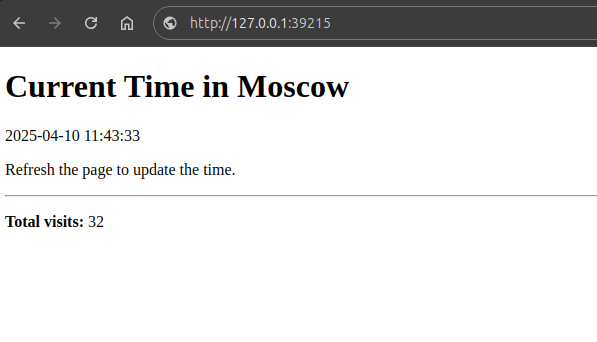

# Kubernetes StatefulSet


## StatefulSet Observations

### Overview

```bash
$ kubectl get po,sts,svc,pvc
NAME                                        READY   STATUS    RESTARTS      AGE
pod/vault-0                                 1/1     Running   0             4h43m
pod/vault-agent-injector-75f9dfc9c8-dq7kd   1/1     Running   0             4h43m
pod/web-app-0                               2/2     Running   0             7m27s
pod/web-app-1                               2/2     Running   0             7m24s

NAME                       READY   AGE
statefulset.apps/vault     1/1     32h

NAME                               TYPE        CLUSTER-IP       EXTERNAL-IP   PORT(S)             AGE
service/kubernetes                 ClusterIP   10.96.0.1        <none>        443/TCP             2d10h
service/web-app                    ClusterIP   110.102.229.106  <none>        5000/TCP            7m48s

NAME                                          STATUS   VOLUME                                     CAPACITY   ACCESS MODES   STORAGECLASS   VOLUMEATTRIBUTESCLASS   AGE
persistentvolumeclaim/web-app-vol-web-app-0   Bound    pvc-3ef32197-89b2-4d61-946e-dacb5e05d28f   1Gi        RWO            standard       <unset>                 115m
persistentvolumeclaim/web-app-vol-web-app-1   Bound    pvc-bf26f006-c8d1-4a76-bde9-b98b4c0092b7   1Gi        RWO            standard       <unset>                 103m
```

### Service Access with Minikube
```bash
$ minikube service web-app
|-----------|---------|-------------|--------------|
| NAMESPACE |  NAME   | TARGET PORT |     URL      |
|-----------|---------|-------------|--------------|
| default   | web-app |             | No node port |
|-----------|---------|-------------|--------------|
😿  service default/web-app has no node port
❗  Services [default/web-app] have type "ClusterIP" not meant to be exposed, however for local development minikube allows you to access this !
🏃  Starting tunnel for service web-app.
|-----------|---------|-------------|------------------------|
| NAMESPACE |  NAME   | TARGET PORT |          URL           |
|-----------|---------|-------------|------------------------|
| default   | web-app |             | http://127.0.0.1:39215 |
|-----------|---------|-------------|------------------------|
🎉  Opening service default/web-app in default browser...
❗  Because you are using a Docker driver on linux, the terminal needs to be open to run it.
```



### Visit Counter Results

- **pod/web-app-0**

    ```bash
    $ kubectl exec pod/web-app-0 -- cat visits
    Defaulted container "web-app" out of: web-app, vault-agent, vault-agent-init (init)
    10
    ```

- **pod/web-app-1**

    ```bash
    $ kubectl exec pod/web-app-1 -- cat visits
    Defaulted container "web-app" out of: web-app, vault-agent, vault-agent-init (init)
    7
    ```

This confirms isolated volumes per pod, explaining the varying counts.

### Storage Persistence

After deleting a pod, volume persistence can be verified:

```bash
$ kubectl get po,pvc
NAME                                        READY   STATUS    RESTARTS      AGE
pod/vault-0                                 1/1     Running   0             5h21m
pod/vault-agent-injector-75f9dfc9c8-dq7kd   1/1     Running   0             5h21m
pod/web-app-0                               2/2     Running   0             9s
pod/web-app-1                               2/2     Running   0             9m27s

NAME                                          STATUS   VOLUME                                     CAPACITY   ACCESS MODES   STORAGECLASS   VOLUMEATTRIBUTESCLASS   AGE
persistentvolumeclaim/web-app-vol-web-app-0   Bound    pvc-3ef32197-89b2-4d61-946e-dacb5e05d28f   1Gi        RWO            standard       <unset>                 133m
persistentvolumeclaim/web-app-vol-web-app-1   Bound    pvc-bf26f006-c8d1-4a76-bde9-b98b4c0092b7   1Gi        RWO            standard       <unset>                 121m
```


```bash
$ kubectl exec pod/web-app-0 -- cat visits
Defaulted container "web-app" out of: web-app, vault-agent, vault-agent-init (init)
1
```

The PVC was preserved, but the counter was reset due to reinitialization.

### Headless service
Pod communication via DNS works:
```bash
$ kubectl exec pod/web-app-0 -- nslookup web-app-1.web-app.default.svc.cluster.local
Defaulted container "web-app" out of: web-app, vault-agent, vault-agent-init (init)
Server:  10.96.0.10
Address: 10.96.0.10:53


Name: web-app-1.web-app.default.svc.cluster.local
Address: 10.244.0.152
```


### Monitoring & Alerts

Liveness and readiness probes are working as expected:

```bash
$ kubectl describe pod web-app-0 | grep "Liveness"
    Liveness:       http-get http://:http/ delay=0s timeout=1s period=10s #success=1 #failure=3
```

```bash
$ kubectl describe pod web-app-0 | grep "Readiness"
    Readiness:      http-get http://:http/ delay=0s timeout=1s period=10s #success=1 #failure=3
```
### Questions to answer
- **How probes ensure pod health**

    **Probes** in Kubernetes continuously monitor container health:

    - **Liveness probe**: Ensures the container is still running. If it fails, Kubernetes restarts the container.
    - **Readiness probe**: Determines if the container is ready to receive traffic. If it fails, the pod is removed from the service endpoints.

    These probes maintain app stability by restarting unresponsive containers and avoiding routing traffic to unhealthy pods.

- **Why They’re Critical for Stateful Apps**

    Stateful applications rely on persistent data. Probes are critical because:

    - They prevent routing traffic to a pod until it’s ready.
    - They help restart failed pods without data loss.
    - They reduce downtime by ensuring only healthy pods serve traffic.

    This safeguards data consistency and improves app resilience.


### Ordering and Pod Management Policies

- **Explain why ordering guarantees are unnecessary for your app.**

    Our Flask app is stateless from a coordination standpoint:

    - Each pod manages its own persistent state (visit count).
    - Pods do not depend on each other.
    - No initialization or clustering order is needed.

    Therefore, strict pod start-up or shutdown ordering is not required.

- Pod Management Policies


    ```bash
    $ kubectl get po
    NAME                                    READY   STATUS    RESTARTS      AGE
    vault-0                                 1/1     Running   0             5h
    vault-agent-injector-75f9dfc9c8-dq7kd   1/1     Running   0             5h
    web-app-0                               2/2     Running   0             23s
    web-app-1                               2/2     Running   0             23s
    ```
    This optimization reduces deployment time when startup order doesn't matter.