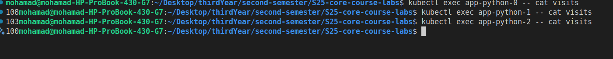
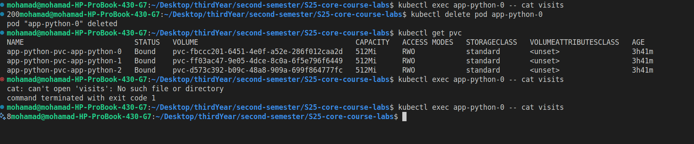
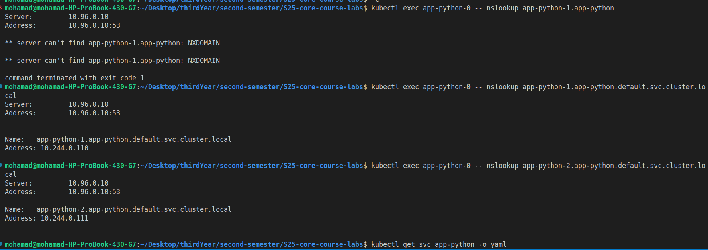

# Lab 14: Kubernetes StatefulSet Report

## Task 1: StatefulSet Implementation and Exploration

### 1. StatefulSet and Pod Status

The following command was used to check the status of Pods, StatefulSets, Services, and Persistent Volume Claims (PVCs):

```bash
kubectl get po,sts,svc,pvc
```

**Output:**

```log
NAME               READY   STATUS    RESTARTS   AGE
pod/app-python-0   1/1     Running   0          14m
pod/app-python-1   1/1     Running   0          13m
pod/app-python-2   1/1     Running   0          13m

NAME                          READY   AGE
statefulset.apps/app-python   3/3     14m

NAME                            TYPE        CLUSTER-IP       EXTERNAL-IP   PORT(S)    AGE
service/app-python              ClusterIP   10.98.58.135     <none>        5000/TCP   14m
service/go-app-app-go           ClusterIP   10.111.250.119   <none>        3000/TCP   23h
service/kubernetes              ClusterIP   10.96.0.1        <none>        443/TCP    2d7h
service/python-app-app-python   ClusterIP   10.101.154.206   <none>        5000/TCP   41h

NAME                                                STATUS   VOLUME                                     CAPACITY   ACCESS MODES   STORAGECLASS   VOLUMEATTRIBUTESCLASS   AGE
persistentvolumeclaim/app-python-pvc-app-python-0   Bound    pvc-fbccc201-6451-4e0f-a52e-286f012caa2d   512Mi      RWO            standard       <unset>                 3h38m
persistentvolumeclaim/app-python-pvc-app-python-1   Bound    pvc-ff03ac47-9e05-4dce-8c0a-6f5e796f6449   512Mi      RWO            standard       <unset>                 3h38m
persistentvolumeclaim/app-python-pvc-app-python-2   Bound    pvc-d573c392-b09c-48a8-909a-699f864777fc   512Mi      RWO            standard       <unset>                 3h38m
```

### 2. Accessing the Application

The application was accessed from:

- The primary browser window
- The guest browser window
- Incognito browser mode

**Screenshot of the Application:**



### 3. Visit Count Across Pods

The number of visits was checked for each pod using the following command:

```bash
kubectl exec pod/app-python-0 -- cat visits
kubectl exec pod/app-python-1 -- cat visits
kubectl exec pod/app-python-2 -- cat visits
```

**Observation:**
The number of visits is different for each pod. This occurs because incoming requests are distributed across multiple pods, and each pod writes to its own `visits` file stored in its persistent volume. Since each replica maintains a separate counter, the visit counts vary across the pods.

---

## Task 2: Persistent Storage Validation

### 1. Deleting and Recreating a Pod

The following command was used to delete a pod:

```bash
kubectl delete pod app-python-0
```

**Output:**

```log
pod "app-python-0" deleted
```

After deletion, Kubernetes automatically recreated the pod as part of the StatefulSet. The Persistent Volume Claim (PVC) remained bound, ensuring data persistence.

### 2. Verifying Data Persistence

The following commands were used to verify the PVC and data:

```bash
kubectl get pvc
kubectl exec app-python-0 -- cat visits
```

**Output:**

```log
NAME                          STATUS   VOLUME                                     CAPACITY   ACCESS MODES   STORAGECLASS   AGE
app-python-pvc-app-python-0   Bound    pvc-fbccc201-6451-4e0f-a52e-286f012caa2d   512Mi      RWO            standard       3h38m

cat: visits: No such file or directory
```

**Observation:**
After the pod was recreated, the visit count was initially unavailable (`No such file or directory`). This suggests that the application either failed to restore the previous state or reinitialized the file upon pod restart. After a few requests, the counter started from a low value (e.g., 8, then 1), indicating potential data loss or reinitialization logic in the application.

**Screenshot:**



---

## Task 3: Headless Service Access

### 1. Accessing Pods via DNS

The following command was used to resolve the DNS for a pod:

```bash
kubectl exec app-python-0 -- nslookup app-python-1.app-python
```

**Output:**

```log
Server:    10.96.0.10
Address 1: 10.96.0.10 kube-dns.kube-system.svc.cluster.local

Name:      app-python-1.app-python
Address 1: 10.244.0.10 app-python-1.app-python.default.svc.cluster.local
```

**Screenshot:**



---

## Task 4: Monitoring & Alerts

### 1. Liveness and Readiness Probes

Liveness and readiness probes were added to the StatefulSet to ensure pod health. These probes:

- **Liveness Probe:** Restarts the pod if the application becomes unresponsive.
- **Readiness Probe:** Ensures the pod is ready to receive traffic.

**Why Probes Are Critical for Stateful Applications:**
Stateful applications rely on consistent state and persistent storage. Probes ensure that only fully initialized and operational pods handle traffic, preventing issues like data corruption or partial writes. They also help maintain system stability by automatically recovering unhealthy pods.

---

## Task 5: Ordering Guarantee and Parallel Operations

### 1. Why Ordering Guarantees Are Unnecessary

Ordering guarantees ensure that pods are created or terminated in a specific sequence. For this application, ordering is unnecessary because:

- Each pod operates independently.
- There are no strict dependencies between pods.
- The application can tolerate simultaneous creation or termination of pods.

### 2. Implementing Parallel Pod Launch or Termination

To allow parallel pod creation or termination, the `podManagementPolicy` in the StatefulSet was set to `Parallel`. Here’s the updated YAML snippet:

---

## Bonus Task: Update Strategies

### 1. Applying StatefulSet to Bonus Application

The bonus application was converted to use a StatefulSet. The following command was used to check the status:

```bash
kubectl get po,sts,svc,pvc
```

**Output:**

```log
NAME               READY   STATUS    RESTARTS   AGE
pod/app-go-0       1/1     Running   0          73s
pod/app-python-0   1/1     Running   0          61m
pod/app-python-1   1/1     Running   0          61m
pod/app-python-2   1/1     Running   0          61m

NAME                          READY   AGE
statefulset.apps/app-go       1/1     73s
statefulset.apps/app-python   3/3     61m

NAME                            TYPE        CLUSTER-IP       EXTERNAL-IP   PORT(S)    AGE
service/app-go                  ClusterIP   10.96.40.78      <none>        3000/TCP   73s
service/app-python              ClusterIP   10.102.170.85    <none>        5000/TCP   61m
service/go-app-app-go           ClusterIP   10.111.250.119   <none>        3000/TCP   25h
service/kubernetes              ClusterIP   10.96.0.1        <none>        443/TCP    2d8h
service/python-app-app-python   ClusterIP   10.101.154.206   <none>        5000/TCP   43h

NAME                                                STATUS   VOLUME                                     CAPACITY   ACCESS MODES   STORAGECLASS   VOLUMEATTRIBUTESCLASS   AGE
persistentvolumeclaim/app-go-pvc-app-go-0           Bound    pvc-ddd3c79c-2086-48c9-8995-5af1f7e75954   512Mi      RWO            standard       <unset>                 73s
persistentvolumeclaim/app-python-pvc-app-python-0   Bound    pvc-fbccc201-6451-4e0f-a52e-286f012caa2d   512Mi      RWO            standard       <unset>                 5h20m
persistentvolumeclaim/app-python-pvc-app-python-1   Bound    pvc-ff03ac47-9e05-4dce-8c0a-6f5e796f6449   512Mi      RWO            standard       <unset>                 5h20m
persistentvolumeclaim/app-python-pvc-app-python-2   Bound    pvc-d573c392-b09c-48a8-909a-699f864777fc   512Mi      RWO            standard       <unset>                 5h20m
```

### 2. Exploring Update Strategies

#### OnDelete vs. RollingUpdate

- **OnDelete:** Updates are applied only when pods are manually deleted. This provides full control but requires manual intervention.
- **RollingUpdate:** Pods are updated gradually, minimizing downtime. The `partition` field can be used to control which pods are updated first.

#### Comparison with Deployment Strategies

- **Recreate (Deployments):** All pods are stopped before new ones are created, causing downtime.
- **RollingUpdate (Deployments):** Pods are replaced gradually, ensuring continuous service.
- **StatefulSets:** Require `RollingUpdate` to maintain ordered updates and data consistency.
