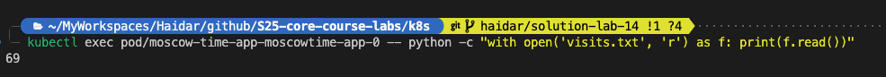

# Lab 14: Kubernetes StatefulSet

## Output of `kubectl get po,sts,svc,pvc`

```bash
NAME                                   READY   STATUS    RESTARTS   AGE
pod/moscow-time-app-moscowtime-app-0   1/1     Running   0          71s

NAME                                              READY   AGE
statefulset.apps/moscow-time-app-moscowtime-app   1/1     71s

NAME                                     TYPE           CLUSTER-IP      EXTERNAL-IP   PORT(S)          AGE
service/kubernetes                       ClusterIP      10.96.0.1       <none>        443/TCP          14m
service/moscow-time-app-moscowtime-app   LoadBalancer   10.97.205.213   <pending>     8000:30910/TCP   71s

NAME                                                          STATUS   VOLUME                                     CAPACITY   ACCESS MODES   STORAGECLASS   VOLUMEATTRIBUTESCLASS   AGE
persistentvolumeclaim/data-moscow-time-app-moscowtime-app-0   Bound    pvc-fc4152f9-b76f-444e-a14f-d9011fb0f45d   1Gi        RWO            standard       <unset>                 6m5s

```

## Output of  `kubectl exec pod/moscow-time-app-moscowtime-app-0 -- python -c "with open('visits.txt', 'r') as f: print(f.read())"`


