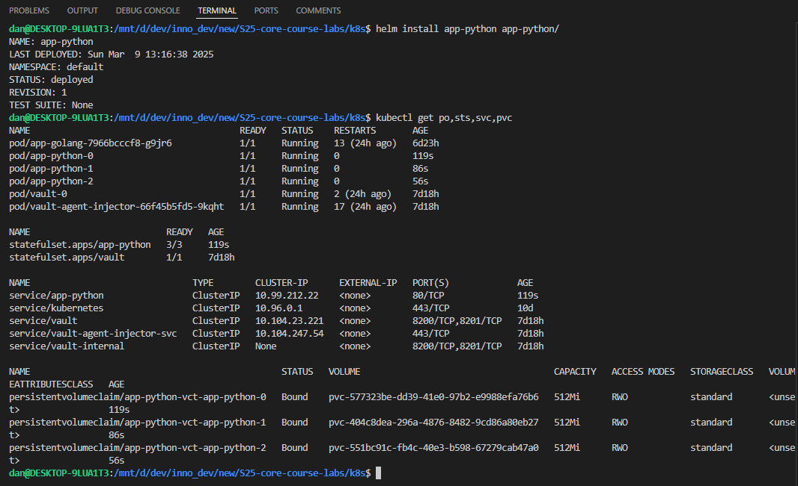
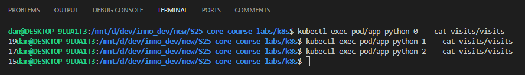
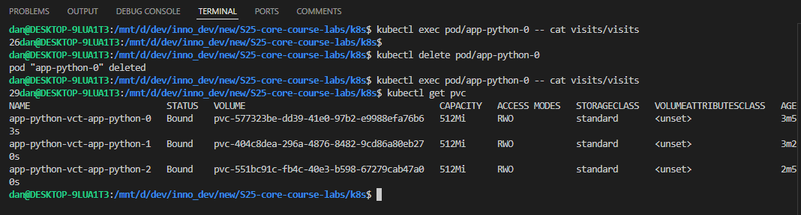
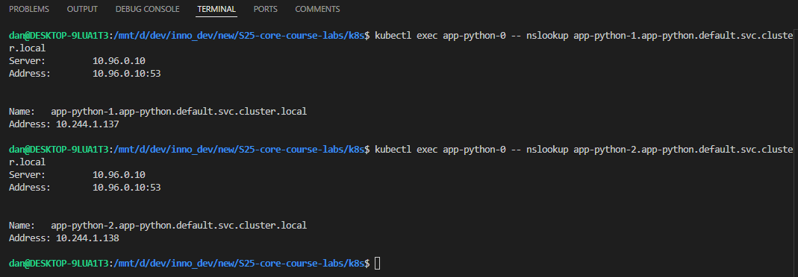
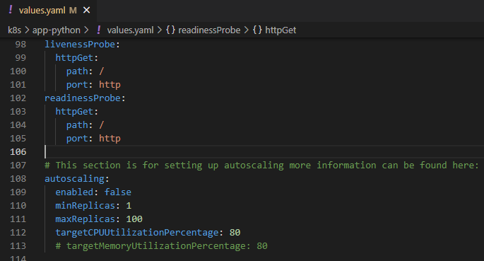

# Kubernetes StatefulSet

## Task 2: StatefulSet Exploration and Optimization

### Research and Documentation

The output of `kubectl get po,sts,svc,pvc` command:

I have accessed the app from:

- the primary browser window
- the new browser window
- from the incognito browser mode

Let's check the content of my file in each pod.

As we can see, the number of visits is different. This happens due to nature of load balancing: each request goes to different pod, and each pod writes to its own `visits` file in their personal volume. Due to this behavior, we get such different numbers for each replica.

### Persistent Storage Validation

Let's try to delete a pod and see if data persists.

As we can see from the following screenshot, the data and PVC persist, and the counter did not change.

### Headless Service Access

I have been able to access pods via DNS using FQDN (e.g. `app-python-1.app-python.default.svc.cluster.local`).

### Monitoring & Alerts

I have added liveness and readiness probes to my StatefulSet.

#### How probes ensure pod health

Liveness probes help `kubelet` to know when it needs to restart the container. Restarting the container in a some non-responsive state (e.g. deadlock) helps to make the app more available. Usually simple HTTP requests to some low-cost endpoint are used to determine the pod that is not-ready.

Readiness probes help `kubelet` to know when the container is ready to accept the traffic. If a Pod is not ready, then it is removed from the load balancer and it will not receive any traffic until it is ready.

#### Why they're critical for stateful apps

Liveness probe is critical for stateful apps because it ensures that the application is not blocked in some non-responsive state. It will make stateful app more available despite some appeared bug. \
Readiness probe is critical for stateful apps because it helps to determine whether the application should receive traffic or not. We do not want to kill the application that, for instance, loads some big data before listening for requests. So, we defined the readiness probe such that it will be marked as ready later.

### Ordering Guarantee and Parallel Operations

Ordering guarantees are not necessary for my app because each Pod is independent from each other. There will be no effect on the app performance if I run all Pods in parallel. Moreover, Pods do not share any data and may be created/deleted at any time, since the requests are distributed across the Pods by a load balancer.

I have implemented a way to instruct the StatefulSet controller to launch or terminate all Pods in parallel via `.spec.podManagementPolicy` field. I setted this field to `Parallel` value.
