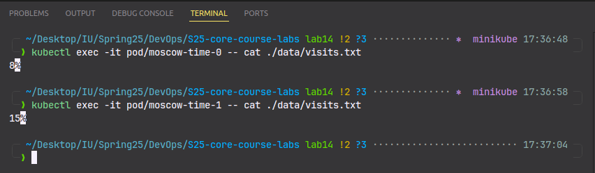
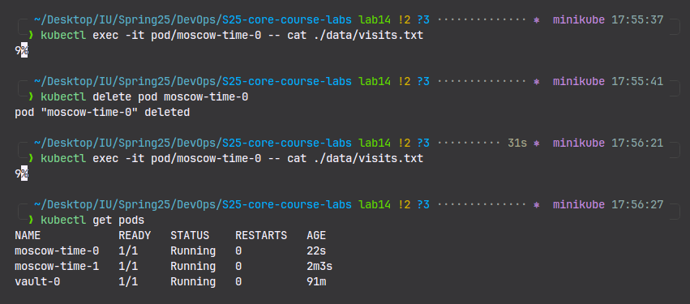

# Kubernetes StatefulSet

## Research and Documentation

```bash
kubectl get po,sts,svc,pvc
```

```text
NAME                READY   STATUS    RESTARTS   AGE
pod/moscow-time-0   1/1     Running   0          7m40s
pod/moscow-time-1   1/1     Running   0          9s
pod/vault-0         1/1     Running   0          68m

NAME                           READY   AGE
statefulset.apps/moscow-time   2/2     7m40s
statefulset.apps/vault         1/1     6d19h

NAME                  TYPE        CLUSTER-IP     EXTERNAL-IP   PORT(S)    AGE
service/kubernetes    ClusterIP   10.96.0.1      <none>        443/TCP    66m
service/moscow-time   ClusterIP   10.110.178.0   <none>        5000/TCP   7m40s

NAME                                              STATUS   VOLUME                                     CAPACITY   ACCESS MODES   STORAGECLASS   VOLUMEATTRIBUTESCLASS   AGE
persistentvolumeclaim/visits-data-moscow-time-0   Bound    pvc-1a583603-c0b1-4b89-bad8-9f9f8c77532e   10Mi       RWO            standard       <unset>                 7m40s
persistentvolumeclaim/visits-data-moscow-time-1   Bound    pvc-3564ee8e-8f95-41cc-840f-b1f0d7fbf246   10Mi       RWO            standard       <unset>                 9s
```



The visit counts vary between pods because the load balancer randomly distributes requests, and each pod in the StatefulSet has its own visits.txt file stored in a separate PersistentVolume. Since the files are not shared, each pod updates its own counter separately. StatefulSets provide isolated storage for each pod, so to synchronize the counts, a shared database would be necessary.

## Persistent Storage Validation



## Headless Service Access

```text
kubectl exec moscow-time-0 -- nslookup moscow-time-0.moscow-time.default.svc.cluster.local
Server:         10.96.0.10
Address:        10.96.0.10:53

kubectl exec moscow-time-1 -- nslookup moscow-time-1.moscow-time.default.svc.cluster.local
Server:         10.96.0.10
Address:        10.96.0.10:53
```

## Monitoring & alerts

```yaml
livenessProbe:
  httpGet:
    path: /
    port: http
readinessProbe:
  httpGet:
    path: /
    port: http
```

### Probes

- Liveness probes monitor the pod's health and can trigger a container restart if it becomes unresponsive.
- Readiness probes make sure that traffic is only directed to healthy pods.
- These probes are essential for stateful applications, as they prevent traffic from being routed to failed pods, ensuring consistent and stable performance.

### Ordering Guarantee and Parallel Operations

Ordering guarantees (sequential pod startup) are important for systems with dependencies, such as master-replica databases.
In this application, the pods are stateless and independent, meaning no pod depends on another.
Therefore, ordered scaling is not required.
By setting podManagementPolicy: Parallel, all pods can start or stop simultaneously, which helps improve the deployment speed.
