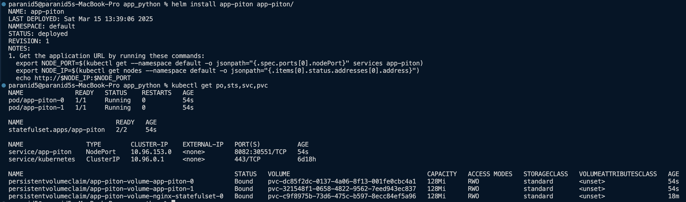
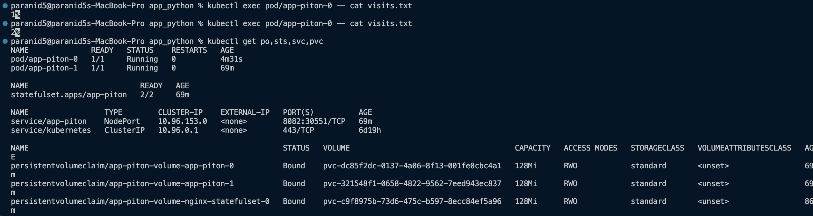
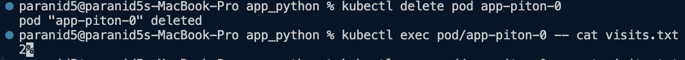
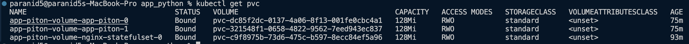
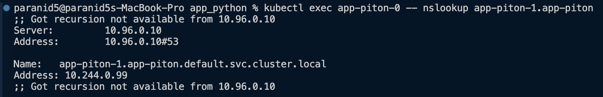
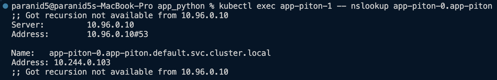
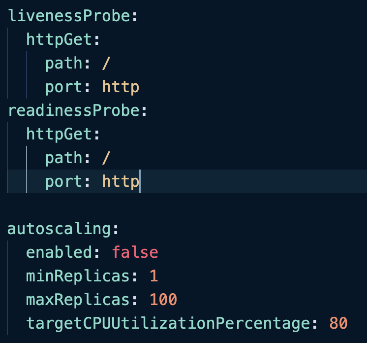

# StatefulSet

### Install and access components

### Accessing an app

### Delete pod and checking persistance

### Access pods via DNS

### Monitoring and alerts

* How probes ensure pod health

Liveness and readiness probes are mechanisms used to check if a pod is running and healthy.

Liveness probes determine if the application is alive and should be restarted if it is in non responsive state. The process of checking availability is done via sample HTTP requests to endpoints (status code is then mapped to the pod health state).

Readiness probes check if the application is ready to handle traffic. If a pod is not ready, it is removed from the load balancer until it is ready. This ensures that only healthy pods receive requests, which helps maintain the overall stability and performance of the application.

* Why they’re critical for stateful apps

Stateful applications frequently depend on persistent data and require a stable network connection. Probes help manage the lifecycle of these applications, ensuring that they are only accessed when they are fully operational and ready to work, preventing service interruptions and data inconsistencies. They monitor the health of pods, initiating restarts or updates as required.

### Ordering Guarantee and Parallel Operations

Ordering guarantees are not required for the app, as each Pod can work independently and does not require any type of synchronization between each other.

To ensure that all Pods are launched and terminated simultaneously, the `podManagementPolicy` property was set to `Parallel`, allowing for parallel deployment and termination of Pods.
