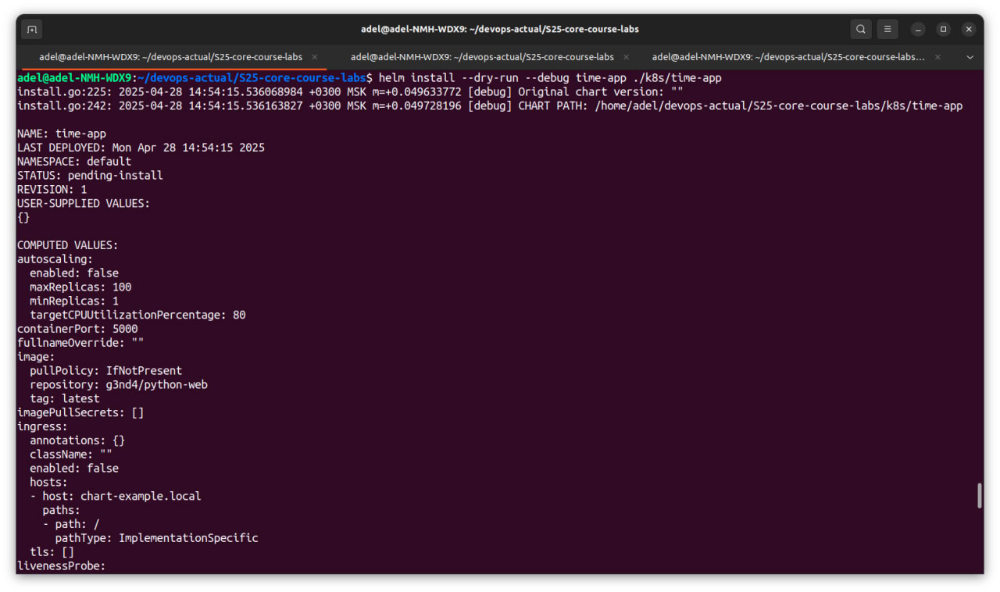
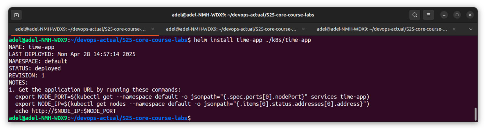
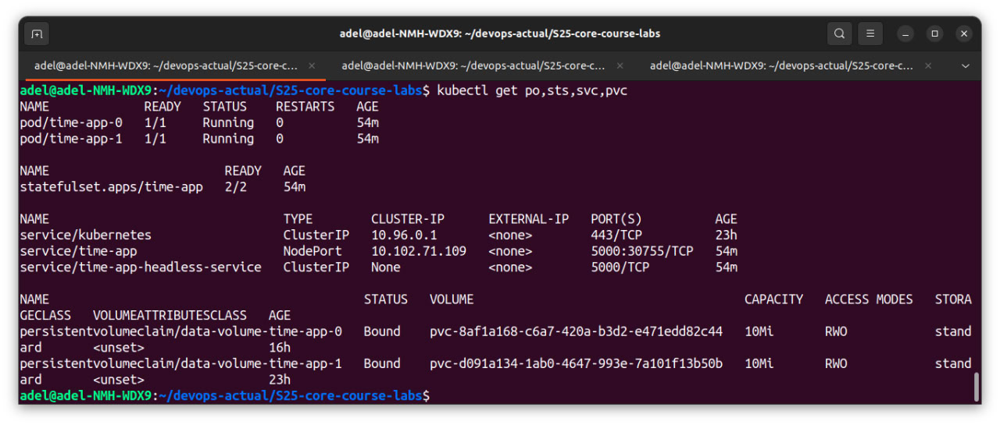
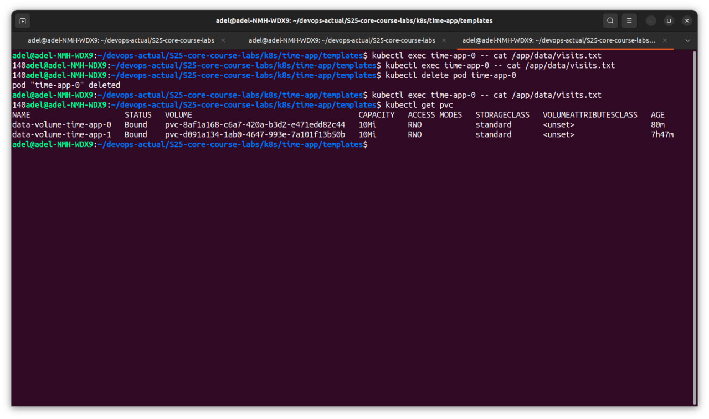

# Lab 14: Kubernetes StatefulSet

## Task 1: Implement StatefulSet in Helm Chart

### Understanding StatefulSets

Stateful set is needed to manage stateful apps to garantee uniqueness and ordering of pods. It provides persistent storage, ordered deployment, updates and etc.

I have renamed `deployment.yaml` to `statefulset.yaml`, changed the kind from `Deployment` to `StatefulSet`, added `headless-service.yaml` and changed values configs.

In following screenshots, you can see that neither --dry-run and real installation did not produce any errors:




Also i have mounted /app/data directory for persistent storage.

## Task 2: StatefulSet Exploration and Optimization

### Commands Output



### Persistent Storage Validation

Here we can see that the data persists after pod deletion:



### Monitoring & Alerts

I configured both the livenessProbe and readinessProbe to use the root / endpoint of my time-app for simplicity.

The livenessProbe ensures that crashed pods are restarted to maintain health, while the readinessProbe checks if the application is ready to accept traffic. If the readiness check fails, the pod is temporarily removed from traffic until it can handle requests again.

These probes are essential for stateful applications, as they help maintain stable pods, prevent data loss, and identify issues early to ensure the application runs properly.

### Ordering Guarantee and Parallel Operations

Our application doesn't need strict ordering for the following reasons:
1. no specific inter-pod communication is required
2. each pod works independently
3. no leader or follower setup for starting pods

I used the ```.spec.podManagementPolicy: Parallel``` in the StatefulSet to allow pods to launch or terminate simultaneously, because:

1. it speeds up deployment and scaling
2. no startup order is necessary between pods
3. each pod manages its own state
