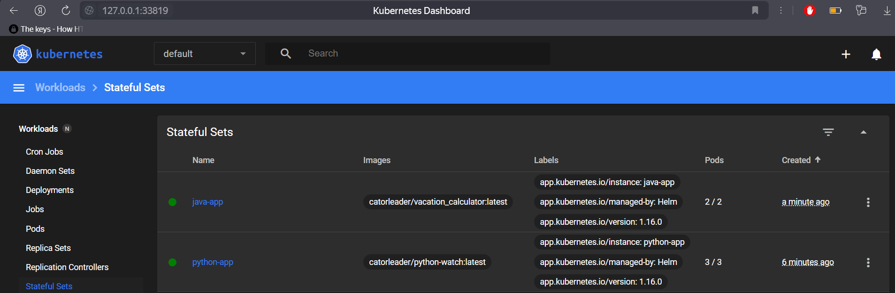
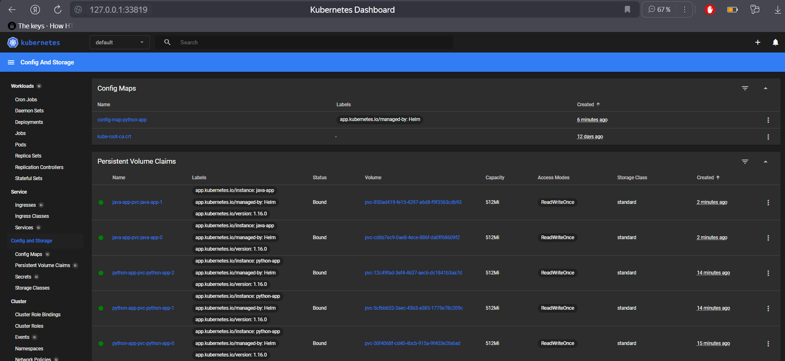
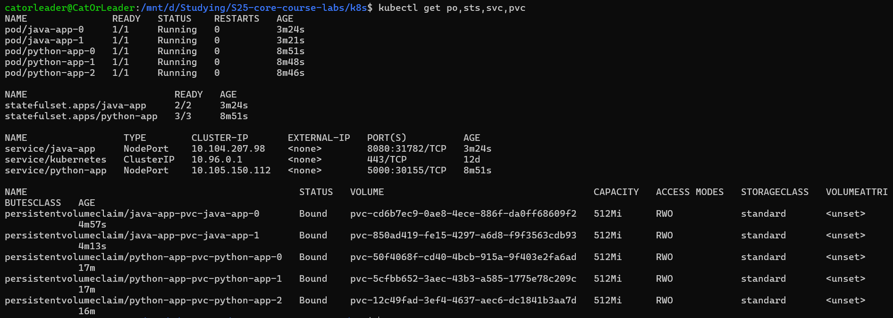
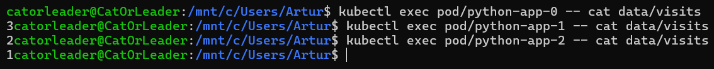
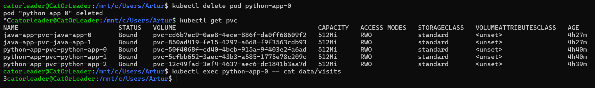
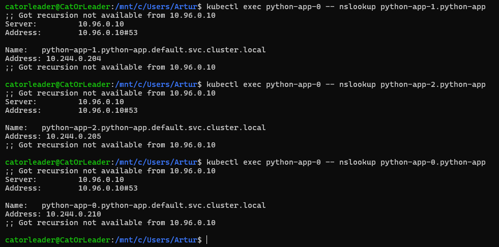
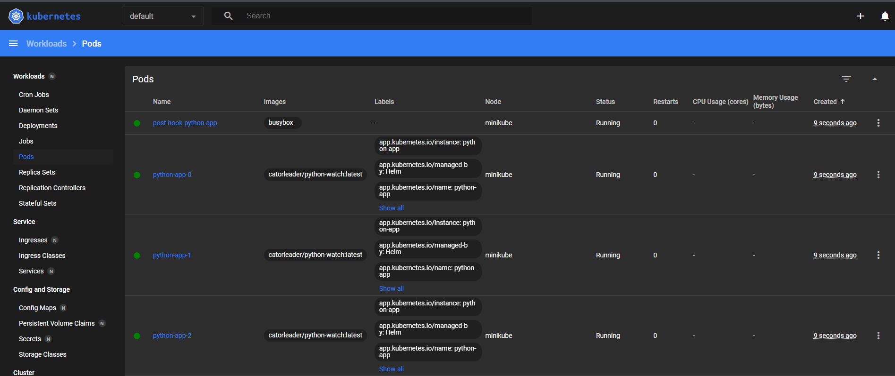
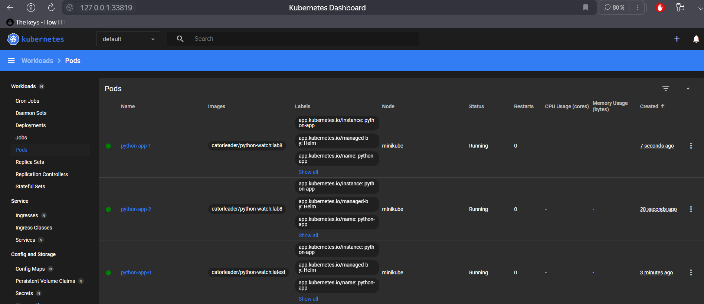
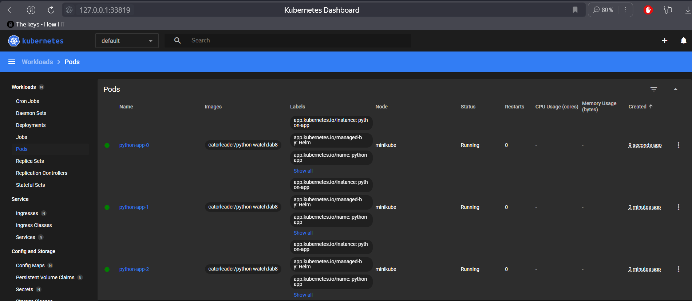

# StatefulSet

---

## Deploying python_app & java_app

```bash
catorleader@CatOrLeader:/mnt/d/Studying/S25-core-course-labs/k8s$ helm install --dry-run --debug python-app python-app
install.go:225: 2025-03-04 14:18:21.666808848 +0300 MSK m=+0.492556380 [debug] Original chart version: ""
install.go:242: 2025-03-04 14:18:21.668240967 +0300 MSK m=+0.493988500 [debug] CHART PATH: /mnt/d/Studying/S25-core-course-labs/k8s/python-app

NAME: python-app
LAST DEPLOYED: Tue Mar  4 14:18:21 2025
NAMESPACE: default
STATUS: pending-install
REVISION: 1
USER-SUPPLIED VALUES:
{}

COMPUTED VALUES:
affinity: {}
autoscaling:
  enabled: false
  maxReplicas: 100
  minReplicas: 1
  targetCPUUtilizationPercentage: 80
config:
  path: files/config.json
env:
  APP_MODE: PRODUCTION
  LOG_LEVEL: INFO
fullnameOverride: ""
image:
  pullPolicy: IfNotPresent
  repository: catorleader/python-watch
  tag: latest
imagePullSecrets: []
ingress:
  annotations: {}
  className: ""
  enabled: false
  hosts:
  - host: watch.example.com
    paths:
    - path: /
      pathType: ImplementationSpecific
  tls: []
library-helm:
  global: {}
nameOverride: ""
nodeSelector: {}
podAnnotations: {}
podLabels:
  app_name: watch
podSecurityContext: {}
replicaCount: 3
resources:
  limits:
    cpu: 100m
    memory: 128Mi
  requests:
    cpu: 100m
    memory: 128Mi
securityContext: {}
service:
  port: 5000
  targetPort: 5000
  type: NodePort
serviceAccount:
  annotations: {}
  automount: true
  create: true
  name: ""
tolerations: []
volumeClaimTemplatesName: python-app-pvc
volumeClaimTemplatesRequestStorage: 512Mi
volumeMounts:
- mountPath: /etc/config
  name: config-volume
  readOnly: true
- mountPath: /app/data
  name: python-app-pvc
volumes:
- configMap:
    name: config-map-python-app
  name: config-volume

HOOKS:
---
# Source: python-app/templates/post-install-hook.yaml
apiVersion: v1
kind: Pod
metadata:
   name: post-hook-python-app
   annotations:
       "helm.sh/hook": "post-install"
       "helm.sh/hook-delete-policy": before-hook-creation,hook-succeeded
spec:
  containers:
  - name: post-install-container
    image: busybox
    imagePullPolicy: Always
    command: ['sh', '-c', 'echo The post-install hook is running && sleep 15' ]
  restartPolicy: Never
  terminationGracePeriodSeconds: 0
---
# Source: python-app/templates/tests/test-connection.yaml
apiVersion: v1
kind: Pod
metadata:
  name: "python-app-test-connection"
  labels:
    helm.sh/chart: python-app-0.1.0
    app.kubernetes.io/name: python-app
    app.kubernetes.io/instance: python-app
    app.kubernetes.io/version: "1.16.0"
    app.kubernetes.io/managed-by: Helm
  annotations:
    "helm.sh/hook": test
spec:
  containers:
    - name: wget
      image: busybox
      command: ['wget']
      args: ['python-app:5000']
  restartPolicy: Never
MANIFEST:
---
# Source: python-app/templates/serviceaccount.yaml
apiVersion: v1
kind: ServiceAccount
metadata:
  name: python-app
  labels:
    helm.sh/chart: python-app-0.1.0
    app.kubernetes.io/name: python-app
    app.kubernetes.io/instance: python-app
    app.kubernetes.io/version: "1.16.0"
    app.kubernetes.io/managed-by: Helm
automountServiceAccountToken: true
---
# Source: python-app/templates/config-map.yaml
apiVersion: v1
kind: ConfigMap
metadata:
  name: config-map-python-app
data:
  config.json: |-
    {
      "some-very-unusual-data": "config-deploy-production",
      "very-structured-data": {
        "unbelievable-array": [
          "empty",
          "not-empty",
          "idgaf rly"
        ],
        "plain-obj": "kapusta"
      }
    }
---
# Source: python-app/templates/service.yaml
apiVersion: v1
kind: Service
metadata:
  name: python-app
  labels:
    app.kubernetes.io/version: "1.16.0"
    app.kubernetes.io/managed-by: Helm
    app.kubernetes.io/instance: python-app
spec:
  type: NodePort
  ports:
    - port: 5000
      targetPort: 5000
      protocol: TCP
      name: http
  selector:
    app.kubernetes.io/version: "1.16.0"
    app.kubernetes.io/managed-by: Helm
    app.kubernetes.io/instance: python-app
---
# Source: python-app/templates/statefulset.yaml
apiVersion: apps/v1
kind: StatefulSet
metadata:
  name: python-app
  labels:
    app.kubernetes.io/version: "1.16.0"
    app.kubernetes.io/managed-by: Helm
    app.kubernetes.io/instance: python-app
spec:
  serviceName: python-app
  replicas: 3
  selector:
    matchLabels:
      app.kubernetes.io/version: "1.16.0"
      app.kubernetes.io/managed-by: Helm
      app.kubernetes.io/instance: python-app
  volumeClaimTemplates:
    - metadata:
        name: python-app-pvc
      spec:
        accessModes: [ "ReadWriteOnce" ]
        resources:
          requests:
            storage: 512Mi
  template:
    metadata:
      labels:
        helm.sh/chart: python-app-0.1.0
        app.kubernetes.io/name: python-app
        app.kubernetes.io/instance: python-app
        app.kubernetes.io/version: "1.16.0"
        app.kubernetes.io/managed-by: Helm
        app_name: watch
    spec:
      serviceAccountName: python-app
      containers:
        - name: python-app
          image: "catorleader/python-watch:latest"
          imagePullPolicy: IfNotPresent
          envFrom:
            - configMapRef:
                name: config-map-python-app
          env:
#            - name: MY_PASS
#              valueFrom:
#                secretKeyRef:
#                  name: common-secret-python-app
#                  key: MY_PASS


            - name: LOG_LEVEL
              value: "INFO"
            - name: APP_MODE
              value: "production"

          ports:
            - name: http
              containerPort: 5000
              protocol: TCP
          resources:
            limits:
              cpu: 100m
              memory: 128Mi
            requests:
              cpu: 100m
              memory: 128Mi
          volumeMounts:
            - mountPath: /etc/config
              name: config-volume
              readOnly: true
            - mountPath: /app/data
              name: python-app-pvc
      volumes:
        - configMap:
            name: config-map-python-app
          name: config-volume

NOTES:
1. Get the application URL by running these commands:
  export NODE_PORT=$(kubectl get --namespace default -o jsonpath="{.spec.ports[0].nodePort}" services python-app)
  export NODE_IP=$(kubectl get nodes --namespace default -o jsonpath="{.items[0].status.addresses[0].address}")
  echo http://$NODE_IP:$NODE_PORT
catorleader@CatOrLeader:/mnt/d/Studying/S25-core-course-labs/k8s$ helm install --dry-run --debug java-app java-app
install.go:225: 2025-03-04 14:23:08.570352242 +0300 MSK m=+0.714184940 [debug] Original chart version: ""
install.go:242: 2025-03-04 14:23:08.572240521 +0300 MSK m=+0.716073213 [debug] CHART PATH: /mnt/d/Studying/S25-core-course-labs/k8s/java-app

NAME: java-app
LAST DEPLOYED: Tue Mar  4 14:23:08 2025
NAMESPACE: default
STATUS: pending-install
REVISION: 1
USER-SUPPLIED VALUES:
{}

COMPUTED VALUES:
affinity: {}
autoscaling:
  enabled: false
  maxReplicas: 100
  minReplicas: 1
  targetCPUUtilizationPercentage: 80
env:
  APP_MODE: PRODUCTION
  LOG_LEVEL: INFO
fullnameOverride: ""
image:
  pullPolicy: IfNotPresent
  repository: catorleader/vacation_calculator
  tag: latest
imagePullSecrets: []
ingress:
  annotations: {}
  className: ""
  enabled: false
  hosts:
  - host: chart-example.local
    paths:
    - path: /
      pathType: ImplementationSpecific
  tls: []
library-helm:
  global: {}
nameOverride: ""
nodeSelector: {}
podAnnotations: {}
podLabels:
  app_name: vacation_calculator
podSecurityContext: {}
replicaCount: 2
resources:
  limits:
    cpu: 100m
    memory: 128Mi
  requests:
    cpu: 100m
    memory: 128Mi
securityContext: {}
service:
  port: 8080
  type: NodePort
serviceAccount:
  annotations: {}
  automount: true
  create: true
  name: ""
tolerations: []
volumeClaimTemplatesName: java-app-pvc
volumeClaimTemplatesRequestStorage: 128Mi
volumeMounts:
- mountPath: /home/appuser/data
  name: java-app-pvc
volumes: []

HOOKS:
---
# Source: java-app/templates/tests/test-connection.yaml
apiVersion: v1
kind: Pod
metadata:
  name: "java-app-test-connection"
  labels:
    helm.sh/chart: java-app-0.1.0
    app.kubernetes.io/name: java-app
    app.kubernetes.io/instance: java-app
    app.kubernetes.io/version: "1.16.0"
    app.kubernetes.io/managed-by: Helm
  annotations:
    "helm.sh/hook": test
spec:
  containers:
    - name: wget
      image: busybox
      command: ['wget']
      args: ['java-app:8080']
  restartPolicy: Never
MANIFEST:
---
# Source: java-app/templates/serviceaccount.yaml
apiVersion: v1
kind: ServiceAccount
metadata:
  name: java-app
  labels:
    helm.sh/chart: java-app-0.1.0
    app.kubernetes.io/name: java-app
    app.kubernetes.io/instance: java-app
    app.kubernetes.io/version: "1.16.0"
    app.kubernetes.io/managed-by: Helm
automountServiceAccountToken: true
---
# Source: java-app/templates/service.yaml
apiVersion: v1
kind: Service
metadata:
  name: java-app
  labels:
    app.kubernetes.io/version: "1.16.0"
    app.kubernetes.io/managed-by: Helm
    app.kubernetes.io/instance: java-app
spec:
  type: NodePort
  ports:
    - port: 8080
      targetPort:
      protocol: TCP
      name: http
  selector:
    app.kubernetes.io/version: "1.16.0"
    app.kubernetes.io/managed-by: Helm
    app.kubernetes.io/instance: java-app
---
# Source: java-app/templates/statefulset.yaml
apiVersion: apps/v1
kind: StatefulSet
metadata:
  name: java-app
  labels:
    app.kubernetes.io/version: "1.16.0"
    app.kubernetes.io/managed-by: Helm
    app.kubernetes.io/instance: java-app
spec:
  serviceName: java-app
  replicas: 2
  selector:
    matchLabels:
      app.kubernetes.io/version: "1.16.0"
      app.kubernetes.io/managed-by: Helm
      app.kubernetes.io/instance: java-app
  volumeClaimTemplates:
    - metadata:
        name: java-app-pvc
      spec:
        accessModes: [ "ReadWriteOnce" ]
        resources:
          requests:
            storage: 128Mi
  template:
    metadata:
      labels:
        helm.sh/chart: java-app-0.1.0
        app.kubernetes.io/name: java-app
        app.kubernetes.io/instance: java-app
        app.kubernetes.io/version: "1.16.0"
        app.kubernetes.io/managed-by: Helm
        app_name: vacation_calculator
    spec:
      serviceAccountName: java-app
      containers:
        - name: java-app
          image: "catorleader/vacation_calculator:latest"
          imagePullPolicy: IfNotPresent
          env:


            - name: LOG_LEVEL
              value: "INFO"
            - name: APP_MODE
              value: "production"

          ports:
            - name: http
              containerPort: 8080
              protocol: TCP
          resources:
            limits:
              cpu: 100m
              memory: 128Mi
            requests:
              cpu: 100m
              memory: 128Mi
          volumeMounts:
            - mountPath: /home/appuser/data
              name: java-app-pvc

NOTES:
1. Get the application URL by running these commands:
  export NODE_PORT=$(kubectl get --namespace default -o jsonpath="{.spec.ports[0].nodePort}" services java-app)
  export NODE_IP=$(kubectl get nodes --namespace default -o jsonpath="{.items[0].status.addresses[0].address}")
  echo http://$NODE_IP:$NODE_PORT
```





## Best Practices

* Additional line in the `statefulset.yaml` (differ from the `deployment.yaml`):

```yaml
apiVersion: apps/v1
kind: StatefulSet
metadata:
  name: {{ include "java-app.fullname" . }}
  labels:
    {{- include "library-chart.labels" . | indent 4 }}
spec:
  serviceName: {{ include "java-app.fullname" . }}  # <-- Added in the python_app too
  volumeClaimTemplates:
  - metadata:
      name: {{ .Values.volumeClaimTemplatesName }}
    spec:
      accessModes: [ "ReadWriteOnce" ]
      resources:
        requests:
          storage: {{ .Values.volumeClaimTemplatesRequestStorage }}
...
```

* `podLabels` in the `values.yaml` file to keep the changed variables in the same place:

```yaml
# java_app
podLabels: {
             app_name: vacation_calculator
}

...
volumeMounts:
  - name: java-app-pvc
    mountPath: /home/appuser/data

volumeClaimTemplatesName: java-app-pvc
volumeClaimTemplatesRequestStorage: 128Mi
...
# python_app
podLabels: {
             app_name: watch
}
...
volumeMounts:
  - name: config-volume
    mountPath: /etc/config
    readOnly: true
  - name: python-app-pvc
    mountPath: /app/data

volumeClaimTemplatesName: python-app-pvc
volumeClaimTemplatesRequestStorage: 512Mi
```

* All the other variables already placed in the `values.yaml` files, not hardcoded inside the templates

---

* `kubectl get po,sts,svc,pvc`



* Then, I open access to the `python-app` service and open the root page three times by default browser, and three
  times in incognito mode. Let's check the results in the `visits` file in each pod



* What is going on here? Let's review the results

As we can see, k8s by itself balance requests from the user (us) to the different pods of the stateful set.
Even if the pods on the same Node (worker), the changes in the local FS cannot be seen through the different pods.
However, this can be solved by using single (P)VC, i.e. persistent volume claims. What I mean:
if pods will be placed on the same node (at least, from my working experience, it is necessary) and the same PVC will be
mounted on each pod (by adding necessary manifest in the `statefulset.yaml`), pods can access the same `data/visits`
file across the instances.
However, for now pods working in the isolated PVC (even on the same node), and cannot see changes across themselves.

---

* Access after deletion of pod (PVC remains)



* To properly install `nslookup` tool, I connect through the ssh to the minikube node, and then install
  `dnsutils` using `root` user in the `python-app-0` container



---

## Probes

```yaml
...
# python_app
livenessProbe:
  tcpSocket:
    port: 5000
  initialDelaySeconds: 5
  periodSeconds: 10
readinessProbe:
  tcpSocket:
    port: 5000
  initialDelaySeconds: 5
  periodSeconds: 10
...
# java_app
livenessProbe:
  tcpSocket:
    port: 8080
  initialDelaySeconds: 30
  periodSeconds: 10
readinessProbe:
  tcpSocket:
    port: 8080
  initialDelaySeconds: 30
  periodSeconds: 10
...
```

* Probes (in my configuration) check the availability of TCP sockets on each pod to make it clear that the socket doesn't hang up.

* Probes are essentially critical for the `StatefulSet` because of their necessity to work with the consistent data.
  It means that pods should be restarted if they were stuck, etc.
  Pods should always work with the persistent data to keep it convenient for the users.

* Additionally, the readiness probe can prevent sending traffic to a not properly initialized application

* When there is a problem with pods, k8s mostly instantly can receive the alert about it and restart the pod to
  efficiently consume resources

* And along with the latter one, stateful sets should be available as much as possible because of the necessity
  to process each request on the given data

---

## Ordering

* For the python application (and java_app too) the ordering is not important due to the following essential factors:
  * a) Kubernetes can properly manage the incoming traffic to the first available instance
  * b) The instances work on different (but consistent!) amount of data; However, for the final user, this is not
       important because functionality of the application does not depend on the data
  * c) There is no dependency between pods

* To implement the parallel podManagement, we can set the `podManagementPolicy` in the `StatefulSet` template

```yaml
# python_app; The same for the java_app
apiVersion: apps/v1
kind: StatefulSet
metadata:
  name: {{ include "python-app.fullname" . }}
  labels:
    {{- include "library-chart.labels" . | indent 4 }}
spec:
  podManagementPolicy: Parallel
...
```

* And now, all the pods started up in the same time



---

## Update Strategies

* For testing purposes, I change the tag: `tag: "lab8"`

* There are changed pods (2 out of 3);



* Then, I set `partition: 0` to update the last pod



* It can be treated as the canary update: we firstly update the subset of pods {1, 2}; And then update all the pods

## Brief Explanation

* **OnDelete**: pods not automatically updated; Users must manually delete pods to update the version
  * _Use Case_: when we need to manually update pods (in terms of verification or careful ordering)
* **RollingUpdate**: pods automatically updated (by some rules defined in the manifest) when changes encountered
  * _Use Case_: when we need to deliver the new version of application as fast as possible, to reduce the amount of
                downtime

* Deployments update strategies: **RollingUpdate** & **Recreate**
  * **RollingUpdate**: mostly the same as in the `StatefulSet`
  * **Recreate**: stop all the pods and ensure that all the instances use the same new version at the moment

* Comparison:
  * Update strategies for `StatefulSet`s dedicated to the usage with the stateful applications: each application
    can work with the unique identities
  * Update strategies for `Deployment`s used for the application with no state, when we can simply restart the application
    and be sure that pods can process requests as before
  * However, **RollingUpdate** is mostly the same for both types of resources
