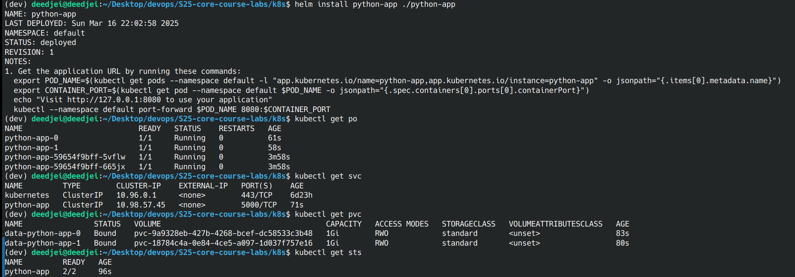

# Lab 14: Kubernetes StatefulSet
## Task 1 & 2: Implement StatefulSet & StatefulSet Exploration and Optimization
### kubectl get `po`,`sts`,`svc`,`pvc` outputs:
```bash
NAME                          READY   STATUS    RESTARTS   AGE
python-app-0                  1/1     Running   0          61s
python-app-1                  1/1     Running   0          58s
python-app-59654f9bff-5vflw   1/1     Running   0          3m58s
python-app-59654f9bff-665jx   1/1     Running   0          3m58s

NAME         TYPE        CLUSTER-IP    EXTERNAL-IP   PORT(S)    AGE
kubernetes   ClusterIP   10.96.0.1     <none>        443/TCP    6d23h
python-app   ClusterIP   10.98.57.45   <none>        5000/TCP   71s

NAME                STATUS   VOLUME                                     CAPACITY   ACCESS MODES   STORAGECLASS   VOLUMEATTRIBUTESCLASS   AGE
data-python-app-0   Bound    pvc-9a9328eb-427b-4268-bcef-dc58533c3b48   1Gi        RWO            standard       <unset>                 83s
data-python-app-1   Bound    pvc-18784c4a-0e84-4ce5-a097-1d037f757e16   1Gi        RWO            standard       <unset>                 80s

NAME         READY   AGE
python-app   2/2     96s
```



---

### File Content in Each Pod

```bash
$ kubectl exec python-app-0 -- cat /config/visits.txt
4
$ kubectl exec python-app-1 -- cat /config/visits.txt
3
```

Each replica shows a different visit count because they don’t share the same storage. By default, Kubernetes provides separate, isolated storage for each Pod unless you explicitly configure a shared storage solution like a PersistentVolume. As a result, `python-app-0` and `python-app-1` each maintain their own separate counters, which is why the visit counts differ between them.

---
### Persistent Storage Validation
- Delete pod:

```bash
$ kubectl delete pod app-python-0
pod "python-app-0" deleted

$ kubectl get pvc
NAME                STATUS   VOLUME                                     CAPACITY   ACCESS MODES   STORAGECLASS   VOLUMEATTRIBUTESCLASS   AGE
data-python-app-0   Bound    pvc-9a9328eb-427b-4268-bcef-dc58533c3b48   1Gi        RWO            standard       <unset>                 22m
data-python-app-1   Bound    pvc-18784c4a-0e84-4ce5-a097-1d037f757e16   1Gi        RWO            standard       <unset>                 22m

$ kubectl exec python-app-0 -- cat config/visits.txt
4
```
---
### Headless Service Access

```bash
$ kubectl exec python-app-0 -- nslookup python-app-1.python-app.default.svc.cluster.local
Server:		10.94.0.10
Address:	10.94.0.10

Name:	python-app-1.python-app.default.svc.cluster.local
Address: 10.264.0.155
```

### Monitoring & Alerts

- `How Probes Ensure Pod Health`: They continuously check the app’s status and take action (restart or remove from service) if issues are detected.

- `Why Critical for Stateful Apps`: Stateful apps often manage critical data or connections. Probes ensure they remain reliable and available.

### Ordering Guarantee and Parallel Operations

- `Why Ordering Guarantees Are Unnecessary`: App is stateless or doesn’t depend on a specific startup/shutdown order. Each Pod operates independently.

- Added `podManagementPolicy: Parallel` in statefulset.yaml/spec: This allows all Pods to start or stop simultaneously, improving scalability and reducing deployment time.