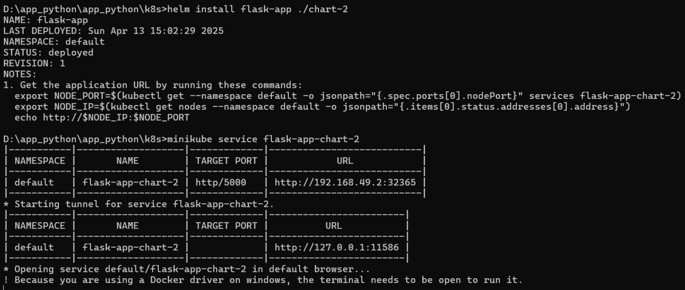

# Lab 14 - Statefulset

## Task 1: Implementing StatefulSet in Helm Chart

### Implementation steps

#### 1. Renamed deployment manifest
- The original `deployment.yaml` was replaced by `statefulset.yaml`.
- Resource kind was changed to `StatefulSet`.

#### 2. StatefulSet configuration
- Headless service was configured to allow stable network identities for StatefulSet pods.

#### 3. Best practises for values.yaml used
- values.yaml was re-cheked and used for deployment

### List of commands and their outputs
- ```cmd
  helm install ...
  ```
  
- 
  
- 
