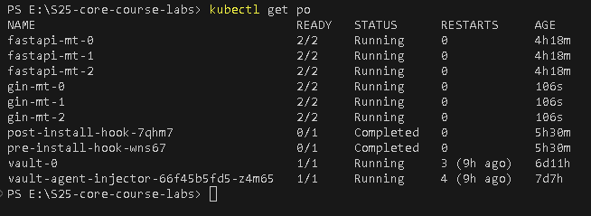

### Task 1
#### Step 2: Update Helm Chart
1. Renamed `deployment.yml` to `statefulset.yml`
2. Created manifest for StatefulSet:
```yaml
apiVersion: apps/v1
kind: StatefulSet
metadata:
  name: {{ include "fastapi-mt.fullname" . }}
  labels:
    {{- include "common.labels" . | nindent 4 }}
spec:
  serviceName: {{ .Values.service.name | default "fastapi-mt" }}
  replicas: {{ .Values.replicaCount }}
  podManagementPolicy: Parallel
  updateStrategy:
    type: RollingUpdate
    rollingUpdate:
      partition: 0
  selector:
    matchLabels:
      {{- include "fastapi-mt.selectorLabels" . | nindent 6 }}
  template:
    metadata:
      annotations:
        {{- toYaml .Values.podAnnotations | nindent 8 }}
      labels:
        {{- include "fastapi-mt.labels" . | nindent 8 }}
    spec:
      serviceAccountName: {{ .Values.serviceAccount.name | default "internal-app" }}
      securityContext:
        {{- toYaml .Values.podSecurityContext | nindent 8 }}
      containers:
        - name: {{ .Chart.Name }}
          image: "{{ .Values.image.repository }}:{{ .Values.image.tag | default .Chart.AppVersion }}"
          imagePullPolicy: {{ .Values.image.pullPolicy }}
          securityContext:
            {{- toYaml .Values.securityContext | nindent 12 }}
          ports:
            - name: http
              containerPort: {{ .Values.service.port }}
              protocol: TCP
          
          livenessProbe:
            httpGet:
              path: /health
              port: 8000
            initialDelaySeconds: 5
            periodSeconds: 10
            failureThreshold: 3

          readinessProbe:
            httpGet:
              path: /health
              port: 8000
            initialDelaySeconds: 3
            periodSeconds: 5
            failureThreshold: 2

          volumeMounts:
            {{- toYaml .Values.volumeMounts | nindent 12 }}
          resources:
            {{- toYaml .Values.resources | nindent 12 }}
      volumes:
        {{- toYaml .Values.volumes | nindent 8 }}
      nodeSelector:
        {{- toYaml .Values.nodeSelector | nindent 8 }}
      affinity:
        {{- toYaml .Values.affinity | nindent 8 }}
      tolerations:
        {{- toYaml .Values.tolerations | nindent 8 }}
  volumeClaimTemplates:
    - metadata:
        name: fastapi-mt-storage
      spec:
        accessModes: [ "ReadWriteOnce" ]
        resources:
          requests:
            storage: {{ .Values.storage.size | default "5Gi" }}
```
3. Added `storage` section to `values.yml`
4. Tested and finally deployed

### Task 2
#### Step 1
1. Output of `kubectl get po,sts,svc,pvc` command:
    
2. Result of `minikube service fastapi-mt` command:
    
3. Differences in the report (image attached below) are being seen due to the fact that `fastapi-mt-0, fastapi-mt-1, fastapi-mt-2` are not sharing the same `visits.txt` file, so each pod has its own separate storage. StatefulSets ensure each pod gets a unique volume that persists across pod restarts.
    - 

#### Step 2
1. Pod was deleted via `kubectl delete pod/fastapi-mt-1`
2. Data persistency was verified, result:
    

#### Step 3
1. Checked if the pods can be accessed via DNS: `kubectl exec fastapi-mt-0 -- nslookup fastapi-mt-1.fastapi-mt.default.svc.cluster.local`
    
    

#### Step 4
1. Added probes to StatefulSet:
```yaml
livenessProbe:
    httpGet:
        path: /health
        port: 8000
    initialDelaySeconds: 5
    periodSeconds: 10
    failureThreshold: 3

readinessProbe:
    httpGet:
        path: /health
        port: 8000
    initialDelaySeconds: 3
    periodSeconds: 5
    failureThreshold: 2
```
2. How probes ensure pod health?
    1. Liveness Probe:
        - Detects if the app hangs or crashes and restarts the pod
        - Ensures self-healing by killing unresponsive pods
    2. Readiness Probe:
        - Prevents traffic from being sent to an unready pod
        - Avoids downtime by only routing requests to fully initialized instances

#### Step 5
1. Why ordering guarantees are unnecessary for the app?
    - `Stateless API` - my FastAPI service does not require a strict start-up sequence
    - `Each Pod Works Independently` - No need to wait for previous pods to start
    - `Pods Are Interchangeable` - They don’t depend on a specific order to function
2. Added update strategy to StatefulSet
```yaml
updateStrategy:
type: RollingUpdate
rollingUpdate:
    partition: 0
```
Added pod management policy to StatefulSet
```yaml
podManagementPolicy: Parallel
```

- `updateStrategy` allows Kubernetes to update all pods at the same time rather than waiting for one to become ready before launching the next
- `podManagementPolicy: Parallel` ensures all pods shut down and start at the same time

#### Additionally
1. Verified auto-recovery:
    - 
2. Verified simultaneous start:
    - 
3. Verified simultaneous termination:
    - 

### Bonus Task
#### Apply StatefulSet to Bonus App
- StatefulSet manifest:
```yaml
apiVersion: apps/v1
kind: StatefulSet
metadata:
  name: {{ include "gin-mt.fullname" . }}
  labels:
    {{- include "common.labels" . | nindent 4 }}
spec:
  serviceName: {{ .Values.service.name | default "gin-mt" }}
  replicas: {{ .Values.replicaCount }}
  podManagementPolicy: Parallel
  updateStrategy:
    type: RollingUpdate
    rollingUpdate:
      partition: 0
  selector:
    matchLabels:
      {{- include "gin-mt.selectorLabels" . | nindent 6 }}
  template:
    metadata:
      annotations:
        {{- toYaml .Values.podAnnotations | nindent 8 }}
      labels:
        {{- include "gin-mt.labels" . | nindent 8 }}
    spec:
      serviceAccountName: {{ .Values.serviceAccount.name | default "internal-app-gin" }}
      securityContext:
        {{- toYaml .Values.podSecurityContext | nindent 8 }}
      containers:
        - name: {{ .Chart.Name }}
          image: "{{ .Values.image.repository }}:{{ .Values.image.tag | default .Chart.AppVersion }}"
          imagePullPolicy: {{ .Values.image.pullPolicy }}
          securityContext:
            {{- toYaml .Values.securityContext | nindent 12 }}
          ports:
            - name: http
              containerPort: {{ .Values.service.port }}
              protocol: TCP
          
          livenessProbe:
            httpGet:
              path: /health
              port: 8080
            initialDelaySeconds: 5
            periodSeconds: 10
            failureThreshold: 3

          readinessProbe:
            httpGet:
              path: /health
              port: 8080
            initialDelaySeconds: 3
            periodSeconds: 5
            failureThreshold: 2

          volumeMounts:
            {{- toYaml .Values.volumeMounts | nindent 12 }}
          resources:
            {{- toYaml .Values.resources | nindent 12 }}
      volumes:
        {{- toYaml .Values.volumes | nindent 8 }}
      nodeSelector:
        {{- toYaml .Values.nodeSelector | nindent 8 }}
      affinity:
        {{- toYaml .Values.affinity | nindent 8 }}
      tolerations:
        {{- toYaml .Values.tolerations | nindent 8 }}
  volumeClaimTemplates:
    - metadata:
        name: gin-mt-storage
      spec:
        accessModes: [ "ReadWriteOnce" ]
        resources:
          requests:
            storage: {{ .Values.storage.size | default "5Gi" }}
```
- Result:
  - Pods being deployed:
    - 
  - Pods terminating and starting simultaniously:
    - 
  - Guesses statistics before termination:
    - 
  - Guesses statistics after restart (Data persistency was verified):
    - 

#### Explore Update Strategies
1.  - Rolling updates were added in both StatefulSets on the previous steps
2.  - `updateStrategy.rollingUpdate.partition` changed to `2` to test a canary update
3.  1. `OnDelete`
      - `Behavior`: New pod versions are not updated automatically. Instead, user must manually delete and recreate each pod
      - `Use Case`: When strict control over pod updates is needed. Also can be useful when upgrading a database or any stateful application where manual migration is required
    2. `RollingUpdate`
      - `Behavior`: Updates pods one at a time by terminating and recreating them with the new configuration
      - `Use Case`: If minimal downtime is required. Safer for production because ensures only one pod is down at a time. Back-end services like message queues, distributed storage or microservices
      - `Additionaly`: Allows subset-based updates by setting partition
    - `Deployments`: Update all pods at once, making them better for stateless applications.

#### Comparison Table: StatefulSet vs Deployment Update Strategies

| Feature            | StatefulSet (OnDelete) | StatefulSet (RollingUpdate) | Deployment (Recreate) | Deployment (RollingUpdate) |
|--------------------|-----------------------|----------------------------|------------------------|----------------------------|
| **Update Mechanism** | Manual (Delete each pod) | Auto-updates pods one at a time | Deletes all pods, then creates new ones | Gradually replaces old pods with new ones |
| **Pod Identity**   | Stable                 | Stable                      | No stable identity    | No stable identity |
| **Order Guarantees** | Yes                   | Yes                         | No                     | No |
| **Downtime Risk**  | High (Manual restart)  | Low (One pod at a time)     | High (All pods restart at once) | Low (Gradual rollout) |
| **Use Case**       | Databases, critical stateful apps | Stateful apps needing seamless updates | Stateless apps needing full replacement | Web services, APIs, microservices |