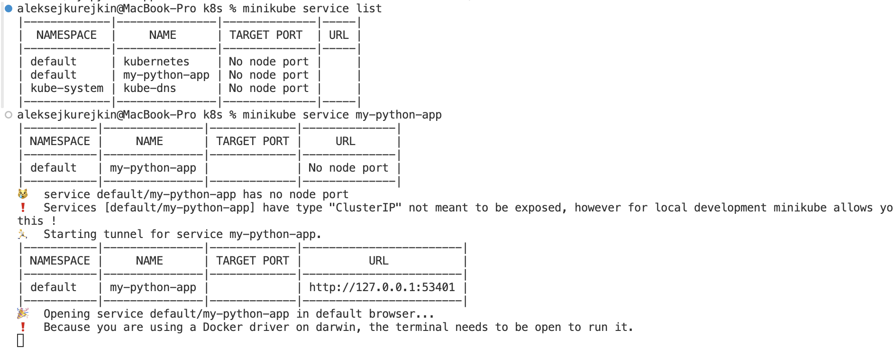

# Lab 14: Kubernetes StatefulSet | Mametov Eldar

## Task 1

```
lekski@LAPTOP-EA8M0FT5:/mnt/c/Users/Honor/Desktop/S25-core-course-labs/k8s$ helm install --dry-run --debug my-web-app ./web-apps
install.go:225: 2025-03-14 16:59:03.918372538 +0300 MSK m=+1.827746236 [debug] Original chart version: ""
install.go:242: 2025-03-14 16:59:03.925078402 +0300 MSK m=+1.834452171 [debug] CHART PATH: /mnt/c/Users/Honor/Desktop/S25-core-course-labs/k8s/web-apps

NAME: my-web-app
LAST DEPLOYED: Fri Mar 14 16:59:06 2025
NAMESPACE: default
STATUS: pending-install
REVISION: 1
USER-SUPPLIED VALUES:
{}

COMPUTED VALUES:
affinity: {}
autoscaling:
  enabled: false
  maxReplicas: 100
  minReplicas: 1
  targetCPUUtilizationPercentage: 80
fullnameOverride: ""
image:
  pullPolicy: IfNotPresent
  repository: lekski/python-web-app
  tag: latest
imagePullSecrets: []
ingress:
  annotations: {}
  className: ""
  enabled: true
  hosts:
  - host: new-python-web-app.local
    paths:
    - path: /
      pathType: Prefix
  tls: []
livenessProbe:
  failureThreshold: 3
  httpGet:
    path: /
    port: http
  initialDelaySeconds: 60
  periodSeconds: 5
mylibchart:
  affinity: {}
  autoscaling:
    enabled: false
    maxReplicas: 100
    minReplicas: 1
    targetCPUUtilizationPercentage: 80
  fullnameOverride: ""
  global: {}
  image:
    pullPolicy: IfNotPresent
    repository: nginx
    tag: ""
  imagePullSecrets: []
  ingress:
    annotations: {}
    className: ""
    enabled: false
    hosts:
    - host: chart-example.local
      paths:
      - path: /
        pathType: ImplementationSpecific
    tls: []
  livenessProbe:
    httpGet:
      path: /
      port: http
  nameOverride: ""
  nodeSelector: {}
  podAnnotations: {}
  podLabels: {}
  podSecurityContext: {}
  readinessProbe:
    httpGet:
      path: /
      port: http
  replicaCount: 1
  resources: {}
  securityContext: {}
  service:
    port: 80
    type: ClusterIP
  serviceAccount:
    annotations: {}
    automount: true
    create: true
    name: ""
  tolerations: []
  volumeMounts: []
  volumes: []
nameOverride: ""
nodeSelector: {}
password: my-secret-password
podAnnotations:
  vault.hashicorp.com/agent-inject: "true"
  vault.hashicorp.com/agent-inject-secret-database-config.txt: internal/data/database/config
  vault.hashicorp.com/agent-inject-template-database-config.txt: |
    {{- with secret "internal/data/database/config" -}}
    postgresql://{{ .Data.data.username }}:{{ .Data.data.password }}@postgres:5432/wizard
    {{- end -}}
  vault.hashicorp.com/role: web-apps
podLabels: {}
podSecurityContext: {}
readinessProbe:
  httpGet:
    path: /
    port: http
  initialDelaySeconds: 60
  periodSeconds: 5
replicaCount: 1
resources:
  limits:
    cpu: 100m
    memory: 128Mi
  requests:
    cpu: 100m
    memory: 128Mi
securityContext: {}
service:
  port: 8000
  type: ClusterIP
serviceAccount:
  annotations: {}
  automount: true
  create: true
  name: web-apps
tolerations: []
useStatefulSet: true
volumeMounts: []
volumes: []

HOOKS:
---
# Source: web-apps/templates/post-install-hook.yaml
apiVersion: v1
kind: Pod
metadata:
   name: postinstall-hook
   annotations:
       "helm.sh/hook": "post-install"
       # "helm.sh/hook-delete-policy": hook-succeeded
spec:
  containers:
  - name: post-install-container
    image: busybox:latest
    imagePullPolicy: Always
    command: ['sh', '-c', 'echo The post-install hook is running && sleep 20' ]
  restartPolicy: Never
  terminationGracePeriodSeconds: 0
---
# Source: web-apps/templates/pre-install-hook.yaml
apiVersion: v1
kind: Pod
metadata:
   name: preinstall-hook
   annotations:
       "helm.sh/hook": "pre-install"
       # "helm.sh/hook-delete-policy": hook-succeeded
spec:
  containers:
  - name: pre-install-container
    image: busybox:latest
    imagePullPolicy: IfNotPresent
    command: ['sh', '-c', 'echo The pre-install hook is running && sleep 20' ]
  restartPolicy: Never
  terminationGracePeriodSeconds: 0
---
# Source: web-apps/templates/tests/test-connection.yaml
apiVersion: v1
kind: Pod
metadata:
  name: "my-web-app-web-apps-test-connection"
  labels:
    helm.sh/chart: web-apps-0.1.0
    app.kubernetes.io/name: web-apps
    app.kubernetes.io/instance: my-web-app
    app.kubernetes.io/version: "1.16.0"
    app.kubernetes.io/managed-by: Helm
  annotations:
    "helm.sh/hook": test
spec:
  containers:
    - name: wget
      image: busybox
      command: ['wget']
      args: ['my-web-app-web-apps:8000']
  restartPolicy: Never
MANIFEST:
---
# Source: web-apps/templates/serviceaccount.yaml
apiVersion: v1
kind: ServiceAccount
metadata:
  name: web-apps
  labels:
    helm.sh/chart: web-apps-0.1.0
    app.kubernetes.io/name: web-apps
    app.kubernetes.io/instance: my-web-app
    app.kubernetes.io/version: "1.16.0"
    app.kubernetes.io/managed-by: Helm
automountServiceAccountToken: true
---
# Source: web-apps/templates/secrets.yaml
apiVersion: v1
kind: Secret
metadata:
  name: credentials
  labels:
    helm.sh/chart: web-apps-0.1.0
    app.kubernetes.io/name: web-apps
    app.kubernetes.io/instance: my-web-app
    app.kubernetes.io/version: "1.16.0"
    app.kubernetes.io/managed-by: Helm
type: Opaque
data:
  password: "bXktc2VjcmV0LXBhc3N3b3Jk"
---
# Source: web-apps/templates/config.yaml
apiVersion: v1
kind: ConfigMap
metadata:
  name: web-apps-config
  labels:
    helm.sh/chart: web-apps-0.1.0
    app.kubernetes.io/name: web-apps
    app.kubernetes.io/instance: my-web-app
    app.kubernetes.io/version: "1.16.0"
    app.kubernetes.io/managed-by: Helm
data:
  config.json: |-

    {
        "myname": "Eldar"
    }
---
# Source: web-apps/templates/service-headless.yaml
apiVersion: v1
kind: Service
metadata:
  name: my-web-app-web-apps-headless
  labels:
    app.kubernetes.io/name: web-apps
    app.kubernetes.io/instance: my-web-app
    app.kubernetes.io/version: 1.16.0
    app.kubernetes.io/managed-by: Helm
spec:
  clusterIP: None
  ports:
    - port: 8000
      targetPort: http
      protocol: TCP
      name: http
  selector:
    app.kubernetes.io/name: web-apps
    app.kubernetes.io/instance: my-web-app
---
# Source: web-apps/templates/service.yaml
apiVersion: v1
kind: Service
metadata:
  name: my-web-app-web-apps
  labels:
    helm.sh/chart: web-apps-0.1.0
    app.kubernetes.io/name: web-apps
    app.kubernetes.io/instance: my-web-app
    app.kubernetes.io/version: "1.16.0"
    app.kubernetes.io/managed-by: Helm
spec:
  type: ClusterIP
  ports:
    - port: 8000
      targetPort: 8000
      protocol: TCP
      name: http
  selector:
    app.kubernetes.io/name: web-apps
    app.kubernetes.io/instance: my-web-app
---
# Source: web-apps/templates/statefulset.yaml
apiVersion: apps/v1
kind: StatefulSet
metadata:
  name: my-web-app-web-apps
  labels:
    app.kubernetes.io/name: web-apps
    app.kubernetes.io/instance: my-web-app
    app.kubernetes.io/version: 1.16.0
    app.kubernetes.io/managed-by: Helm
spec:
  serviceName: my-web-app-web-apps-headless
  replicas: 1
  selector:
    matchLabels:
      app.kubernetes.io/name: web-apps
      app.kubernetes.io/instance: my-web-app
  template:
    metadata:
      annotations:
        vault.hashicorp.com/agent-inject: "true"
        vault.hashicorp.com/agent-inject-secret-database-config.txt: internal/data/database/config
        vault.hashicorp.com/agent-inject-template-database-config.txt: |
          {{- with secret "internal/data/database/config" -}}
          postgresql://{{ .Data.data.username }}:{{ .Data.data.password }}@postgres:5432/wizard
          {{- end -}}
        vault.hashicorp.com/role: web-apps
      labels:
        helm.sh/chart: web-apps-0.1.0
        app.kubernetes.io/name: web-apps
        app.kubernetes.io/instance: my-web-app
        app.kubernetes.io/version: "1.16.0"
        app.kubernetes.io/managed-by: Helm
    spec:
      serviceAccountName: web-apps
      containers:
        - name: web-apps
          image: "lekski/python-web-app:latest"
          imagePullPolicy: IfNotPresent
          env:
          - name: MY_PASSWORD
            valueFrom:
              secretKeyRef:
                name: credentials
                key: password
          - name: STUDENT
            value: "Eldar Mametov"
          envFrom:
          - configMapRef:
              name: web-apps-config
          ports:
            - name: http
              containerPort: 8000
              protocol: TCP
          livenessProbe:
            failureThreshold: 3
            httpGet:
              path: /
              port: http
            initialDelaySeconds: 60
            periodSeconds: 5
          readinessProbe:
            httpGet:
              path: /
              port: http
            initialDelaySeconds: 60
            periodSeconds: 5
          resources:
            limits:
              cpu: 100m
              memory: 128Mi
            requests:
              cpu: 100m
              memory: 128Mi
          volumeMounts:
            - name: data
              mountPath: /data
  volumeClaimTemplates:
    - metadata:
        name: data
      spec:
        accessModes: ["ReadWriteOnce"]
        resources:
          requests:
            storage: 1Gi
---
# Source: web-apps/templates/ingress.yaml
apiVersion: networking.k8s.io/v1
kind: Ingress
metadata:
  name: my-web-app-web-apps
  labels:
    helm.sh/chart: web-apps-0.1.0
    app.kubernetes.io/name: web-apps
    app.kubernetes.io/instance: my-web-app
    app.kubernetes.io/version: "1.16.0"
    app.kubernetes.io/managed-by: Helm
spec:
  rules:
    - host: "new-python-web-app.local"
      http:
        paths:
          - path: /
            pathType: Prefix
            backend:
              service:
                name: my-web-app-web-apps
                port:
                  number: 8000

NOTES:
1. Get the application URL by running these commands:
  http://new-python-web-app.local/
```

```
lekski@LAPTOP-EA8M0FT5:/mnt/c/Users/Honor/Desktop/S25-core-course-labs/k8s$ helm install my-web-app ./web-apps
NAME: my-web-app
LAST DEPLOYED: Fri Mar 14 16:59:58 2025
NAMESPACE: default
STATUS: deployed
REVISION: 1
NOTES:
1. Get the application URL by running these commands:
  http://new-python-web-app.local/
```

```
lekski@LAPTOP-EA8M0FT5:/mnt/c/Users/Honor/Desktop/S25-core-course-labs/k8s$ curl http://new-python-web-app.local/
<!DOCTYPE html>
<html>
<head>
    <meta charset="UTF-8">
    <meta name="viewport" content="width=device-width, initial-scale=1.0">
    <link rel="stylesheet" href="./static/css/main.css">
    <title>Moscow</title>
</head>
<body>
    <div class="time">
        <h1 id='main_text'>MSC Time</h1>
        <h1 id='msc-time'>14-03-2025 17:02:23</h1>
    </div>
</body>
</html>
```

## Task 2

```
lekski@LAPTOP-EA8M0FT5:/mnt/c/Users/Honor/Desktop/S25-core-course-labs/k8s$ kubectl get po,sts,svc,pvc
NAME                                        READY   STATUS      RESTARTS       AGE
pod/my-web-app-web-apps-0                   2/2     Running     0              7m43s
pod/postinstall-hook                        0/1     Completed   0              7m40s
pod/preinstall-hook                         0/1     Completed   0              8m14s
pod/python-app-web-apps-55d87457cc-g7f86    1/2     Running     0              69s
pod/python-app-web-apps-55d87457cc-kp4lx    1/2     Running     0              69s
pod/vault-0                                 1/1     Running     11 (72m ago)   11d
pod/vault-agent-injector-66f45b5fd5-t9x62   1/1     Running     25             11d

NAME                                   READY   AGE
statefulset.apps/my-web-app-web-apps   1/1     7m44s
statefulset.apps/vault                 1/1     11d

NAME                                   TYPE        CLUSTER-IP       EXTERNAL-IP   PORT(S)             AGE
service/helm-hooks-release-web-apps    ClusterIP   10.97.254.224    <none>        8000/TCP            18d
service/kubernetes                     ClusterIP   10.96.0.1        <none>        443/TCP             18d
service/my-web-app-web-apps            ClusterIP   10.100.96.60     <none>        8000/TCP            7m44s
service/my-web-app-web-apps-headless   ClusterIP   None             <none>        8000/TCP            7m44s
service/vault                          ClusterIP   10.106.252.247   <none>        8200/TCP,8201/TCP   11d
service/vault-agent-injector-svc       ClusterIP   10.96.170.185    <none>        443/TCP             11d
service/vault-internal                 ClusterIP   None             <none>        8200/TCP,8201/TCP   11d

NAME                                               STATUS   VOLUME                                     CAPACITY   ACCESS MODES   STORAGECLASS   VOLUMEATTRIBUTESCLASS   AGE
persistentvolumeclaim/data-my-web-app-web-apps-0   Bound    pvc-9b1ea2c9-4538-4976-915b-48428cf0e5a4   1Gi        RWO            standard       <unset>                 62m
```

```
lekski@LAPTOP-EA8M0FT5:/mnt/c/Users/Honor/Desktop/S25-core-course-labs/k8s$ minikube service my-web-app-web-apps 
|-----------|---------------------|-------------|--------------|
| NAMESPACE |        NAME         | TARGET PORT |     URL      |
|-----------|---------------------|-------------|--------------|
| default   | my-web-app-web-apps |             | No node port |
|-----------|---------------------|-------------|--------------|
😿  service default/my-web-app-web-apps has no node port
❗  Services [default/my-web-app-web-apps] have type "ClusterIP" not meant to be exposed, however for local development minikube allows you to access this !
🏃  Starting tunnel for service my-web-app-web-apps.
|-----------|---------------------|-------------|------------------------|
| NAMESPACE |        NAME         | TARGET PORT |          URL           |
|-----------|---------------------|-------------|------------------------|
| default   | my-web-app-web-apps |             | http://127.0.0.1:42641 |
|-----------|---------------------|-------------|------------------------|
🎉  Opening service default/my-web-app-web-apps in default browser...
👉  http://127.0.0.1:42641
❗  Because you are using a Docker driver on linux, the terminal needs to be open to run it.
```




```
lekski@LAPTOP-EA8M0FT5:/mnt/c/Users/Honor/Desktop/S25-core-course-labs/k8s$ kubectl get po,sts,svc,pvc
NAME                                        READY   STATUS             RESTARTS       AGE
pod/my-web-app-web-apps-0                   2/2     Running            0              4m46s
pod/postinstall-hook                        0/1     ImagePullBackOff   0              4m45s
pod/preinstall-hook                         0/1     Completed          0              5m21s
pod/python-app-web-apps-55d87457cc-g7f86    2/2     Running            0              26m
pod/python-app-web-apps-55d87457cc-kp4lx    2/2     Running            0              26m
pod/vault-0                                 1/1     Running            11 (97m ago)   11d
pod/vault-agent-injector-66f45b5fd5-t9x62   1/1     Running            25             11d

NAME                                   READY   AGE
statefulset.apps/my-web-app-web-apps   1/1     4m47s
statefulset.apps/vault                 1/1     11d

NAME                                   TYPE        CLUSTER-IP       EXTERNAL-IP   PORT(S)             AGE
service/helm-hooks-release-web-apps    ClusterIP   10.97.254.224    <none>        8000/TCP            18d
service/kubernetes                     ClusterIP   10.96.0.1        <none>        443/TCP             18d
service/my-web-app-web-apps            ClusterIP   10.103.72.214    <none>        8000/TCP            4m47s
service/my-web-app-web-apps-headless   ClusterIP   None             <none>        8000/TCP            4m47s
service/vault                          ClusterIP   10.106.252.247   <none>        8200/TCP,8201/TCP   11d
service/vault-agent-injector-svc       ClusterIP   10.96.170.185    <none>        443/TCP             11d
service/vault-internal                 ClusterIP   None             <none>        8200/TCP,8201/TCP   11d

NAME                                               STATUS   VOLUME                                     CAPACITY   ACCESS MODES   STORAGECLASS   VOLUMEATTRIBUTESCLASS   AGE
persistentvolumeclaim/data-my-web-app-web-apps-0   Bound    pvc-9b1ea2c9-4538-4976-915b-48428cf0e5a4   1Gi        RWO            standard       <unset>                 88m
lekski@LAPTOP-EA8M0FT5:/mnt/c/Users/Honor/Desktop/S25-core-course-labs/k8s$ kubectl get pod my-web-app-web-apps-0 -n default
NAME                    READY   STATUS    RESTARTS   AGE
my-web-app-web-apps-0   2/2     Running   0          5m10s
lekski@LAPTOP-EA8M0FT5:/mnt/c/Users/Honor/Desktop/S25-core-course-labs/k8s$ curl http://new-python-web-app.local/
<!DOCTYPE html>
<html>
<head>
    <meta charset="UTF-8">
    <meta name="viewport" content="width=device-width, initial-scale=1.0">
    <link rel="stylesheet" href="./static/css/main.css">
    <title>Moscow</title>
</head>
<body>
    <div class="time">
        <h1 id='main_text'>MSC Time</h1>
        <h1 id='msc-time'>14-03-2025 17:34:03</h1>
    </div>
</body>
</html>lekski@LAPTOP-EA8M0FT5:/mnt/c/Users/Honor/Desktop/S25-core-course-labs/k8s$ kubectl exec my-web-app-web-apps-0 -n default -- cat /visits
Defaulted container "web-apps" out of: web-apps, vault-agent, vault-agent-init (init)
cat: read error: Is a directory
command terminated with exit code 1
lekski@LAPTOP-EA8M0FT5:/mnt/c/Users/Honor/Desktop/S25-core-course-labs/k8s$ curl http://new-python-web-app.local/visits
{"detail":"Not Found"}
```

app.py:
```
'''python web-app program'''
import os
import threading
from datetime import datetime
from contextlib import asynccontextmanager
from fastapi import FastAPI, Request, Response
from fastapi.responses import HTMLResponse, PlainTextResponse
from fastapi.templating import Jinja2Templates
from fastapi.staticfiles import StaticFiles
import uvicorn
import pytz
from prometheus_client import Counter, Histogram, generate_latest, CONTENT_TYPE_LATEST

app = FastAPI(lifespan=lifespan)
STATIC_DIR = os.path.join(os.path.dirname(__file__), "static")
# specify the folder with static files
app.mount("/static", StaticFiles(directory=STATIC_DIR), name="static")

TEMPLATES_DIR = os.path.join(os.path.dirname(__file__), "templates")
templates = Jinja2Templates(directory=TEMPLATES_DIR) # html template folder

REQUEST_COUNT = Counter('http_requests_total', 'Total number of HTTP requests', ['method', 'path'])
REQUEST_LATENCY = Histogram('http_request_duration_seconds', 'HTTP request latency in seconds', ['method', 'path'])

@app.middleware("http")
async def metrics_middleware(request: Request, call_next):
    '''Middleware to collect request metrics'''
    start_time = datetime.now()
    response = await call_next(request)
    process_time = datetime.now() - start_time
    REQUEST_COUNT.labels(method=request.method, path=request.url.path).inc()
    REQUEST_LATENCY.labels(method=request.method, path=request.url.path).observe(process_time.total_seconds())
    return response

COUNTER_FILE = "visits"
counter_lock = threading.Lock()
persistent_counter = 0

def load_counter():
    global persistent_counter
    try:
        with open(COUNTER_FILE, "r") as f:
            persistent_counter = int(f.read())
    except Exception:
        persistent_counter = 0

def save_counter():
    with open(COUNTER_FILE, "w") as f:
        f.write(str(persistent_counter))

@asynccontextmanager
async def lifespan(app: FastAPI):
    load_counter()
    yield

@REQUEST_LATENCY.time()
@app.get("/", response_class=HTMLResponse)
async def read_root(request: Request):
    '''Displaying Moscow time'''
    timezone = pytz.timezone('Europe/Moscow') # Selecting a time zone
    time = datetime.now(timezone).strftime("%d-%m-%Y %H:%M:%S")
    global persistent_counter
    with counter_lock:
        persistent_counter += 1
        save_counter()
    return templates.TemplateResponse("index.html", {"request": request, "msc_time": time})

@app.get("/metrics")
async def metrics():
    '''Endpoint Prometheus metrics'''
    return Response(generate_latest(), media_type=CONTENT_TYPE_LATEST)

@app.get("/visits", response_class=PlainTextResponse)
async def get_visits():
    '''Number of visits'''
    return f"Visits №{persistent_counter}"

if __name__ == "__main__":
    # ip address and port to run the web application
    uvicorn.run(app, host="127.0.0.1", port=int(8000))
```

statefulset.yaml:
```
{{- if .Values.useStatefulSet }}
apiVersion: apps/v1
kind: StatefulSet
metadata:
  name: {{ include "web-apps.fullname" . }}
  labels:
    {{- include "mylibchart.labels" . | nindent 4 }}
spec:
  serviceName: {{ include "web-apps.fullname" . }}-headless
  replicas: {{ .Values.replicaCount }}
  selector:
    matchLabels:
      {{- include "web-apps.selectorLabels" . | nindent 6 }}
  template:
    metadata:
      {{- with .Values.podAnnotations }}
      annotations:
        {{- toYaml . | nindent 8 }}
      {{- end }}
      labels:
        {{- include "web-apps.labels" . | nindent 8 }}
        {{- with .Values.podLabels }}
        {{- toYaml . | nindent 8 }}
        {{- end }}
    spec:
      {{- with .Values.imagePullSecrets }}
      imagePullSecrets:
        {{- toYaml . | nindent 8 }}
      {{- end }}
      serviceAccountName: {{ include "web-apps.serviceAccountName" . }}
      {{- with .Values.podSecurityContext }}
      securityContext:
        {{- toYaml . | nindent 8 }}
      {{- end }}
      containers:
        - name: {{ .Chart.Name }}
          {{- with .Values.securityContext }}
          securityContext:
            {{- toYaml . | nindent 12 }}
          {{- end }}
          image: "{{ .Values.image.repository }}:{{ .Values.image.tag | default .Chart.AppVersion }}"
          imagePullPolicy: {{ .Values.image.pullPolicy }}
          env:
          - name: MY_PASSWORD
            valueFrom:
              secretKeyRef:
                name: credentials
                key: password
          {{- include "web-apps.env" . | nindent 10 }}
          envFrom:
          - configMapRef:
              name: web-apps-config
          ports:
            - name: http
              containerPort: 8000
              protocol: TCP
          {{- with .Values.livenessProbe }}
          livenessProbe:
            {{- toYaml . | nindent 12 }}
          {{- end }}
          {{- with .Values.readinessProbe }}
          readinessProbe:
            {{- toYaml . | nindent 12 }}
          {{- end }}
          {{- with .Values.resources }}
          resources:
            {{- toYaml . | nindent 12 }}
          {{- end }}
          volumeMounts:
            - name: data
              mountPath: /visits
      {{- with .Values.nodeSelector }}
      nodeSelector:
        {{- toYaml . | nindent 8 }}
      {{- end }}
      {{- with .Values.affinity }}
      affinity:
        {{- toYaml . | nindent 8 }}
      {{- end }}
      {{- with .Values.tolerations }}
      tolerations:
        {{- toYaml . | nindent 8 }}
      {{- end }}
  volumeClaimTemplates:
    - metadata:
        name: data
      spec:
        accessModes: ["ReadWriteOnce"]
        resources:
          requests:
            storage: 1Gi
{{- end }}
```

service-handle.yaml:
```
apiVersion: v1
kind: Service
metadata:
  name: {{ include "web-apps.fullname" . }}-headless
  labels:
    {{- include "mylibchart.labels" . | nindent 4 }}
spec:
  clusterIP: None
  ports:
    - port: 8000
      targetPort: http
      protocol: TCP
      name: http
  selector:
    {{- include "web-apps.selectorLabels" . | nindent 4 }}
```

values.yaml:
```
# Default values for web-apps.
# This is a YAML-formatted file.
# Declare variables to be passed into your templates.

# This will set the replicaset count more information can be found here: https://kubernetes.io/docs/concepts/workloads/controllers/replicaset/
replicaCount: 1
useStatefulSet: true

# This sets the container image more information can be found here: https://kubernetes.io/docs/concepts/containers/images/
image:
  repository: lekski/python-web-app
  # This sets the pull policy for images.
  pullPolicy: IfNotPresent
  # Overrides the image tag whose default is the chart appVersion.
  tag: "latest"

# This is for the secrets for pulling an image from a private repository more information can be found here: https://kubernetes.io/docs/tasks/configure-pod-container/pull-image-private-registry/
imagePullSecrets: []
# This is to override the chart name.
nameOverride: ""
fullnameOverride: ""

# This section builds out the service account more information can be found here: https://kubernetes.io/docs/concepts/security/service-accounts/
serviceAccount:
  # Specifies whether a service account should be created
  create: true
  # Automatically mount a ServiceAccount's API credentials?
  automount: true
  # Annotations to add to the service account
  annotations: {}
  # The name of the service account to use.
  # If not set and create is true, a name is generated using the fullname template
  name: "web-apps"

# This is for setting Kubernetes Annotations to a Pod.
# For more information checkout: https://kubernetes.io/docs/concepts/overview/working-with-objects/annotations/
podAnnotations:
  vault.hashicorp.com/agent-inject: "true"
  vault.hashicorp.com/role: "web-apps"
  vault.hashicorp.com/agent-inject-secret-database-config.txt: 'internal/data/database/config'
  vault.hashicorp.com/agent-inject-template-database-config.txt: |
    {{- with secret "internal/data/database/config" -}}
    postgresql://{{ .Data.data.username }}:{{ .Data.data.password }}@postgres:5432/wizard
    {{- end -}}
# This is for setting Kubernetes Labels to a Pod.
# For more information checkout: https://kubernetes.io/docs/concepts/overview/working-with-objects/labels/
podLabels: {}

podSecurityContext: {}
  # fsGroup: 2000

securityContext: {}
  # capabilities:
  #   drop:
  #   - ALL
  # readOnlyRootFilesystem: true
  # runAsNonRoot: true
  # runAsUser: 1000

# This is for setting up a service more information can be found here: https://kubernetes.io/docs/concepts/services-networking/service/
service:
  # This sets the service type more information can be found here: https://kubernetes.io/docs/concepts/services-networking/service/#publishing-services-service-types
  type: ClusterIP
  # This sets the ports more information can be found here: https://kubernetes.io/docs/concepts/services-networking/service/#field-spec-ports
  port: 8000

# This block is for setting up the ingress for more information can be found here: https://kubernetes.io/docs/concepts/services-networking/ingress/
ingress:
  enabled: true
  className: ""
  annotations: {}
    # kubernetes.io/ingress.class: nginx
    # kubernetes.io/tls-acme: "true"
  hosts:
    - host: new-python-web-app.local
      paths:
        - path: /
          pathType: Prefix
  tls: []
  #  - secretName: chart-example-tls
  #    hosts:
  #      - chart-example.local

resources:
  limits:
    cpu: 100m
    memory: 128Mi
  requests:
    cpu: 100m
    memory: 128Mi
  # We usually recommend not to specify default resources and to leave this as a conscious
  # choice for the user. This also increases chances charts run on environments with little
  # resources, such as Minikube. If you do want to specify resources, uncomment the following
  # lines, adjust them as necessary, and remove the curly braces after 'resources:'.
  # limits:
  #   cpu: 100m
  #   memory: 128Mi
  # requests:
  #   cpu: 100m
  #   memory: 128Mi

# This is to setup the liveness and readiness probes more information can be found here: https://kubernetes.io/docs/tasks/configure-pod-container/configure-liveness-readiness-startup-probes/
livenessProbe:
  httpGet:
    path: /
    port: http
  initialDelaySeconds: 60
  periodSeconds: 5         
  failureThreshold: 3     

readinessProbe:
  httpGet:
    path: /
    port: http
  initialDelaySeconds: 60
  periodSeconds: 5

# This section is for setting up autoscaling more information can be found here: https://kubernetes.io/docs/concepts/workloads/autoscaling/
autoscaling:
  enabled: false
  minReplicas: 1
  maxReplicas: 100
  targetCPUUtilizationPercentage: 80
  # targetMemoryUtilizationPercentage: 80

# Additional volumes on the output Deployment definition
volumes: []
# volumes:
#   - name: web-apps-config-volume
#     configMap:
#       name: web-apps-config
# - name: foo
#   secret:
#     secretName: mysecret
#     optional: false

# Additional volumeMounts on the output Deployment definition.
volumeMounts: []
# volumeMounts:
# - name: web-apps-config-volume
#   mountPath: "/app/data/config.json"
#   subPath: "config.json"

nodeSelector: {}

tolerations: []

affinity: {}


password: "my-secret-password"
```

в чем проблема? почему нет доступа к /visits