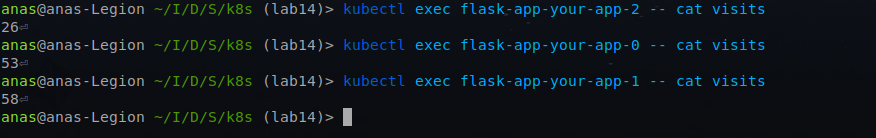

# Lab 14: Kubernetes StatefulSet

## Overview

In this lab, you'll explore Kubernetes StatefulSets, focusing on managing stateful applications with guarantees about the ordering and uniqueness of a set of Pods.

## Task 1: Implement StatefulSet in Helm Chart

**6 Points:**

1. Understand StatefulSets:
   - Read about StatefulSet objects:
     - [Concept](https://kubernetes.io/docs/concepts/workloads/controllers/statefulset/)
     - [Tutorial](https://kubernetes.io/docs/tutorials/stateful-application/basic-stateful-set/)

2. Update Helm Chart:
   - Rename `deployment.yml` to `statefulset.yml`.
   - Create a manifest for StatefulSet following the tutorial.
   - Test with command: `helm install --dry-run --debug name_of_your_chart path_to_your_chart`.
   
   - Fix any issues and deploy it.
   
   
   - Apply best practices by moving values to variables in `values.yml` meaningfully.
## Task 2: StatefulSet Exploration and Optimization

**4 Points:**

1. Research and Documentation:
   - Create `14.md` report.
   - Include the output of `kubectl get po,sts,svc,pvc` commands.
   
   - Use `minikube service name_of_your_statefulset` command to access your app.
   
   - Access the root path of your app from different tabs and modes in your browser.
   - Check the content of your file in each pod, e.g., `kubectl exec pod/demo-0 -- cat visits`, and provide the output for all replicas.
   
   - Describe and explain differences in the report.

        the difference between pods means that each pod maintains its own state or persistent volume.

2. Persistent Storage Validation
   - Delete a pod:

     ```bash
     kubectl delete pod app-stateful-0
     ```
        
   - Verify that the PVC and data persist:

     ```bash
     kubectl get pvc
     kubectl exec app-stateful-0 -- cat /data/visits
     ```
        
        
3. Headless Service Access
   - Access pods via DNS:

     ```bash
     kubectl exec app-stateful-0 -- nslookup app-stateful-1.app-stateful
     ```
        
   - Document DNS resolution in `14.md`.

4. Monitoring & Alerts
   - Add liveness/readiness probes to your StatefulSet.
   
   - Describe in `14.md`:
     - How probes ensure pod health.
        
        Liveness Probe: Ensures the pod is running and healthy. If it fails, Kubernetes will restart the pod to recover from potential failures or deadlocks.
        
        Readiness Probe: Ensures the pod is ready to handle traffic. If it fails, Kubernetes stops routing traffic to that pod until it becomes healthy again.
     - Why they’re critical for stateful apps.

        Stateful apps manage persistent data and have dependencies (e.g., databases). Probes ensure that only fully initialized, healthy pods serve traffic, preventing data corruption and improving availability. Without probes, traffic could be routed to pods that aren’t ready, causing errors or downtime.
5. Ordering Guarantee and Parallel Operations:
   - Explain why ordering guarantees are unnecessary for your app.
    
        Ordering guarantees are unnecessary for stateless apps because they don’t rely on the state of other pods. Each pod operates independently, and there’s no need to start or terminate pods in sequence. Using podManagementPolicy: Parallel allows faster scaling without dependencies, making parallel operations more efficient.
   - Implement a way to instruct the StatefulSet controller to launch or terminate all Pods in parallel.

        Using: `podManagementPolicy: Parallel`

**List of Requirements:**

- Outputs of commands in `14.md`.
- Results of the "number of visits" command for each pod, with an explanation in `14.md`.
- Answers to questions in point 2 of `14.md`.
- Implementation of parallel launch and terminate.
