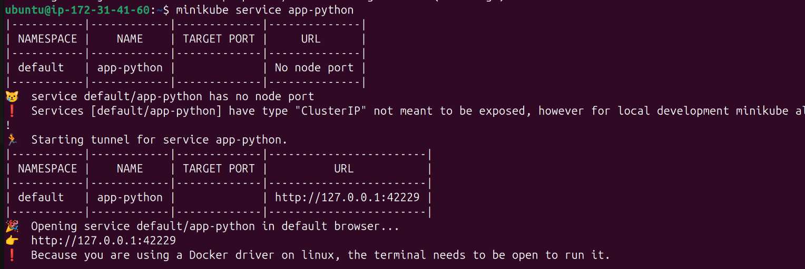
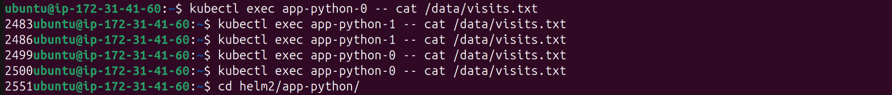

# Lab 14: Kubernetes StatefulSet

## Task 1

- let's create a simple helm chart for `app-python` and configure it and change `deployment.yaml` to `statfulset.yaml`
- 
- let's perform a dry run by executing `helm install --dry-run --debug app-python app-python/`

  ```
  install.go:225: 2025-03-13 16:01:46.920721601 +0000 UTC m=+0.045550515 [debug] Original chart version: ""
  install.go:242: 2025-03-13 16:01:46.920764031 +0000 UTC m=+0.045592826 [debug] CHART PATH: /home/ubuntu/helm2/app-python

  NAME: app-python
  LAST DEPLOYED: Thu Mar 13 16:01:46 2025
  NAMESPACE: default
  STATUS: pending-install
  REVISION: 1
  USER-SUPPLIED VALUES:
  {}

  COMPUTED VALUES:
  affinity: {}
  autoscaling:
    enabled: false
    maxReplicas: 100
    minReplicas: 1
    targetCPUUtilizationPercentage: 80
  fullnameOverride: ""
  image:
    pullPolicy: IfNotPresent
    repository: spaghettic0der/moscow-time
    tag: latest
  imagePullSecrets: []
  ingress:
    annotations: {}
    className: ""
    enabled: false
    hosts:
    - host: chart-example.local
      paths:
      - path: /
        pathType: ImplementationSpecific
    tls: []
  livenessProbe:
    failureThreshold: 3
    httpGet:
      path: /
      port: http
    initialDelaySeconds: 30
    periodSeconds: 10
    timeoutSeconds: 5
  nameOverride: ""
  nodeSelector: {}
  podAnnotations: {}
  podLabels: {}
  podSecurityContext: {}
  readinessProbe:
    failureThreshold: 3
    httpGet:
      path: /
      port: http
    initialDelaySeconds: 30
    periodSeconds: 10
    timeoutSeconds: 5
  replicaCount: 1
  resources: {}
  securityContext: {}
  service:
    port: 8000
    type: ClusterIP
  serviceAccount:
    annotations: {}
    automount: true
    create: true
    name: ""
  tolerations: []
  volumeMounts: []
  volumes: []

  HOOKS:
  ---
  # Source: app-python/templates/tests/test-connection.yaml
  apiVersion: v1
  kind: Pod
  metadata:
    name: "app-python-test-connection"
    labels:
      helm.sh/chart: app-python-0.1.0
      app.kubernetes.io/name: app-python
      app.kubernetes.io/instance: app-python
      app.kubernetes.io/version: "1.16.0"
      app.kubernetes.io/managed-by: Helm
    annotations:
      "helm.sh/hook": test
  spec:
    containers:
      - name: wget
        image: busybox
        command: ['wget']
        args: ['app-python:8000']
    restartPolicy: Never
  MANIFEST:
  ---
  # Source: app-python/templates/serviceaccount.yaml
  apiVersion: v1
  kind: ServiceAccount
  metadata:
    name: app-python
    labels:
      helm.sh/chart: app-python-0.1.0
      app.kubernetes.io/name: app-python
      app.kubernetes.io/instance: app-python
      app.kubernetes.io/version: "1.16.0"
      app.kubernetes.io/managed-by: Helm
  automountServiceAccountToken: true
  ---
  # Source: app-python/templates/service.yaml
  apiVersion: v1
  kind: Service
  metadata:
    name: app-python
    labels:
      helm.sh/chart: app-python-0.1.0
      app.kubernetes.io/name: app-python
      app.kubernetes.io/instance: app-python
      app.kubernetes.io/version: "1.16.0"
      app.kubernetes.io/managed-by: Helm
  spec:
    type: ClusterIP
    ports:
      - port: 8000
        targetPort: http
        protocol: TCP
        name: http
    selector:
      app.kubernetes.io/name: app-python
      app.kubernetes.io/instance: app-python
  ---
  # Source: app-python/templates/statefulset.yaml
  apiVersion: apps/v1
  kind: StatefulSet
  metadata:
    name: app-python
    labels:
      helm.sh/chart: app-python-0.1.0
      app.kubernetes.io/name: app-python
      app.kubernetes.io/instance: app-python
      app.kubernetes.io/version: "1.16.0"
      app.kubernetes.io/managed-by: Helm
  spec:
    serviceName: app-python
    replicas: 1
    selector:
      matchLabels:
        app.kubernetes.io/name: app-python
        app.kubernetes.io/instance: app-python

    template:
      metadata:
        labels:
          helm.sh/chart: app-python-0.1.0
          app.kubernetes.io/name: app-python
          app.kubernetes.io/instance: app-python
          app.kubernetes.io/version: "1.16.0"
          app.kubernetes.io/managed-by: Helm
      spec:
        serviceAccountName: app-python
        containers:
          - name: app-python
            image: "spaghettic0der/moscow-time:latest"
            imagePullPolicy: IfNotPresent
            ports:
              - name: http
                containerPort: 8000
                protocol: TCP
            livenessProbe:
              failureThreshold: 3
              httpGet:
                path: /
                port: http
              initialDelaySeconds: 30
              periodSeconds: 10
              timeoutSeconds: 5
            readinessProbe:
              failureThreshold: 3
              httpGet:
                path: /
                port: http
              initialDelaySeconds: 30
              periodSeconds: 10
              timeoutSeconds: 5

  NOTES:
  1. Get the application URL by running these commands:
    export POD_NAME=$(kubectl get pods --namespace default -l "app.kubernetes.io/name=app-python,app.kubernetes.io/instance=app-python" -o jsonpath="{.items[0].metadata.name}")
    export CONTAINER_PORT=$(kubectl get pod --namespace default $POD_NAME -o jsonpath="{.spec.containers[0].ports[0].containerPort}")
    echo "Visit http://127.0.0.1:8080 to use your application"
    kubectl --namespace default port-forward $POD_NAME 8080:$CONTAINER_PORT
  ```
- now let's deploy it:
- 
- let's check the pods
- 
- let's update the number of replicas to 2 and check agian
- 

## Task 2

- let's execute `kubectl get po,sts,svc,pvc`

  ```
  NAME                                        READY   STATUS    RESTARTS      AGE
  pod/app-python-0                            0/1     Running   5 (36s ago)   12m
  pod/app-python-1                            1/1     Running   0             4m42s
  pod/vault-0                                 1/1     Running   7 (12h ago)   7d16h
  pod/vault-agent-injector-66f45b5fd5-kpklp   1/1     Running   7 (12h ago)   7d16h

  NAME                          READY   AGE
  statefulset.apps/app-python   1/2     12m
  statefulset.apps/vault        1/1     7d16h

  NAME                               TYPE        CLUSTER-IP      EXTERNAL-IP   PORT(S)             AGE
  service/app-python                 ClusterIP   10.105.115.4    <none>        8000/TCP            12m
  service/go-app-app-go              ClusterIP   10.111.246.94   <none>        8000/TCP            12h
  service/kubernetes                 ClusterIP   10.96.0.1       <none>        443/TCP             14d
  service/python-app-app-python      ClusterIP   10.105.88.249   <none>        8000/TCP            15h
  service/vault                      ClusterIP   10.107.70.228   <none>        8200/TCP,8201/TCP   7d16h
  service/vault-agent-injector-svc   ClusterIP   10.101.217.42   <none>        443/TCP             7d16h
  service/vault-internal             ClusterIP   None            <none>        8200/TCP,8201/TCP   7d16h
  ```
- let's run `minikube service app-python` to be able to access the app
- 
- let's create a tunnel using `ssh -4 -i "VM_Linux.pem" -L 42229:127.0.0.1:42229 ubuntu@ec2-34-196-196-120.compute-1.amazonaws.com` to access the port from the local machine
- let's access the app from different browsers/ modes

  - firefox:
  - 
  - chromium:
  - 
  - chromium (incognito mode):
  - 
- let's check the visits file for each replica:
- 
- each replica has a different number of visits because requests are getting distributed among replicas and each pod serves a certain request (the number of request in my output is quite huge because of liveness and readiness probes, after i noticed this issue, i handled it by setting the target for those probes to be the **visits** endpoint instead of the root endpoint)
- after fixing the probes, and raising the replicas number to 4 and visiting the root again from different places:
- 
- let's enable `pvc` by configuring `statefulset.yaml` and adding the following to `values.yaml` :

  ```
  volumeClaimTemplates:
    storage: 512Mi
  ```
- now let's delete the first pod, run `kubectl get pvc` and check the visits count:
- 
- as we can see it's still 4 as in the previous screenshot, persistency approved!
- now let's access pods via DNS:
- 
- liveness and readiness were already added
- How probes ensure pod health?

  - probes are like health checks (or heartbeats) for pods as they periodically "poke" the application to make sure it’s alive and ready to handle traffic
- Why they’re critical for stateful apps?

  - stateful apps are sensitive to restarts and depend on stable identities. rrobes are critical because:
    - they prevent data corruption, probes ensure unhealthy pods are restarted or removed from service
    - they ensure readiness before traffic, readiness probes ensure the pod is fully ready before it starts receiving traffic
    - they avoid split-brain scenarios, in distributed systems,unhealthy pods can cause split-brain (e.g., two pods thinking they’re the leader).
    - they handle failures gracefully, liveness probes restart stuck pods, while readiness probes prevent traffic from being sent to pods that are still recovering
- why ordering guarantees are unnecessary for your app?

  - **Stateless Logic** : the core functionality (displaying the time) is stateless and doesn't depend on the order of pod startup
  - **Visit Counting** : the visits count is stored locally, so each pod will track its own visits independently, making ordering irrelevant
- to implement a way to instruct the StatefulSet controller to launch or terminate all Pods in parallel, we just need to add the following property `podManagementPolicy: Parallel` to our `values.yaml`

## Bonus

- after applying the steps to `app-go`, let's run `kubectl get po,sts,svc,pvc` and check the output:

  ```
  NAME                                        READY   STATUS    RESTARTS        AGE
  pod/app-go-0                                1/1     Running   0               3m45s
  pod/app-go-1                                1/1     Running   0               3m1s
  pod/app-go-2                                1/1     Running   0               2m27s
  pod/app-go-3                                1/1     Running   0               112s
  pod/app-python-0                            1/1     Running   0               73m
  pod/app-python-1                            1/1     Running   0               82m
  pod/app-python-2                            1/1     Running   0               81m
  pod/app-python-3                            1/1     Running   0               81m
  pod/vault-0                                 1/1     Running   8 (5h41m ago)   7d23h
  pod/vault-agent-injector-66f45b5fd5-kpklp   1/1     Running   8 (5h41m ago)   7d23h

  NAME                          READY   AGE
  statefulset.apps/app-go       4/4     3m45s
  statefulset.apps/app-python   4/4     83m
  statefulset.apps/vault        1/1     7d23h

  NAME                               TYPE        CLUSTER-IP       EXTERNAL-IP   PORT(S)             AGE
  service/app-go                     ClusterIP   10.101.153.226   <none>        8000/TCP            3m45s
  service/app-python                 ClusterIP   10.109.123.189   <none>        8000/TCP            83m
  service/go-app-app-go              ClusterIP   10.111.246.94    <none>        8000/TCP            19h
  service/kubernetes                 ClusterIP   10.96.0.1        <none>        443/TCP             14d
  service/python-app-app-python      ClusterIP   10.105.88.249    <none>        8000/TCP            22h
  service/vault                      ClusterIP   10.107.70.228    <none>        8200/TCP,8201/TCP   7d23h
  service/vault-agent-injector-svc   ClusterIP   10.101.217.42    <none>        443/TCP             7d23h
  service/vault-internal             ClusterIP   None             <none>        8200/TCP,8201/TCP   7d23h

  NAME                                                STATUS   VOLUME                                     CAPACITY   ACCESS MODES   STORAGECLASS   VOLUMEATTRIBUTESCLASS   AGE
  persistentvolumeclaim/app-go-pvc-app-go-0           Bound    pvc-f63163bb-9c3f-447e-a405-920b8dda6019   512Mi      RWO            standard       <unset>                 3m45s
  persistentvolumeclaim/app-go-pvc-app-go-1           Bound    pvc-fb2a6e1d-fec2-4e9e-8393-555a38e122a3   512Mi      RWO            standard       <unset>                 3m1s
  persistentvolumeclaim/app-go-pvc-app-go-2           Bound    pvc-90ce0ac4-8c1b-42bd-9665-1864ad89e9c0   512Mi      RWO            standard       <unset>                 2m27s
  persistentvolumeclaim/app-go-pvc-app-go-3           Bound    pvc-7a0cfe75-203f-437a-9c1c-4583699eb60c   512Mi      RWO            standard       <unset>                 112s
  persistentvolumeclaim/app-python-pvc-app-python-0   Bound    pvc-0a7f1862-ea41-469a-abf9-217d762ee489   512Mi      RWO            standard       <unset>                 89m
  persistentvolumeclaim/app-python-pvc-app-python-1   Bound    pvc-dd1b3291-af71-44db-8c64-e9e830b260c3   512Mi      RWO            standard       <unset>                 88m
  persistentvolumeclaim/app-python-pvc-app-python-2   Bound    pvc-804511c3-7cfb-4caa-bed4-39eb36c05ac9   512Mi      RWO            standard       <unset>                 81m
  persistentvolumeclaim/app-python-pvc-app-python-3   Bound    pvc-bd77ae14-6496-4548-97fa-e11a2c89e69d   512Mi      RWO            standard       <unset>                 81m
  ```
- `Rolling Update` strategy was configured successfully:
- 
- the propery `partition: 1` was set to apply canary test, so updates will be applied only for pods with ordinal more than 1
- Explain `OnDelete`, `RollingUpdate`, and their use cases

  - `OnDelete`:

    - Behavior :
      - pods are not automatically updated when the StatefulSet's template is changed
      - pods are updated only when they are manually deleted, and the StatefulSet controller recreates them with the new template
    - Use Case :
      - useful for scenarios where you want full control over when Pods are updated
      - suitable for stateful applications where manual intervention is required to ensure data consistency or proper shutdown procedures
  - `RollingUpdate`:

    - Behavior:
      - pods are updated in a rolling fashion, one by one, in reverse order (from the highest ordinal to the lowest)
      - we can control the update process using the `partition` field, which specifies the ordinal at which the update should start
    - Use Case:
      - ideal for applications that require zero downtime during updates
      - useful for canary deployments, where you want to update a subset of Pods first (e.g., set `partition: 1` to update only Pods with ordinals >= 1)
- Compare with Deployment update strategies.

  - **StatefulSet**:
    - `RollingUpdate` is for zero-downtime updates and canary deployments
    - `OnDelete` is for manual control over updates
  - **Deployment**:
    - `RollingUpdate` is for automated, zero-downtime updates
    - `Recreate` is for updates that require downtime or a clean slate
