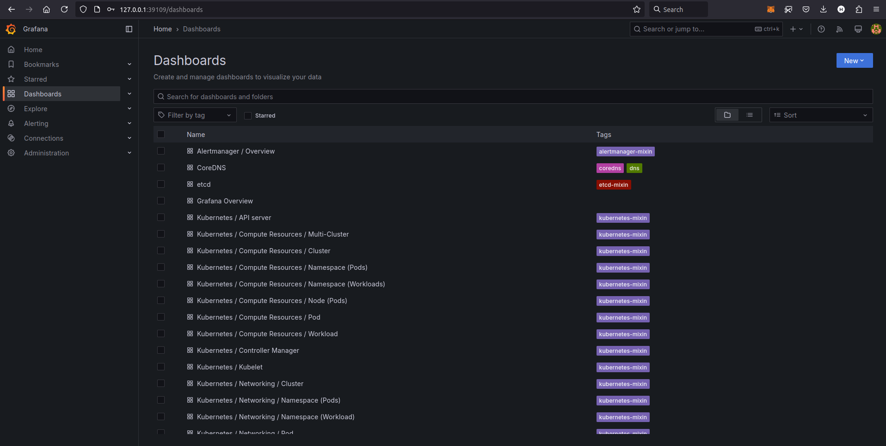
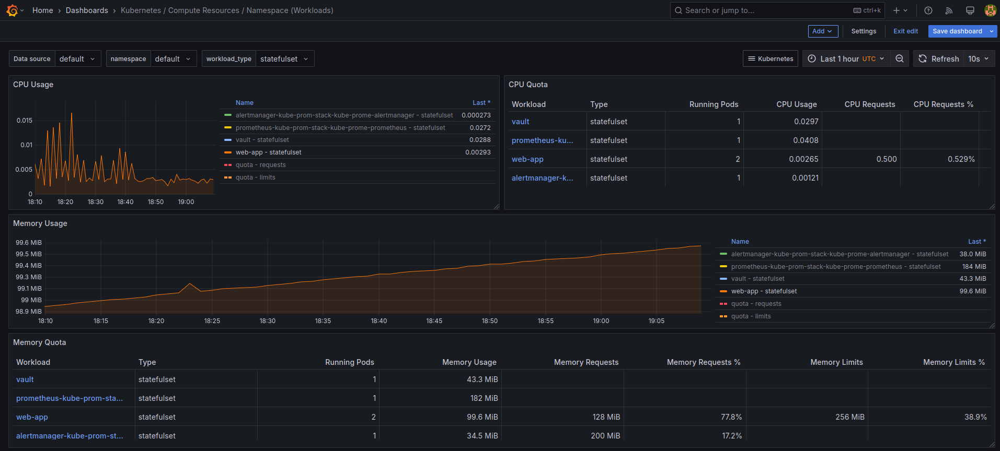
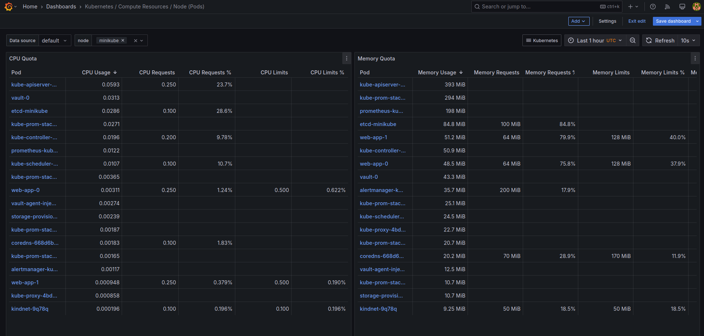
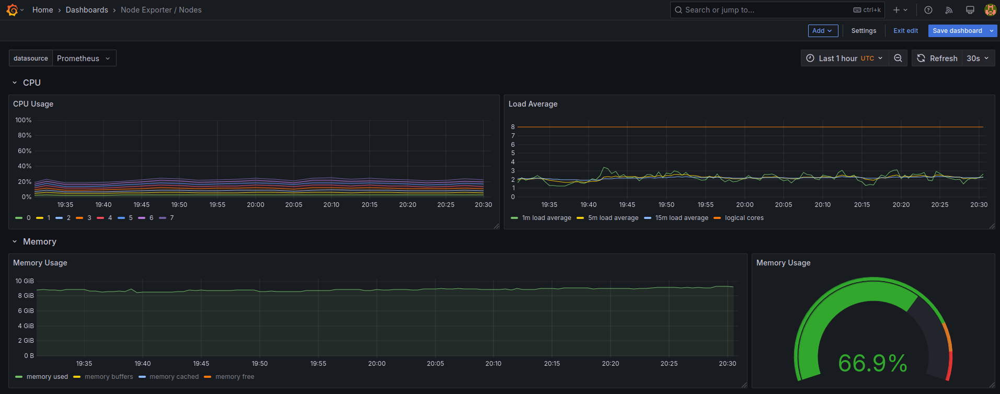
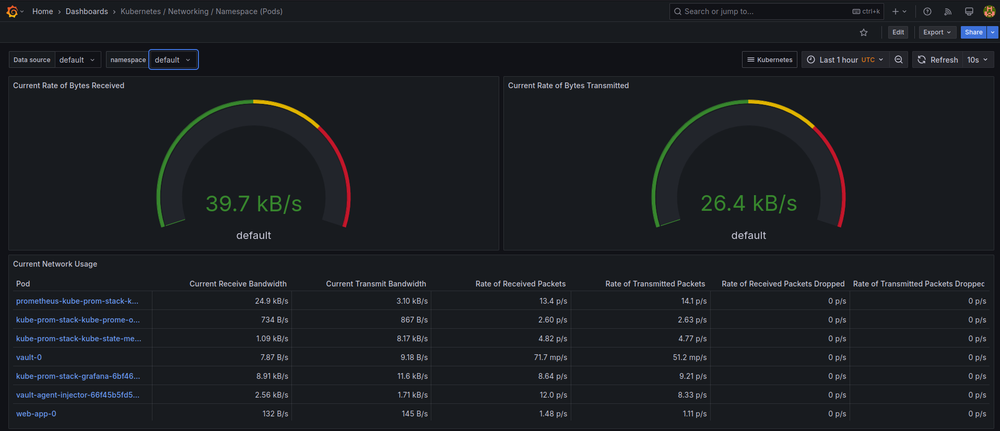
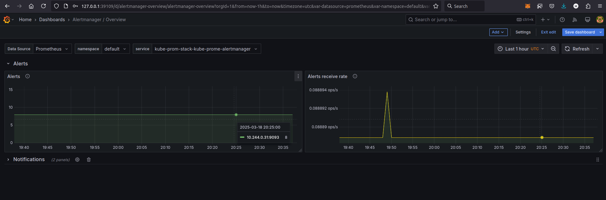
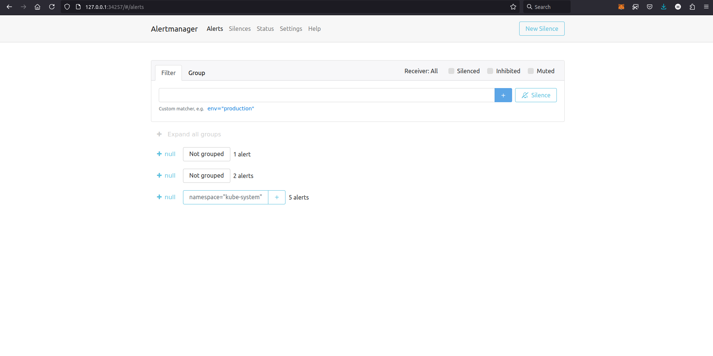

# Kubernetes Monitoring and Init Containers

## Overview

This document gives an overview over monitoring a Kubernetes Cluster using Prometheus and introduce the concept of Init Containers in Kubernetes

## Monitoring with Prometheus

### [Kube Prometheus Stack](https://github.com/prometheus-operator/kube-prometheus/blob/main/README.md#kube-prometheus)

- **[The Prometheus Operator](https://github.com/prometheus-operator/prometheus-operator):** The Prometheus Operator simplifies interacting, deploying and managing Prometheus and its components in a Kubernetes Cluster.
- **[Prometheus](https://prometheus.io/):** Prometheus is a tool used for system monitoring and alerting.
- **[Alert-manager](https://github.com/prometheus/alertmanager):** From its name, the alert-manager, manages alert sent to it from Prometheus.
- **[Node-exporter](https://github.com/prometheus/node_exporter):** The node-exporter is used to gather the metrics from the system and handles them to Prometheus, working as a metrics collector for Prometheus.
- **[Blackbox-exporter](https://github.com/prometheus/blackbox_exporter):** The blackbox-exporter is used to check and examine the system's endpoint using different protocols, like: (HTTP, HTTPS, DNS, TCP, ICMP and gRPC)
- **[Prometheus Adapter](https://github.com/kubernetes-sigs/prometheus-adapter):** The Prometheus Adapter works as a tool that helps with Horizontal Pod Autoscaling, by providing Kubernetes with the metrics gathered by Prometheus.
- **[Kubernetes State Metrics(KSM)](https://github.com/kubernetes/kube-state-metrics):** KSM is a tool that gathers information about the Kubernetes Cluster's objects like deployments, pods, ...
- **[Grafana](https://grafana.com/):** Grafana is tool used to visualize and organize the information collected by Prometheus.

### Installing the Kub Prometheus Stack Helm Chart

```bash
$ helm list
NAME           	NAMESPACE	REVISION	UPDATED                                	STATUS  	CHART                       	APP VERSION
kube-prom-stack	default  	1       	2025-03-18 20:04:52.899891851 +0300 MSK	deployed	kube-prometheus-stack-70.0.2	v0.81.0    
vault          	default  	1       	2025-03-18 18:15:04.053734728 +0300 MSK	deployed	vault-0.29.1                	1.18.1     
web-app        	default  	1       	2025-03-18 19:06:35.697854391 +0300 MSK	deployed	web-app-0.1.0               	1.16.0
```

```bash
$ kubectl get po,sts,svc,pvc,cm
NAME                                                         READY   STATUS    RESTARTS   AGE
pod/alertmanager-kube-prom-stack-kube-prome-alertmanager-0   2/2     Running   0          4m57s
pod/kube-prom-stack-grafana-6bf46ccdd6-xnqgs                 3/3     Running   0          4m58s
pod/kube-prom-stack-kube-prome-operator-667c7f7fbf-llx5b     1/1     Running   0          4m58s
pod/kube-prom-stack-kube-state-metrics-777fd8b75d-v4s48      1/1     Running   0          4m58s
pod/kube-prom-stack-prometheus-node-exporter-cksjx           1/1     Running   0          4m58s
pod/prometheus-kube-prom-stack-kube-prome-prometheus-0       2/2     Running   0          4m57s
pod/vault-0                                                  1/1     Running   1          114m
pod/vault-agent-injector-66f45b5fd5-nmkvz                    1/1     Running   1          114m
pod/web-app-0                                                2/2     Running   0          63m
pod/web-app-1                                                2/2     Running   0          63m

NAME                                                                    READY   AGE
statefulset.apps/alertmanager-kube-prom-stack-kube-prome-alertmanager   1/1     4m58s
statefulset.apps/prometheus-kube-prom-stack-kube-prome-prometheus       1/1     4m57s
statefulset.apps/vault                                                  1/1     114m
statefulset.apps/web-app                                                2/2     63m

NAME                                               TYPE        CLUSTER-IP       EXTERNAL-IP   PORT(S)                      AGE
service/alertmanager-operated                      ClusterIP   None             <none>        9093/TCP,9094/TCP,9094/UDP   4m58s
service/kube-prom-stack-grafana                    ClusterIP   10.96.95.254     <none>        80/TCP                       4m58s
service/kube-prom-stack-kube-prome-alertmanager    ClusterIP   10.102.44.166    <none>        9093/TCP,8080/TCP            4m58s
service/kube-prom-stack-kube-prome-operator        ClusterIP   10.111.219.242   <none>        443/TCP                      4m58s
service/kube-prom-stack-kube-prome-prometheus      ClusterIP   10.103.191.7     <none>        9090/TCP,8080/TCP            4m58s
service/kube-prom-stack-kube-state-metrics         ClusterIP   10.102.185.236   <none>        8080/TCP                     4m58s
service/kube-prom-stack-prometheus-node-exporter   ClusterIP   10.102.233.97    <none>        9100/TCP                     4m58s
service/kubernetes                                 ClusterIP   10.96.0.1        <none>        443/TCP                      128m
service/prometheus-operated                        ClusterIP   None             <none>        9090/TCP                     4m57s
service/vault                                      ClusterIP   10.108.161.22    <none>        8200/TCP,8201/TCP            114m
service/vault-agent-injector-svc                   ClusterIP   10.102.10.220    <none>        443/TCP                      114m
service/vault-internal                             ClusterIP   None             <none>        8200/TCP,8201/TCP            114m
service/web-app                                    ClusterIP   10.107.74.83     <none>        5000/TCP                     63m

NAME                                          STATUS   VOLUME                                     CAPACITY   ACCESS MODES   STORAGECLASS   VOLUMEATTRIBUTESCLASS   AGE
persistentvolumeclaim/web-app-vol-web-app-0   Bound    pvc-0042ff12-75fa-4518-8307-653b84c62b75   1Gi        RWO            standard       <unset>                 107m
persistentvolumeclaim/web-app-vol-web-app-1   Bound    pvc-251472ae-c503-40a2-9917-6db43f476958   1Gi        RWO            standard       <unset>                 104m

NAME                                                                     DATA   AGE
configmap/kube-prom-stack-grafana                                        1      4m58s
configmap/kube-prom-stack-grafana-config-dashboards                      1      4m58s
configmap/kube-prom-stack-kube-prome-alertmanager-overview               1      4m58s
configmap/kube-prom-stack-kube-prome-apiserver                           1      4m58s
configmap/kube-prom-stack-kube-prome-cluster-total                       1      4m58s
configmap/kube-prom-stack-kube-prome-controller-manager                  1      4m58s
configmap/kube-prom-stack-kube-prome-etcd                                1      4m58s
configmap/kube-prom-stack-kube-prome-grafana-datasource                  1      4m58s
configmap/kube-prom-stack-kube-prome-grafana-overview                    1      4m58s
configmap/kube-prom-stack-kube-prome-k8s-coredns                         1      4m58s
configmap/kube-prom-stack-kube-prome-k8s-resources-cluster               1      4m58s
configmap/kube-prom-stack-kube-prome-k8s-resources-multicluster          1      4m58s
configmap/kube-prom-stack-kube-prome-k8s-resources-namespace             1      4m58s
configmap/kube-prom-stack-kube-prome-k8s-resources-node                  1      4m58s
configmap/kube-prom-stack-kube-prome-k8s-resources-pod                   1      4m58s
configmap/kube-prom-stack-kube-prome-k8s-resources-workload              1      4m58s
configmap/kube-prom-stack-kube-prome-k8s-resources-workloads-namespace   1      4m58s
configmap/kube-prom-stack-kube-prome-kubelet                             1      4m58s
configmap/kube-prom-stack-kube-prome-namespace-by-pod                    1      4m58s
configmap/kube-prom-stack-kube-prome-namespace-by-workload               1      4m58s
configmap/kube-prom-stack-kube-prome-node-cluster-rsrc-use               1      4m58s
configmap/kube-prom-stack-kube-prome-node-rsrc-use                       1      4m58s
configmap/kube-prom-stack-kube-prome-nodes                               1      4m58s
configmap/kube-prom-stack-kube-prome-nodes-aix                           1      4m58s
configmap/kube-prom-stack-kube-prome-nodes-darwin                        1      4m58s
configmap/kube-prom-stack-kube-prome-persistentvolumesusage              1      4m58s
configmap/kube-prom-stack-kube-prome-pod-total                           1      4m58s
configmap/kube-prom-stack-kube-prome-prometheus                          1      4m58s
configmap/kube-prom-stack-kube-prome-proxy                               1      4m58s
configmap/kube-prom-stack-kube-prome-scheduler                           1      4m58s
configmap/kube-prom-stack-kube-prome-workload-total                      1      4m58s
configmap/kube-root-ca.crt                                               1      128m
configmap/prometheus-kube-prom-stack-kube-prome-prometheus-rulefiles-0   35     4m57s
configmap/web-app-config                                                 1      63m
```

Output explanation:
- First section (`Pods`):
    - Here we see the running pods in the cluster in the default namespace.
    - The first 6 pods are for the **kube-prom-stack** helm chart that we downloaded. Then we have 2 pods for the **vault** and the last 2 pods are replicas for the **web-app**.
- Second section (`StatefulSets`):
    - Here we have the stateful applications in our cluster.
- Third section (`Services`):
    - Here we have the services that helps with exposing the pods in our cluster for internal use with other pods, or external users outside of the cluster.
    - In the list we can see services to for the **kube-prom-stack**, **vault** and our **web-app**.
- Fourth section (`PersistentVolumeClaims`):
    - The `pvc` is a list of the storage resources that we created for our StatefulSet app in the previous lab.
- Fifth section (`ConfigMaps`):
    - Here we can see all the ConfigMaps used to help configure the pods.

### Grafana Dashboard

```bash
$ minikube service kube-prom-stack-grafana
|-----------|-------------------------|-------------|--------------|
| NAMESPACE |          NAME           | TARGET PORT |     URL      |
|-----------|-------------------------|-------------|--------------|
| default   | kube-prom-stack-grafana |             | No node port |
|-----------|-------------------------|-------------|--------------|
😿  service default/kube-prom-stack-grafana has no node port
❗  Services [default/kube-prom-stack-grafana] have type "ClusterIP" not meant to be exposed, however for local development minikube allows you to access this !
🏃  Starting tunnel for service kube-prom-stack-grafana.
|-----------|-------------------------|-------------|------------------------|
| NAMESPACE |          NAME           | TARGET PORT |          URL           |
|-----------|-------------------------|-------------|------------------------|
| default   | kube-prom-stack-grafana |             | http://127.0.0.1:39109 |
|-----------|-------------------------|-------------|------------------------|
🎉  Opening service default/kube-prom-stack-grafana in default browser...
❗  Because you are using a Docker driver on linux, the terminal needs to be open to run it.
```
To get the password for the admin user in Grafana, we can check the notes:
```bash
$ helm get notes kube-prom-stack
```



#### Exploring the Dashboard:
1. CPU & Memory Consumption of the **web-app** StatefulSet:

    

2. Pods CPU & Memory Consumption:

    

    In this image I order the pods from higher to lower when it comes to CPU and Memory usage.

3. Node Memory Usage:

    

4. Number of pods & containers:

    

    From the image we can see that we have 18 running pods and 29 running containers

5. Pods Network Usage:

    

6. The Number of Active Alerts:

    

    Alert Manager Web UI:

    

## Init Containers

The implementation for the Init Container can be found in the `values.yaml`.

Proof of that the Init Container downloaded the file:

```bash
$ kubectl exec pod/web-app-0 -- cat /init-container-vol/index.html
Defaulted container "web-app" out of: web-app, vault-agent, init-container (init), vault-agent-init (init)
<!doctype html>
<html>
<head>
    <title>Example Domain</title>

    <meta charset="utf-8" />
    <meta http-equiv="Content-type" content="text/html; charset=utf-8" />
    <meta name="viewport" content="width=device-width, initial-scale=1" />
    <style type="text/css">
    body {
        background-color: #f0f0f2;
        margin: 0;
        padding: 0;
        font-family: -apple-system, system-ui, BlinkMacSystemFont, "Segoe UI", "Open Sans", "Helvetica Neue", Helvetica, Arial, sans-serif;
        
    }
    div {
        width: 600px;
        margin: 5em auto;
        padding: 2em;
        background-color: #fdfdff;
        border-radius: 0.5em;
        box-shadow: 2px 3px 7px 2px rgba(0,0,0,0.02);
    }
    a:link, a:visited {
        color: #38488f;
        text-decoration: none;
    }
    @media (max-width: 700px) {
        div {
            margin: 0 auto;
            width: auto;
        }
    }
    </style>    
</head>

<body>
<div>
    <h1>Example Domain</h1>
    <p>This domain is for use in illustrative examples in documents. You may use this
    domain in literature without prior coordination or asking for permission.</p>
    <p><a href="https://www.iana.org/domains/example">More information...</a></p>
</div>
</body>
</html>
```
