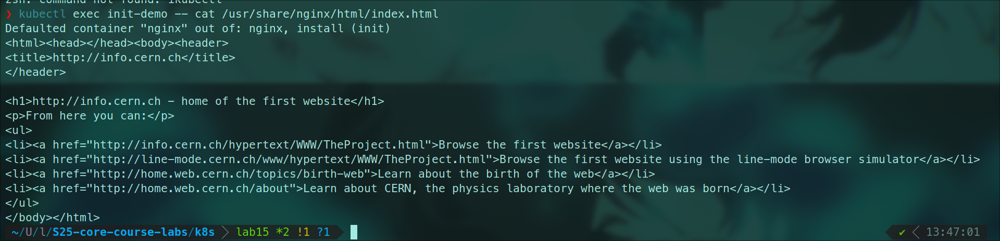
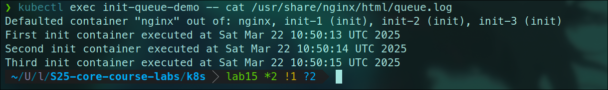

# Lab 15: Kubernetes Monitoring with Prometheus Stack

## Components of Kube Prometheus Stack

### Core Components

1. **Prometheus**
   - Main monitoring system that collects and stores metrics
   - Uses PromQL for querying and supports alerting

2. **Grafana**
   - Visualization platform for metrics with customizable dashboards
   - Supports multiple data sources and alerting

3. **Alertmanager**
   - Handles alerts from Prometheus
   - Manages notifications and alert grouping

4. **Node Exporter**
   - Collects hardware and OS metrics from nodes
   - Monitors CPU, memory, disk, and network stats

5. **Kube State Metrics**
   - Generates metrics about Kubernetes objects
   - Monitors deployments, pods, and cluster resources

6. **Prometheus Operator**
   - Manages Prometheus deployments and configuration
   - Automates monitoring setup in Kubernetes

## Installation Steps

### 1. Starting Minikube
```bash
minikube start --driver=docker --container-runtime=containerd
```

### 2. Installing Kube Prometheus Stack
```bash
helm repo add prometheus-community https://prometheus-community.github.io/helm-charts
helm repo update
kubectl create namespace monitoring
helm install monitoring prometheus-community/kube-prometheus-stack --version 57.2.0 --namespace monitoring
```

### 3. Installing Application Helm Chart
```bash
helm install my-app ./your-app
```

### 4. Cluster State Analysis

Current state of cluster resources:
```bash
❯ kubectl get po,sts,svc,pvc,cm
NAME                    READY   STATUS    RESTARTS   AGE
pod/my-app-your-app-0   1/1     Running   0          3m24s
pod/my-app-your-app-1   1/1     Running   0          3m9s

NAME                               READY   AGE
statefulset.apps/my-app-your-app   2/2     3m24s

NAME                      TYPE        CLUSTER-IP       EXTERNAL-IP   PORT(S)   AGE
service/kubernetes        ClusterIP   10.96.0.1        <none>        443/TCP   8m59s
service/my-app-your-app   ClusterIP   10.109.250.240   <none>        80/TCP    3m24s

NAME                                           STATUS   VOLUME                                     CAPACITY   ACCESS MODES   STORAGECLASS   VOLUMEATTRIBUTESCLASS   AGE
persistentvolumeclaim/data-my-app-your-app-0   Bound    pvc-4c0143db-03a4-4489-947b-94934dbb7ea5   1Gi        RWO            standard       <unset>                 3m24s
persistentvolumeclaim/data-my-app-your-app-1   Bound    pvc-87ecefe2-3841-4d37-904e-93f004091ee3   1Gi        RWO            standard       <unset>                 3m9s

NAME                               DATA   AGE
configmap/kube-root-ca.crt         1      8m54s
configmap/my-app-your-app-config   1      3m24s
```

## Grafana Dashboard Analysis

1) Check CPU and Memory consumption of your StatefulSet.


2) Identify Pods with higher and lower CPU usage in the default namespace.


3) Monitor node memory usage in percentage and megabytes.


4) Count the number of pods and containers managed by the Kubelet service.
16.


5) Evaluate network usage of Pods in the default namespace.


6) Determine the number of active alerts; also check the Web UI with minikube service monitoring-kube-prometheus-alertmanager.

8 alerts


5 alerts


## Init Container Implementation

Basic init container that downloads CERN's first webpage:
```yaml
apiVersion: v1
kind: Pod
metadata:
  name: init-demo
spec:
  containers:
  - name: nginx
    image: nginx
    ports:
    - containerPort: 80
    volumeMounts:
    - name: workdir
      mountPath: /usr/share/nginx/html
  initContainers:
  - name: install
    image: busybox:1.28
    command:
    - wget
    - "-O"
    - "/work-dir/index.html"
    - http://info.cern.ch
    volumeMounts:
    - name: workdir
      mountPath: "/work-dir"
  dnsPolicy: Default
  volumes:
  - name: workdir
    emptyDir: {}
```

Proof of successful download:


## Bonus Tasks

### 1. Init Container Queue

Created three init containers that write timestamps sequentially:
```yaml
apiVersion: v1
kind: Pod
metadata:
  name: init-queue-demo
spec:
  containers:
  - name: nginx
    image: nginx
    ports:
    - containerPort: 80
    volumeMounts:
    - name: workdir
      mountPath: /usr/share/nginx/html
  initContainers:
  - name: init-1
    image: busybox:1.28
    command: ['sh', '-c', 'echo "First init container executed at $(date)" >> /work-dir/queue.log']
    volumeMounts:
    - name: workdir
      mountPath: "/work-dir"
  - name: init-2
    image: busybox:1.28
    command: ['sh', '-c', 'echo "Second init container executed at $(date)" >> /work-dir/queue.log']
    volumeMounts:
    - name: workdir
      mountPath: "/work-dir"
  - name: init-3
    image: busybox:1.28
    command: ['sh', '-c', 'echo "Third init container executed at $(date)" >> /work-dir/queue.log']
    volumeMounts:
    - name: workdir
      mountPath: "/work-dir"
  volumes:
  - name: workdir
    emptyDir: {}
```

Proof of sequential execution:


