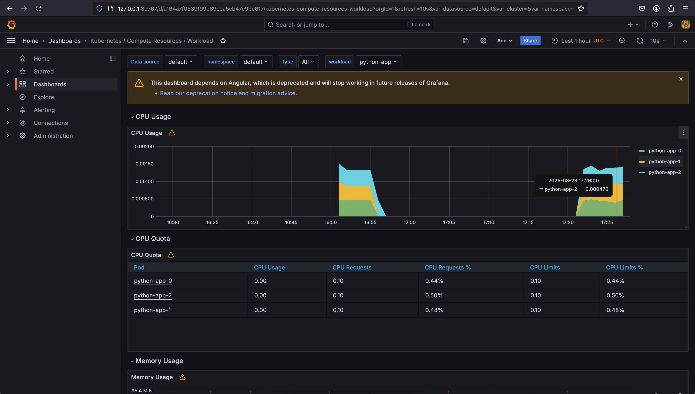
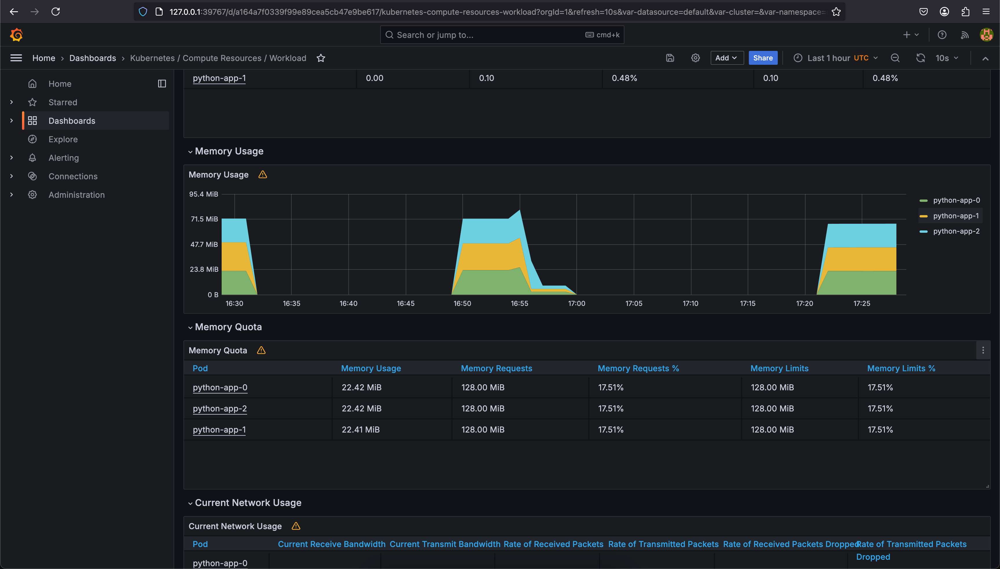
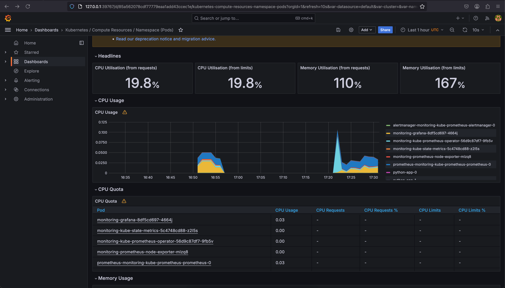
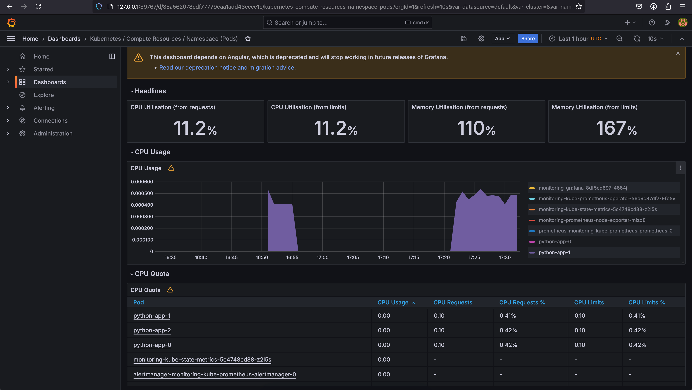
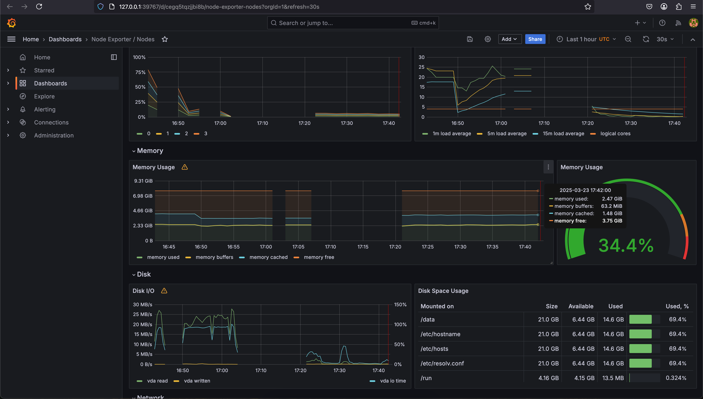
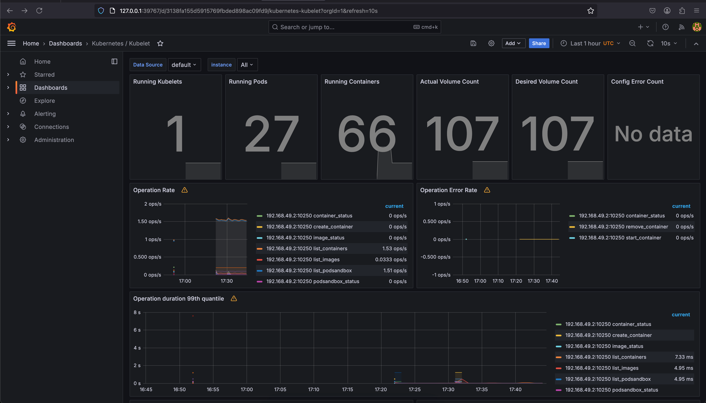
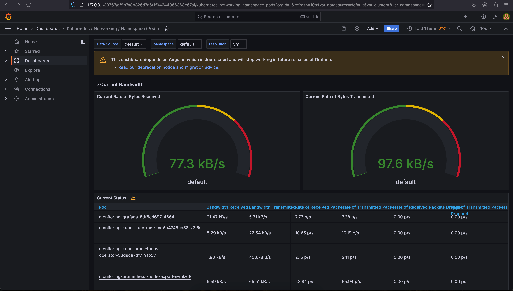
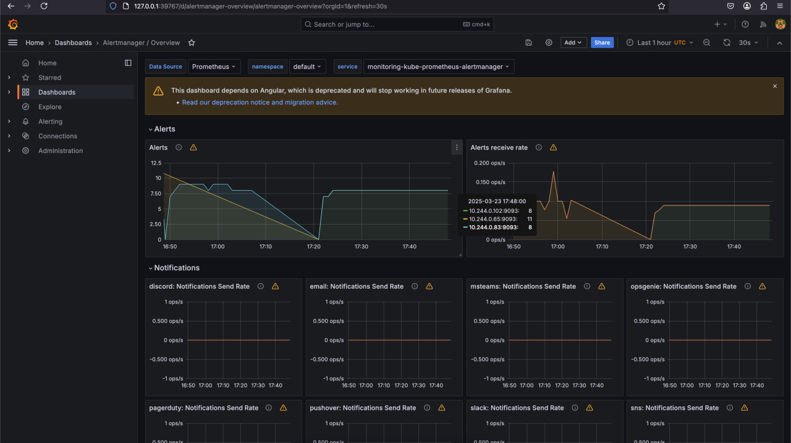
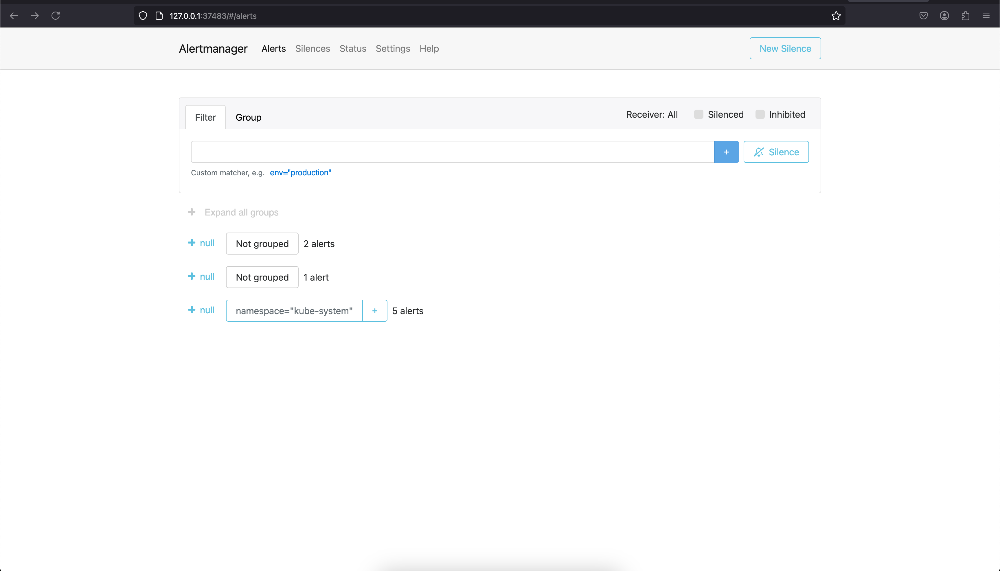

# Task 1

## Kube Prometheus Stack

### Prometheus
Prometheus is a central time-series database and monitoring system. It collects metrics from configured targets at given intervals, evaluates rule expressions, displays results, and can trigger alerts when specified conditions are observed. In the Kube Prometheus Stack, it specifically targets Kubernetes resources and provides insights into cluster performance.

### Alertmanager
Alertmanager handles alerts sent by Prometheus. It takes care of deduplicating, grouping, and routing alerts to the correct receiver (like email or Slack). It also handles silencing and inhibition of alerts to reduce noise during maintenance or when certain conditions are met.

### Grafana
Grafana provides visualization for the metrics collected by Prometheus. In the Kube Prometheus Stack, Grafana comes pre-configured with dashboards for monitoring Kubernetes resources.

### Node Exporter
Node Exporter is a Prometheus exporter that collects hardware and OS metrics from the nodes in your Kubernetes cluster. It provides information about CPU, memory, disk, and network usage at the node level.

### kube-state-metrics
Listens to the Kubernetes API server and generates metrics about the state of various Kubernetes objects like deployments, nodes, and pods.

### Prometheus Operator
The Prometheus Operator provides Kubernetes-native deployment and management of Prometheus and related monitoring components. It simplifies the deployment and configuration of Prometheus, Alertmanager, and related components using custom resource definitions.

## Output of `kubectl get po,sts,svc,pvc,cm`:

```bash
ubuntu@fhmhd8tturtcnb6bcjnt:~/S25-DevOps-labs$ kubectl get po,sts,svc,pvc,cm
NAME                                                         READY   STATUS    RESTARTS        AGE
pod/alertmanager-monitoring-kube-prometheus-alertmanager-0   2/2     Running   2 (2m18s ago)   24m
pod/monitoring-grafana-8df5cd697-4664j                       2/3     Running   4 (2m18s ago)   24m
pod/monitoring-kube-prometheus-operator-56d9c87df7-9fb5v     1/1     Running   2 (38s ago)     24m
pod/monitoring-kube-state-metrics-5c4748cd88-z2l5s           1/1     Running   2 (45s ago)     24m
pod/monitoring-prometheus-node-exporter-mlzq8                1/1     Running   3 (2m18s ago)   24m
pod/prometheus-monitoring-kube-prometheus-prometheus-0       2/2     Running   3 (2m18s ago)   24m
pod/python-app-0                                             1/1     Running   3 (2m18s ago)   6d19h
pod/python-app-1                                             1/1     Running   2 (2m18s ago)   6d19h
pod/python-app-2                                             1/1     Running   3 (2m18s ago)   6d19h

NAME                                                                    READY   AGE
statefulset.apps/alertmanager-monitoring-kube-prometheus-alertmanager   1/1     24m
statefulset.apps/prometheus-monitoring-kube-prometheus-prometheus       1/1     24m
statefulset.apps/python-app                                             3/3     6d19h

NAME                                              TYPE           CLUSTER-IP       EXTERNAL-IP   PORT(S)                      AGE
service/alertmanager-operated                     ClusterIP      None             <none>        9093/TCP,9094/TCP,9094/UDP   24m
service/kubernetes                                ClusterIP      10.96.0.1        <none>        443/TCP                      6d19h
service/monitoring-grafana                        ClusterIP      10.107.36.77     <none>        80/TCP                       24m
service/monitoring-kube-prometheus-alertmanager   ClusterIP      10.109.200.124   <none>        9093/TCP,8080/TCP            24m
service/monitoring-kube-prometheus-operator       ClusterIP      10.111.99.191    <none>        443/TCP                      24m
service/monitoring-kube-prometheus-prometheus     ClusterIP      10.109.166.4     <none>        9090/TCP,8080/TCP            24m
service/monitoring-kube-state-metrics             ClusterIP      10.107.113.35    <none>        8080/TCP                     24m
service/monitoring-prometheus-node-exporter       ClusterIP      10.108.190.54    <none>        9100/TCP                     24m
service/prometheus-operated                       ClusterIP      None             <none>        9090/TCP                     24m
service/python-app                                LoadBalancer   10.109.84.180    <pending>     8080:30238/TCP               6d19h

NAME                                      STATUS   VOLUME                                     CAPACITY   ACCESS MODES   STORAGECLASS   VOLUMEATTRIBUTESCLASS   AGE
persistentvolumeclaim/data-python-app-0   Bound    pvc-764da364-c71b-4911-b301-2d5f6bb77f47   1Gi        RWO            standard       <unset>                 6d19h
persistentvolumeclaim/data-python-app-1   Bound    pvc-75daa5cf-ab2e-454c-b08c-cb8294164b42   1Gi        RWO            standard       <unset>                 6d19h
persistentvolumeclaim/data-python-app-2   Bound    pvc-e450df77-6bcc-4e8e-836f-ba9351e8ba69   1Gi        RWO            standard       <unset>                 6d19h

NAME                                                                     DATA   AGE
configmap/kube-root-ca.crt                                               1      9d
configmap/monitoring-grafana                                             1      24m
configmap/monitoring-grafana-config-dashboards                           1      24m
configmap/monitoring-kube-prometheus-alertmanager-overview               1      24m
configmap/monitoring-kube-prometheus-apiserver                           1      24m
configmap/monitoring-kube-prometheus-cluster-total                       1      24m
configmap/monitoring-kube-prometheus-controller-manager                  1      24m
configmap/monitoring-kube-prometheus-etcd                                1      24m
configmap/monitoring-kube-prometheus-grafana-datasource                  1      24m
configmap/monitoring-kube-prometheus-grafana-overview                    1      24m
configmap/monitoring-kube-prometheus-k8s-coredns                         1      24m
configmap/monitoring-kube-prometheus-k8s-resources-cluster               1      24m
configmap/monitoring-kube-prometheus-k8s-resources-multicluster          1      24m
configmap/monitoring-kube-prometheus-k8s-resources-namespace             1      24m
configmap/monitoring-kube-prometheus-k8s-resources-node                  1      24m
configmap/monitoring-kube-prometheus-k8s-resources-pod                   1      24m
configmap/monitoring-kube-prometheus-k8s-resources-workload              1      24m
configmap/monitoring-kube-prometheus-k8s-resources-workloads-namespace   1      24m
configmap/monitoring-kube-prometheus-kubelet                             1      24m
configmap/monitoring-kube-prometheus-namespace-by-pod                    1      24m
configmap/monitoring-kube-prometheus-namespace-by-workload               1      24m
configmap/monitoring-kube-prometheus-node-cluster-rsrc-use               1      24m
configmap/monitoring-kube-prometheus-node-rsrc-use                       1      24m
configmap/monitoring-kube-prometheus-nodes                               1      24m
configmap/monitoring-kube-prometheus-nodes-darwin                        1      24m
configmap/monitoring-kube-prometheus-persistentvolumesusage              1      24m
configmap/monitoring-kube-prometheus-pod-total                           1      24m
configmap/monitoring-kube-prometheus-prometheus                          1      24m
configmap/monitoring-kube-prometheus-proxy                               1      24m
configmap/monitoring-kube-prometheus-scheduler                           1      24m
configmap/monitoring-kube-prometheus-workload-total                      1      24m
configmap/prometheus-monitoring-kube-prometheus-prometheus-rulefiles-0   35     24m
configmap/test-config                                                    1      6d19h
```

## Grafana observations

1. **CPU and Memory consumption of StatefulSet**:
   - CPU usage: almost 0
   - Memory usage: 67.25 MiB





2. **Pods with higher and lower CPU usage in the default namespace**:
   - Higher CPU usage: monitoring-grafana-8df5cd697-4664j 0.03
   - Lower CPU usage: python-app-1 almost 0





3. **Node memory usage**:
   - Percentage: 34.4%
   - Megabytes: 2.47 GiB



4. **Number of pods and containers managed by Kubelet**:
   - Pods: 27
   - Containers: 66



5. **Network usage of Pods in the default namespace**:
   - Bytes recieved: 77.3 kB/s
   - Bytes transmitted: 97.6 kB/s



6. **Number of active alerts**:
   - Count from Grafana: 27
   - AlertManager UI: 8





# Task 2

```bash
ubuntu@fhmhd8tturtcnb6bcjnt:~/S25-DevOps-labs/k8s$ kubectl apply -f init-container-example.yaml 
statefulset.apps/demo created

ubuntu@fhmhd8tturtcnb6bcjnt:~/S25-DevOps-labs/k8s$ kubectl get po
NAME                                                     READY   STATUS    RESTARTS      AGE
alertmanager-monitoring-kube-prometheus-alertmanager-0   2/2     Running   4 (60m ago)   115m
demo-0                                                   1/1     Running   0             23s
monitoring-grafana-8df5cd697-4664j                       3/3     Running   9 (60m ago)   115m
monitoring-kube-prometheus-operator-56d9c87df7-9fb5v     1/1     Running   4 (59m ago)   115m
monitoring-kube-state-metrics-5c4748cd88-z2l5s           1/1     Running   4             115m
monitoring-prometheus-node-exporter-mlzq8                1/1     Running   5 (60m ago)   115m
prometheus-monitoring-kube-prometheus-prometheus-0       2/2     Running   5 (60m ago)   115m
python-app-0                                             1/1     Running   5 (60m ago)   6d21h
python-app-1                                             1/1     Running   4 (60m ago)   6d21h
python-app-2                                             1/1     Running   5 (60m ago)   6d21h

ubuntu@fhmhd8tturtcnb6bcjnt:~/S25-DevOps-labs/k8s$ kubectl exec pod/demo-0 -- cat /data/test.html
Defaulted container "main-container" out of: main-container, init-download (init)
<html><head></head><body><header>
<title>http://info.cern.ch</title>
</header>

<h1>http://info.cern.ch - home of the first website</h1>
<p>From here you can:</p>
<ul>
<li><a href="http://info.cern.ch/hypertext/WWW/TheProject.html">Browse the first website</a></li>
<li><a href="http://line-mode.cern.ch/www/hypertext/WWW/TheProject.html">Browse the first website using the line-mode browser simulator</a></li>
<li><a href="http://home.web.cern.ch/topics/birth-web">Learn about the birth of the web</a></li>
<li><a href="http://home.web.cern.ch/about">Learn about CERN, the physics laboratory where the web was born</a></li>
</ul>
</body></html>
```
