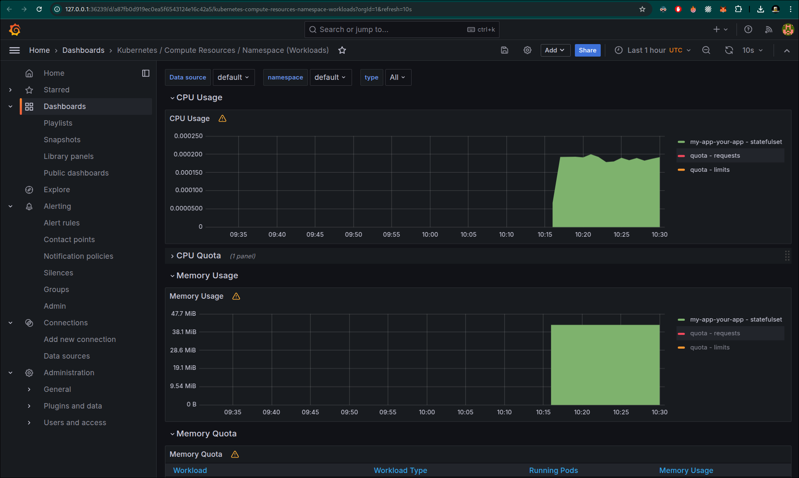
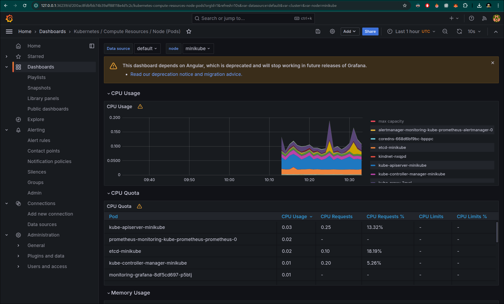
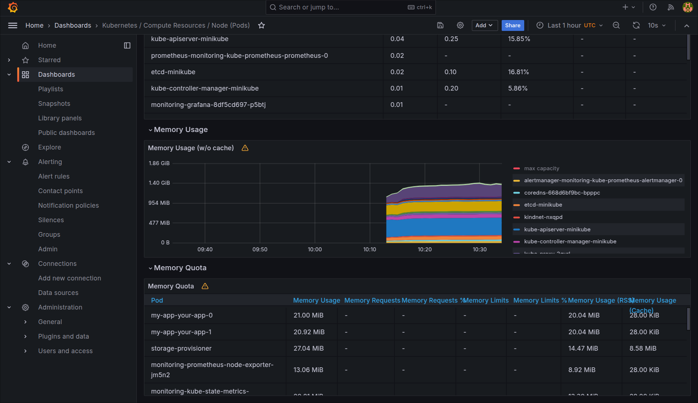
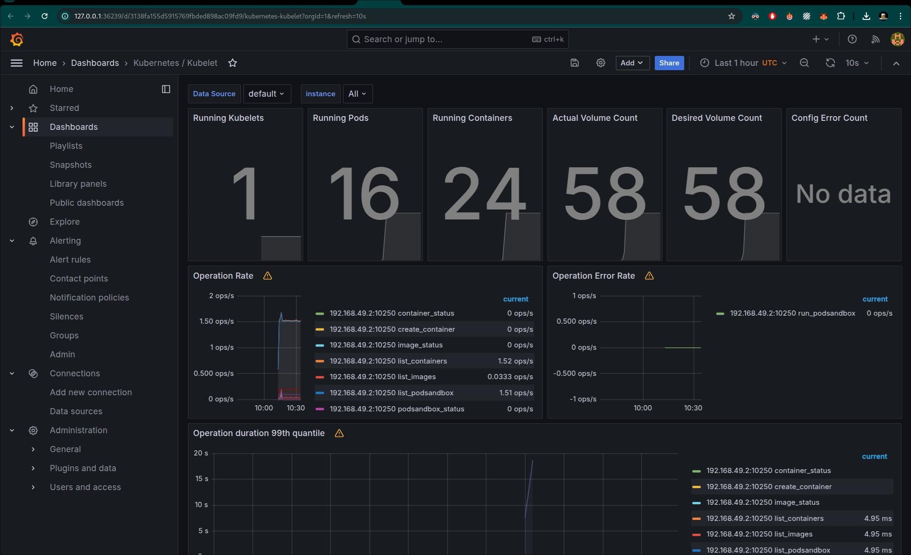
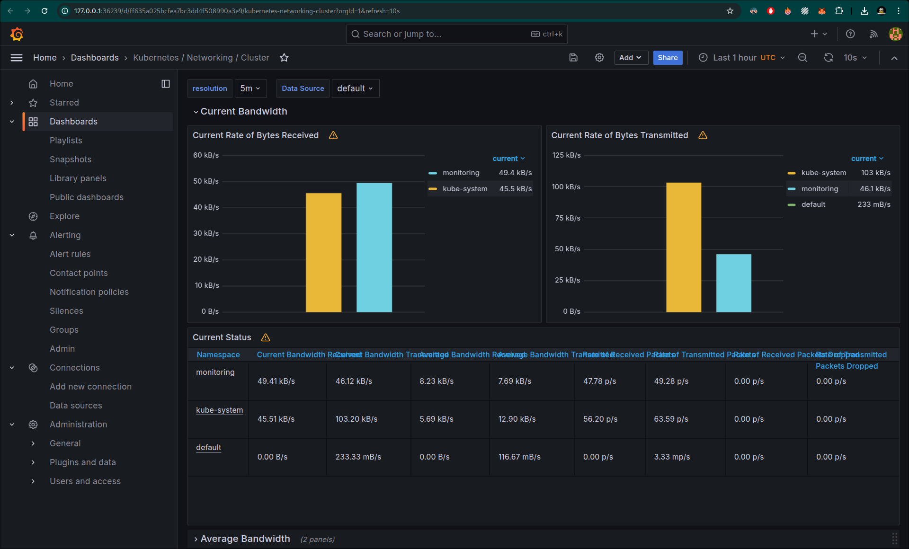
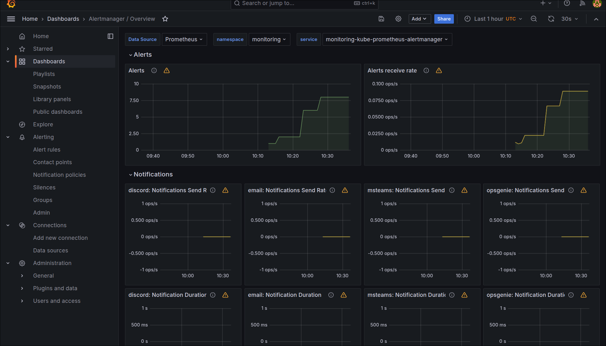
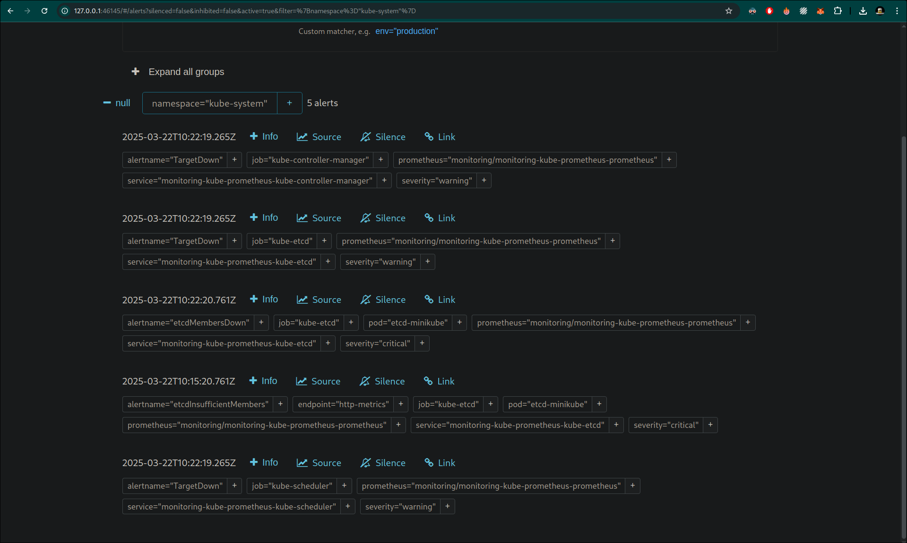

# Lab 15: Kubernetes Monitoring with Prometheus Stack

## Components of Kube Prometheus Stack

### Core Components

1. **Prometheus**
   - Primary time-series database and monitoring system
   - Uses a pull-based model to collect metrics from targets
   - Implements PromQL (Prometheus Query Language) for flexible data querying
   - Handles service discovery to automatically find and monitor new services
   - Stores metrics with timestamps for historical analysis
   - Supports alerting based on metric thresholds

2. **Grafana**
   - Advanced visualization platform for metrics and logs
   - Provides customizable dashboards with multiple panel types
   - Supports various data sources including Prometheus
   - Features built-in alerting system
   - Allows template variables for dynamic dashboards
   - Includes user authentication and authorization

3. **Alertmanager**
   - Centralizes alert handling and notification
   - Groups similar alerts to reduce notification noise
   - Implements deduplication to prevent alert spam
   - Supports multiple notification channels (email, Slack, etc.)
   - Provides silencing and inhibition mechanisms
   - Handles alert routing based on labels

4. **Node Exporter**
   - Collects hardware and OS-level metrics
   - Monitors CPU, memory, disk I/O, and network statistics
   - Exposes filesystem metrics and disk usage
   - Tracks system load and process statistics
   - Provides network interface metrics
   - Monitors system uptime and performance

5. **Kube State Metrics**
   - Generates metrics about Kubernetes object states
   - Monitors deployments, pods, and services
   - Tracks resource quotas and limits
   - Provides metrics about node status
   - Monitors PersistentVolumes and claims
   - Tracks job and cronjob statistics

6. **Prometheus Operator**
   - Automates Prometheus deployment and configuration
   - Manages the lifecycle of Prometheus instances
   - Handles service monitor configuration
   - Automates alert rules management
   - Simplifies Prometheus configuration updates
   - Ensures high availability setup

## Installation Steps

### 1. Starting Minikube
```bash
minikube start --driver=docker --container-runtime=containerd
```

### 2. Installing Kube Prometheus Stack
```bash
# Add Prometheus community repository
helm repo add prometheus-community https://prometheus-community.github.io/helm-charts
helm repo update

# Create monitoring namespace
kubectl create namespace monitoring

# Install Prometheus Stack
helm install monitoring prometheus-community/kube-prometheus-stack --version 57.2.0 --namespace monitoring
```

### 3. Installing Application Helm Chart
```bash
# Install the application
helm install my-app ./your-app
```

### 4. Cluster State Analysis

```bash
❯ kubectl get po,sts,svc,pvc,cm

NAME                    READY   STATUS    RESTARTS   AGE
pod/my-app-your-app-0   1/1     Running   0          3m24s
pod/my-app-your-app-1   1/1     Running   0          3m9s

NAME                               READY   AGE
statefulset.apps/my-app-your-app   2/2     3m24s

NAME                      TYPE        CLUSTER-IP       EXTERNAL-IP   PORT(S)   AGE
service/kubernetes        ClusterIP   10.96.0.1        <none>        443/TCP   8m59s
service/my-app-your-app   ClusterIP   10.109.250.240   <none>        80/TCP    3m24s

NAME                                           STATUS   VOLUME                                     CAPACITY   ACCESS MODES   STORAGECLASS   VOLUMEATTRIBUTESCLASS   AGE
persistentvolumeclaim/data-my-app-your-app-0   Bound    pvc-4c0143db-03a4-4489-947b-94934dbb7ea5   1Gi        RWO            standard       <unset>                 3m24s
persistentvolumeclaim/data-my-app-your-app-1   Bound    pvc-87ecefe2-3841-4d37-904e-93f004091ee3   1Gi        RWO            standard       <unset>                 3m9s

NAME                               DATA   AGE
configmap/kube-root-ca.crt         1      8m54s
configmap/my-app-your-app-config   1      3m24s
```

## Grafana Dashboard Analysis

1) Check CPU and Memory consumption of your StatefulSet.


2) Identify Pods with higher and lower CPU usage in the default namespace.



3) Monitor node memory usage in percentage and megabytes.


4) Count the number of pods and containers managed by the Kubelet service.
16.


5) Evaluate network usage of Pods in the default namespace.



6) Determine the number of active alerts; also check the Web UI with minikube service monitoring-kube-prometheus-alertmanager.

8 alerts


5 alerts



