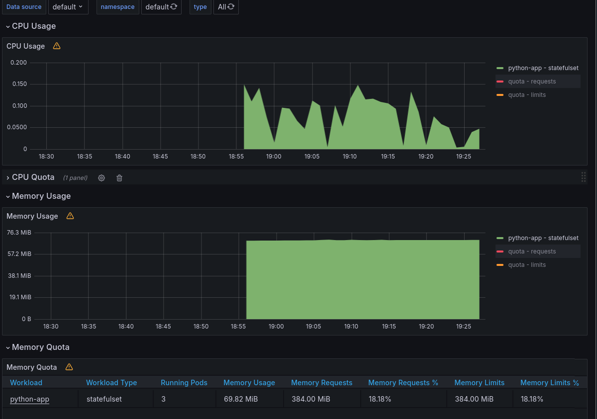
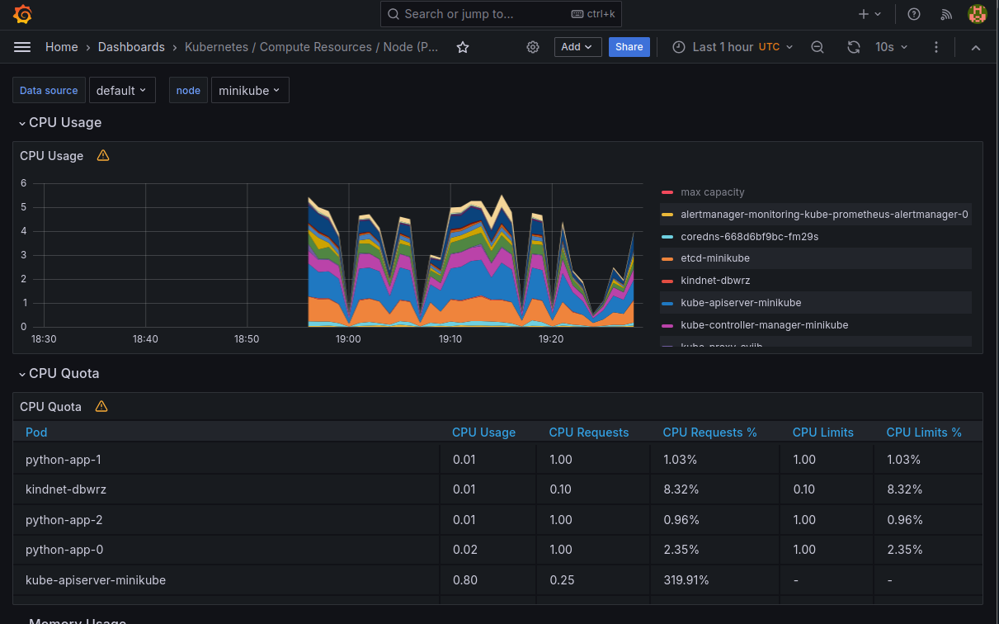
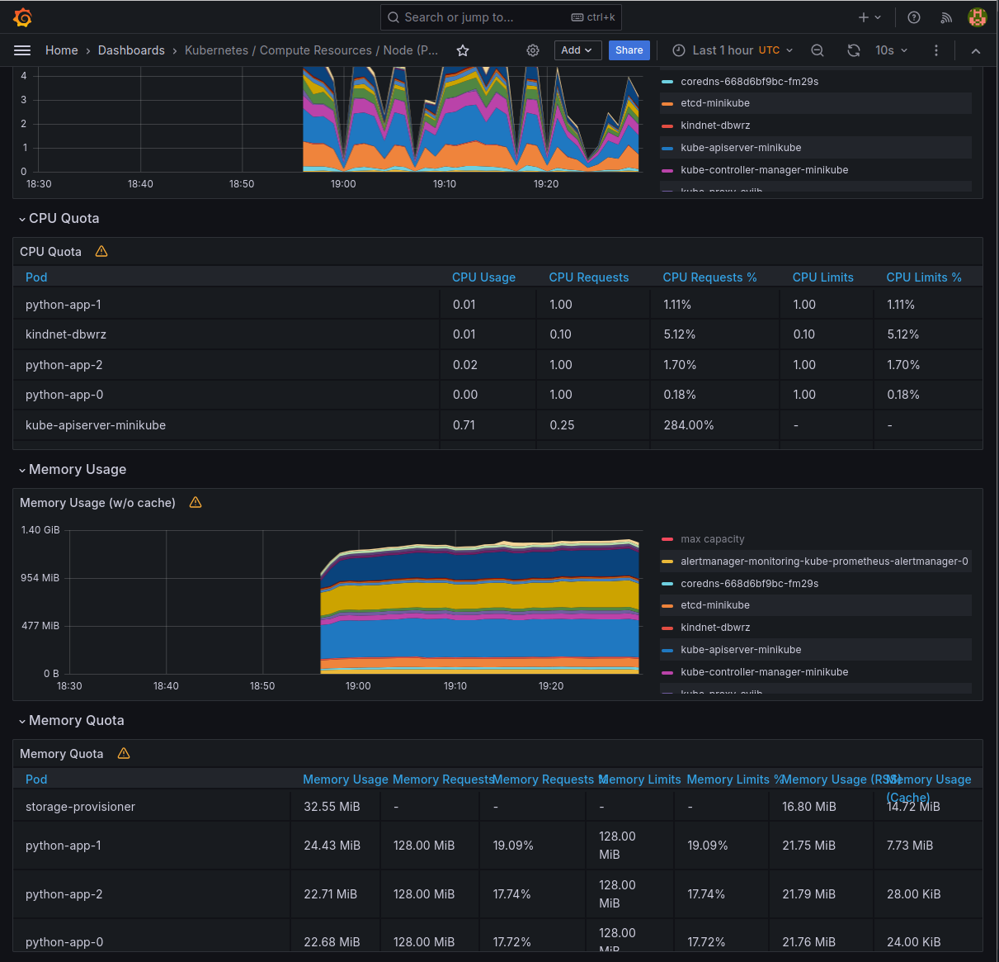
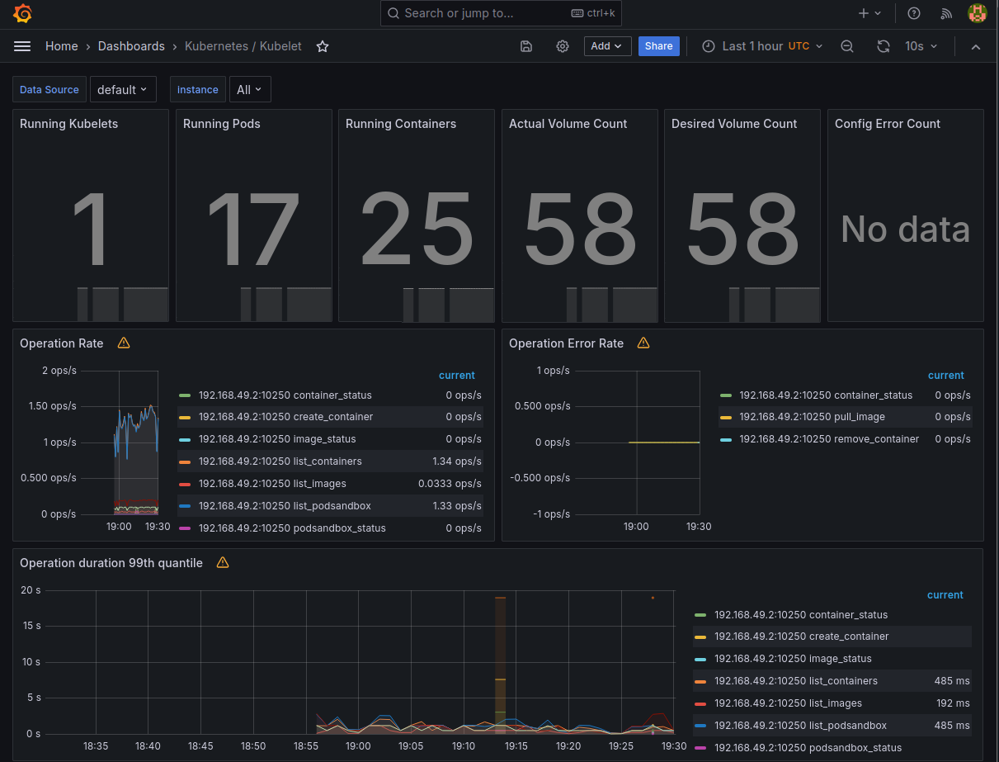
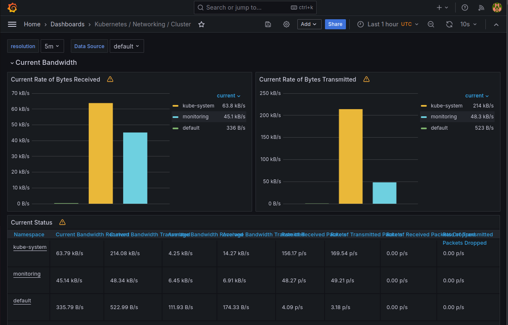
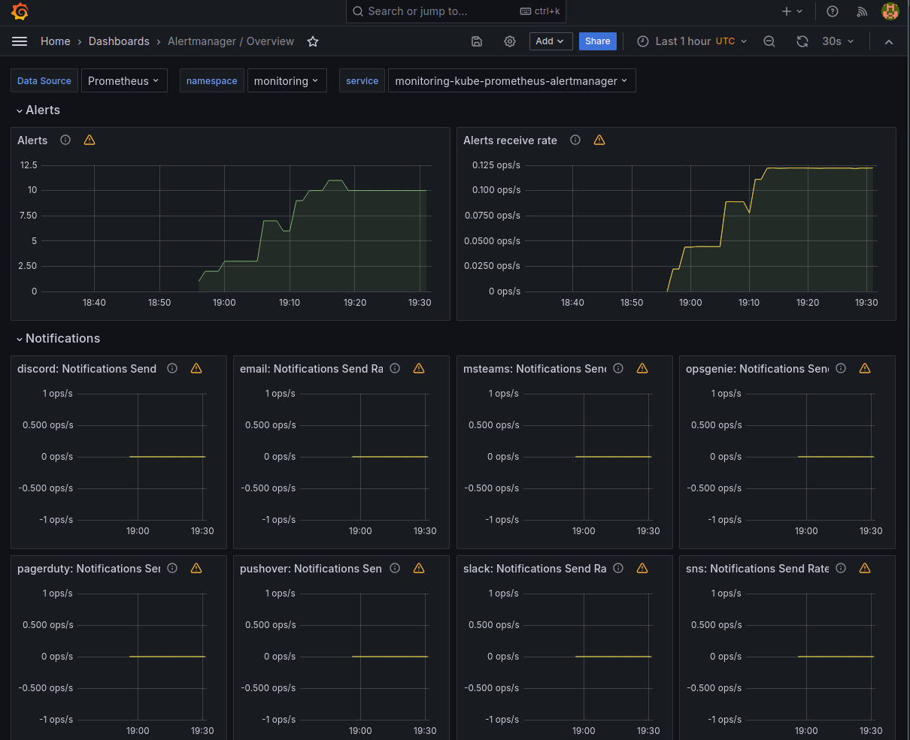

## 1. **Prometheus**
- The core component of the stack, it scrapes metrics from various sources (like applications, nodes, and Kubernetes components) and stores them for querying and analysis.
- Prometheus is the backbone of the stack, enabling real-time monitoring and alerting for the entire Kubernetes ecosystem.

---

## 2. **Alertmanager**
- Manages alerts generated by Prometheus.
- It ensures that alerts are actionable and not overwhelming, improving incident response times.

---

## 3. **Grafana**
- A visualization tool for creating dashboards and analyzing metrics.
- It makes it easy to interpret complex metrics and "share insights with teams", although I am yet to connect several people to one instance.

---

## 4. **kube-state-metrics**
- Exposes Kubernetes object metrics (e.g., deployments, pods, nodes) to Prometheus.
- it connects Kubernetes' internal state and Prometheus, enabling monitoring of cluster health and resource usage.

---

## 5. **node-exporter**
- Collects system-level metrics from Kubernetes nodes.
- It provides visibility into the underlying infrastructure, helping identify node-level issues.

---

## 6. **Prometheus Operator**
- Simplifies the deployment and management of Prometheus and related components in Kubernetes.
- It (presumably) reduces operational overhead and ensures a consistent monitoring setup across clusters.

---

## 7. **ServiceMonitors and PodMonitors**
- They define how Prometheus should scrape metrics from services and pods.
- It enables dynamic discovery and monitoring of Kubernetes services and pods without manual configuration.

---

## 8. **Metrics Server**
- Collects resource usage data (e.g., CPU, memory) for Kubernetes objects.
- It provides essential metrics for autoscaling and resource management.


```bash
kubectl get po,sts,svc,pvc,cm
```
```bash
NAME               READY   STATUS    RESTARTS   AGE
pod/python-app-0   1/1     Running   0          23m
pod/python-app-1   1/1     Running   0          23m
pod/python-app-2   1/1     Running   0          23m

NAME                          READY   AGE
statefulset.apps/python-app   3/3     24m

NAME                 TYPE        CLUSTER-IP     EXTERNAL-IP   PORT(S)   AGE
service/kubernetes   ClusterIP   10.96.0.1      <none>        443/TCP   6d22h
service/python-app   ClusterIP   10.106.24.60   <none>        80/TCP    24m

NAME                                                                 STATUS   VOLUME                                     CAPACITY   ACCESS MODES   STORAGECLASS   VOLUMEATTRIBUTESCLASS   AGE
persistentvolumeclaim/python-moskov-time-volume-mount-python-app-0   Bound    pvc-f02dc011-3af0-4dca-94f2-82a907ab0ce4   100Mi      RWO            standard       <unset>                 6d21h
persistentvolumeclaim/python-moskov-time-volume-mount-python-app-1   Bound    pvc-60b8d5d8-1d8a-4b1d-9fc7-3e5323401aa0   100Mi      RWO            standard       <unset>                 6d21h
persistentvolumeclaim/python-moskov-time-volume-mount-python-app-2   Bound    pvc-3766b8b2-e55d-4ebd-93cc-a963ad11dbbb   100Mi      RWO            standard       <unset>                 6d21h

NAME                         DATA   AGE
configmap/kube-root-ca.crt   1      6d22h
```

I really don't get what I needed to explain here, it's all as we created in the last lab.

5.1


5.2


5.3


5.4


5.5


5.6


```bash
kubectl exec init-demo -- cat /usr/share/nginx/html/index.html
```
```bash
Defaulted container "nginx" out of: nginx, install (init)
<html><head></head><body><header>
<title>http://info.cern.ch</title>
</header>

<h1>http://info.cern.ch - home of the first website</h1>
<p>From here you can:</p>
<ul>
<li><a href="http://info.cern.ch/hypertext/WWW/TheProject.html">Browse the first website</a></li>
<li><a href="http://line-mode.cern.ch/www/hypertext/WWW/TheProject.html">Browse the first website using the line-mode browser simulator</a></li>
<li><a href="http://home.web.cern.ch/topics/birth-web">Learn about the birth of the web</a></li>
<li><a href="http://home.web.cern.ch/about">Learn about CERN, the physics laboratory where the web was born</a></li>
</ul>
</body></html>
```
