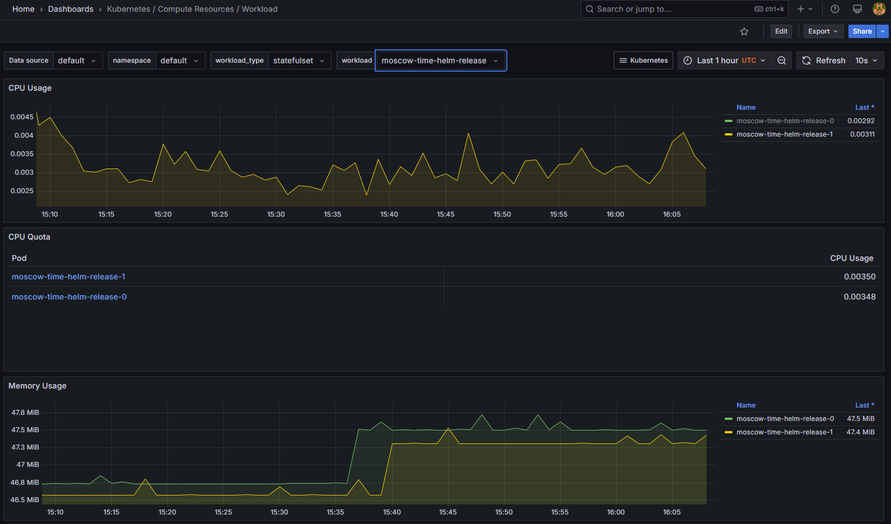
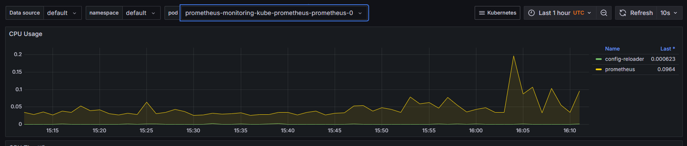
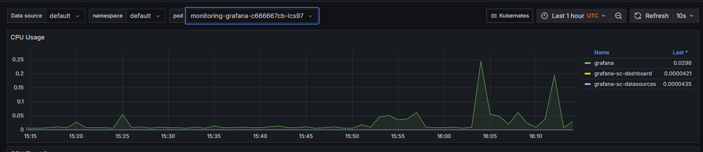
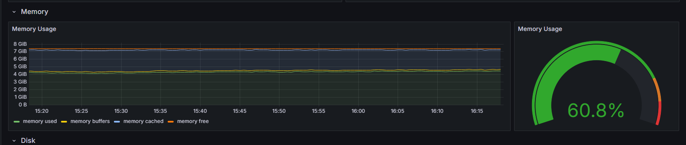
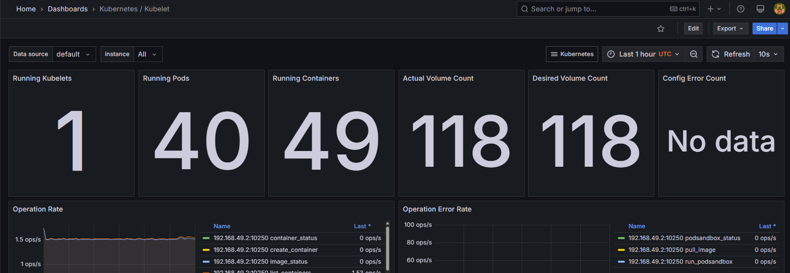
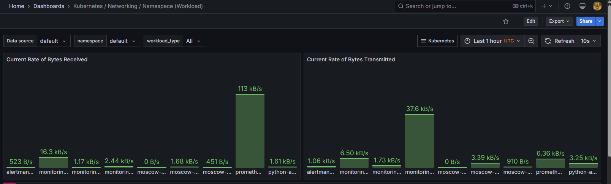
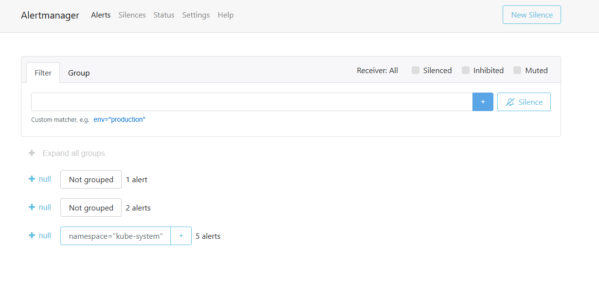

#### Kube Prometheus Stack

It is a set of components for monitoring a Kubernetes cluster, including the following main elements:

- Prometheus - collects metrics from nodes, pods and other components, stores them and provides flexible querying for
  graphing

- Alertmanager - processes alerts sent by Prometheus, groups them and sends notifications via various channels (email,
  etc.)

- Grafana - provides a convenient web interface for visualizing metrics in the form of dashboards

- Node Exporter - collects low-level metrics from hosts (e.g. CPU utilization, memory usage)

- Kube-state-metrics - exports metrics about the state of Kubernetes objects (Deployment, StatefulSet, Pods, etc.)

- Prometheus Operator - automates deployment, configuration and management of Prometheus components in Kubernetes

Output of `kubectl get po,sts,svc,pvc,cm`:

```shell
PS C:\Users\EzzySoft\PycharmProjects\S25-core-course-labs\k8s> kubectl get po,sts,svc,pvc,cm
NAME                                                         READY   STATUS    RESTARTS   AGE
pod/alertmanager-monitoring-kube-prometheus-alertmanager-0   2/2     Running   0          33m
pod/monitoring-grafana-c666667cb-lcs97                       3/3     Running   0          34m
pod/monitoring-kube-prometheus-operator-68ff49bc99-dbc22     1/1     Running   0          34m
pod/monitoring-kube-state-metrics-5fdcf4dd5d-l74cn           1/1     Running   0          34m
pod/monitoring-prometheus-node-exporter-glwrc                1/1     Running   0          34m
pod/moscow-time-5979b8667d-9m9rh                             1/1     Running   2          32d
pod/moscow-time-5979b8667d-fxrm4                             1/1     Running   2          32d
pod/moscow-time-5979b8667d-v6gz7                             1/1     Running   2          32d
pod/moscow-time-helm-release-0                               1/1     Running   1          6d19h
pod/moscow-time-helm-release-1                               1/1     Running   1          6d19h
pod/moscow-time-helm-release-64fb4cfb5-2xzbd                 1/1     Running   1          6d20h
pod/moscow-time-helm-release-64fb4cfb5-9l8zl                 1/1     Running   2          32d
pod/moscow-time-moscow-time-helm-64746fd4db-d6cqq            1/1     Running   0          19m
pod/moscow-time-moscow-time-helm-64746fd4db-x4p4t            1/1     Running   0          19m
pod/prometheus-monitoring-kube-prometheus-prometheus-0       2/2     Running   0          33m
pod/python-app-moscow-time-helm-0                            1/1     Running   1          6d19h
pod/python-app-moscow-time-helm-1                            1/1     Running   1          6d19h
pod/python-app-moscow-time-helm-667459766b-bktrn             1/1     Running   1          6d21h
pod/python-app-moscow-time-helm-667459766b-nj9hp             1/1     Running   1          6d23h

NAME                                                                    READY   AGE
statefulset.apps/alertmanager-monitoring-kube-prometheus-alertmanager   1/1     33m
statefulset.apps/moscow-time-helm-release                               2/2     6d19h
statefulset.apps/prometheus-monitoring-kube-prometheus-prometheus       1/1     33m
statefulset.apps/python-app-moscow-time-helm                            2/2     6d19h

NAME                                              TYPE        CLUSTER-IP       EXTERNAL-IP   PORT(S)                      AGE
service/alertmanager-operated                     ClusterIP   None             <none>        9093/TCP,9094/TCP,9094/UDP   33m
service/kubernetes                                ClusterIP   10.96.0.1        <none>        443/TCP                      32d
service/monitoring-grafana                        ClusterIP   10.96.199.81     <none>        80/TCP                       34m
service/monitoring-kube-prometheus-alertmanager   ClusterIP   10.104.127.64    <none>        9093/TCP,8080/TCP            34m
service/monitoring-kube-prometheus-operator       ClusterIP   10.109.63.82     <none>        443/TCP                      34m
service/monitoring-kube-prometheus-prometheus     ClusterIP   10.105.225.148   <none>        9090/TCP,8080/TCP            34m
service/monitoring-kube-state-metrics             ClusterIP   10.102.158.128   <none>        8080/TCP                     34m
service/monitoring-prometheus-node-exporter       ClusterIP   10.109.73.18     <none>        9100/TCP                     34m
service/moscow-time                               NodePort    10.101.29.203    <none>        5000:32196/TCP               32d
service/moscow-time-helm-release                  ClusterIP   10.111.219.203   <none>        5000/TCP                     32d
service/moscow-time-moscow-time-helm              ClusterIP   10.100.42.198    <none>        5000/TCP                     19m
service/prometheus-operated                       ClusterIP   None             <none>        9090/TCP                     33m
service/python-app-moscow-time-helm               ClusterIP   10.109.100.18    <none>        5000/TCP                     6d23h

NAME                                                       STATUS   VOLUME                                     CAPACITY   ACCESS MODES   STORAGECLASS   VOLUMEATTRIBUTESCLASS   AGE
persistentvolumeclaim/data-moscow-time-helm-release-0      Bound    pvc-d2ecf7b6-00f9-4435-b455-8d035bb41de6   1Gi        RWO            standard       <unset>                 6d20h
persistentvolumeclaim/data-moscow-time-helm-release-1      Bound    pvc-05e1255a-ab24-4944-84a6-88469135c223   1Gi        RWO            standard       <unset>                 6d20h
persistentvolumeclaim/data-python-app-moscow-time-helm-0   Bound    pvc-e03756c5-4af7-44f0-a36a-55a7bbd515db   1Gi        RWO            standard       <unset>                 6d19h
persistentvolumeclaim/data-python-app-moscow-time-helm-1   Bound    pvc-6271de87-a78a-4406-b915-dd93d0615985   1Gi        RWO            standard       <unset>                 6d19h

NAME                                                                     DATA   AGE
configmap/kube-root-ca.crt                                               1      32d
configmap/monitoring-grafana                                             1      34m
configmap/monitoring-grafana-config-dashboards                           1      34m
configmap/monitoring-kube-prometheus-alertmanager-overview               1      34m
configmap/monitoring-kube-prometheus-apiserver                           1      34m
configmap/monitoring-kube-prometheus-cluster-total                       1      34m
configmap/monitoring-kube-prometheus-controller-manager                  1      34m
configmap/monitoring-kube-prometheus-etcd                                1      34m
configmap/monitoring-kube-prometheus-grafana-datasource                  1      34m
configmap/monitoring-kube-prometheus-grafana-overview                    1      34m
configmap/monitoring-kube-prometheus-k8s-coredns                         1      34m
configmap/monitoring-kube-prometheus-k8s-resources-cluster               1      34m
configmap/monitoring-kube-prometheus-k8s-resources-multicluster          1      34m
configmap/monitoring-kube-prometheus-k8s-resources-namespace             1      34m
configmap/monitoring-kube-prometheus-k8s-resources-node                  1      34m
configmap/monitoring-kube-prometheus-k8s-resources-pod                   1      34m
configmap/monitoring-kube-prometheus-k8s-resources-workload              1      34m
configmap/monitoring-kube-prometheus-k8s-resources-workloads-namespace   1      34m
configmap/monitoring-kube-prometheus-kubelet                             1      34m
configmap/monitoring-kube-prometheus-namespace-by-pod                    1      34m
configmap/monitoring-kube-prometheus-namespace-by-workload               1      34m
configmap/monitoring-kube-prometheus-node-cluster-rsrc-use               1      34m
configmap/monitoring-kube-prometheus-node-rsrc-use                       1      34m
configmap/monitoring-kube-prometheus-nodes                               1      34m
configmap/monitoring-kube-prometheus-nodes-aix                           1      34m
configmap/monitoring-kube-prometheus-nodes-darwin                        1      34m
configmap/monitoring-kube-prometheus-persistentvolumesusage              1      34m
configmap/monitoring-kube-prometheus-pod-total                           1      34m
configmap/monitoring-kube-prometheus-prometheus                          1      34m
configmap/monitoring-kube-prometheus-proxy                               1      34m
configmap/monitoring-kube-prometheus-scheduler                           1      34m
configmap/monitoring-kube-prometheus-workload-total                      1      34m
configmap/prometheus-monitoring-kube-prometheus-prometheus-rulefiles-0   35     33m
```

#### Conclusion:

Successful deployment of monitoring components (Prometheus, Alertmanager, Grafana, Prometheus operator,
kube-state-metrics, node-exporter) and applications (moscow-time and python-app) using Helm-charts.

The monitoring part shows that all key components are in Running status, which indicates that they are functioning
correctly.

Applications are also running and operating in normal mode, some pods have restarts recorded

Services provide network accessibility to both internal and external components, with moscow-time application configured
to access via NodePort.

PVCs indicate correct storage allocation for components that require persistent data retention.

ConfigMaps contain important settings that allow monitoring and application components to operate according to the
specified configurations.


---

### Grafana stats

- Check CPU and Memory consumption of your StatefulSet.
    - CPU:
        - alertmanager-monitoring-kube-prometheus-alertmanager-0 - 0.000935
        - moscow-time-helm-release-0 - 0.00337
        - moscow-time-helm-release-1 - 0.00384
        - prometheus-monitoring-kube-prometheus-prometheus-0 - 0.0330
        - python-app-moscow-time-helm-0 - 0.00333
        - python-app-moscow-time-helm-1 - 0.00322

    - MEMORY:
        - alertmanager-monitoring-kube-prometheus-alertmanager-0 - 83.5 MiB
        - moscow-time-helm-release-0 - 47.5 MiB
        - moscow-time-helm-release-1 - 47.3 MiB
        - prometheus-monitoring-kube-prometheus-prometheus-0 - 454 MiB
        - python-app-moscow-time-helm-0 - 47.3 MiB
        - python-app-moscow-time-helm-1 - 47.4 MiB
          

- Identify Pods with higher and lower CPU usage in the default namespace.
    - Higher:
        - prometheus pod
          
    - Lower:
        - grafana-sc-dashboard pod
          


- Monitor node memory usage in percentage and megabytes.
  

- Count the number of pods and containers managed by the Kubelet service.
  


- Evaluate network usage of Pods in the default namespace.  
  


- Determine the number of active alerts; also check the Web UI with minikube service
  monitoring-kube-prometheus-alertmanager.

  

----

### Task 2

Proof:

```shell
PS C:\Users\EzzySoft\PycharmProjects\S25-core-course-labs\k8s> kubectl get pod demo
NAME   READY   STATUS    RESTARTS   AGE
demo   1/1     Running   0          9s
PS C:\Users\EzzySoft\PycharmProjects\S25-core-course-labs\k8s> kubectl exec pod/demo -- cat /test/lab15.md
Defaulted container "main-container" out of: main-container, init-downloader (init)
# Lab 15: Kubernetes Monitoring and Init Containers

## Overview

In this lab, you will explore Kubernetes cluster monitoring using Prometheus with the Kube Prometheus Stack. Additionally, you'll delve into the concept of Init Containers in Kubernetes.

## Task 1: Kubernetes Cluster Monitoring with Prometheus

**6 Points:**

1. This lab was tested on a specific version of components:
    - Minikube v1.33.0
    - Minikube kubectl v1.28.3
    - kube-prometheus-stack-57.2.0    v0.72.0
    - the minikube start command - `minikube start --driver=docker --container-runtime=containerd`

2. Read about `Kube Prometheus Stack`:
    - [Helm chart with installation guide](https://github.com/prometheus-community/helm-charts/tree/main/charts/kube-prometheus-stack)
    - [Explanation of components](https://github.com/prometheus-operator/kube-prometheus#kubeprometheus)
...
```