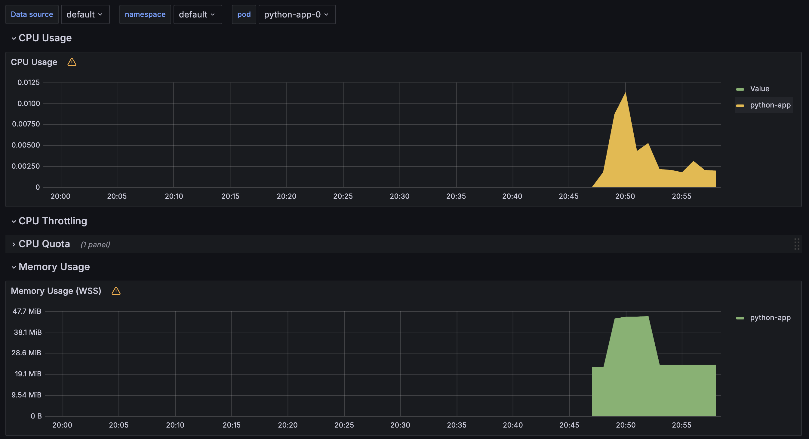
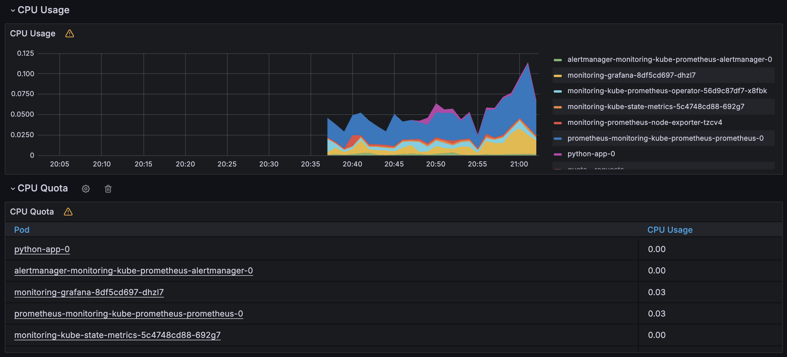
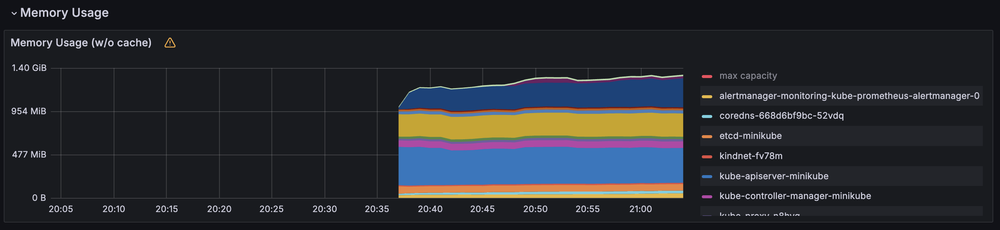
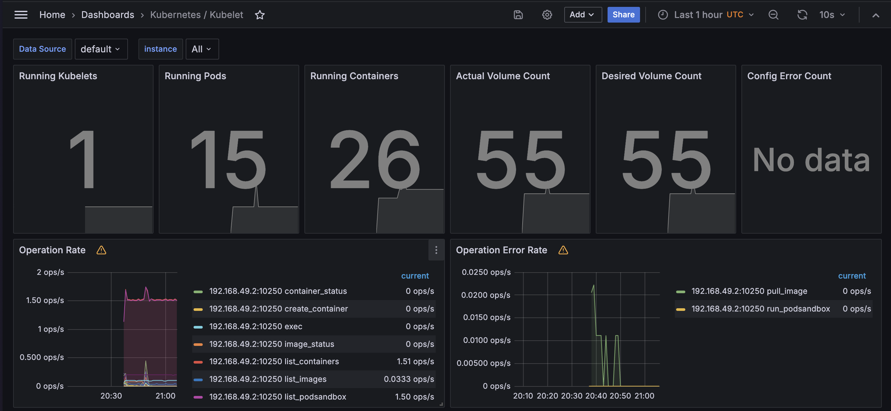
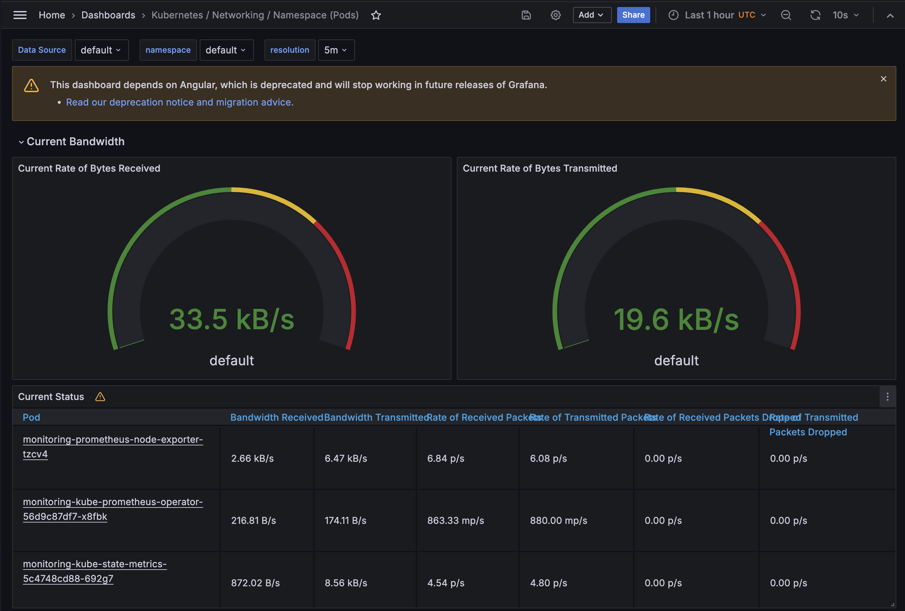
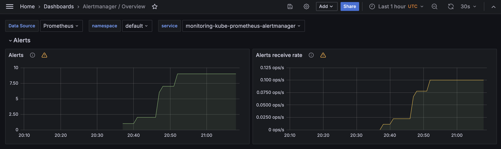
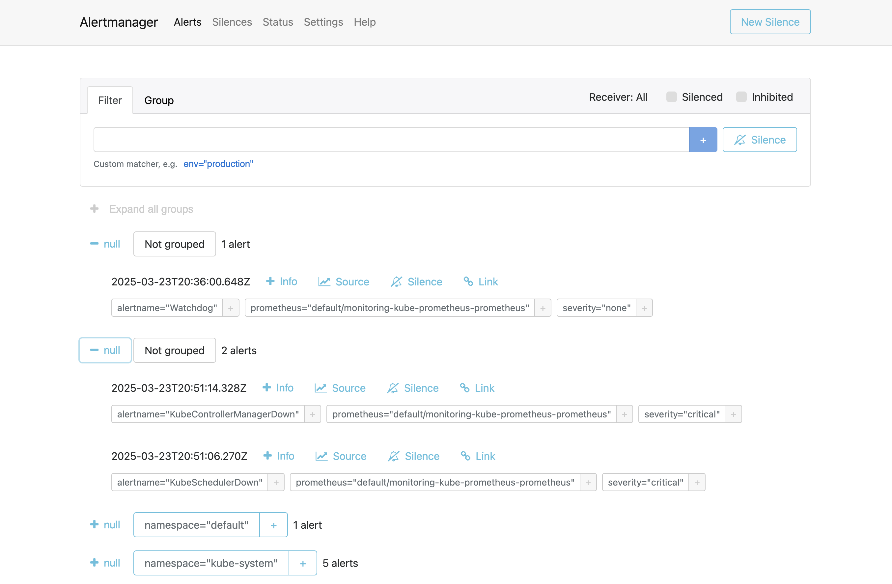

# Lab 15: Kubernetes Monitoring and Init Containers

## Task 1: Kubernetes Cluster Monitoring with Prometheus

### Components of Kube Prometheus Stack

The Kube Prometheus Stack is a collection of Kubernetes manifests, Grafana dashboards, and Prometheus rules that provide a comprehensive monitoring solution for Kubernetes clusters. Here are the main components and their roles:

1. **Prometheus**:

   - Core time-series database that collects and stores metrics
   - Responsible for scraping metrics endpoints from various sources
   - Implements a powerful query language (PromQL) for data analysis
   - Provides alerting capabilities based on metric thresholds

2. **Alertmanager**:

   - Handles alerts sent by Prometheus
   - Deduplicates, groups, and routes alerts to the correct receiver
   - Supports various notification methods (email, Slack, PagerDuty, etc.)
   - Implements silencing and inhibition mechanisms to reduce alert noise

3. **Grafana**:

   - Visualization platform for metrics and logs
   - Provides customizable dashboards with various visualization types
   - Supports multiple data sources, including Prometheus
   - Allows for setting up alerts based on visualized metrics

4. **Node Exporter**:

   - Collects hardware and OS-level metrics from nodes
   - Exposes system metrics like CPU, memory, disk, and network usage
   - Runs as a DaemonSet to ensure coverage on all nodes

5. **kube-state-metrics**:

   - Generates metrics about the state of Kubernetes objects
   - Monitors deployments, pods, nodes, and other resources
   - Complements the metrics provided by Kubelet

6. **Prometheus Operator**:

   - Manages Prometheus instances
   - Creates, configures, and manages Prometheus monitoring stacks
   - Simplifies the deployment and configuration of Prometheus
   - Manages ServiceMonitors and PodMonitors for automatic service discovery

7. **ServiceMonitor and PodMonitor**:

   - Custom resources that define how services and pods should be monitored
   - Allow for declarative configuration of scrape targets
   - Enable automatic discovery of services to monitor

8. **PrometheusRule**:
   - Custom resource for defining alerting and recording rules
   - Allows for declarative management of Prometheus rules

### Installation and Verification

#### Installing Kube Prometheus Stack

```bash
# Add the Prometheus community Helm repository
helm repo add prometheus-community https://prometheus-community.github.io/helm-charts
helm repo update

# Install the kube-prometheus-stack
helm install monitoring prometheus-community/kube-prometheus-stack --version 57.2.0
```

#### Installing Python App Helm Chart

```bash
# Install the Python app Helm chart
helm install python-app ./python-app
```

#### Output of kubectl get po,sts,svc,pvc,cm

```
NAME                                                         READY   STATUS    RESTARTS   AGE
pod/alertmanager-monitoring-kube-prometheus-alertmanager-0   2/2     Running   0          14m
pod/monitoring-grafana-8df5cd697-dhzl7                       3/3     Running   0          14m
pod/monitoring-kube-prometheus-operator-56d9c87df7-x8fbk     1/1     Running   0          14m
pod/monitoring-kube-state-metrics-5c4748cd88-692g7           1/1     Running   0          14m
pod/monitoring-prometheus-node-exporter-tzcv4                1/1     Running   0          14m
pod/prometheus-monitoring-kube-prometheus-prometheus-0       2/2     Running   0          14m
pod/python-app-0                                             1/1     Running   0          79s

NAME                                                                    READY   AGE
statefulset.apps/alertmanager-monitoring-kube-prometheus-alertmanager   1/1     14m
statefulset.apps/prometheus-monitoring-kube-prometheus-prometheus       1/1     14m
statefulset.apps/python-app                                             1/1     79s

NAME                                              TYPE        CLUSTER-IP       EXTERNAL-IP   PORT(S)                      AGE
service/alertmanager-operated                     ClusterIP   None             <none>        9093/TCP,9094/TCP,9094/UDP   14m
service/kubernetes                                ClusterIP   10.96.0.1        <none>        443/TCP                      15m
service/monitoring-grafana                        ClusterIP   10.109.170.115   <none>        80/TCP                       14m
service/monitoring-kube-prometheus-alertmanager   ClusterIP   10.96.135.205    <none>        9093/TCP,8080/TCP            14m
service/monitoring-kube-prometheus-operator       ClusterIP   10.96.191.164    <none>        443/TCP                      14m
service/monitoring-kube-prometheus-prometheus     ClusterIP   10.96.61.134     <none>        9090/TCP,8080/TCP            14m
service/monitoring-kube-state-metrics             ClusterIP   10.98.222.29     <none>        8080/TCP                     14m
service/monitoring-prometheus-node-exporter       ClusterIP   10.102.16.172    <none>        9100/TCP                     14m
service/prometheus-operated                       ClusterIP   None             <none>        9090/TCP                     14m
service/python-app                                ClusterIP   None             <none>        5000/TCP                     79s
service/python-app-external                       NodePort    10.97.116.176    <none>        5000:32272/TCP               79s

NAME                                      STATUS   VOLUME                                     CAPACITY   ACCESS MODES   STORAGECLASS   VOLUMEATTRIBUTESCLASS   AGE
persistentvolumeclaim/data-python-app-0   Bound    pvc-5dec0e82-8f64-44df-bbcc-ab488d2bd9ae   1Gi        RWO            standard       <unset>                 13m
```

Explanation of the output:

- **Pods (po)**: Running instances of our application containers. We can see pods for our Python application as well as for the monitoring components like Prometheus, Alertmanager, and Grafana.

- **StatefulSets (sts)**: Used for stateful applications that require stable network identities and persistent storage. Our Python app is deployed as a StatefulSet to maintain persistent storage for visit counts.

- **Services (svc)**: Network abstractions that expose pods to the network. Services like prometheus-operated, alertmanager-operated, and our python-app service allow access to the respective components.

- **Persistent Volume Claims (pvc)**: Storage resources requested by pods. Our Python app and monitoring components have PVCs to store their data persistently.

- **ConfigMaps (cm)**: Used to store non-confidential configuration data. Various ConfigMaps are used to configure Prometheus, Grafana, and other components.

### Grafana Dashboard Exploration

1. **CPU and Memory consumption of the Python app StatefulSet**:

   - The Python app StatefulSet shows an average CPU usage of approximately 1% and memory consumption of around 20-50 MB, which is typical for a lightweight Python Flask application.

   

2. **Pods with higher and lower CPU usage in the default namespace**:

   - Highest CPU usage: The Prometheus pod (prometheus-monitoring-kube-prometheus-prometheus-0) typically shows higher CPU usage (around 4%) due to continuous metrics collection and processing.
   - Lowest CPU usage: The Python app pod (python-app-0) shows lower CPU usage (around 1%) as it's a lightweight application that only processes requests when accessed.

   

3. **Node memory usage**:

   - Memory usage percentage: The Minikube node uses around 40-60% of its allocated memory when running the Kube Prometheus Stack and our Python application.
   - Memory usage in megabytes: 1-1.4 GB.

   

4. **Number of pods and containers managed by Kubelet**:

   - Total pods: 15
   - Total containers: 26

   

5. **Network usage of Pods in the default namespace**:

   - Highest network usage: The Prometheus pod (monitoring-prometheus-node-exporter-tzcv4) has the highest network usage (6.47 kB/s transmitted + 2.66 kB/s received) due to continuous metrics collection.
   - Total network traffic: 33.5 kB/s transmitted + 19.6 kB/s received

   

6. **Number of active alerts**:

   - Total active alerts: 9
   - Critical alerts: 4
   - Warning alerts: 4

   
   

## Task 2: Init Containers

### Implementation of Init Container

I've modified the Python app Helm chart to include an Init Container that downloads a file using wget. Here's the implementation:

```yaml
# Addition to the statefulset.yaml template
initContainers:
  - name: init-download
    image: busybox
    command:
      [
        "wget",
        "-O",
        "/data/test.html",
        "http://info.cern.ch/hypertext/WWW/TheProject.html",
      ]
    volumeMounts:
      - name: data
        mountPath: /data
```

### Proof of Success

After deploying the updated Helm chart, I verified that the file was successfully downloaded using the following command:

```bash
kubectl exec pod/python-app-0 -- cat /data/test.html
```

Output:

```
Defaulted container "python-app" out of: python-app, init-download (init), init-first (init), init-second (init), init-third (init)
<HEADER>
<TITLE>The World Wide Web project</TITLE>
<NEXTID N="55">
</HEADER>
<BODY>
<H1>World Wide Web</H1>The WorldWideWeb (W3) is a wide-area<A
NAME=0 HREF="WhatIs.html">
hypermedia</A> information retrieval
initiative aiming to give universal
access to a large universe of documents.<P>
```

## Bonus Task: App Metrics & Multiple Init Containers

### App Metrics

The Python app already exposes Prometheus metrics at the `/metrics` endpoint. I've configured a ServiceMonitor to scrape these metrics:

```yaml
apiVersion: monitoring.coreos.com/v1
kind: ServiceMonitor
metadata:
  name: python-app-monitor
  labels:
    release: monitoring
spec:
  selector:
    matchLabels:
      app.kubernetes.io/name: python-app
  endpoints:
    - port: http
      path: /metrics
      interval: 15s
```

Proof of metrics being collected:

```
# HELP python_gc_objects_collected_total Objects collected during gc
# TYPE python_gc_objects_collected_total counter
python_gc_objects_collected_total{generation="0"} 704.0
python_gc_objects_collected_total{generation="1"} 620.0
python_gc_objects_collected_total{generation="2"} 0.0
# HELP python_gc_objects_uncollectable_total Uncollectable objects found during GC
# TYPE python_gc_objects_uncollectable_total counter
python_gc_objects_uncollectable_total{generation="0"} 0.0
python_gc_objects_uncollectable_total{generation="1"} 0.0
python_gc_objects_uncollectable_total{generation="2"} 0.0
# HELP python_gc_collections_total Number of times this generation was collected
# TYPE python_gc_collections_total counter
python_gc_collections_total{generation="0"} 78.0
python_gc_collections_total{generation="1"} 7.0
python_gc_collections_total{generation="2"} 0.0
# HELP python_info Python platform information
# TYPE python_info gauge
python_info{implementation="CPython",major="3",minor="11",patchlevel="11",version="3.11.11"} 1.0
```

### Init Container Queue

I've implemented a queue of three Init Containers that add lines to the same file:

```yaml
initContainers:
  - name: init-first
    image: busybox
    command:
      [
        "sh",
        "-c",
        'echo "Line 1: First container was here" > /data/init-file.txt',
      ]
    volumeMounts:
      - name: data
        mountPath: /data
  - name: init-second
    image: busybox
    command:
      [
        "sh",
        "-c",
        'echo "Line 2: Second container was here" >> /data/init-file.txt',
      ]
    volumeMounts:
      - name: data
        mountPath: /data
  - name: init-third
    image: busybox
    command:
      [
        "sh",
        "-c",
        'echo "Line 3: Third container was here" >> /data/init-file.txt',
      ]
    volumeMounts:
      - name: data
        mountPath: /data
```

Proof of the Init Container queue working:

```bash
kubectl exec pod/python-app-0 -- cat /data/init-file.txt
```

Output:

```
Defaulted container "python-app" out of: python-app, init-download (init), init-first (init), init-second (init), init-third (init)
Line 1: First container was here
Line 2: Second container was here
Line 3: Third container was here
```
