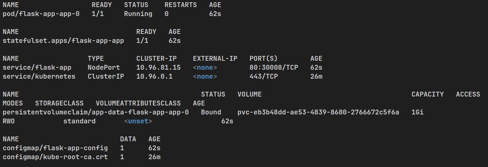
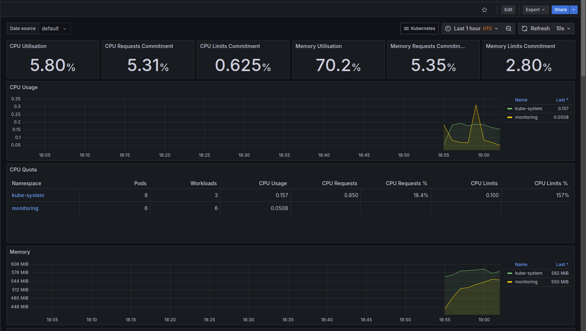
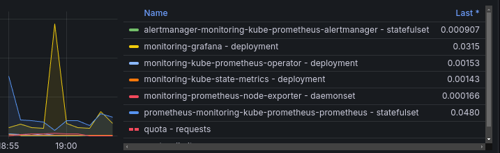
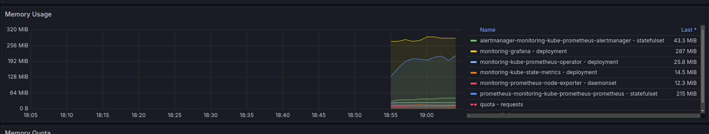
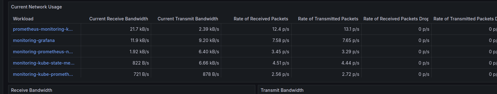
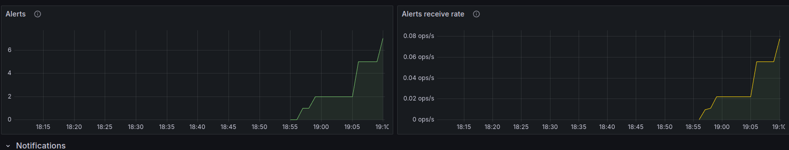
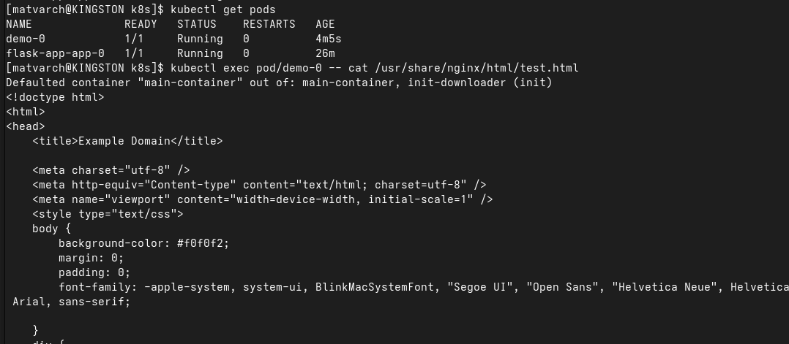

## Kube Prometheus Stack is a comprehensive monitoring solution for Kubernetes, which includes Prometheus, Alertmanager, Grafana, etc. More about it

1. Prometheus

* Role: A time-series database and monitoring system that collects metrics from Kubernetes components and applications.

2. Alertmanager
   * Role: Handles alerts generated by Prometheus and manages notifications.

3. Grafana
   * Role: A visualization tool used to create and display dashboards from Prometheus metrics.

4. Node Exporter
   * Role: Collects hardware and OS-level metrics from Kubernetes nodes.

5. Kube State Metrics
   * Role: Collects detailed metrics on the state of Kubernetes objects.

## kubectl get output

## CPU usage

## CPU usage graphic - alertmanager has a higher cpu usage and prometheus has lower

## Memory usage

## Quantity of pods in default namespace is 5

## Network usage

## Alert count

## Task 2 proof: I created new demo-0 release and get test.html

