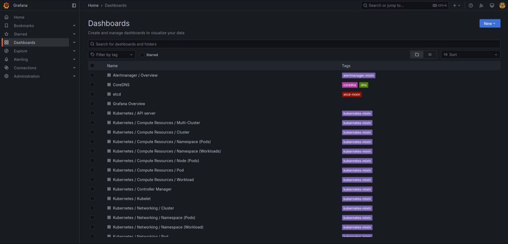
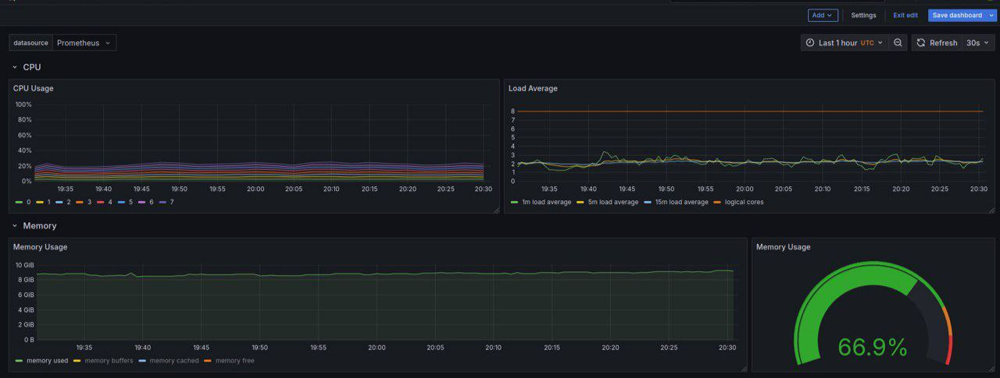
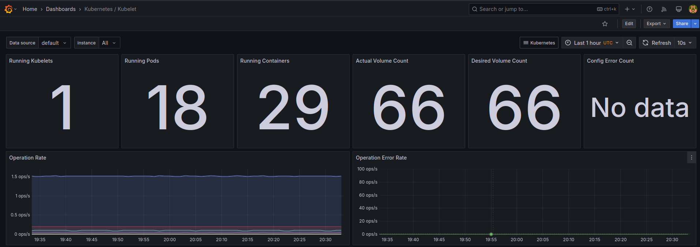

# Kubernetes Monitoring and Init Containers

## Overview

This document gives an overview over monitoring a Kubernetes Cluster using Prometheus and introduce the concept of Init Containers in Kubernetes

## Monitoring with Prometheus

### [Kube Prometheus Stack](https://github.com/prometheus-operator/kube-prometheus/blob/main/README.md#kube-prometheus)

- **[Prometheus Operator](https://github.com/prometheus-operator/prometheus-operator):** Streamlines the deployment, configuration, and management of Prometheus along with its ecosystem in a Kubernetes environment.
- **[Prometheus](https://prometheus.io/):** A powerful monitoring and alerting toolkit that collects and processes performance data.
- **[Alertmanager](https://github.com/prometheus/alertmanager):** Manages alert notifications from Prometheus by organizing, deduplicating, and routing them.
- **[Node Exporter](https://github.com/prometheus/node_exporter):** Gathers system-level metrics, including hardware and operating system statistics, for analysis by Prometheus.
- **[Blackbox Exporter](https://github.com/prometheus/blackbox_exporter):** Checks endpoint availability and performance using various protocols such as HTTP, HTTPS, DNS, TCP, ICMP, and gRPC.
- **[Prometheus Adapter](https://github.com/kubernetes-sigs/prometheus-adapter):** Integrates with Kubernetes to support Horizontal Pod Autoscaling by delivering custom metrics from Prometheus.
- **[Kube-State-Metrics](https://github.com/kubernetes/kube-state-metrics):** Provides detailed state information about Kubernetes resources like deployments and pods, offering insights into cluster health.
- **[Grafana](https://grafana.com/):** Enables the creation of dynamic dashboards and visualizations to display the metrics collected by Prometheus.


### Installing the Kub Prometheus Stack Helm Chart

```bash
$ helm list
NAME            NAMESPACE REVISION UPDATED                                 STATUS   CHART                        APP VERSION
kube-prom-stack default   1        2025-03-23 20:04:52.899891851 +0300 MSK deployed kube-prometheus-stack-70.0.2 v0.81.0    
app-python           default   1        2025-03-23 18:15:04.053734728 +0300 MSK deployed app-python-0.29.1                 1.18.1     
```

```bash
$ kubectl get po,sts,svc,pvc,cm
NAME                                                         READY   STATUS    RESTARTS   AGE
pod/alertmanager-kube-prom-stack-kube-prome-alertmanager-0   2/2     Running   0          4m57s
pod/kube-prom-stack-grafana-6bf46ccdd6-xnqgs                 3/3     Running   0          4m58s
pod/kube-prom-stack-kube-prome-operator-667c7f7fbf-llx5b     1/1     Running   0          4m58s
pod/kube-prom-stack-kube-state-metrics-777fd8b75d-v4s48      1/1     Running   0          4m58s
pod/kube-prom-stack-prometheus-node-exporter-cksjx           1/1     Running   0          4m58s
pod/prometheus-kube-prom-stack-kube-prome-prometheus-0       2/2     Running   0          4m57s
pod/app-python-0                                                2/2     Running   0          63m
pod/app-python-1                                                2/2     Running   0          63m

NAME                                                                    READY   AGE
statefulset.apps/alertmanager-kube-prom-stack-kube-prome-alertmanager   1/1     4m58s
statefulset.apps/prometheus-kube-prom-stack-kube-prome-prometheus       1/1     4m57s
statefulset.apps/app-python                                                2/2     63m

NAME                                               TYPE        CLUSTER-IP       EXTERNAL-IP   PORT(S)                      AGE
service/alertmanager-operated                      ClusterIP   None             <none>        9093/TCP,9094/TCP,9094/UDP   4m58s
service/kube-prom-stack-grafana                    ClusterIP   10.96.95.254     <none>        80/TCP                       4m58s
service/kube-prom-stack-kube-prome-alertmanager    ClusterIP   10.102.44.166    <none>        9093/TCP,8080/TCP            4m58s
service/kube-prom-stack-kube-prome-operator        ClusterIP   10.111.219.242   <none>        443/TCP                      4m58s
service/kube-prom-stack-kube-prome-prometheus      ClusterIP   10.103.191.7     <none>        9090/TCP,8080/TCP            4m58s
service/kube-prom-stack-kube-state-metrics         ClusterIP   10.102.185.236   <none>        8080/TCP                     4m58s
service/kube-prom-stack-prometheus-node-exporter   ClusterIP   10.102.233.97    <none>        9100/TCP                     4m58s
service/kubernetes                                 ClusterIP   10.96.0.1        <none>        443/TCP                      128m
service/prometheus-operated                        ClusterIP   None             <none>        9090/TCP                     4m57s
service/app-python                                    ClusterIP   10.107.74.83     <none>        5000/TCP                     63m

NAME                                          STATUS   VOLUME                                     CAPACITY   ACCESS MODES   STORAGECLASS   VOLUMEATTRIBUTESCLASS   AGE
persistentvolumeclaim/app-python-vol-app-python-0   Bound    pvc-0042ff12-75fa-4518-8307-653b84c62b75   1Gi        RWO            standard       <unset>                 107m
persistentvolumeclaim/app-python-vol-app-python-1   Bound    pvc-251472ae-c503-40a2-9917-6db43f476958   1Gi        RWO            standard       <unset>                 104m

NAME                                                                     DATA   AGE
configmap/kube-prom-stack-grafana                                        1      4m58s
configmap/kube-prom-stack-grafana-config-dashboards                      1      4m58s
configmap/kube-prom-stack-kube-prome-alertmanager-overview               1      4m58s
configmap/kube-prom-stack-kube-prome-apiserver                           1      4m58s
configmap/kube-prom-stack-kube-prome-cluster-total                       1      4m58s
configmap/kube-prom-stack-kube-prome-controller-manager                  1      4m58s
configmap/kube-prom-stack-kube-prome-etcd                                1      4m58s
configmap/kube-prom-stack-kube-prome-grafana-datasource                  1      4m58s
configmap/kube-prom-stack-kube-prome-grafana-overview                    1      4m58s
configmap/kube-prom-stack-kube-prome-k8s-coredns                         1      4m58s
configmap/kube-prom-stack-kube-prome-k8s-resources-cluster               1      4m58s
configmap/kube-prom-stack-kube-prome-k8s-resources-multicluster          1      4m58s
configmap/kube-prom-stack-kube-prome-k8s-resources-namespace             1      4m58s
configmap/kube-prom-stack-kube-prome-k8s-resources-node                  1      4m58s
configmap/kube-prom-stack-kube-prome-k8s-resources-pod                   1      4m58s
configmap/kube-prom-stack-kube-prome-k8s-resources-workload              1      4m58s
configmap/kube-prom-stack-kube-prome-k8s-resources-workloads-namespace   1      4m58s
configmap/kube-prom-stack-kube-prome-kubelet                             1      4m58s
configmap/kube-prom-stack-kube-prome-namespace-by-pod                    1      4m58s
configmap/kube-prom-stack-kube-prome-namespace-by-workload               1      4m58s
configmap/kube-prom-stack-kube-prome-node-cluster-rsrc-use               1      4m58s
configmap/kube-prom-stack-kube-prome-node-rsrc-use                       1      4m58s
configmap/kube-prom-stack-kube-prome-nodes                               1      4m58s
configmap/kube-prom-stack-kube-prome-nodes-aix                           1      4m58s
configmap/kube-prom-stack-kube-prome-nodes-darwin                        1      4m58s
configmap/kube-prom-stack-kube-prome-persistentvolumesusage              1      4m58s
configmap/kube-prom-stack-kube-prome-pod-total                           1      4m58s
configmap/kube-prom-stack-kube-prome-prometheus                          1      4m58s
configmap/kube-prom-stack-kube-prome-proxy                               1      4m58s
configmap/kube-prom-stack-kube-prome-scheduler                           1      4m58s
configmap/kube-prom-stack-kube-prome-workload-total                      1      4m58s
configmap/kube-root-ca.crt                                               1      128m
configmap/prometheus-kube-prom-stack-kube-prome-prometheus-rulefiles-0   35     4m57s
configmap/app-python-config                                                 1      63m
```

Output explanation:

- **Section One (`Pods`):**
  - This section shows the active pods in the default namespace.
  - Initially, you’ll notice six pods associated with the **kube-prom-stack** helm chart installation, followed by two pods for **app-python** and two additional replicas of **app-python**.

- **Section Two (`StatefulSets`):**
  - Here, you can review the stateful applications deployed within the cluster.

- **Section Three (`Services`):**
  - This part details the services that expose the pods, facilitating both internal communication between pods and external access.
  - The list includes services for the **kube-prom-stack** as well as for **app-python**.

- **Section Four (`PersistentVolumeClaims`):**
  - This section lists the PersistentVolumeClaims, representing the storage resources set up for the StatefulSet application from the previous lab.

- **Section Five (`ConfigMaps`):**
  - This final section displays the ConfigMaps that are used to manage and configure the pods.


### Grafana Dashboard

```bash
$ minikube service kube-prom-stack-grafana
|-----------|-------------------------|-------------|--------------|
| NAMESPACE |          NAME           | TARGET PORT |     URL      |
|-----------|-------------------------|-------------|--------------|
| default   | kube-prom-stack-grafana |             | No node port |
|-----------|-------------------------|-------------|--------------|
😿  service default/kube-prom-stack-grafana has no node port
❗  Services [default/kube-prom-stack-grafana] have type "ClusterIP" not meant to be exposed, however for local development minikube allows you to access this !
🏃  Starting tunnel for service kube-prom-stack-grafana.
|-----------|-------------------------|-------------|------------------------|
| NAMESPACE |          NAME           | TARGET PORT |          URL           |
|-----------|-------------------------|-------------|------------------------|
| default   | kube-prom-stack-grafana |             | http://127.0.0.1:39109 |
|-----------|-------------------------|-------------|------------------------|
🎉  Opening service default/kube-prom-stack-grafana in default browser...
❗  Because you are using a Docker driver on linux, the terminal needs to be open to run it.
```

To get the password for the admin user in Grafana, we can check the notes:

```bash
helm get notes kube-prom-stack
```



#### Exploring the Dashboard

2. Node Memory Usage:

    

3. Number of pods & containers:

    

    From the image we can see that we have 18 running pods and 29 running containers

