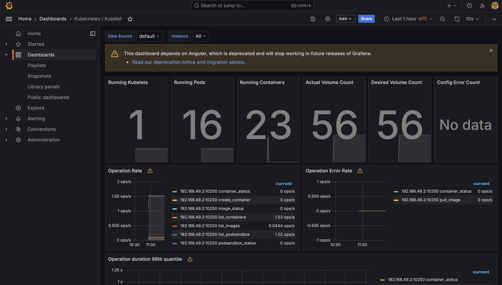
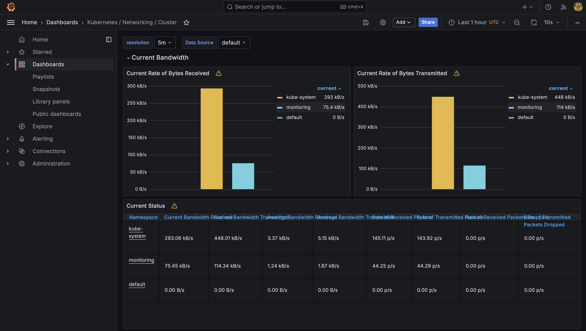
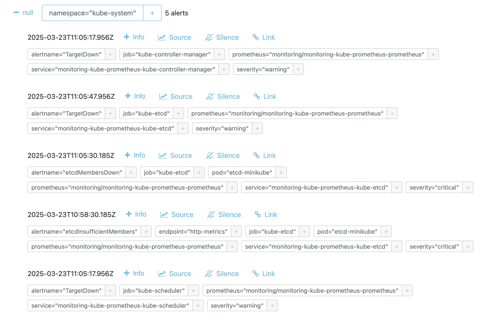

# Lab 15: Kubernetes Monitoring and Init Containers

## Task 1: Kubernetes Cluster Monitoring with Prometheus

### 1. Description of Kube Prometheus Stack Components

Kube Prometheus Stack is a set of tools for monitoring Kubernetes clusters. The main components are:

1. **Prometheus**:
    - The main tool for collecting and storing metrics.
    - Gathers data from nodes, pods, services, and other cluster components.
    - Provides an API for querying and visualizing metrics.

2. **Grafana**:
    - A tool for data visualization.
    - Uses data from Prometheus to create graphs and dashboards.
    - Allows real-time analysis of the cluster's state.

3. **Alertmanager**:
    - Manages notifications and alerts.
    - Receives alerts from Prometheus and sends notifications via email, Slack, and other channels.

4. **kube-state-metrics**:
    - Provides metrics about the state of Kubernetes objects (pods, deployments, services).
    - Used by Prometheus to monitor the cluster's state.

5. **node-exporter**:
    - Collects metrics from cluster nodes (CPU, memory, disks).
    - These metrics are used to analyze node performance.

6. **Prometheus Operator**:
    - An operator for managing Prometheus in Kubernetes.
    - Automates the creation and configuration of Prometheus, Alertmanager, and other components.

---

### 2. Installing Helm Charts

1. Installing Kube Prometheus Stack:
   ```bash
   helm install monitoring prometheus-community/kube-prometheus-stack
   ```

2. Installing your application's Helm chart (if applicable):
   ```bash
   helm install my-app2 ./my-app
   ```

3. Checking installed resources:
   ```bash
   kubectl get po,sts,svc,pvc,cm
   ```

   **Explanation of the output:**
    - **po (Pods)**: List of all pods in the cluster.
    - **sts (StatefulSets)**: StatefulSets manage pods with stable network identifiers and storage.
    - **svc (Services)**: Services provide access to pods.
    - **pvc (PersistentVolumeClaims)**: Requests for persistent storage.
    - **cm (ConfigMaps)**: Configuration data for applications.

    ```commandline
    demanzverev@MacBook-Pro-Deman k8s % kubectl get po,sts,svc,pvc,cm
    NAME                          READY   STATUS    RESTARTS   AGE
    pod/my-app-6bbfc8dd6c-jxw5f   1/1     Running   1          13d
    pod/my-app2-6f658664c-vzn65   1/1     Running   0          31s
    
    NAME                 TYPE        CLUSTER-IP       EXTERNAL-IP   PORT(S)   AGE
    service/kubernetes   ClusterIP   10.96.0.1        <none>        443/TCP   13d
    service/my-app       ClusterIP   10.111.253.151   <none>        80/TCP    13d
    service/my-app2      ClusterIP   10.101.97.245    <none>        80/TCP    31s
    
    NAME                         DATA   AGE
    configmap/kube-root-ca.crt   1      13d
    configmap/my-app-config      1      13d
    configmap/my-app2-config     1      31s
    ```
---

### 3. Using Grafana Dashboards

1. Accessing Grafana:
   ```bash
   minikube service monitoring-grafana -n monitoring
   ```

2. Exploring dashboards:
    - **CPU and Memory consumption of your StatefulSet**:
      
    - **Pods with higher and lower CPU usage**:
      
    - **Node memory usage**:
      
    - **Number of pods and containers managed by Kubelet**:
      
    - **Network traffic of pods**:
      
    - **Number of active alerts**:
      ```bash
      minikube service monitoring-kube-prometheus-alertmanager -n monitoring
      ```
      
      
---

## Task 2: Init Containers

