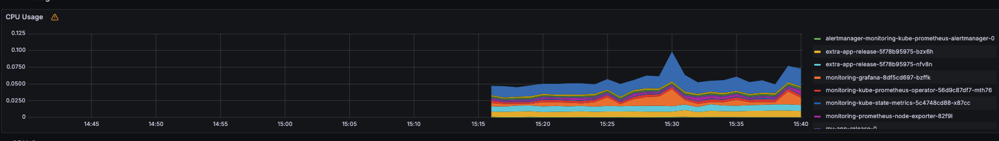

# Kubernetes Monitoring with Kube Prometheus Stack and Bonus Tasks

## Kube Prometheus Stack Components

### Prometheus Operator
Manages Prometheus instances declaratively via custom resources. It simplifies deployment, scaling, and lifecycle management of Prometheus instances.

### Prometheus
A robust time-series database that scrapes, stores, and allows querying of metrics. It evaluates alerting rules and provides historical data for analysis.

### Alertmanager
Receives alerts generated by Prometheus, deduplicates them, and routes notifications to the appropriate channels (e.g., email, Slack).

### Grafana
Provides powerful dashboards for visualizing metrics from Prometheus. Customizable panels allow detailed views on cluster, pod, and application performance.

### Node Exporter
Runs on each node to expose operating system and hardware-level metrics (CPU, memory, disk I/O, etc.) to Prometheus.

### Kube State Metrics
Exports metrics about the state of Kubernetes objects (e.g., Pods, Deployments, StatefulSets) enabling deeper insight into cluster health.

### Custom Resource Definitions (CRDs)
Defines native Kubernetes objects for managing Prometheus, Alertmanager, ServiceMonitors, and PodMonitors, integrating monitoring into the Kubernetes API.

### ServiceMonitors & PodMonitors
Custom resources that instruct Prometheus on which endpoints to scrape, ensuring comprehensive metric collection.

---

## Cluster Resources Overview

### `kubectl get po` - Active Pods
Lists running pods from the monitoring stack and deployed applications:

```
NAME                                                     READY   STATUS    RESTARTS   AGE
alertmanager-monitoring-kube-prometheus-alertmanager-0   2/2     Running   0          15m
extra-app-release-5f78b95975-bzx6h                       1/1     Running   1          6d18h
extra-app-release-5f78b95975-nfv8n                       1/1     Running   1          6d18h
monitoring-grafana-8df5cd697-bzffk                       3/3     Running   0          15m
monitoring-kube-prometheus-operator-56d9c87df7-mth76     1/1     Running   0          15m
monitoring-kube-state-metrics-5c4748cd88-x87cc           1/1     Running   0          15m
monitoring-prometheus-node-exporter-82f9l                1/1     Running   0          15m
my-app-release-0                                         1/1     Running   1          6d18h
my-app-release-1                                         1/1     Running   1          6d18h
my-app-release-2                                         1/1     Running   1          6d18h
prometheus-monitoring-kube-prometheus-prometheus-0       2/2     Running   0          15m
```

### `kubectl get sts` - StatefulSets
Displays stateful components in the cluster:

```
NAME                                                   READY   AGE
alertmanager-monitoring-kube-prometheus-alertmanager   1/1     20m
my-app-release                                         3/3     6d18h
prometheus-monitoring-kube-prometheus-prometheus       1/1     20m
```

### `kubectl get svc` - Services
Internal services exposing Prometheus, Grafana, Alertmanager, and application endpoints:

```
NAME                                      TYPE        CLUSTER-IP       EXTERNAL-IP   PORT(S)                      AGE
alertmanager-operated                     ClusterIP   None             <none>        9093/TCP,9094/TCP,9094/UDP   21m
extra-app-release                         NodePort    10.110.114.156   <none>        3001:32280/TCP               6d20h
kubernetes                                ClusterIP   10.96.0.1        <none>        443/TCP                      7d18h
monitoring-grafana                        ClusterIP   10.106.0.226     <none>        80/TCP                       21m
monitoring-kube-prometheus-alertmanager   ClusterIP   10.100.85.241    <none>        9093/TCP,8080/TCP            21m
monitoring-kube-prometheus-operator       ClusterIP   10.103.129.193   <none>        443/TCP                      21m
monitoring-kube-prometheus-prometheus     ClusterIP   10.97.139.179    <none>        9090/TCP,8080/TCP            21m
monitoring-kube-state-metrics             ClusterIP   10.102.231.254   <none>        8080/TCP                     21m
monitoring-prometheus-node-exporter       ClusterIP   10.99.108.53     <none>        9100/TCP                     21m
my-app-release-headless                   ClusterIP   None             <none>        5001/TCP                     6d18h
my-app-release-service                    NodePort    10.98.230.235    <none>        5001:30415/TCP               6d18h
prometheus-operated                       ClusterIP   None             <none>        9090/TCP                     21m
python-app-my-app-service                 NodePort    10.110.199.113   <none>        5001:31821/TCP               6d20h
```

### `kubectl get pvc` - Persistent Volumes
Lists PVCs used by stateful components:

```
NAME                                  STATUS   VOLUME                                     CAPACITY   ACCESS MODES   STORAGECLASS   VOLUMEATTRIBUTESCLASS   AGE
my-app-pvc                            Bound    pvc-7186d085-eb09-4b7f-8729-39069d90a5dc   1Gi        RWO            standard       <unset>                 6d18h
persistence-volume-my-app-release-0   Bound    pvc-c3ae7456-1c1b-4e2f-b440-5d240921c0f7   1Gi        RWO            standard       <unset>                 6d19h
persistence-volume-my-app-release-1   Bound    pvc-3c9cbf3e-2678-4227-b6e1-915e923cf710   1Gi        RWO            standard       <unset>                 6d18h
persistence-volume-my-app-release-2   Bound    pvc-15f05034-6a0f-4afa-b825-2769311ed0ec   1Gi        RWO            standard       <unset>                 6d18h
```

### `kubectl get cm` - ConfigMaps
Contains configurations, dashboards, and alert rules:

```
NAME                                                           DATA   AGE
extra-app-release-config                                       1      6d20h
kube-root-ca.crt                                               1      7d18h
monitoring-grafana                                             1      22m
monitoring-grafana-config-dashboards                           1      22m
monitoring-kube-prometheus-alertmanager-overview               1      22m
monitoring-kube-prometheus-apiserver                           1      22m
monitoring-kube-prometheus-cluster-total                       1      22m
monitoring-kube-prometheus-controller-manager                  1      22m
monitoring-kube-prometheus-etcd                                1      22m
monitoring-kube-prometheus-grafana-datasource                  1      22m
monitoring-kube-prometheus-grafana-overview                    1      22m
monitoring-kube-prometheus-k8s-coredns                         1      22m
monitoring-kube-prometheus-k8s-resources-cluster               1      22m
monitoring-kube-prometheus-k8s-resources-multicluster          1      22m
monitoring-kube-prometheus-k8s-resources-namespace             1      22m
monitoring-kube-prometheus-k8s-resources-node                  1      22m
monitoring-kube-prometheus-k8s-resources-pod                   1      22m
monitoring-kube-prometheus-k8s-resources-workload              1      22m
monitoring-kube-prometheus-k8s-resources-workloads-namespace   1      22m
monitoring-kube-prometheus-kubelet                             1      22m
monitoring-kube-prometheus-namespace-by-pod                    1      22m
monitoring-kube-prometheus-namespace-by-workload               1      22m
monitoring-kube-prometheus-node-cluster-rsrc-use               1      22m
monitoring-kube-prometheus-node-rsrc-use                       1      22m
monitoring-kube-prometheus-nodes                               1      22m
monitoring-kube-prometheus-nodes-darwin                        1      22m
monitoring-kube-prometheus-persistentvolumesusage              1      22m
monitoring-kube-prometheus-pod-total                           1      22m
monitoring-kube-prometheus-prometheus                          1      22m
monitoring-kube-prometheus-proxy                               1      22m
monitoring-kube-prometheus-scheduler                           1      22m
monitoring-kube-prometheus-workload-total                      1      22m
my-app-release-config                                          1      6d18h
prometheus-monitoring-kube-prometheus-prometheus-rulefiles-0   35     21m
python-app-my-app-config                                       1      6d20h
```

---

## Grafana Dashboard Insights

1. **StatefulSet CPU & Memory Usage:**  
   The dashboard visualizes resource consumption for the `app-my-app` StatefulSet. Metrics show stable CPU and memory usage with no critical spikes.  
   

2. **Pods with Highest/Lowest CPU Usage:**  
   Individual pod metrics reveal that while some pods (e.g., core system pods) exhibit higher CPU utilization, others remain under lower loads, ensuring balanced resource distribution.  
   

3. **Node Memory Usage:**  
   The node memory dashboard displays both percentage usage and absolute values in MiB, indicating healthy memory management across the cluster.  
   

4. **Total Pods & Containers Managed by Kubelet:**  
   A summary panel confirms the number of running pods and containers, verifying that the cluster is efficiently managed by the Kubelet.  
   

5. **Pod Network Usage:**  
   Network metrics for pods in the default namespace show consistent ingress and egress traffic, essential for maintaining communication between services.  
   

6. **Active Alerts:**  
   The alerts panel indicates the current number of active alerts. For detailed management, the Alertmanager UI is accessible via:
   ```bash
   minikube service monitoring-kube-prometheus-alertmanager -n monitoring
   ```
   

---

## Init Container Implementation

### Single Init Container Example

A pod manifest (`demo-pod.yaml`) includes an init container that downloads a file using `wget`:

```yaml
apiVersion: v1
kind: Pod
metadata:
  name: demo-0
spec:
  volumes:
    - name: shared-data
      emptyDir: {}
  initContainers:
    - name: init-downloader
      image: busybox
      command:
        - sh
        - -c
        - "wget -qO /shared/test.html https://example.com"
      volumeMounts:
        - name: shared-data
          mountPath: /shared
  containers:
    - name: app-container
      image: busybox
      command:
        - sh
        - -c
        - "sleep 3600"
      volumeMounts:
        - name: shared-data
          mountPath: /shared
```

After applying the manifest:
```bash
kubectl apply -f demo-pod.yaml
```
Check the downloaded file with:
```bash
kubectl exec demo-0 -- cat /shared/test.html
```

### Multiple Init Containers (Bonus Task)

A bonus manifest (`demo-multi-init.yaml`) demonstrates sequential execution of three init containers that append lines to a shared file:

```yaml
apiVersion: v1
kind: Pod
metadata:
  name: demo-multi
spec:
  volumes:
    - name: shared-data
      emptyDir: {}
  initContainers:
    - name: init-1
      image: busybox
      command: ['sh', '-c', 'echo "Init 1 executed" > /shared/output.txt']
      volumeMounts:
        - name: shared-data
          mountPath: /shared
    - name: init-2
      image: busybox
      command: ['sh', '-c', 'echo "Init 2 executed" >> /shared/output.txt']
      volumeMounts:
        - name: shared-data
          mountPath: /shared
    - name: init-3
      image: busybox
      command: ['sh', '-c', 'echo "Init 3 executed" >> /shared/output.txt']
      volumeMounts:
        - name: shared-data
          mountPath: /shared
  containers:
    - name: app-container
      image: busybox
      command: ['sh', '-c', 'sleep 3600']
      volumeMounts:
        - name: shared-data
          mountPath: /shared
```

Apply the manifest:
```bash
kubectl apply -f demo-multi-init.yaml
```

Verify the sequential execution by checking the shared file:
```bash
kubectl exec demo-multi -- cat /shared/output.txt
```
The expected output should show:
```
Init 1 executed
Init 2 executed
Init 3 executed
```

---

## Bonus: Application Metrics & Health Checks

### Application Metrics Integration
For bonus points, we integrate application-level metrics:
- Ensuring our application exposes metrics at an endpoint (e.g., `/metrics`).
- Configuring Prometheus to scrape this endpoint by adding a ServiceMonitor resource.
- Verify metrics by accessing Prometheus’s targets page at:
  ```bash
  http://<prometheus-service-ip>:9090/targets
  ```


### Health Checks for Enhanced Service Stability
- Updating `docker-compose.yml`, pod specifications to include health checks.
- Example health check in a pod spec:
  ```yaml
  livenessProbe:
    httpGet:
      path: /health
      port: 8080
    initialDelaySeconds: 30
    periodSeconds: 10
  ```
- These checks help in early detection of issues and ensure the robustness of our services.

---

## Accessing Grafana and Alertmanager

- **Grafana UI:**  
  Access via:
  ```bash
  minikube service monitoring-grafana -n monitoring
  ```
  Default credentials: username **admin**, password as retrieved from the secret.

- **Alertmanager UI:**  
  Access via:
  ```bash
  minikube service monitoring-kube-prometheus-alertmanager -n monitoring
  ```
