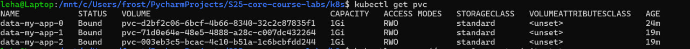

# K8S Monitoring

---

## Components & Brief Description

* **Prometheus operator**: simplify deployment of the whole _prometheus_ stack application into the k8s cluster,
                           managing resources and configuring the specifications of the stack at all
* **Prometheus**: this is an open-source complex system with the following features:
  * Monitoring: the application has the timestamp DB inside that can store a lot of `events` - some actions from the
                configured source
  * Alerting: the application has the ability to set alerts by some thresholds / appearing events
* **Alertmanager**: the name talks a lot by itself - this is a software that manipulate with the incoming alert to
                    properly handle and process them; Also, there is a broad amount of solution for the alerting mechanism,
                    such as emails, chats, calls, etc.
* **Node Exporter**: the application to catch metrics from the Node OS systems ("*NIX kernels") and then to push it
                     in the prometheus; Alongside with the metrics, kernel logs also can be scrapped by it
* **BlackBox Exporter**: the application that can poll different endpoints ("HTTP, HTTPS, DNS, TCP, ICMP and gRPC")
                         to catch metrics from the different applications (i.e. `blackboxes). It is the main component
                         that will talk to your application if you configure monitoring stack explicitly in the
                         software lifecycle (not in the k8s)
* **Adapter**: the real `API` client that will connect to the k8s metrics server to fetch all the necessary stuff that is
               necessary for the proper monitoring
* **State Metrics**: tool for the constant checking the resource state (abstract state, not the `real` state, i.e.
                     health or accessibility). Mostly give metrics about the cluster state by http `/metrics` endpoint
* **Grafana**: open-source system that visualise the metrics from a **really** broad amount of sources in the
               user-convenient way. There are a lot of different configurations, visualisation techniques, and the
               system overall are flexible to work with almost every source

---

* I placed `kube-monitoring-stack` into the `monitoring` namespace

* Explanations:
  * Pods the same I explained upper
  * StatefulSet of the application with the most necessary uptime
  * Services to interconnect between application inside the k8s network
  * ConfigMaps mostly for the configuration of the applications
  * Also, there are a secrets, for example to fetch the password for the Grafana admin:

---

* CPU and Memory consumption of your StatefulSet
  * Dashboard: `Kubernetes / Compute Resources / Workload`

* Pods with higher and lower CPU usage in the default namespace (additionally add the image with the `monitoring` namespace)
  * Dashboard: `Kubernetes / Compute Resources / Namespace (Pods)`

* Node memory usage in percentage and megabytes
  * Dashboard: `Node Exporter / Nodes`

* Count the number of pods and containers managed by the Kubelet service.
  * Dashboard: `Kubernetes / Kubelet`

* Network usage of Pods in the default namespace (additionally add the image with the `monitoring` namespace)
  * Dashboard: `Kubernetes / Networking / Namespace (Pods)`

* Number of active alerts
  * Dashboard: `Alertmanager / Overview`

---

## Init Containers

* To make it easier, I will write these containers inside the helm `python-app` release, setting the replicaCount=1
* Additionally, I made the 4th container that sleep for huge amount of time to check the `message.txt` file

