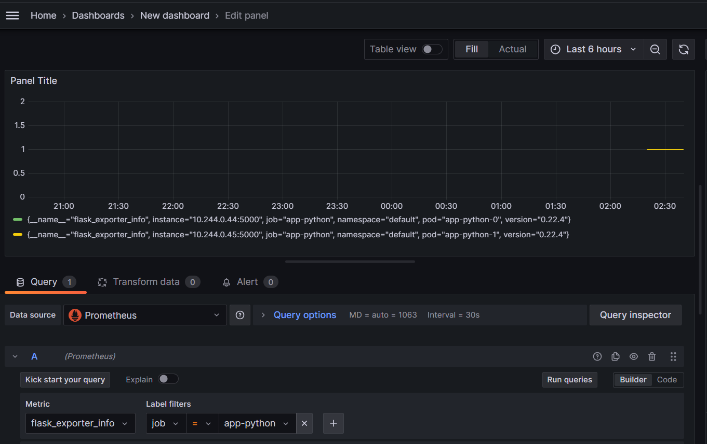

# Kubernetes Monitoring and Init Containers

## Task 1

### Components

- **The Prometheus Operator**

  - **Role**: simplification of Prometheus management in Kubernetes.

  - **Functions**: automates configuration, lifecycle management, and scaling of Prometheus and related components.

- **Highly Available Prometheus**

  - **Role**: ensuring fault-tolerant metric collection.

  - **Functions**: runs multiple Prometheus instances for redundancy and uses tools like Thanos for global querying.

- **Highly Available Alertmanager**

  - **Role**: proving reliable alert delivery.

  - **Functions**: runs multiple Alertmanager instances to route alerts during failures.

- **Prometheus node-exporter**
  - **Role**: collecting node-level metrics.
  
  - **Functions**: exports CPU, memory, disk, and network metrics for Prometheus to scrape.
  
- **Prometheus blackbox-exporter**

  - **Role**: monitoring of external service availability.

  - **Functions**: probes HTTP, TCP, and other endpoints and exposes metrics for Prometheus.

- **Prometheus Adapter for Kubernetes Metrics APIs**

  - **Role**: enabling custom metrics for Kubernetes autoscaling.

  - **Functions**: converts Prometheus metrics for use by Kubernetes HPA.

- **kube-state-metrics**

  - **Role**: tracking of Kubernetes resource states.

  - **Functions**: exports metrics about pods, deployments, nodes, and other Kubernetes objects.

- **Grafana**

  - **Role**: visualization of monitoring data.

  - **Functions**: creates dashboards and graphs for Prometheus metrics, enabling real-time analysis.

### App's Helm chart installation

```sh
(venv) vm@vm /m/v/d/h/V/U/L/P/D/S/k8s (lab15)> helm install python-app python-app
NAME: python-app
LAST DEPLOYED: Wed Mar 19 12:33:51 2025
NAMESPACE: default
STATUS: deployed
REVISION: 1
NOTES:
1. Get the application URL by running these commands:
  export POD_NAME=$(kubectl get pods --namespace default -l "app.kubernetes.io/name=python-app,app.kubernetes.io/instance=python-app" -o jsonpath="{.items[0].metadata.name}")
  export CONTAINER_PORT=$(kubectl get pod --namespace default $POD_NAME -o jsonpath="{.spec.containers[0].ports[0].containerPort}")
  echo "Visit http://127.0.0.1:8080 to use your application"
  kubectl --namespace default port-forward $POD_NAME 8080:$CONTAINER_PORT
(venv) vm@vm /m/v/d/h/V/U/L/P/D/S/k8s (lab15)> kubectl get po,sts,svc,pvc,cm
NAME                                                           READY   STATUS    RESTARTS   AGE
pod/alertmanager-prometheus-community-kube-alertmanager-0      2/2     Running   0          22m
pod/prometheus-community-grafana-797dbf5c7d-5mfqs              3/3     Running   0          23m
pod/prometheus-community-kube-operator-7f7d9cf57c-2gq44        1/1     Running   0          23m
pod/prometheus-community-kube-state-metrics-757ff5bb66-brqqd   1/1     Running   0          23m
pod/prometheus-community-prometheus-node-exporter-5jbjw        1/1     Running   0          23m
pod/prometheus-prometheus-community-kube-prometheus-0          2/2     Running   0          22m
pod/python-app-0                                               2/2     Running   0          17s
pod/python-app-1                                               2/2     Running   0          17s
pod/python-app-2                                               2/2     Running   0          17s
pod/vault-0                                                    1/1     Running   3          3d12h
pod/vault-agent-injector-cb67b46-htkrl                         1/1     Running   3          3d12h

NAME                                                                   READY   AGE
statefulset.apps/alertmanager-prometheus-community-kube-alertmanager   1/1     22m
statefulset.apps/prometheus-prometheus-community-kube-prometheus       1/1     22m
statefulset.apps/python-app                                            3/3     17s
statefulset.apps/vault                                                 1/1     3d12h

NAME                                                    TYPE        CLUSTER-IP       EXTERNAL-IP   PORT(S)                      AGE
service/alertmanager-operated                           ClusterIP   None             <none>        9093/TCP,9094/TCP,9094/UDP   22m
service/kubernetes                                      ClusterIP   10.96.0.1        <none>        443/TCP                      3d14h
service/prometheus-community-grafana                    ClusterIP   10.104.224.186   <none>        80/TCP                       23m
service/prometheus-community-kube-alertmanager          ClusterIP   10.106.196.155   <none>        9093/TCP,8080/TCP            23m
service/prometheus-community-kube-operator              ClusterIP   10.97.183.77     <none>        443/TCP                      23m
service/prometheus-community-kube-prometheus            ClusterIP   10.97.95.160     <none>        9090/TCP,8080/TCP            23m
service/prometheus-community-kube-state-metrics         ClusterIP   10.108.49.1      <none>        8080/TCP                     23m
service/prometheus-community-prometheus-node-exporter   ClusterIP   10.108.21.186    <none>        9100/TCP                     23m
service/prometheus-operated                             ClusterIP   None             <none>        9090/TCP                     22m
service/python-app                                      ClusterIP   10.106.59.8      <none>        5000/TCP                     17s
service/python-app-headless                             ClusterIP   None             <none>        5000/TCP                     17s
service/vault                                           ClusterIP   10.96.124.72     <none>        8200/TCP,8201/TCP            3d12h
service/vault-agent-injector-svc                        ClusterIP   10.103.138.23    <none>        443/TCP                      3d12h
service/vault-internal                                  ClusterIP   None             <none>        8200/TCP,8201/TCP            3d12h

NAME                                        STATUS   VOLUME                                     CAPACITY   ACCESS MODES   STORAGECLASS   VOLUMEATTRIBUTESCLASS   AGE
persistentvolumeclaim/visits-python-app-0   Bound    pvc-77de9fa9-60a3-47e7-bee7-9ca2ec0a1ee1   1Mi        RWO            standard       <unset>                 17s
persistentvolumeclaim/visits-python-app-1   Bound    pvc-16a87c54-55a2-4a5e-9b6f-a2831a5eba8a   1Mi        RWO            standard       <unset>                 17s
persistentvolumeclaim/visits-python-app-2   Bound    pvc-5abfe1f1-9e41-4267-ada8-58815d844d3a   1Mi        RWO            standard       <unset>                 17s

NAME                                                                    DATA   AGE
configmap/kube-root-ca.crt                                              1      3d14h
configmap/prometheus-community-grafana                                  1      23m
configmap/prometheus-community-grafana-config-dashboards                1      23m
configmap/prometheus-community-kube-alertmanager-overview               1      23m
configmap/prometheus-community-kube-apiserver                           1      23m
configmap/prometheus-community-kube-cluster-total                       1      23m
configmap/prometheus-community-kube-controller-manager                  1      23m
configmap/prometheus-community-kube-etcd                                1      23m
configmap/prometheus-community-kube-grafana-datasource                  1      23m
configmap/prometheus-community-kube-grafana-overview                    1      23m
configmap/prometheus-community-kube-k8s-coredns                         1      23m
configmap/prometheus-community-kube-k8s-resources-cluster               1      23m
configmap/prometheus-community-kube-k8s-resources-multicluster          1      23m
configmap/prometheus-community-kube-k8s-resources-namespace             1      23m
configmap/prometheus-community-kube-k8s-resources-node                  1      23m
configmap/prometheus-community-kube-k8s-resources-pod                   1      23m
configmap/prometheus-community-kube-k8s-resources-workload              1      23m
configmap/prometheus-community-kube-k8s-resources-workloads-namespace   1      23m
configmap/prometheus-community-kube-kubelet                             1      23m
configmap/prometheus-community-kube-namespace-by-pod                    1      23m
configmap/prometheus-community-kube-namespace-by-workload               1      23m
configmap/prometheus-community-kube-node-cluster-rsrc-use               1      23m
configmap/prometheus-community-kube-node-rsrc-use                       1      23m
configmap/prometheus-community-kube-nodes                               1      23m
configmap/prometheus-community-kube-nodes-aix                           1      23m
configmap/prometheus-community-kube-nodes-darwin                        1      23m
configmap/prometheus-community-kube-persistentvolumesusage              1      23m
configmap/prometheus-community-kube-pod-total                           1      23m
configmap/prometheus-community-kube-prometheus                          1      23m
configmap/prometheus-community-kube-proxy                               1      23m
configmap/prometheus-community-kube-scheduler                           1      23m
configmap/prometheus-community-kube-workload-total                      1      23m
configmap/prometheus-prometheus-community-kube-prometheus-rulefiles-0   35     22m
configmap/python-app-config                                             1      17s

```

**Explanation**:

- **Pods:**

  There are instances of my `python-app`, `vault` components and described above `prometheus` components with proper naming.

- **StatefulSets:**

  There presented `StatefulSets`, which represents stateful applications (new are `alertmanager` and `prometheus`).

- **Services:**

  There are services among which you can see services for all `prometheus` components. All of them are `ClusterIP`, so we may touch them only locally.

- **PersistentVolumeClaims:**

  PVC are the same as in precious lab.

- **ConfigMaps:**

  There are a lot of `ConfigMaps`, especially for `prometheus` components, so we may assume high flexibility in configuration of them.

### Dashboard

**CPU consumption**


**Memory consumption**


Memory and CPU consumption provided for `default` namespace and sorted in order from higher to lower.

**Node memory**


**Kubelet pods and containers**


**Network usage**


**Active alters**


And Web UI


## Task 2

**Proof of the Init container execution**

```sh
vm@vm /m/v/d/h/V/U/L/P/D/S/k8s (lab15)> helm install python-app python-app
NAME: python-app
LAST DEPLOYED: Wed Mar 19 20:27:55 2025
NAMESPACE: default
STATUS: deployed
REVISION: 1
NOTES:
1. Get the application URL by running these commands:
  export POD_NAME=$(kubectl get pods --namespace default -l "app.kubernetes.io/name=python-app,app.kubernetes.io/instance=python-app" -o jsonpath="{.items[0].metadata.name}")
  export CONTAINER_PORT=$(kubectl get pod --namespace default $POD_NAME -o jsonpath="{.spec.containers[0].ports[0].containerPort}")
  echo "Visit http://127.0.0.1:8080 to use your application"
  kubectl --namespace default port-forward $POD_NAME 8080:$CONTAINER_PORT
vm@vm /m/v/d/h/V/U/L/P/D/S/k8s (lab15)> kubectl exec python-app-0 -- cat /app/init/test.html
Defaulted container "python-app" out of: python-app, vault-agent, python-app-init (init), vault-agent-init (init)
<!doctype html>
<html>
<head>
    <title>Example Domain</title>

    <meta charset="utf-8" />
    <meta http-equiv="Content-type" content="text/html; charset=utf-8" />
    <meta name="viewport" content="width=device-width, initial-scale=1" />
    <style type="text/css">
    body {
        background-color: #f0f0f2;
        margin: 0;
        padding: 0;
        font-family: -apple-system, system-ui, BlinkMacSystemFont, "Segoe UI", "Open Sans", "Helvetica Neue", Helvetica, Arial, sans-serif;
        
    }
    div {
        width: 600px;
        margin: 5em auto;
        padding: 2em;
        background-color: #fdfdff;
        border-radius: 0.5em;
        box-shadow: 2px 3px 7px 2px rgba(0,0,0,0.02);
    }
    a:link, a:visited {
        color: #38488f;
        text-decoration: none;
    }
    @media (max-width: 700px) {
        div {
            margin: 0 auto;
            width: auto;
        }
    }
    </style>    
</head>

<body>
<div>
    <h1>Example Domain</h1>
    <p>This domain is for use in illustrative examples in documents. You may use this
    domain in literature without prior coordination or asking for permission.</p>
    <p><a href="https://www.iana.org/domains/example">More information...</a></p>
</div>
</body>
</html>
vm@vm /m/v/d/h/V/U/L/P/D/S/k8s (lab15)> kubectl logs python-app-1 -c python-app-init
Connecting to example.com (96.7.128.175:443)
wget: note: TLS certificate validation not implemented
saving to '/init/test.html'
test.html            100% |********************************|  1256  0:00:00 ETA
'/init/test.html' saved
```

## Bonus task

**Metrics**




**Init containers queue**

Each container writes string "randomstr<its number>" to the file:

```sh
vm@vm /m/v/d/h/V/U/L/P/D/S/k8s (lab15)> helm install python-app python-app
NAME: python-app
LAST DEPLOYED: Wed Mar 19 21:00:06 2025
NAMESPACE: default
STATUS: deployed
REVISION: 1
NOTES:
1. Get the application URL by running these commands:
  export POD_NAME=$(kubectl get pods --namespace default -l "app.kubernetes.io/name=python-app,app.kubernetes.io/instance=python-app" -o jsonpath="{.items[0].metadata.name}")
  export CONTAINER_PORT=$(kubectl get pod --namespace default $POD_NAME -o jsonpath="{.spec.containers[0].ports[0].containerPort}")
  echo "Visit http://127.0.0.1:8080 to use your application"
  kubectl --namespace default port-forward $POD_NAME 8080:$CONTAINER_PORT
vm@vm /m/v/d/h/V/U/L/P/D/S/k8s (lab15)> kubectl get po
NAME                                                       READY   STATUS    RESTARTS       AGE
alertmanager-prometheus-community-kube-alertmanager-0      2/2     Running   2 (101m ago)   8h
prometheus-community-grafana-797dbf5c7d-5mfqs              3/3     Running   3 (101m ago)   8h
prometheus-community-kube-operator-7f7d9cf57c-2gq44        1/1     Running   1 (101m ago)   8h
prometheus-community-kube-state-metrics-757ff5bb66-brqqd   1/1     Running   1 (101m ago)   8h
prometheus-community-prometheus-node-exporter-5jbjw        1/1     Running   1 (101m ago)   8h
prometheus-prometheus-community-kube-prometheus-0          2/2     Running   2 (101m ago)   8h
python-app-0                                               2/2     Running   0              20s
python-app-1                                               2/2     Running   0              20s
python-app-2                                               2/2     Running   0              20s
vault-0                                                    1/1     Running   4 (101m ago)   3d21h
vault-agent-injector-cb67b46-htkrl                         1/1     Running   4 (101m ago)   3d21h
vm@vm /m/v/d/h/V/U/L/P/D/S/k8s (lab15)> kubectl exec python-app-0 -- cat /app/init/test.txt
Defaulted container "python-app" out of: python-app, vault-agent, python-app-init (init), python-app-init-one (init), python-app-init-two (init), python-app-init-three (init), vault-agent-init (init)
randomstr1
randomstr2
randomstr3
```


