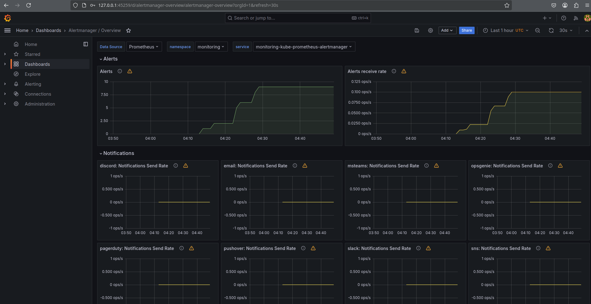

#  Kubernetes Monitoring and Init Containers

## **Task 1: Kubernetes Cluster Monitoring with Prometheus**

### **1. Understanding Kube Prometheus Stack Components**

The **Kube Prometheus Stack** is a comprehensive monitoring solution for Kubernetes clusters. It bundles several open-source tools to provide a full-stack monitoring experience. Below is a breakdown of its key components and their roles:

1. **Prometheus**:
   - **Role**: Core monitoring and alerting tool.
   - **Function**: Collects metrics from Kubernetes components and applications, stores them in a time-series database, and allows querying using PromQL.

2. **Grafana**:
   - **Role**: Visualization tool.
   - **Function**: Provides dashboards to visualize metrics collected by Prometheus.

3. **Alertmanager**:
   - **Role**: Handles alerts generated by Prometheus.
   - **Function**: Deduplicates, groups, and routes alerts to appropriate receivers.

4. **kube-state-metrics**:
   - **Role**: Generates metrics about the state of Kubernetes objects.
   - **Function**: Provides insights into the health and status of Kubernetes resources.

5. **node-exporter**:
   - **Role**: Collects hardware and OS-level metrics from Kubernetes nodes.
   - **Function**: Exposes metrics like CPU, memory, disk, and network usage.

6. **Prometheus Operator**:
   - **Role**: Simplifies the deployment and management of Prometheus and related components.
   - **Function**: Automates the configuration of Prometheus instances, alerting rules, and service monitors.

7. **Service Monitors**:
   - **Role**: Defines how Prometheus should scrape metrics from specific services.
   - **Function**: Enables dynamic discovery and monitoring of services.

---

### **2. Installing Helm Charts**

1. **Install Kube Prometheus Stack**:
   ```bash
   helm repo add prometheus-community https://prometheus-community.github.io/helm-charts
   helm repo update
   kubectl create namespace monitoring
   helm install monitoring prometheus-community/kube-prometheus-stack --version 57.2.0 --namespace monitoring
   ```

2. **Install Your App's Helm Chart**:
   ```bash
   helm install my-app ./my-app-chart
   ```

3. **Verify Installation**:
   ```bash
   kubectl get po,sts,svc,pvc,cm

   NAME                          READY   STATUS    RESTARTS   AGE
   python-app-0                  1/1     Running   0          12s
   python-app-1                  1/1     Running   0          25s
   python-app-59654f9bff-5vflw   1/1     Running   2          6d9h
   python-app-59654f9bff-665jx   1/1     Running   2          6d9h
   
   NAME         READY   AGE
   python-app   2/2     14m

   NAME         TYPE        CLUSTER-IP      EXTERNAL-IP   PORT(S)    AGE
   kubernetes   ClusterIP   10.96.0.1       <none>        443/TCP    13d
   python-app   ClusterIP   10.103.67.110   <none>        5000/TCP   14m

   NAME                STATUS   VOLUME                                     CAPACITY   ACCESS MODES   STORAGECLASS   VOLUMEATTRIBUTESCLASS   AGE
   data-python-app-0   Bound    pvc-9a9328eb-427b-4268-bcef-dc58533c3b48   1Gi        RWO            standard       <unset>                 6d9h
   data-python-app-1   Bound    pvc-18784c4a-0e84-4ce5-a097-1d037f757e16   1Gi        RWO            standard       <unset>                 6d9h

   NAME               DATA   AGE
   kube-root-ca.crt   1      13d
   my-config          1      14m
   ```
   

---

### **3. Utilizing Grafana Dashboards**

1. **Access Grafana**:
   ```bash
   minikube service monitoring-grafana
   ```

2. **Explore Dashboards**:
   - **Kubernetes / Compute Resources / Cluster**: Shows CPU and memory usage.
   
   

   - **Kubernetes / Pods**: Displays resource usage by individual pods.

3. **Answer the Following Questions**:
   - **CPU and Memory Consumption of StatefulSet**:
     
   - **Pods with Higher and Lower CPU Usage**:
     
   - **Node Memory Usage**:
     
   - **Number of Pods and Containers Managed by Kubelet**:
     
   - **Network Usage of Pods**:
     
   - **Active Alerts**:
     - Access the Alertmanager UI:
       ```bash
       minikube service monitoring-kube-prometheus-alertmanager
       ```
     


     


## **Task 2: Init Containers**

### **1. Implementing an Init Container**

#### **Step 1: Create a Persistent Volume (PV) and Persistent Volume Claim (PVC) on app/templates**
1. **Create a Persistent Volume (PV)**:
   ```yaml
   apiVersion: v1
   kind: PersistentVolume
   metadata:
     name: demo-pv
   spec:
     capacity:
       storage: 1Gi
     accessModes:
       - ReadWriteOnce
     hostPath:
       path: /mnt/data
   ```

2. **Create a Persistent Volume Claim (PVC)**:
   ```yaml
   apiVersion: v1
   kind: PersistentVolumeClaim
   metadata:
     name: demo-pvc
   spec:
     accessModes:
       - ReadWriteOnce
     resources:
       requests:
         storage: 1Gi
   ```

   Apply the PV and PVC:
   ```bash
   kubectl apply -f pv.yaml
   kubectl apply -f pvc.yaml
   ```

#### **Step 2: Create a Pod with an Init Container**
```yaml
apiVersion: v1
kind: Pod
metadata:
  name: demo
spec:
  volumes:
    - name: shared-data
      persistentVolumeClaim:
        claimName: demo-pvc
  initContainers:
    - name: download-file
      image: busybox
      command: ["wget", "-O", "/shared-data/test.html", "https://example.com"]
      volumeMounts:
        - name: shared-data
          mountPath: /shared-data
  containers:
    - name: main-container
      image: nginx
      volumeMounts:
        - name: shared-data
          mountPath: /usr/share/nginx/html
      ports:
        - containerPort: 80
```

#### **Step 3: Apply the Pod Manifest**
```bash
kubectl apply -f pod.yaml
```

---

### **3. Proof of Success**

#### **Step 1: Verify the Init Container Completed**
```bash
kubectl get pods
```


#### **Step 2: Verify the Downloaded File**
```bash
kubectl exec pod/demo -- cat /usr/share/nginx/html/test.html
```
