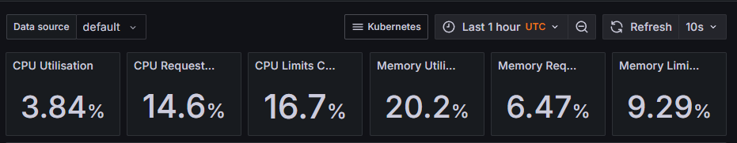

# Lab 15 : Kubernetes Monitoring and Init Containers

## Components

### Prometheus
Prometheus is a monitoring tool and time-series database that:
- Collects metrics via HTTP (pull-based)
- Stores time-series data
- Supports querying with PromQL
- Visualizes data through built-in tools

### Alertmanager
Handles alerts triggered by Prometheus by:
- Deduplicating and grouping alerts
- Routing notifications (email, Slack, PagerDuty)
- Silencing alerts when required

### Grafana
Grafana is a visualization and analytics platform that:
- Creates interactive dashboards
- Integrates data from various sources
- Sets up alerts based on metrics
- Analyzes data trends and anomalies

### Node Exporter
Collects hardware and OS metrics such as:
- CPU, memory, and disk utilization
- System load
- Filesystem statistics
- Network performance

### kube-state-metrics
Generates metrics based on Kubernetes object states, including:
- Pod, deployment, and node statuses
- Replica counts and resource limits
- Job and cron job states

### Prometheus Operator
Simplifies Prometheus stack management through Kubernetes CRDs:
- Automates Prometheus deployment
- Manages alerting rules
- Configures ServiceMonitors

## Installation and Verification

```bash
$ helm repo add prometheus-community https://prometheus-community.github.io
/helm-charts
"prometheus-community" has been added to your repositories
```

```bash
$ helm repo update
Hang tight while we grab the latest from your chart repositories...
...Successfully got an update from the "hashicorp" chart repository
...Successfully got an update from the "argo" chart repository
...Successfully got an update from the "prometheus-community" chart repository
...Successfully got an update from the "stable" chart repository
Update Complete. ⎈Happy Helming!⎈
```

```bash
$    helm install monitoring prometheus-community/kube-prometheus-stack --namespace monitoring --create-namespace
NAME: monitoring
LAST DEPLOYED: Sun Mar 23 22:17:28 2025
NAMESPACE: monitoring
STATUS: deployed
REVISION: 1
NOTES:
kube-prometheus-stack has been installed. Check its status by running:     
  kubectl --namespace monitoring get pods -l "release=monitoring"

Get Grafana 'admin' user password by running:

  kubectl --namespace monitoring get secrets monitoring-grafana -o jsonpath="{.data.admin-password}" | base64 -d ; echo

Access Grafana local instance:

  export POD_NAME=$(kubectl --namespace monitoring get pod -l "app.kubernetes.io/name=grafana,app.kubernetes.io/instance=monitoring" -oname)
  kubectl --namespace monitoring port-forward $POD_NAME 3000

Visit https://github.com/prometheus-operator/kube-prometheus for instructions on how to create & configure Alertmanager and Prometheus instances using the Operator.
```

```bash
kubectl get po -n monitoring
$ kubectl get po -n monitoring
NAME                                                     READY   STATUS              RESTARTS   AGE
alertmanager-monitoring-kube-prometheus-alertmanager-0   0/2     PodInitializing     0          93s
monitoring-grafana-76fb7b98c6-g98z8                      0/3     ContainerCreating   0          109s
monitoring-kube-prometheus-operator-75d598485f-64mcv     1/1     Running             0          109s
monitoring-kube-state-metrics-5fdcf4dd5d-ww6jr           1/1     Running             0          109s
monitoring-prometheus-node-exporter-xkhrk                1/1     Running             0          109s
prometheus-monitoring-kube-prometheus-prometheus-0       0/2     PodInitializing     0          91s
```
### Monitoring Resources
Check monitoring-related Kubernetes resources:
```bash
kubectl get pods,sts,svc,pvc,cm -n monitoring
$ kubectl get pods,sts,svc,pvc,cm -n monitoring
NAME                                                         READY   STATUS    RESTARTS   AGE
pod/alertmanager-monitoring-kube-prometheus-alertmanager-0   2/2     Running   0          4m5s
pod/monitoring-grafana-76fb7b98c6-g98z8                      3/3     Running   0          4m21s
pod/monitoring-kube-prometheus-operator-75d598485f-64mcv     1/1     Running   0          4m21s
pod/monitoring-kube-state-metrics-5fdcf4dd5d-ww6jr           1/1     Running   0          4m21s
pod/monitoring-prometheus-node-exporter-xkhrk                1/1     Running   0          4m21s
pod/prometheus-monitoring-kube-prometheus-prometheus-0       2/2     Running   0          4m3s

NAME                                                                    READY   AGE
statefulset.apps/alertmanager-monitoring-kube-prometheus-alertmanager   1/1     4m5s
statefulset.apps/prometheus-monitoring-kube-prometheus-prometheus       1/1     4m4s

NAME                                              TYPE        CLUSTER-IP       EXTERNAL-IP   PORT(S)                      AGE
service/alertmanager-operated                     ClusterIP   None         
    <none>        9093/TCP,9094/TCP,9094/UDP   4m5s
service/monitoring-grafana                        ClusterIP   10.107.164.182   <none>        80/TCP                       4m21s
service/monitoring-kube-prometheus-alertmanager   ClusterIP   10.108.109.72    <none>        9093/TCP,8080/TCP            4m21s
service/monitoring-kube-prometheus-operator       ClusterIP   10.103.160.228   <none>        443/TCP                      4m21s
service/monitoring-kube-prometheus-prometheus     ClusterIP   10.98.34.106     <none>        9090/TCP,8080/TCP            4m21s
service/monitoring-kube-state-metrics             ClusterIP   10.104.77.109    <none>        8080/TCP                     4m21s
service/monitoring-prometheus-node-exporter       ClusterIP   10.105.54.45     <none>        9100/TCP                     4m21s
service/prometheus-operated                       ClusterIP   None         
    <none>        9090/TCP                     4m4s

NAME                                                                     DATA   AGE
configmap/kube-root-ca.crt                                               1      4m50s
configmap/monitoring-grafana                                             1      4m21s
configmap/monitoring-grafana-config-dashboards                           1      4m21s
configmap/monitoring-kube-prometheus-alertmanager-overview               1      4m21s
configmap/monitoring-kube-prometheus-apiserver                           1      4m21s
configmap/monitoring-kube-prometheus-cluster-total                       1      4m21s
configmap/monitoring-kube-prometheus-controller-manager                  1      4m21s
configmap/monitoring-kube-prometheus-etcd                                1      4m21s
configmap/monitoring-kube-prometheus-grafana-datasource                  1      4m21s
configmap/monitoring-kube-prometheus-grafana-overview                    1      4m21s
configmap/monitoring-kube-prometheus-k8s-coredns                         1      4m21s
configmap/monitoring-kube-prometheus-k8s-resources-cluster               1      4m21s
configmap/monitoring-kube-prometheus-k8s-resources-multicluster          1      4m21s
configmap/monitoring-kube-prometheus-k8s-resources-namespace             1      4m21s
configmap/monitoring-kube-prometheus-k8s-resources-node                  1      4m21s
configmap/monitoring-kube-prometheus-k8s-resources-pod                   1      4m21s
configmap/monitoring-kube-prometheus-k8s-resources-workload              1      4m21s
configmap/monitoring-kube-prometheus-k8s-resources-workloads-namespace   1      4m21s
configmap/monitoring-kube-prometheus-kubelet                             1      4m21s
configmap/monitoring-kube-prometheus-namespace-by-pod                    1      4m21s
configmap/monitoring-kube-prometheus-namespace-by-workload               1      4m21s
configmap/monitoring-kube-prometheus-node-cluster-rsrc-use               1      4m21s
configmap/monitoring-kube-prometheus-node-rsrc-use                       1      4m21s
configmap/monitoring-kube-prometheus-nodes                               1      4m21s
configmap/monitoring-kube-prometheus-nodes-aix                           1      4m21s
configmap/monitoring-kube-prometheus-nodes-darwin                        1      4m21s
configmap/monitoring-kube-prometheus-persistentvolumesusage              1      4m21s
configmap/monitoring-kube-prometheus-pod-total                           1      4m21s
configmap/monitoring-kube-prometheus-prometheus                          1      4m21s
configmap/monitoring-kube-prometheus-proxy                               1      4m21s
configmap/monitoring-kube-prometheus-scheduler                           1      4m21s
configmap/monitoring-kube-prometheus-workload-total                      1      4m21s
configmap/prometheus-monitoring-kube-prometheus-prometheus-rulefiles-0   35     4m4s

```


## Grafana Metrics Overview

### Grafana Access
Open Grafana service with Minikube:
```bash
minikube service monitoring-grafana -n monitoring --url
* le service monitoring/monitoring-grafana n'a pas de port de nœud
! Les services [monitoring/monitoring-grafana] ont le type "ClusterIP" non destiné à être exposé, cependant pour le développement local, minikube vous permet d'y accéder !
http://127.0.0.1:60829
! Comme vous utilisez un pilote Docker sur windows, le terminal doit être ouvert pour l'exécuter.
```


Login credentials: admin, password from Kubernetes secret.
```bash
$ kubectl get secret -n monitoring monitoring-grafana -o jsonpath="{.data.admin-password}" | base64 --decode ; echo
prom-operator
```




Here’s a paraphrased version of your instructions with a clearer and more concise structure:  

---

### **Monitoring Metrics Overview**  

#### **1. Python App StatefulSet CPU & Memory Usage**  
- **Dashboard**: *Kubernetes / Compute Resources / Workload*  
- **Filters**: Namespace → `default`, Workload → `python-app`  
- **Observation**: CPU and memory usage are very low.  

#### **2. Pod CPU Usage in Default Namespace**  
- **Dashboard**: *Kubernetes / Compute Resources / Pod*  
- **Filters**: Namespace → `default`  
- **Findings**:  
  - Highest CPU usage comes from monitoring components (Prometheus).  
  - `python-app` pods show minimal CPU usage (~2%).  

#### **3. Node Memory Utilization**  
- **Dashboard**: *Kubernetes / Compute Resources / Node (Pods)*  
- **Observation**: Minikube node uses ~46% memory (~1.5 GB).  

#### **4. Pod & Container Count Managed by Kubelet**  
- **Dashboard**: *Kubernetes / Kubelet*  
- **Metrics**:  
  - Total pods: **16**  
  - Total containers: **21**  

#### **5. Pod Network Traffic (Default Namespace)**  
- **Dashboard**: *Kubernetes / Networking / Pod*  
- **Filters**: Namespace → `default`  
- **Observation**:  
  - **Transmitted**: 32.1 kbps  
  - **Received**: 11.3 kbps  

#### **6. Active Alerts**  
- **Method 1**: Check the *Alerting* section in Grafana.  
- **Method 2**: Run:  
  ```sh
  minikube service monitoring-kube-prometheus-alertmanager
  ```  
- **Current Alerts**: 7 active alerts in the system.  

Note that the metric values may change depending on when you check Grafana and your cluster's current status.

## Init Container Implementation

Init Containers perform preliminary tasks before the main application containers start.

### Pod Creation with Init Container Example

```yaml
apiVersion: v1
 kind: Pod
 metadata:
   name: demo-pod
   labels:
     app: demo-pod
 spec:
   volumes:
     - name: shared-data
       emptyDir: {}
   initContainers:
     - name: init-download
       image: busybox
       command: ['wget', '-O', '/work-dir/index.html', 'kubernetes.io']
       volumeMounts:
         - name: shared-data
           mountPath: "/work-dir"
   containers:
     - name: demo-container
       image: busybox
       command: ['sh', '-c', 'while true; do sleep 30; done']
       volumeMounts:
         - name: shared-data
           mountPath: "/usr/share/nginx/html" 
```

This setup establishes:

1. A shared storage named `shared-data` with the `emptyDir` type, providing an initially empty directory that persists through container failures but gets erased upon Pod termination.

2. An initialization container called `init-download` that:
   - Utilizes the busybox image
   - Executes a wget command to retrieve the kubernetes.io homepage
   - Stores the content as index.html in the shared volume accessible at `/work-dir`

3. The primary container which:
   - Executes a basic continuous loop to maintain the container's operation
   - Accesses the same shared volume mounted at `/usr/share/nginx/html`
   
### Verification
Check downloaded content:
```bash
kubectl exec pod/demo -- cat /usr/share/nginx/html/index.html | head -n 5```

