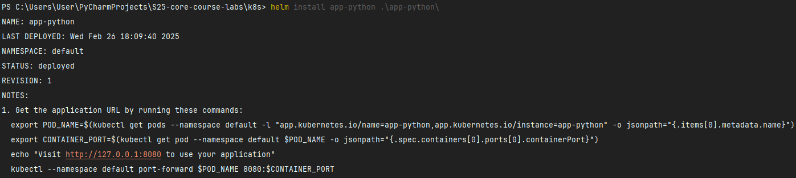
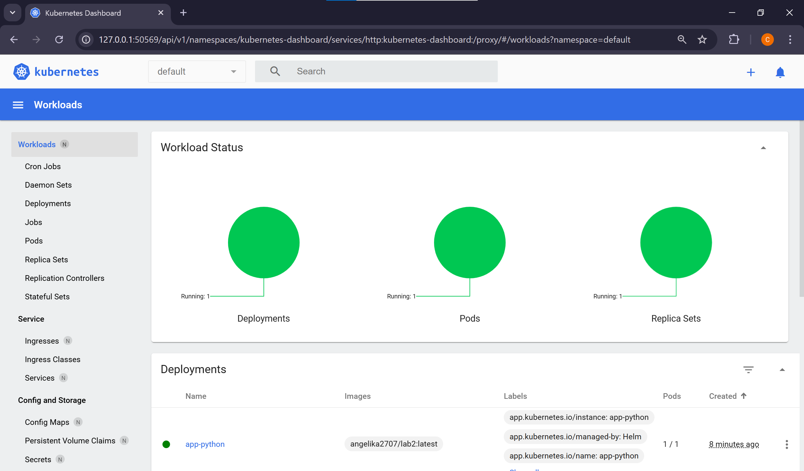
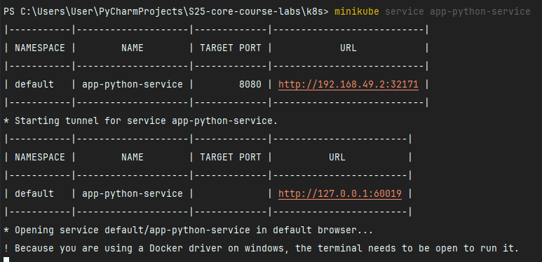
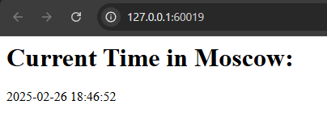
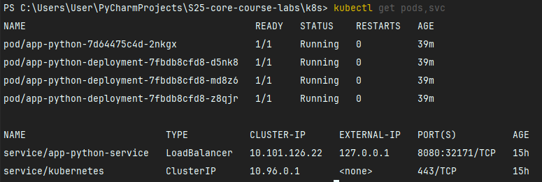
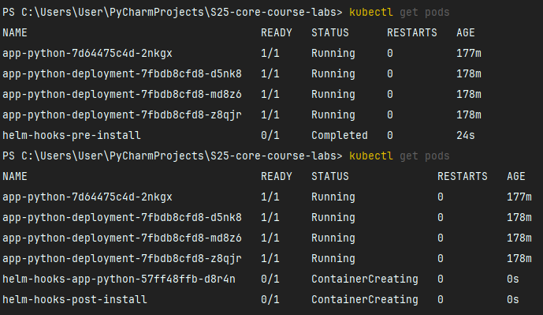
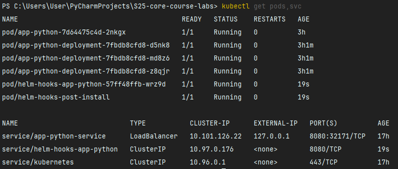

## Task 1: Helm Setup and Chart Creation

1. Install Helm:



2. Check minikube dashboard via `minikube dashboard`:



3. Check what our application running in the browser on the same port:





4. Check via `kubectl get pods,svc` command:



## Task 2: Helm Chart Hooks

1. Checking `kubectl get po`



2. `kubectl describe po helm-hooks-pre-install`:

```bash
PS C:\Users\User\PyCharmProjects\S25-core-course-labs> kubectl describe po helm-hooks-pre-install
Name:             helm-hooks-pre-install
Namespace:        default
Priority:         0
Service Account:  default
Node:             minikube/192.168.49.2
Start Time:       Wed, 26 Feb 2025 21:17:20 +0300
Labels:           app=helm-hooks-pre-install
Annotations:      helm.sh/hook: pre-install
                  helm.sh/hook-delete-policy: hook-succeeded
Status:           Running
IP:               10.244.0.49
IPs:
  IP:  10.244.0.49
Containers:
  pre-install-sleep:
    Container ID:  docker://8571ee0c46260590a298d32d96e1052b1ff20755eb3c936d5b579ed2d4f3d755
    Image:         busybox
    Image ID:      docker-pullable://busybox@sha256:498a000f370d8c37927118ed80afe8adc38d1edcbfc071627d17b25c88efcab0
    Port:          <none>
    Host Port:     <none>
    Command:
      sleep
      20
    State:          Running
      Started:      Wed, 26 Feb 2025 21:17:22 +0300
    Ready:          True
    Restart Count:  0
    Environment:    <none>
    Mounts:
      /var/run/secrets/kubernetes.io/serviceaccount from kube-api-access-nnzvt (ro)
Conditions:
  Type                        Status
  PodReadyToStartContainers   True
  Initialized                 True
  Ready                       True
  ContainersReady             True
  PodScheduled                True
Volumes:
  kube-api-access-nnzvt:
    Type:                    Projected (a volume that contains injected data from multiple sources)
    TokenExpirationSeconds:  3607
    ConfigMapName:           kube-root-ca.crt
    ConfigMapOptional:       <nil>
    DownwardAPI:             true
QoS Class:                   BestEffort
Node-Selectors:              <none>
Tolerations:                 node.kubernetes.io/not-ready:NoExecute op=Exists for 300s
                             node.kubernetes.io/unreachable:NoExecute op=Exists for 300s
Events:
  Type    Reason     Age   From               Message
  ----    ------     ----  ----               -------
  Normal  Scheduled  8s    default-scheduler  Successfully assigned default/helm-hooks-pre-install to minikube
  Normal  Pulling    8s    kubelet            Pulling image "busybox"
  Normal  Pulled     6s    kubelet            Successfully pulled image "busybox" in 1.557s (1.557s including waiting). Image size: 4269694 bytes.
  Normal  Created    6s    kubelet            Created container: pre-install-sleep
  Normal  Started    6s    kubelet            Started container pre-install-sleep
```

3. `kubectl describe po helm-hooks-post-install`:

```bash
PS C:\Users\User\PyCharmProjects\S25-core-course-labs> kubectl describe po helm-hooks-post-install
Name:             helm-hooks-post-install
Namespace:        default
Priority:         0
Service Account:  default
Node:             minikube/192.168.49.2
Start Time:       Wed, 26 Feb 2025 21:17:44 +0300
Labels:           app=helm-hooks-post-install
Annotations:      helm.sh/hook: post-install
                  helm.sh/hook-delete-policy: hook-succeeded
Status:           Running
IP:               10.244.0.51
IPs:
  IP:  10.244.0.51
Containers:
  post-install-sleep:
    Container ID:  docker://9e79e6a806db260f5cfc8e5a642126333aaeec4b73eb289e4ad901a718f635ff
    Image:         busybox
    Image ID:      docker-pullable://busybox@sha256:498a000f370d8c37927118ed80afe8adc38d1edcbfc071627d17b25c88efcab0
    Port:          <none>
    Host Port:     <none>
    Command:
      sleep
      20
    State:          Running
      Started:      Wed, 26 Feb 2025 21:17:46 +0300
    Ready:          True
    Restart Count:  0
    Environment:    <none>
    Mounts:
      /var/run/secrets/kubernetes.io/serviceaccount from kube-api-access-drfxk (ro)
Conditions:
  Type                        Status
  PodReadyToStartContainers   True
  Initialized                 True
  Ready                       True
  ContainersReady             True
  PodScheduled                True
Volumes:
  kube-api-access-drfxk:
    Type:                    Projected (a volume that contains injected data from multiple sources)
    TokenExpirationSeconds:  3607
    ConfigMapName:           kube-root-ca.crt
    ConfigMapOptional:       <nil>
    DownwardAPI:             true
QoS Class:                   BestEffort
Node-Selectors:              <none>
Tolerations:                 node.kubernetes.io/not-ready:NoExecute op=Exists for 300s
                             node.kubernetes.io/unreachable:NoExecute op=Exists for 300s
Events:
  Type    Reason     Age   From               Message
  ----    ------     ----  ----               -------
  Normal  Scheduled  5s    default-scheduler  Successfully assigned default/helm-hooks-post-install to minikube
  Normal  Pulling    5s    kubelet            Pulling image "busybox"
  Normal  Pulled     4s    kubelet            Successfully pulled image "busybox" in 1.431s (1.431s including waiting). Image size: 4269694 bytes.
  Normal  Created    3s    kubelet            Created container: post-install-sleep
  Normal  Started    3s    kubelet            Started container post-install-sleep
```

4. Check via `kubectl get pods,svc` command:

