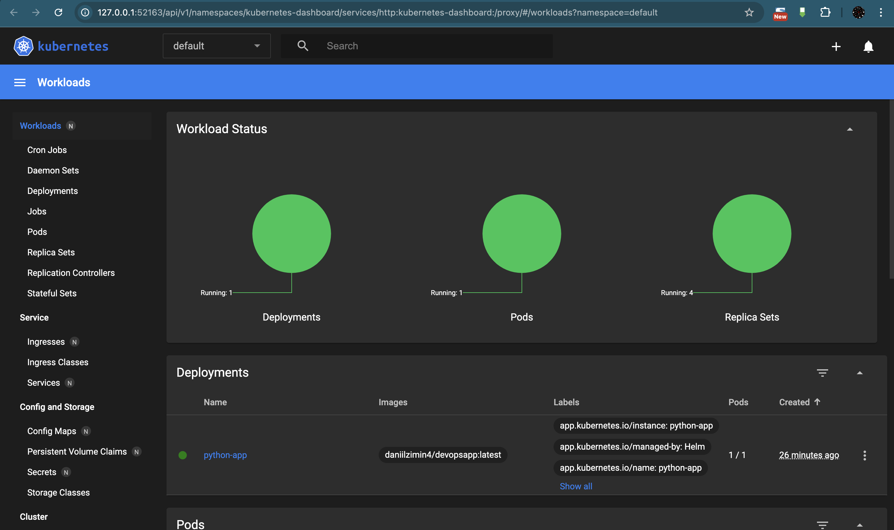
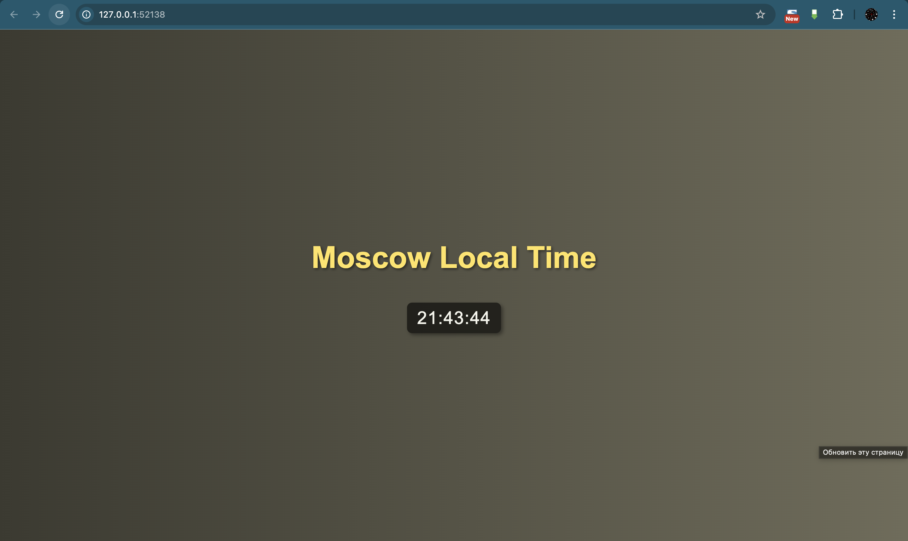

### Task 1

```bash
(devopss) daniilzimin@MacBook-Pro k8s % helm upgrade python-app python-app/
Release "python-app" has been upgraded. Happy Helming!
NAME: python-app
LAST DEPLOYED: Tue Apr 29 21:34:35 2025
NAMESPACE: default
STATUS: deployed
REVISION: 2
NOTES:
1. Get the application URL by running these commands:
  export POD_NAME=$(kubectl get pods --namespace default -l "app.kubernetes.io/name=python-app,app.kubernetes.io/instance=python-app" -o jsonpath="{.items[0].metadata.name}")
  export CONTAINER_PORT=$(kubectl get pod --namespace default $POD_NAME -o jsonpath="{.spec.containers[0].ports[0].containerPort}")
  echo "Visit http://127.0.0.1:8080 to use your application"
  kubectl --namespace default port-forward $POD_NAME 8080:$CONTAINER_PORT
```

```bash
(devopss) daniilzimin@MacBook-Pro k8s % kubectl get svc python-app         
NAME         TYPE        CLUSTER-IP    EXTERNAL-IP   PORT(S)    AGE
python-app   ClusterIP   10.99.87.96   <none>        9200/TCP   16m
```


```bash
(devopss) daniilzimin@MacBook-Pro k8s % minikube service python-app           
|-----------|------------|-------------|--------------|
| NAMESPACE |    NAME    | TARGET PORT |     URL      |
|-----------|------------|-------------|--------------|
| default   | python-app |             | No node port |
|-----------|------------|-------------|--------------|
😿  service default/python-app has no node port
❗  Services [default/python-app] have type "ClusterIP" not meant to be exposed, however for local development minikube allows you to access this !
🏃  Starting tunnel for service python-app.
|-----------|------------|-------------|------------------------|
| NAMESPACE |    NAME    | TARGET PORT |          URL           |
|-----------|------------|-------------|------------------------|
| default   | python-app |             | http://127.0.0.1:52138 |
|-----------|------------|-------------|------------------------|
🎉  Opening service default/python-app in default browser...
❗  Because you are using a Docker driver on darwin, the terminal needs to be open to run it.
```

```bash
(devopss) daniilzimin@MacBook-Pro k8s % kubectl get pods,svc
NAME                             READY   STATUS    RESTARTS   AGE
pod/python-app-596b4b98c-99266   1/1     Running   0          5m36s

NAME                 TYPE        CLUSTER-IP    EXTERNAL-IP   PORT(S)    AGE
service/kubernetes   ClusterIP   10.96.0.1     <none>        443/TCP    103m
service/python-app   ClusterIP   10.99.87.96   <none>        9200/TCP   24m
```




### Task 2

```bash
(devopss) daniilzimin@MacBook-Pro k8s % helm lint python-app/ 
==> Linting python-app/
[INFO] Chart.yaml: icon is recommended

1 chart(s) linted, 0 chart(s) failed
(devopss) daniilzimin@MacBook-Pro k8s % 
```

```bash
(devopss) daniilzimin@MacBook-Pro k8s % helm install --dry-run helm-hooks python-app/ 
NAME: helm-hooks
LAST DEPLOYED: Tue Apr 29 21:49:38 2025
NAMESPACE: default
STATUS: pending-install
REVISION: 1
HOOKS:
---
# Source: python-app/templates/post-install.yaml
apiVersion: v1
kind: Pod
metadata:
  name: postinstall-hook
  annotations:
    "helm.sh/hook": "post-install"
    "helm.sh/hook-delete-policy": "hook-succeeded"
spec:
  containers:
    - name: post-install-container
      image: busybox
      imagePullPolicy: Always
      command: ['sh', '-c', 'echo The post-install hook is running && sleep 15' ]
  restartPolicy: Never
  terminationGracePeriodSeconds: 0
---
# Source: python-app/templates/pre-install.yaml
apiVersion: v1
kind: Pod
metadata:
  name: preinstall-hook
  annotations:
    "helm.sh/hook": "pre-install"
    "helm.sh/hook-delete-policy": "hook-succeeded"
spec:
  containers:
    - name: pre-install-container
      image: busybox
      imagePullPolicy: IfNotPresent
      command: ['sh', '-c', 'echo The pre-install hook is running && sleep 20' ]
  restartPolicy: Never
  terminationGracePeriodSeconds: 0
---
# Source: python-app/templates/tests/test-connection.yaml
apiVersion: v1
kind: Pod
metadata:
  name: "helm-hooks-python-app-test-connection"
  labels:
    helm.sh/chart: python-app-0.1.0
    app.kubernetes.io/name: python-app
    app.kubernetes.io/instance: helm-hooks
    app.kubernetes.io/version: "1.16.0"
    app.kubernetes.io/managed-by: Helm
  annotations:
    "helm.sh/hook": test
spec:
  containers:
    - name: wget
      image: busybox
      command: ['wget']
      args: ['helm-hooks-python-app:9200']
  restartPolicy: Never
MANIFEST:
---
# Source: python-app/templates/serviceaccount.yaml
apiVersion: v1
kind: ServiceAccount
metadata:
  name: helm-hooks-python-app
  labels:
    helm.sh/chart: python-app-0.1.0
    app.kubernetes.io/name: python-app
    app.kubernetes.io/instance: helm-hooks
    app.kubernetes.io/version: "1.16.0"
    app.kubernetes.io/managed-by: Helm
automountServiceAccountToken: true
---
# Source: python-app/templates/service.yaml
apiVersion: v1
kind: Service
metadata:
  name: helm-hooks-python-app
  labels:
    helm.sh/chart: python-app-0.1.0
    app.kubernetes.io/name: python-app
    app.kubernetes.io/instance: helm-hooks
    app.kubernetes.io/version: "1.16.0"
    app.kubernetes.io/managed-by: Helm
spec:
  type: ClusterIP
  ports:
    - port: 9200
      targetPort: http
      protocol: TCP
      name: http
  selector:
    app.kubernetes.io/name: python-app
    app.kubernetes.io/instance: helm-hooks
---
# Source: python-app/templates/deployment.yaml
apiVersion: apps/v1
kind: Deployment
metadata:
  name: helm-hooks-python-app
  labels:
    helm.sh/chart: python-app-0.1.0
    app.kubernetes.io/name: python-app
    app.kubernetes.io/instance: helm-hooks
    app.kubernetes.io/version: "1.16.0"
    app.kubernetes.io/managed-by: Helm
spec:
  replicas: 1
  selector:
    matchLabels:
      app.kubernetes.io/name: python-app
      app.kubernetes.io/instance: helm-hooks
  template:
    metadata:
      labels:
        helm.sh/chart: python-app-0.1.0
        app.kubernetes.io/name: python-app
        app.kubernetes.io/instance: helm-hooks
        app.kubernetes.io/version: "1.16.0"
        app.kubernetes.io/managed-by: Helm
    spec:
      serviceAccountName: helm-hooks-python-app
      containers:
        - name: python-app
          image: "daniilzimin4/devopsapp:latest"
          imagePullPolicy: IfNotPresent
          ports:
            - name: http
              containerPort: 9200
              protocol: TCP
          livenessProbe:
            httpGet:
              path: /
              port: http
          readinessProbe:
            httpGet:
              path: /
              port: http

NOTES:
1. Get the application URL by running these commands:
  export POD_NAME=$(kubectl get pods --namespace default -l "app.kubernetes.io/name=python-app,app.kubernetes.io/instance=helm-hooks" -o jsonpath="{.items[0].metadata.name}")
  export CONTAINER_PORT=$(kubectl get pod --namespace default $POD_NAME -o jsonpath="{.spec.containers[0].ports[0].containerPort}")
  echo "Visit http://127.0.0.1:8080 to use your application"
  kubectl --namespace default port-forward $POD_NAME 8080:$CONTAINER_PORT
```

```bash
(devopss) daniilzimin@MacBook-Pro k8s % kubectl get po
NAME                           READY   STATUS      RESTARTS   AGE
postinstall-hook               0/1     Completed   0          45s
preinstall-hook                0/1     Completed   0          1m
helm-hooks-python-app-test-connection  0/1     Completed   0          30s
python-app-596b4b98c-wdks7     1/1     Running     0          1m
```


```bash
(devopss) daniilzimin@MacBook-Pro k8s % kubectl describe po preinstall-hook
Name:             preinstall-hook
Namespace:        default
Priority:         0
Service Account:  default
Node:             minikube/192.168.49.2
Start Time:       Tue, 29 Apr 2025 22:00:46 +0300
Labels:           <none>
Annotations:      helm.sh/hook: pre-install
                  helm.sh/hook-delete-policy: hook-succeeded
Status:           Succeeded
IP:               10.244.0.16
Containers:
  pre-install-container:
    Image:         busybox
    Image ID:      docker-pullable://busybox@sha256:498a000f370d8c37927118ed80afe8adc38d1edcbfc071627d17b25c88efcab0
    Command:
      sh
      -c
      echo The pre-install hook is running && sleep 20
    State:          Terminated
      Reason:       Completed
      Exit Code:    0
    Ready:          False
    Restart Count:  0
Events:
  Normal  Scheduled  1m  default-scheduler  Successfully assigned default/preinstall-hook to minikube
  Normal  Pulled     1m  kubelet            Container image "busybox" already present on machine
  Normal  Created    1m  kubelet            Created container pre-install-container
  Normal  Started    1m  kubelet            Started container pre-install-container
```


```bash
(devopss) daniilzimin@MacBook-Pro k8s % kubectl describe po postinstall-hook
Name:             postinstall-hook
Namespace:        default
Priority:         0
Service Account:  default
Node:             minikube/192.168.49.2
Start Time:       Tue, 29 Apr 2025 22:01:10 +0300
Labels:           <none>
Annotations:      helm.sh/hook: post-install
                  helm.sh/hook-delete-policy: hook-succeeded
Status:           Succeeded
IP:               10.244.0.17
Containers:
  post-install-container:
    Image:         busybox
    Image ID:      docker-pullable://busybox@sha256:498a000f370d8c37927118ed80afe8adc38d1edcbfc071627d17b25c88efcab0
    Command:
      sh
      -c
      echo The post-install hook is running && sleep 15
    State:          Terminated
      Reason:       Completed
      Exit Code:    0
    Ready:          False
    Restart Count:  0
Events:
  Normal  Scheduled  45s  default-scheduler  Successfully assigned default/postinstall-hook to minikube
  Normal  Pulled     45s  kubelet            Container image "busybox" already present on machine
  Normal  Created    45s  kubelet            Created container post-install-container
  Normal  Started    45s  kubelet            Started container post-install-container
```


```bash
(devopss) daniilzimin@MacBook-Pro k8s % kubectl describe po helm-hooks-python-app-test-connection
Name:             helm-hooks-python-app-test-connection
Namespace:        default
Priority:         0
Service Account:  default
Node:             minikube/192.168.49.2
Start Time:       Tue, 29 Apr 2025 22:01:30 +0300
Labels:           app.kubernetes.io/instance=helm-hooks
                  app.kubernetes.io/managed-by=Helm
                  app.kubernetes.io/name=python-app
                  app.kubernetes.io/version=1.16.0
                  helm.sh/chart=python-app-0.1.0
Annotations:      helm.sh/hook: test
Status:           Succeeded
IP:               10.244.0.18
Containers:
  wget:
    Image:         busybox
    Image ID:      docker-pullable://busybox@sha256:498a000f370d8c37927118ed80afe8adc38d1edcbfc071627d17b25c88efcab0
    Command:
      wget
      helm-hooks-python-app:9200
    State:          Terminated
      Reason:       Completed
      Exit Code:    0
    Ready:          False
    Restart Count:  0
Events:
  Normal  Scheduled  30s  default-scheduler  Successfully assigned default/helm-hooks-python-app-test-connection to minikube
  Normal  Pulled     30s  kubelet            Container image "busybox" already present on machine
  Normal  Created    30s  kubelet            Created container wget
  Normal  Started    30s  kubelet            Started container wget
```


```bash
(devopss) daniilzimin@MacBook-Pro k8s % kubectl get pods,svc
NAME                                          READY   STATUS      RESTARTS   AGE
pod/helm-hooks-python-app-test-connection     0/1     Completed   0          2m
pod/postinstall-hook                          0/1     Completed   0          2m15s
pod/preinstall-hook                           0/1     Completed   0          2m45s
pod/python-app-596b4b98c-wdks7                1/1     Running     0          2m30s

NAME                          TYPE        CLUSTER-IP     EXTERNAL-IP   PORT(S)    AGE
service/helm-hooks-python-app ClusterIP   10.97.141.0    <none>        9200/TCP   2m30s
service/kubernetes            ClusterIP   10.96.0.1      <none>        443/TCP    15m
```