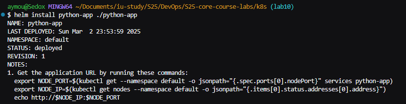
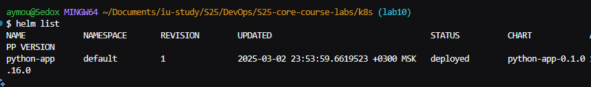
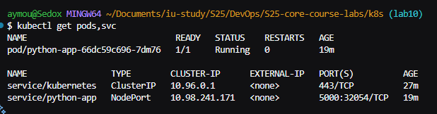
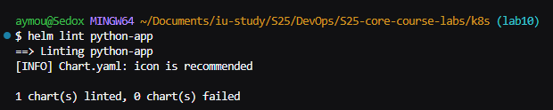
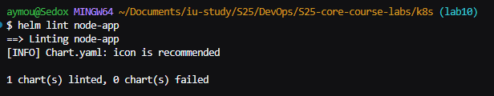
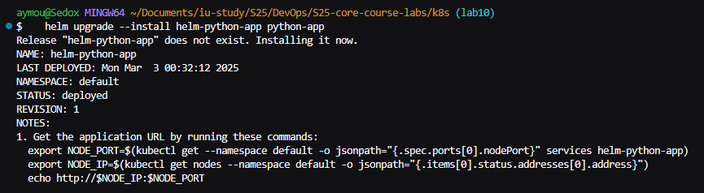
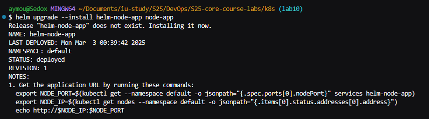

# Lab 10: Helm Deployment and Chart Hooks with Library Chart Integration

This document outlines my comprehensive journey with Helm—from installing Helm, creating and customizing charts for our applications, implementing pre- and post-install hooks, to integrating a library chart for shared configuration (bonus task). All steps are documented with command outputs, instructions, and placeholders for screenshots.

---

## Step 1: Helm Installation and Repository Initialization

1. **Install Helm:**
   I installed Helm using the official installation script:
   ```bash
   curl https://raw.githubusercontent.com/helm/helm/main/scripts/get-helm-3 | bash
   ```
2. **Verify Installation:**
   To ensure Helm is installed correctly, I ran:
   ```bash
   helm version
   ```
---

## Step 2: Creating a Custom Helm Chart for the Python Application

1. **Generate the Chart:**
   I navigated to my `k8s` folder and created a Helm chart for my Python app:
   ```bash
   cd k8s
   helm create python-app
   helm create node-app
   ```

2. **Customize Chart Values:**
   I modified `python-app/values.yaml` same with node-app to point to my Docker repository:
   ```yaml
   image:
     repository: sedoxxx/python-webapp
     tag: "latest"
   service:
     type: NodePort
     port: 5000
   ```

3. **Update Deployment Template:**
   I adjusted the container port in `python-app/templates/deployment.yaml` to ensure the app listens on port 5000, same for node:
   ```yaml
         ports:
           - containerPort: 5000
   ```

---

## Step 3: Installing the Helm Chart

1. **Deploy the Chart:**
   I installed the chart in my Minikube cluster by running:
   ```bash
   helm install python-app-release python-app
   ```
   Sample output:
   ```
   NAME: python-app-release
   LAST DEPLOYED: <timestamp>
   NAMESPACE: default
   STATUS: deployed
   REVISION: 1
   TEST SUITE: None
   ```
   

2. **Verify Deployment:**
   I verified that the pods and services were up using:
   ```bash
   helm list
   kubectl get pods,svc
   ```
   Expected output:
   ```
   NAME                                READY   STATUS    RESTARTS   AGE
   pod/python-webapp-xxxxx             1/1     Running   0          3m12s

   NAME                                  TYPE        CLUSTER-IP       EXTERNAL-IP   PORT(S)          AGE
   service/python-webapp-service         NodePort    10.96.184.19     <none>        5000:31766/TCP   3m1s
   ```
   
   

---

## Step 4: Implementing Helm Chart Hooks

I enhanced the chart by adding pre-install and post-install hooks to perform simple jobs during the deployment process.

1. **Pre-Install Hooks (Python and Node):**
   Created the file `python-app/templates/pre-install-hook.yaml` with:
   ```yaml
    apiVersion: batch/v1
    kind: Job
    metadata:
    name: pre-install-hook-python
    annotations:
        "helm.sh/hook": pre-install
        "helm.sh/hook-delete-policy": hook-succeeded
    spec:
    template:
        spec:
        containers:
        - name: preinstall-python
            image: busybox
            command: ["sh", "-c", "echo Pre-install hook running; sleep 20"]
        restartPolicy: Never
   ```
2. **Post-Install Hook (Python and Node):**
   Created `python-app/templates/post-install-hook.yaml`:
   ```yaml
    apiVersion: batch/v1
    kind: Job
    metadata:
    name: post-install-hook-python
    annotations:
        "helm.sh/hook": post-install
        "helm.sh/hook-delete-policy": hook-succeeded
    spec:
    template:
        spec:
        containers:
        - name: postinstall-python
            image: busybox
            command: ["sh", "-c", "echo Post-install hook running; sleep 20"]
        restartPolicy: Never
   ```

5. **Hook Linting and Deployment:**
   I ran:
   ```bash
   helm lint python-app
   helm lint node-app
   helm upgrade --install helm-python-app python-app
   helm upgrade --install helm-node-app node-app
   ```
   
   
   
   

6. **Verify Hook Execution:**
   Checking pods with:
   ```bash
   kubectl get pods
   ```
   Example output:
   ```
    NAME                               READY   STATUS     RESTARTS      AGE
    helm-node-app-65bc8f65cc-zxpc9     1/1     Running    0             24m
    helm-python-app-5fd885fb6f-rwg6f   1/1     Running    0             23m
    post-install-hook-gch7f            0/1     Completed  0             10m
    pre-install-hook-p4nq6             0/1     Completed  0             10m
    python-app-66dc59c696-7dm76        1/1     Running    0             10m
   ```

## Step 7: Cleanup

To remove all deployed resources:
```bash
helm uninstall python-app
helm uninstall node-app
helm uninstall helm-python-app
helm uninstall helm-node-app
```


