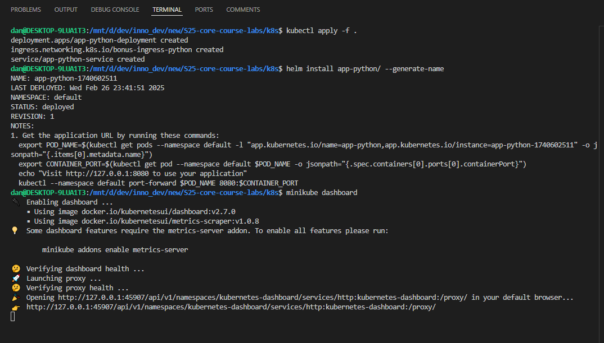
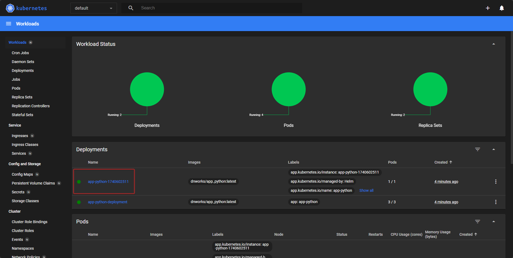
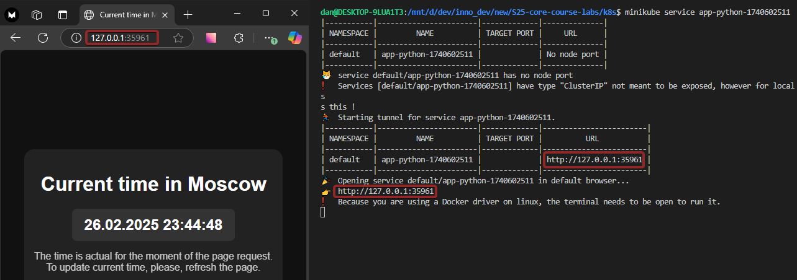
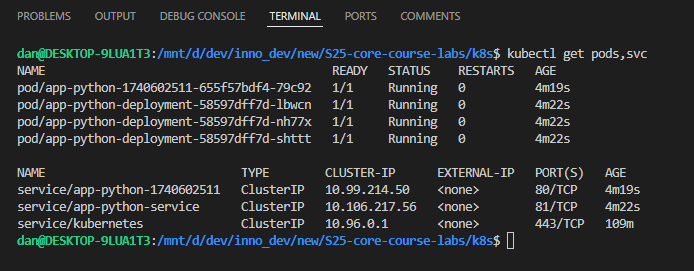

# Introduction to Helm

## Task 1: Helm Setup and Chart Creation

During the Helm setup, I have done the following things:

- generated a Helm chart for my application
- replaced default repository and tag inside `values.yaml`

I did not encounter any issues, so I did not comment out `livenessProbe` and `readinessProbe`.

Here are the screenshots that confirm the healthiness of Helm:

