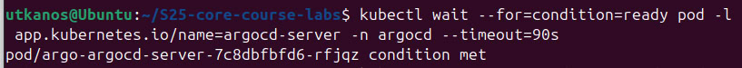
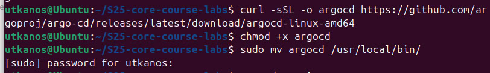

# Introduction to Helm

## Helm Setup and Chart Creation

### Step 1. Installation of helm

For this step I followed the instructions described in the guideline of helm.

### Step 2. Creation of my chart

```bash
PS C:\Users\Elizoveta\Desktop\S25-core-course-labs\k8s>    helm create myapp   
Creating myapp
```

Additionally, I have modified all the needed files.

### Step 3. Installation of custom chart

```bash
PS C:\Users\Elizoveta\Desktop\S25-core-course-labs\k8s>    helm install your-app-install ./myapp
NAME: your-app-install
LAST DEPLOYED: Fri Feb 28 12:52:17 2025
NAMESPACE: default
STATUS: deployed
REVISION: 1
NOTES:
1. Get the application URL by running these commands:
  export POD_NAME=$(kubectl get pods --namespace default -l "app.kubernetes.io/name=myapp,app.kubernetes.io/instance=your-app-install" -o jsonpath="{.items[0].metadata.name}")
  export CONTAINER_PORT=$(kubectl get pod --namespace default $POD_NAME -o jsonpath="{.spec.containers[0].ports[0].containerPort}")
  echo "Visit http://127.0.0.1:8080 to use your application"
  kubectl --namespace default port-forward $POD_NAME 8080:$CONTAINER_PORT
```

### Step 4. Check out on the resources

```bash 
PS C:\Users\Elizoveta\Desktop\S25-core-course-labs\k8s>    kubectl get pods,svc
NAME                                          READY   STATUS    RESTARTS   AGE
pod/your-app-install-myapp-865dbb5c66-lt7xz   1/1     Running   0          38s

NAME                             TYPE        CLUSTER-IP      EXTERNAL-IP   PORT(S)   AGE
service/kubernetes               ClusterIP   10.96.0.1       <none>        443/TCP   14h
service/your-app-install-myapp   ClusterIP   10.100.151.71   <none>        80/TCP    38s
```

### Step 5. Access the app

```bash 
PS C:\Users\Elizoveta\Desktop\S25-core-course-labs\k8s>    minikube service your-app-install-myapp --url
😿  service default/your-app-install-myapp has no node port
❗  Services [default/your-app-install-myapp] have type "ClusterIP" not meant to be exposed, however for local development minikube allows you to access this !
http://127.0.0.1:50339
❗  Because you are using a Docker driver on windows, the terminal needs to be open to run it.
```




```bash
PS C:\Users\Elizoveta\Desktop\S25-core-course-labs\k8s> minikube service --all
|-----------|------------|-------------|--------------|
| NAMESPACE |    NAME    | TARGET PORT |     URL      |
|-----------|------------|-------------|--------------|
| default   | kubernetes |             | No node port |
|-----------|------------|-------------|--------------|
😿  service default/kubernetes has no node port
|-----------|------------------------|-------------|--------------|
| NAMESPACE |          NAME          | TARGET PORT |     URL      |
|-----------|------------------------|-------------|--------------|
| default   | your-app-install-myapp |             | No node port |
|-----------|------------------------|-------------|--------------|
😿  service default/your-app-install-myapp has no node port
❗  Services [default/kubernetes default/your-app-install-myapp] have type "ClusterIP" not meant to be exposed, however for local development minikube allows you to access this !
🏃  Starting tunnel for service kubernetes.
🏃  Starting tunnel for service your-app-install-myapp.
|-----------|------------------------|-------------|------------------------|
| NAMESPACE |          NAME          | TARGET PORT |          URL           |
|-----------|------------------------|-------------|------------------------|
| default   | kubernetes             |             | http://127.0.0.1:50808 |
| default   | your-app-install-myapp |             | http://127.0.0.1:50810 |
|-----------|------------------------|-------------|------------------------|
🎉  Opening service default/kubernetes in default browser...
🎉  Opening service default/your-app-install-myapp in default browser...
❗  Because you are using a Docker driver on windows, the terminal needs to be open to run it.
```

## Helm Chart Hooks

### Outputs of the commands

```bash
PS C:\Users\Elizoveta\Desktop\S25-core-course-labs\k8s> kubectl get po        
NAME                                      READY   STATUS      RESTARTS   AGE
helm-hooks-myapp-6947b58c64-7jz57         1/1     Running     0          35s  
helm-hooks-myapp-postinstall              0/1     Completed   0          34s  
helm-hooks-myapp-preinstall               0/1     Completed   0          62s  
your-app-install-myapp-865dbb5c66-lt7xz   1/1     Running     0          38m 
```

```bash
PS C:\Users\Elizoveta\Desktop\S25-core-course-labs\k8s> kubectl describe po helm-hooks-myapp-preinstall 
Name:             helm-hooks-myapp-preinstall
Namespace:        default
Priority:         0
Service Account:  default
Node:             minikube/192.168.49.2
Start Time:       Fri, 28 Feb 2025 13:29:30 +0300
Labels:           <none>
Annotations:      helm.sh/hook: pre-install
Status:           Succeeded
IP:               10.244.0.16
IPs:
  IP:  10.244.0.16
Containers:
  preinstall:
    Container ID:  docker://32de9cad3e49bf89a4ffc66d52ca4df83ada07a5996e235b6db94d01487a7562
    Image:         busybox
    Image ID:      docker-pullable://busybox@sha256:498a000f370d8c37927118ed80afe8adc38d1edcbfc071627d17b25c88efcab0
    Port:          <none>
    Host Port:     <none>
    Command:
      sh
      -c
      sleep 20
    State:          Terminated
      Reason:       Completed
      Exit Code:    0
      Started:      Fri, 28 Feb 2025 13:29:35 +0300
      Finished:     Fri, 28 Feb 2025 13:29:55 +0300
    Ready:          False
    Restart Count:  0
    Environment:    <none>
    Mounts:
      /var/run/secrets/kubernetes.io/serviceaccount from kube-api-access-vcgrp (ro)
Conditions:
  Type                        Status
  PodReadyToStartContainers   False
  Initialized                 True
  Ready                       False
  ContainersReady             False
  PodScheduled                True
Volumes:
  kube-api-access-vcgrp:
    Type:                    Projected (a volume that contains injected data from multiple sources)
    TokenExpirationSeconds:  3607
    ConfigMapName:           kube-root-ca.crt
    ConfigMapOptional:       <nil>
    DownwardAPI:             true
QoS Class:                   BestEffort
Node-Selectors:              <none>
Tolerations:                 node.kubernetes.io/not-ready:NoExecute op=Exists for 300s
                             node.kubernetes.io/unreachable:NoExecute op=Exists for 300s
Events:
  Type    Reason     Age   From               Message
  ----    ------     ----  ----               -------
  Normal  Scheduled  93s   default-scheduler  Successfully assigned default/helm-hooks-myapp-preinstall to minikube
  Normal  Pulling    93s   kubelet            Pulling image "busybox"
  Normal  Pulled     90s   kubelet            Successfully pulled image "busybox" in 2.957s (2.957s including waiting). Image size: 4269694 bytes.
  Normal  Created    89s   kubelet            Created container: preinstall   
  Normal  Started    89s   kubelet            Started container preinstall 
```

```bash
PS C:\Users\Elizoveta\Desktop\S25-core-course-labs\k8s> kubectl describe po helm-hooks-myapp-postinstall
Name:             helm-hooks-myapp-postinstall
Namespace:        default
Priority:         0
Service Account:  default
Node:             minikube/192.168.49.2
Start Time:       Fri, 28 Feb 2025 13:29:58 +0300
Labels:           <none>
Annotations:      helm.sh/hook: post-install
Status:           Succeeded
IP:               10.244.0.18
IPs:
  IP:  10.244.0.18
Containers:
  postinstall:
    Container ID:  docker://fca45c91618c8f0d4624cd0a332a6a82790c5cbf2aac4fbbd999cbab81468272
    Image:         busybox
    Image ID:      docker-pullable://busybox@sha256:498a000f370d8c37927118ed80afe8adc38d1edcbfc071627d17b25c88efcab0
    Port:          <none>
    Host Port:     <none>
    Command:
      sh
      -c
      sleep 20
    State:          Terminated
      Reason:       Completed
      Exit Code:    0
      Started:      Fri, 28 Feb 2025 13:30:02 +0300
      Finished:     Fri, 28 Feb 2025 13:30:22 +0300
    Ready:          False
    Restart Count:  0
    Environment:    <none>
    Mounts:
      /var/run/secrets/kubernetes.io/serviceaccount from kube-api-access-ggqqk (ro)
Conditions:
  Type                        Status
  PodReadyToStartContainers   False
  Initialized                 True
  Ready                       False
  ContainersReady             False
  PodScheduled                True
Volumes:
  kube-api-access-ggqqk:
    Type:                    Projected (a volume that contains injected data from multiple sources)
    TokenExpirationSeconds:  3607
    ConfigMapName:           kube-root-ca.crt
    ConfigMapOptional:       <nil>
    DownwardAPI:             true
QoS Class:                   BestEffort
Node-Selectors:              <none>
Tolerations:                 node.kubernetes.io/not-ready:NoExecute op=Exists for 300s
                             node.kubernetes.io/unreachable:NoExecute op=Exists for 300s
Events:
  Type    Reason     Age   From               Message
  ----    ------     ----  ----               -------
  Normal  Scheduled  113s  default-scheduler  Successfully assigned default/helm-hooks-myapp-postinstall to minikube
  Normal  Pulling    112s  kubelet            Pulling image "busybox"
  Normal  Pulled     109s  kubelet            Successfully pulled image "busybox" in 2.791s (2.791s including waiting). Image size: 4269694 bytes.
  Normal  Created    109s  kubelet            Created container: postinstall  
  Normal  Started    109s  kubelet            Started container postinstall
```