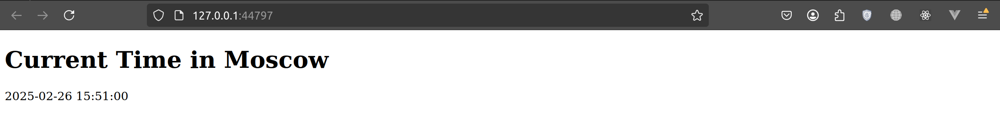
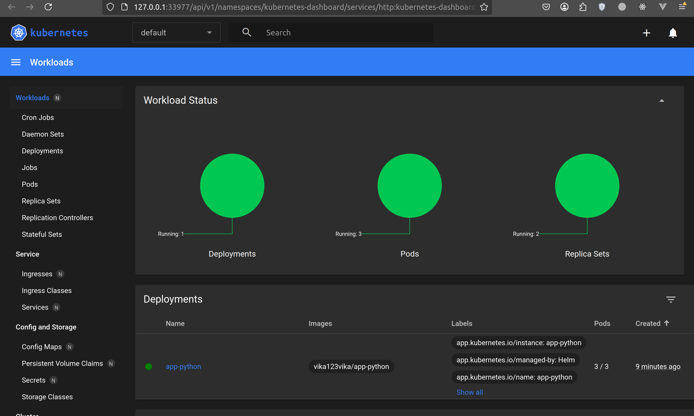
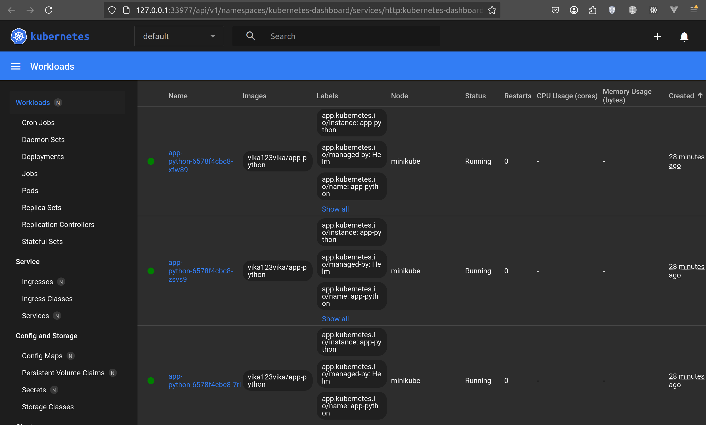

# Helm

## Access the Application

```bash
minikube service app-python                                 
|-----------|------------|-------------|--------------|
| NAMESPACE |    NAME    | TARGET PORT |     URL      |
|-----------|------------|-------------|--------------|
| default   | app-python |             | No node port |
|-----------|------------|-------------|--------------|
😿  service default/app-python has no node port
❗  Services [default/app-python] have type "ClusterIP" not meant to be exposed, however for local development minikube allows you to access this !
🏃  Starting tunnel for service app-python.
|-----------|------------|-------------|------------------------|
| NAMESPACE |    NAME    | TARGET PORT |          URL           |
|-----------|------------|-------------|------------------------|
| default   | app-python |             | http://127.0.0.1:44797 |
|-----------|------------|-------------|------------------------|
🎉  Opening service default/app-python in default browser...
❗  Because you are using a Docker driver on linux, the terminal needs to be open to run it.
Gtk-Message: 15:51:00.083: Not loading module "atk-bridge": The functionality is provided by GTK natively. Please try to not load it.
```



Resulting healthy services


## Task 1

**Command:**
```bash
kubectl get pods,svc
```

**Output:**
```bash
NAME                              READY   STATUS    RESTARTS   AGE
pod/app-python-6578f4cbc8-7rl7j   1/1     Running   0          27m
pod/app-python-6578f4cbc8-xfw89   1/1     Running   0          27m
pod/app-python-6578f4cbc8-zsvs9   1/1     Running   0          27m

NAME                 TYPE        CLUSTER-IP      EXTERNAL-IP   PORT(S)    AGE
service/app-python   ClusterIP   10.111.151.77   <none>        5000/TCP   28m
service/kubernetes   ClusterIP   10.96.0.1       <none>        443/TCP    2d2h
```

## Task 2 

### Helm Chart Hooks

**1)** Troubleshooting

```bash
helm lint app-python                                       
==> Linting app-python
[INFO] Chart.yaml: icon is recommended

1 chart(s) linted, 0 chart(s) failed
helm install --dry-run --debug app-python ./app-python       

install.go:225: 2025-02-26 20:33:34.986325484 +0300 MSK m=+0.031070612 [debug] Original chart version: ""
install.go:242: 2025-02-26 20:33:34.98637196 +0300 MSK m=+0.031117090 [debug] CHART PATH: /home/viktoria/study/S25-core-course-labs/k8s/app-python

NAME: app-python
LAST DEPLOYED: Wed Feb 26 20:33:34 2025
NAMESPACE: default
STATUS: pending-install
REVISION: 1
USER-SUPPLIED VALUES:
{}

COMPUTED VALUES:
affinity: {}
autoscaling:
  enabled: false
  maxReplicas: 100
  minReplicas: 1
  targetCPUUtilizationPercentage: 80
fullnameOverride: ""
image:
  pullPolicy: IfNotPresent
  repository: vika123vika/app-python
  tag: latest
imagePullSecrets: []
ingress:
  annotations: {}
  className: ""
  enabled: false
  hosts:
  - host: chart-example.local
    paths:
    - path: /
      pathType: ImplementationSpecific
  tls: []
livenessProbe:
  httpGet:
    path: /
    port: http
nameOverride: ""
nodeSelector: {}
podAnnotations: {}
podLabels: {}
podSecurityContext: {}
readinessProbe:
  httpGet:
    path: /
    port: http
replicaCount: 3
resources: {}
securityContext: {}
service:
  port: 5000
  type: ClusterIP
serviceAccount:
  annotations: {}
  automount: true
  create: true
  name: ""
tolerations: []
volumeMounts: []
volumes: []

HOOKS:
---
# Source: app-python/templates/tests/test-connection.yaml
apiVersion: v1
kind: Pod
metadata:
  name: "app-python-test-connection"
  labels:
    helm.sh/chart: app-python-0.1.0
    app.kubernetes.io/name: app-python
    app.kubernetes.io/instance: app-python
    app.kubernetes.io/version: "1.16.0"
    app.kubernetes.io/managed-by: Helm
  annotations:
    "helm.sh/hook": test
spec:
  containers:
    - name: wget
      image: busybox
      command: ['wget']
      args: ['app-python:5000']
  restartPolicy: Never
---
# Source: app-python/templates/hooks/post-install-hook.yaml
apiVersion: batch/v1
kind: Job
metadata:
  name: app-python-post-install
  annotations:
    "helm.sh/hook": post-install
    "helm.sh/hook-delete-policy": before-hook-creation
spec:
  template:
    spec:
      containers:
        - name: post-install-job
          image: busybox
          command: ["/bin/sh", "-c", "echo Post-install job completed"]
      restartPolicy: Never
---
# Source: app-python/templates/hooks/pre-install-hook.yaml
apiVersion: batch/v1
kind: Job
metadata:
  name: app-python-pre-install
  annotations:
    "helm.sh/hook": pre-install
    "helm.sh/hook-delete-policy": before-hook-creation
spec:
  template:
    spec:
      containers:
        - name: pre-install-job
          image: busybox
          command: ["/bin/sh", "-c", "echo Pre-install job running"]
      restartPolicy: Never
MANIFEST:
---
# Source: app-python/templates/serviceaccount.yaml
apiVersion: v1
kind: ServiceAccount
metadata:
  name: app-python
  labels:
    helm.sh/chart: app-python-0.1.0
    app.kubernetes.io/name: app-python
    app.kubernetes.io/instance: app-python
    app.kubernetes.io/version: "1.16.0"
    app.kubernetes.io/managed-by: Helm
automountServiceAccountToken: true
---
# Source: app-python/templates/service.yaml
apiVersion: v1
kind: Service
metadata:
  name: app-python
  labels:
    helm.sh/chart: app-python-0.1.0
    app.kubernetes.io/name: app-python
    app.kubernetes.io/instance: app-python
    app.kubernetes.io/version: "1.16.0"
    app.kubernetes.io/managed-by: Helm
spec:
  type: ClusterIP
  ports:
    - port: 5000
      targetPort: http
      protocol: TCP
      name: http
  selector:
    app.kubernetes.io/name: app-python
    app.kubernetes.io/instance: app-python
---
# Source: app-python/templates/deployment.yaml
apiVersion: apps/v1
kind: Deployment
metadata:
  name: app-python
  labels:
    helm.sh/chart: app-python-0.1.0
    app.kubernetes.io/name: app-python
    app.kubernetes.io/instance: app-python
    app.kubernetes.io/version: "1.16.0"
    app.kubernetes.io/managed-by: Helm
spec:
  replicas: 3
  selector:
    matchLabels:
      app.kubernetes.io/name: app-python
      app.kubernetes.io/instance: app-python
  template:
    metadata:
      labels:
        helm.sh/chart: app-python-0.1.0
        app.kubernetes.io/name: app-python
        app.kubernetes.io/instance: app-python
        app.kubernetes.io/version: "1.16.0"
        app.kubernetes.io/managed-by: Helm
    spec:
      serviceAccountName: app-python
      containers:
        - name: app-python
          image: "vika123vika/app-python:latest"
          imagePullPolicy: IfNotPresent
          ports:
            - name: http
              containerPort: 5000
              protocol: TCP
          livenessProbe:
            httpGet:
              path: /
              port: http
          readinessProbe:
            httpGet:
              path: /
              port: http

NOTES:
1. Get the application URL by running these commands:
  export POD_NAME=$(kubectl get pods --namespace default -l "app.kubernetes.io/name=app-python,app.kubernetes.io/instance=app-python" -o jsonpath="{.items[0].metadata.name}")
  export CONTAINER_PORT=$(kubectl get pod --namespace default $POD_NAME -o jsonpath="{.spec.containers[0].ports[0].containerPort}")
  echo "Visit http://127.0.0.1:8080 to use your application"
  kubectl --namespace default port-forward $POD_NAME 8080:$CONTAINER_PORT

```

**2)** Hooks without deletion policy

```bash
helm install app-python ./app-python                      
NAME: app-python
LAST DEPLOYED: Wed Feb 26 20:34:17 2025
NAMESPACE: default
STATUS: deployed
REVISION: 1
NOTES:
1. Get the application URL by running these commands:
  export POD_NAME=$(kubectl get pods --namespace default -l "app.kubernetes.io/name=app-python,app.kubernetes.io/instance=app-python" -o jsonpath="{.items[0].metadata.name}")
  export CONTAINER_PORT=$(kubectl get pod --namespace default $POD_NAME -o jsonpath="{.spec.containers[0].ports[0].containerPort}")
  echo "Visit http://127.0.0.1:8080 to use your application"
  kubectl --namespace default port-forward $POD_NAME 8080:$CONTAINER_PORT
```

**Command:**
```bash
kubectl get pods,svc
```

**Output:**
```bash
NAME                                READY   STATUS      RESTARTS   AGE
pod/app-python-58dcb858c9-g7dvg     1/1     Running     0          14m
pod/app-python-58dcb858c9-pptpz     1/1     Running     0          14m
pod/app-python-58dcb858c9-szdp2     1/1     Running     0          14m
pod/app-python-post-install-zbddx   0/1     Completed   0          14m
pod/app-python-pre-install-zvhg6    0/1     Completed   0          14m

NAME                 TYPE        CLUSTER-IP      EXTERNAL-IP   PORT(S)    AGE
service/app-python   ClusterIP   10.109.59.230   <none>        5000/TCP   14m
service/kubernetes   ClusterIP   10.96.0.1       <none>        443/TCP    2d7h
```

**Command:**
```bash
kubectl get po
```

**Output:**
```bash
NAME                            READY   STATUS      RESTARTS   AGE
app-python-58dcb858c9-g7dvg     1/1     Running     0          15m
app-python-58dcb858c9-pptpz     1/1     Running     0          15m
app-python-58dcb858c9-szdp2     1/1     Running     0          15m
app-python-post-install-zbddx   0/1     Completed   0          15m
app-python-pre-install-zvhg6    0/1     Completed   0          15m
```

**Command:**
```bash
kubectl describe po app-python-pre-install-zvhg6
```

**Output:**
```bash
Name:             app-python-pre-install-zvhg6
Namespace:        default
Priority:         0
Service Account:  default
Node:             minikube/192.168.49.2
Start Time:       Wed, 26 Feb 2025 20:34:17 +0300
Labels:           batch.kubernetes.io/controller-uid=6e01c750-2f2b-4de0-bce4-1788360c7c29
                  batch.kubernetes.io/job-name=app-python-pre-install
                  controller-uid=6e01c750-2f2b-4de0-bce4-1788360c7c29
                  job-name=app-python-pre-install
Annotations:      <none>
Status:           Succeeded
IP:               10.244.0.63
IPs:
  IP:           10.244.0.63
Controlled By:  Job/app-python-pre-install
Containers:
  pre-install-job:
    Container ID:  docker://e102655ae105e766af86a772f87d2c4818694aaac1b346fccd13f08e856862be
    Image:         busybox
    Image ID:      docker-pullable://busybox@sha256:498a000f370d8c37927118ed80afe8adc38d1edcbfc071627d17b25c88efcab0
    Port:          <none>
    Host Port:     <none>
    Command:
      /bin/sh
      -c
      echo Pre-install job running
    State:          Terminated
      Reason:       Completed
      Exit Code:    0
      Started:      Wed, 26 Feb 2025 20:34:19 +0300
      Finished:     Wed, 26 Feb 2025 20:34:19 +0300
    Ready:          False
    Restart Count:  0
    Environment:    <none>
    Mounts:
      /var/run/secrets/kubernetes.io/serviceaccount from kube-api-access-r7ms2 (ro)
Conditions:
  Type                        Status
  PodReadyToStartContainers   False 
  Initialized                 True 
  Ready                       False 
  ContainersReady             False 
  PodScheduled                True 
Volumes:
  kube-api-access-r7ms2:
    Type:                    Projected (a volume that contains injected data from multiple sources)
    TokenExpirationSeconds:  3607
    ConfigMapName:           kube-root-ca.crt
    ConfigMapOptional:       <nil>
    DownwardAPI:             true
QoS Class:                   BestEffort
Node-Selectors:              <none>
Tolerations:                 node.kubernetes.io/not-ready:NoExecute op=Exists for 300s
                             node.kubernetes.io/unreachable:NoExecute op=Exists for 300s
Events:
  Type    Reason     Age   From               Message
  ----    ------     ----  ----               -------
  Normal  Scheduled  17m   default-scheduler  Successfully assigned default/app-python-pre-install-zvhg6 to minikube
  Normal  Pulling    17m   kubelet            Pulling image "busybox"
  Normal  Pulled     17m   kubelet            Successfully pulled image "busybox" in 1.661s (1.661s including waiting). Image size: 4269694 bytes.
  Normal  Created    17m   kubelet            Created container: pre-install-job
  Normal  Started    17m   kubelet            Started container pre-install-job
```

**Command:**
```bash
kubectl describe po app-python-post-install-zbddx
```

**Output:**
```bash
Name:             app-python-post-install-zbddx
Namespace:        default
Priority:         0
Service Account:  default
Node:             minikube/192.168.49.2
Start Time:       Wed, 26 Feb 2025 20:34:22 +0300
Labels:           batch.kubernetes.io/controller-uid=36814b9e-e7a2-46a5-a967-fc12d27a1e1f
                  batch.kubernetes.io/job-name=app-python-post-install
                  controller-uid=36814b9e-e7a2-46a5-a967-fc12d27a1e1f
                  job-name=app-python-post-install
Annotations:      <none>
Status:           Succeeded
IP:               10.244.0.67
IPs:
  IP:           10.244.0.67
Controlled By:  Job/app-python-post-install
Containers:
  post-install-job:
    Container ID:  docker://ffa289c85adab440cdf39f33e1a71c00e242e72a374818bcb118590843d2291d
    Image:         busybox
    Image ID:      docker-pullable://busybox@sha256:498a000f370d8c37927118ed80afe8adc38d1edcbfc071627d17b25c88efcab0
    Port:          <none>
    Host Port:     <none>
    Command:
      /bin/sh
      -c
      echo Post-install job completed
    State:          Terminated
      Reason:       Completed
      Exit Code:    0
      Started:      Wed, 26 Feb 2025 20:34:24 +0300
      Finished:     Wed, 26 Feb 2025 20:34:24 +0300
    Ready:          False
    Restart Count:  0
    Environment:    <none>
    Mounts:
      /var/run/secrets/kubernetes.io/serviceaccount from kube-api-access-ndlqb (ro)
Conditions:
  Type                        Status
  PodReadyToStartContainers   False 
  Initialized                 True 
  Ready                       False 
  ContainersReady             False 
  PodScheduled                True 
Volumes:
  kube-api-access-ndlqb:
    Type:                    Projected (a volume that contains injected data from multiple sources)
    TokenExpirationSeconds:  3607
    ConfigMapName:           kube-root-ca.crt
    ConfigMapOptional:       <nil>
    DownwardAPI:             true
QoS Class:                   BestEffort
Node-Selectors:              <none>
Tolerations:                 node.kubernetes.io/not-ready:NoExecute op=Exists for 300s
                             node.kubernetes.io/unreachable:NoExecute op=Exists for 300s
Events:
  Type    Reason     Age   From               Message
  ----    ------     ----  ----               -------
  Normal  Scheduled  16m   default-scheduler  Successfully assigned default/app-python-post-install-zbddx to minikube
  Normal  Pulling    16m   kubelet            Pulling image "busybox"
  Normal  Pulled     16m   kubelet            Successfully pulled image "busybox" in 1.595s (1.595s including waiting). Image size: 4269694 bytes.
  Normal  Created    16m   kubelet            Created container: post-install-job
  Normal  Started    16m   kubelet            Started container post-install-job
```
