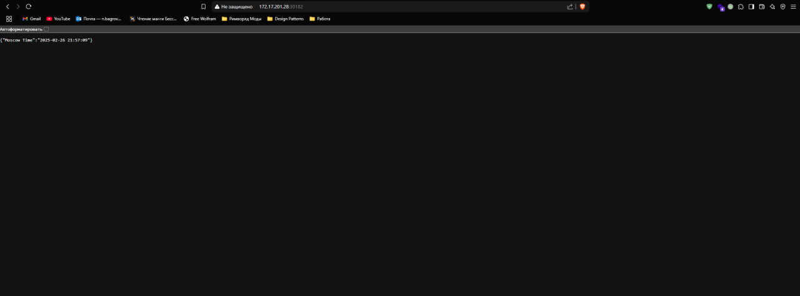
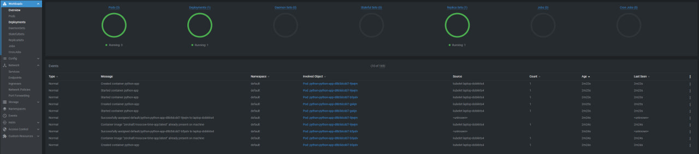
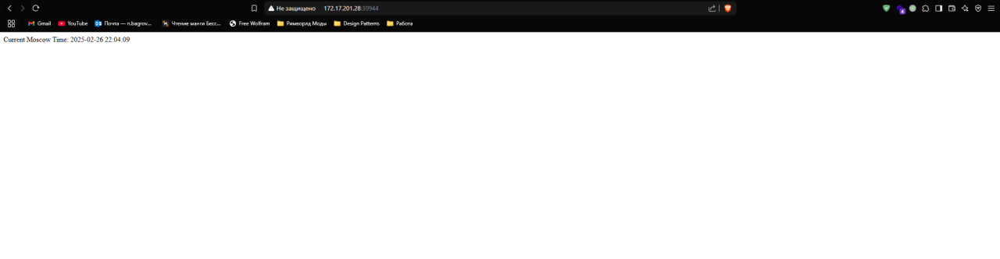
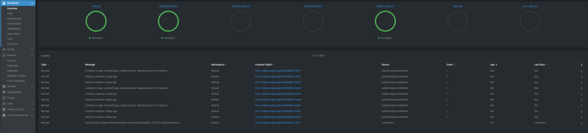

# Helm

## Run helm chart for Python App

```
nikita@LAPTOP-DOBKKTS4:~/S25-core-course-labs/k8s$ helm install python ./python-app/
NAME: python
LAST DEPLOYED: Wed Feb 26 21:56:57 2025
NAMESPACE: default
STATUS: deployed
REVISION: 1
NOTES:
1. Get the application URL by running these commands:
  export NODE_PORT=$(kubectl get --namespace default -o jsonpath="{.spec.ports[0].nodePort}" services python-python-app)
  export NODE_IP=$(kubectl get nodes --namespace default -o jsonpath="{.items[0].status.addresses[0].address}")
  echo http://$NODE_IP:$NODE_PORT
```

```
nikita@LAPTOP-DOBKKTS4:~/S25-core-course-labs/k8s$ kubectl get pods,svc
NAME                                    READY   STATUS    RESTARTS   AGE
pod/python-python-app-d8b5dcdd7-9jwjm   1/1     Running   0          49s
pod/python-python-app-d8b5dcdd7-b5pdv   1/1     Running   0          49s
pod/python-python-app-d8b5dcdd7-gskjn   1/1     Running   0          49s

NAME                        TYPE        CLUSTER-IP     EXTERNAL-IP   PORT(S)          AGE
service/kubernetes          ClusterIP   10.43.0.1      <none>        443/TCP          34d
service/python-python-app   NodePort    10.43.219.83   <none>        8000:30182/TCP   49s
```




---

## Integration of Helm Hooks

```
nikita@LAPTOP-DOBKKTS4:~/S25-core-course-labs/k8s$ helm lint ./python-app
==> Linting ./python-app
[INFO] Chart.yaml: icon is recommended

1 chart(s) linted, 0 chart(s) failed
```

```
Nikita Bagrov, [26.02.2025 22:12]
nikita@LAPTOP-DOBKKTS4:~/S25-core-course-labs/k8s$ helm install --dry-run helm-hooks ./python-app
NAME: helm-hooks
LAST DEPLOYED: Wed Feb 26 22:12:36 2025
NAMESPACE: default
STATUS: pending-install
REVISION: 1
HOOKS:
---
# Source: python-app/templates/post-install-hook.yml
apiVersion: v1
kind: Pod
metadata:
  name: postinstall-hook
  annotations:
    "helm.sh/hook": "post-install"
    "helm.sh/hook-delete-policy": "hook-succeeded"
spec:
  containers:
    - name: post-install-container
      image: busybox
      imagePullPolicy: Always
      command: ['sh', '-c', 'echo The post-install hook is running && sleep 15']
  restartPolicy: Never
---
# Source: python-app/templates/pre-install-hook.yml
apiVersion: v1
kind: Pod
metadata:
  name: preinstall-hook
  annotations:
    "helm.sh/hook": "pre-install"
    "helm.sh/hook-delete-policy": "hook-succeeded"
spec:
  containers:
    - name: pre-install-container
      image: busybox
      imagePullPolicy: IfNotPresent
      command: ['sh', '-c', 'echo The pre-install hook is running && sleep 20']
  restartPolicy: Never
---
# Source: python-app/templates/tests/test-connection.yaml
apiVersion: v1
kind: Pod
metadata:
  name: "helm-hooks-python-app-test-connection"
  labels:
    helm.sh/chart: python-app-0.1.0
    app.kubernetes.io/name: python-app
    app.kubernetes.io/instance: helm-hooks
    app.kubernetes.io/version: "1.16.0"
    app.kubernetes.io/managed-by: Helm
  annotations:
    "helm.sh/hook": test
spec:
  containers:
    - name: wget
      image: busybox
      command: ['wget']
      args: ['helm-hooks-python-app:8000']
  restartPolicy: Never
MANIFEST:
---
# Source: python-app/templates/serviceaccount.yaml
apiVersion: v1
kind: ServiceAccount
metadata:
  name: helm-hooks-python-app
  labels:
    helm.sh/chart: python-app-0.1.0
    app.kubernetes.io/name: python-app
    app.kubernetes.io/instance: helm-hooks
    app.kubernetes.io/version: "1.16.0"
    app.kubernetes.io/managed-by: Helm
automountServiceAccountToken: true
---
# Source: python-app/templates/service.yaml
apiVersion: v1
kind: Service
metadata:
  name: helm-hooks-python-app
  labels:
    helm.sh/chart: python-app-0.1.0
    app.kubernetes.io/name: python-app
    app.kubernetes.io/instance: helm-hooks
    app.kubernetes.io/version: "1.16.0"
    app.kubernetes.io/managed-by: Helm
spec:
  type: NodePort
  ports:
    - port: 8000
      targetPort: http
      protocol: TCP
      name: http
  selector:
    app.kubernetes.io/name: python-app
    app.kubernetes.io/instance: helm-hooks
---
# Source: python-app/templates/deployment.yaml
apiVersion: apps/v1
kind: Deployment
metadata:
  name: helm-hooks-python-app
  labels:
    helm.sh/chart: python-app-0.1.0
    app.kubernetes.io/name: python-app
    app.kubernetes.io/instance: helm-hooks
    app.kubernetes.io/version: "1.16.0"
    app.kubernetes.io/managed-by: Helm
spec:
  replicas: 3
  selector:
    matchLabels:
      app.kubernetes.io/name: python-app
      app.kubernetes.io/instance: helm-hooks
  template:
    metadata:
      labels:
        helm.sh/chart: python-app-0.1.0
        app.kubernetes.io/name: python-app
        app.kubernetes.io/instance: helm-hooks
        app.kubernetes.io/version: "1.16.0"
        app.kubernetes.io/managed-by: Helm
    spec:
      serviceAccountName: helm-hooks-python-app
      containers:
        - name: python-app
          image: "zerohalf/moscow-time-app:latest"
          imagePullPolicy: IfNotPresent
          ports:
            - name: http
              containerPort: 8000
              protocol: TCP
          livenessProbe:
            httpGet:
              path: /
              port: 8000
            initialDelaySeconds: 3
            periodSeconds: 5
          readinessProbe:
            httpGet:
              path: /
              port: 8000
            initialDelaySeconds: 3
            periodSeconds: 5

Nikita Bagrov, [26.02.2025 22:12]
NOTES:
1. Get the application URL by running these commands:
  export NODE_PORT=$(kubectl get --namespace default -o jsonpath="{.spec.ports[0].nodePort}" services helm-hooks-python-app)
  export NODE_IP=$(kubectl get nodes --namespace default -o jsonpath="{.items[0].status.addresses[0].address}")
  echo http://$NODE_IP:$NODE_PORT
```

```
nikita@LAPTOP-DOBKKTS4:~/S25-core-course-labs/k8s$ kubectl get po
NAME                                READY   STATUS      RESTARTS   AGE
nodejs-nodejs-app-6f444d84c-7k972   1/1     Running     0          11m
nodejs-nodejs-app-6f444d84c-tmsmt   1/1     Running     0          11m
nodejs-nodejs-app-6f444d84c-x6495   1/1     Running     0          11m
preinstall-hook                     0/1     Completed   0          23s

nikita@LAPTOP-DOBKKTS4:~/S25-core-course-labs/k8s$ kubectl get po
NAME                                READY   STATUS      RESTARTS   AGE
nodejs-nodejs-app-6f444d84c-7k972   1/1     Running     0          11m
nodejs-nodejs-app-6f444d84c-tmsmt   1/1     Running     0          11m
nodejs-nodejs-app-6f444d84c-x6495   1/1     Running     0          11m
postinstall-hook                    0/1     Completed   0          20s
python-python-app-d8b5dcdd7-2vg2s   1/1     Running     0          20s
python-python-app-d8b5dcdd7-kjl9k   1/1     Running     0          20s
python-python-app-d8b5dcdd7-qcwmv   1/1     Running     0          20s
```

Description for preinstall-hook:
```
nikita@LAPTOP-DOBKKTS4:~/S25-core-course-labs/k8s$ kubectl describe po preinstall-hook
Name:             preinstall-hook
Namespace:        default
Priority:         0
Service Account:  default
Node:             laptop-dobkkts4/172.17.201.28
Start Time:       Wed, 26 Feb 2025 22:16:50 +0300
Labels:           <none>
Annotations:      helm.sh/hook: pre-install
                  helm.sh/hook-delete-policy: hook-succeeded
Status:           Running
IP:               10.42.0.171
IPs:
  IP:  10.42.0.171
Containers:
  pre-install-container:
    Container ID:  containerd://fe96dece36b273e07bc68dcef26963bac936c125943e1ab9ba08e392f29533af
    Image:         busybox
    Image ID:      docker.io/library/busybox@sha256:498a000f370d8c37927118ed80afe8adc38d1edcbfc071627d17b25c88efcab0
    Port:          <none>
    Host Port:     <none>
    Command:
      sh
      -c
      echo The pre-install hook is running && sleep 20
    State:          Running
      Started:      Wed, 26 Feb 2025 22:16:51 +0300
    Ready:          True
    Restart Count:  0
    Environment:    <none>
    Mounts:
      /var/run/secrets/kubernetes.io/serviceaccount from kube-api-access-f4mj8 (ro)
Conditions:
  Type                        Status
  PodReadyToStartContainers   True
  Initialized                 True
  Ready                       True
  ContainersReady             True
  PodScheduled                True
Volumes:
  kube-api-access-f4mj8:
    Type:                    Projected (a volume that contains injected data from multiple sources)
    TokenExpirationSeconds:  3607
    ConfigMapName:           kube-root-ca.crt
    ConfigMapOptional:       <nil>
    DownwardAPI:             true
QoS Class:                   BestEffort
Node-Selectors:              <none>
Tolerations:                 node.kubernetes.io/not-ready:NoExecute op=Exists for 300s
                             node.kubernetes.io/unreachable:NoExecute op=Exists for 300s
Events:
  Type    Reason     Age   From               Message
  ----    ------     ----  ----               -------
  Normal  Scheduled  18s   default-scheduler  Successfully assigned default/preinstall-hook to laptop-dobkkts4
  Normal  Pulled     18s   kubelet            Container image "busybox" already present on machine
  Normal  Created    18s   kubelet            Created container pre-install-container
  Normal  Started    18s   kubelet            Started container pre-install-container
```

Description for postinstall-hook:
```
nikita@LAPTOP-DOBKKTS4:~/S25-core-course-labs/k8s$ kubectl describe po postinstall-hook
Name:             postinstall-hook
Namespace:        default
Priority:         0
Service Account:  default
Node:             laptop-dobkkts4/172.17.201.28
Start Time:       Wed, 26 Feb 2025 22:17:14 +0300
Labels:           <none>
Annotations:      helm.sh/hook: post-install
                  helm.sh/hook-delete-policy: hook-succeeded
Status:           Running
IP:               10.42.0.175
IPs:
  IP:  10.42.0.175
Containers:
  post-install-container:
    Container ID:  containerd://27bce4ed834dc1efd4cba8e86c129a87cc47fc64f55ebe5647e2104b61cc9c86
    Image:         busybox
    Image ID:      docker.io/library/busybox@sha256:498a000f370d8c37927118ed80afe8adc38d1edcbfc071627d17b25c88efcab0
    Port:          <none>
    Host Port:     <none>
    Command:
      sh
      -c
      echo The post-install hook is running && sleep 15
    State:          Running
      Started:      Wed, 26 Feb 2025 22:17:16 +0300
    Ready:          True
    Restart Count:  0
    Environment:    <none>
    Mounts:
      /var/run/secrets/kubernetes.io/serviceaccount from kube-api-access-c2b95 (ro)
Conditions:
  Type                        Status
  PodReadyToStartContainers   True
  Initialized                 True
  Ready                       True
  ContainersReady             True
  PodScheduled                True
Volumes:
  kube-api-access-c2b95:
    Type:                    Projected (a volume that contains injected data from multiple sources)
    TokenExpirationSeconds:  3607
    ConfigMapName:           kube-root-ca.crt
    ConfigMapOptional:       <nil>
    DownwardAPI:             true
QoS Class:                   BestEffort
Node-Selectors:              <none>
Tolerations:                 node.kubernetes.io/not-ready:NoExecute op=Exists for 300s
                             node.kubernetes.io/unreachable:NoExecute op=Exists for 300s
Events:
  Type    Reason     Age   From               Message
  ----    ------     ----  ----               -------
  Normal  Scheduled  5s    default-scheduler  Successfully assigned default/postinstall-hook to laptop-dobkkts4
  Normal  Pulling    5s    kubelet            Pulling image "busybox"
  Normal  Pulled     3s    kubelet            Successfully pulled image "busybox" in 1.294s (1.294s including waiting). Image size: 2167176 bytes.
  Normal  Created    3s    kubelet            Created container post-install-container
  Normal  Started    3s    kubelet            Started container post-install-container
```

Check that all hooks are deleted after their successful execution:
```
nikita@LAPTOP-DOBKKTS4:~/S25-core-course-labs/k8s$ kubectl get pods,svc
NAME                                    READY   STATUS    RESTARTS   AGE
pod/nodejs-nodejs-app-6f444d84c-7k972   1/1     Running   0          14m
pod/nodejs-nodejs-app-6f444d84c-tmsmt   1/1     Running   0          14m
pod/nodejs-nodejs-app-6f444d84c-x6495   1/1     Running   0          14m
pod/python-python-app-d8b5dcdd7-fdr4f   1/1     Running   0          48s
pod/python-python-app-d8b5dcdd7-gwssf   1/1     Running   0          48s
pod/python-python-app-d8b5dcdd7-jn6rd   1/1     Running   0          48s

NAME                        TYPE        CLUSTER-IP    EXTERNAL-IP   PORT(S)          AGE
service/kubernetes          ClusterIP   10.43.0.1     <none>        443/TCP          34d
service/nodejs-nodejs-app   NodePort    10.43.90.37   <none>        3000:30944/TCP   14m
service/python-python-app   NodePort    10.43.59.32   <none>        8000:31813/TCP   48s
```

---

## Bonus task

### Run helm chart for NodeJS App

```
nikita@LAPTOP-DOBKKTS4:~/S25-core-course-labs/k8s$ helm install nodejs ./nodejs-app/
NAME: nodejs
LAST DEPLOYED: Wed Feb 26 22:28:04 2025
NAMESPACE: default
STATUS: deployed
REVISION: 1
NOTES:
1. Get the application URL by running these commands:
  export NODE_PORT=$(kubectl get --namespace default -o jsonpath="{.spec.ports[0].nodePort}" services nodejs-nodejs-app)
  export NODE_IP=$(kubectl get nodes --namespace default -o jsonpath="{.items[0].status.addresses[0].address}")
  echo http://$NODE_IP:$NODE_PORT
```

```
nikita@LAPTOP-DOBKKTS4:~/S25-core-course-labs/k8s$ kubectl get pods,svc
NAME                                    READY   STATUS    RESTARTS   AGE
pod/nodejs-nodejs-app-6f444d84c-f9xlh   1/1     Running   0          25s
pod/nodejs-nodejs-app-6f444d84c-j9fp4   1/1     Running   0          25s
pod/nodejs-nodejs-app-6f444d84c-tsjp4   1/1     Running   0          25s
pod/python-python-app-d8b5dcdd7-fdr4f   1/1     Running   0          11m
pod/python-python-app-d8b5dcdd7-gwssf   1/1     Running   0          11m
pod/python-python-app-d8b5dcdd7-jn6rd   1/1     Running   0          11m

NAME                        TYPE        CLUSTER-IP      EXTERNAL-IP   PORT(S)          AGE
service/kubernetes          ClusterIP   10.43.0.1       <none>        443/TCP          34d
service/nodejs-nodejs-app   NodePort    10.43.171.157   <none>        3000:31819/TCP   25s
service/python-python-app   NodePort    10.43.59.32     <none>        8000:31813/TCP   11m
```




---

### Library chart

```
nikita@LAPTOP-DOBKKTS4:~/S25-core-course-labs/k8s$ helm dependency update ./python-app
Hang tight while we grab the latest from your chart repositories...
...Successfully got an update from the "stable" chart repository
Update Complete. ⎈Happy Helming!⎈
Saving 1 charts
Deleting outdated charts

nikita@LAPTOP-DOBKKTS4:~/S25-core-course-labs/k8s$ helm dependency update ./nodejs-app
Hang tight while we grab the latest from your chart repositories...
...Successfully got an update from the "stable" chart repository
Update Complete. ⎈Happy Helming!⎈
Saving 1 charts
Deleting outdated charts

nikita@LAPTOP-DOBKKTS4:~/S25-core-course-labs/k8s$ helm upgrade --install nodejs ./nodejs-app/
Release "nodejs" has been upgraded. Happy Helming!
NAME: nodejs
LAST DEPLOYED: Wed Feb 26 22:53:57 2025
NAMESPACE: default
STATUS: deployed
REVISION: 2
NOTES:
1. Get the application URL by running these commands:
  export NODE_PORT=$(kubectl get --namespace default -o jsonpath="{.spec.ports[0].nodePort}" services nodejs-nodejs-app)
  export NODE_IP=$(kubectl get nodes --namespace default -o jsonpath="{.items[0].status.addresses[0].address}")
  echo http://$NODE_IP:$NODE_PORT
  
nikita@LAPTOP-DOBKKTS4:~/S25-core-course-labs/k8s$ helm upgrade --install python ./python-app/
Release "python" has been upgraded. Happy Helming!
NAME: python
LAST DEPLOYED: Wed Feb 26 22:54:37 2025
NAMESPACE: default
STATUS: deployed
REVISION: 2
NOTES:
1. Get the application URL by running these commands:
  export NODE_PORT=$(kubectl get --namespace default -o jsonpath="{.spec.ports[0].nodePort}" services python-python-app)
  export NODE_IP=$(kubectl get nodes --namespace default -o jsonpath="{.items[0].status.addresses[0].address}")
  echo http://$NODE_IP:$NODE_PORT
```